# dm_v3_chain_explorer System

Neste repositório se encontra a implementação e documentação de um case de estudo desenvolvido.

Estão aqui implementadas estratégias e rotinas de extração, ingestão, processamento, armazenamento e uso de dados com origem em protocolos P2P do tipo blockchain, assim como definições imagens docker e arquivos yml com serviços utilizados. Esse trabalho foi desenvolvido para o case do programa Data Master.

## Sumário

- [1. Objetivo do case](#1-objetivo-do-case)
  - [1.1. Objetivos de negócio](#11-objetivos-de-negócio)
  - [1.2. Introdução](#12-introdução)
  - [1.3. Objetivos técnicos](#13-objetivos-técnicos)

- [2. Explicação sobre o case desenvolvido](#2-explicação-sobre-o-case-desenvolvido)
  - [2.1. Captura de dados](#21-captura-de-dados)
  - [2.2. Restrições de API keys](#22-restrições-de-api-keys)
  - [2.3. Mecanismo para captura de dados](#23-mecanismo-para-captura-de-dados)
  - [2.4. Sistema Pub / Sub](#24-sistema-pub--sub)
- [3. Arquitetura do case](#3-arquitetura-do-case)
  - [3.1. Arquitetura de solução](#31-arquitetura-de-solução)
  - [3.2. Arquitetura técnica](#32-arquitetura-técnica)
- [4. Aspectos técnicos desse trabalho](#4-aspectos-técnicos-desse-trabalho)
  - [4.1. Dockerização dos serviços](#41-dockerização-dos-serviços)
  - [4.2. Orquestração de serviços em containers](#42-orquestração-de-serviços-em-containers)
- [5. Reprodução do sistema em ambiente local](#5-reprodução-do-sistema-em-ambiente-local)
  - [5.1. Requisitos](#51-requisitos)
  - [5.2. Clonagem de repositórios desse trabalho](#52-clonagem-de-repositórios-desse-trabalho)
  - [5.3. Reprodução do sistema usando o Docker Compose](#53-reprodução-do-sistema-usando-o-docker-compose)

- [6. Conclusão](#6-conclusão)
- [7. Melhorias futuras](#7-melhorias-futuras)
  - [7.1. Aplicações downstream para consumo dos dados](#71-aplicações-downstream-para-consumo-dos-dados)
  - [7.2. Melhoria em aplicações do repositório onchain-watchers](#72-melhoria-em-aplicações-do-repositório-onchain-watchers)
  - [7.3. Troca do uso de provedores Blockchain Node-as-a-Service](#73-troca-do-uso-de-provedores-blockchain-node-as-a-service)
  - [7.4. Evolução dos serviços de um ambiente local para ambiente produtivo](#74-evolução-dos-serviços-de-um-ambiente-local-para-ambiente-produtivo)

## 1. Objetivo do Case

O objetivo final desse trabalho é sua submissão para o programa Data Master, e posterior apresentação do mesmo à banca de Data Experts em engenharia de dados do Santander Brasil. Nessa apresentação serão avaliados conceitos e técnicas de engenharia de dados, entre outros campos, aplicados na construção prática deste sistema entitulado **dm_v3_chain_explorer**.

Para alcançar tal objetivo final e, dados os requisitos do case, especificados pela organização do programa, para a construção desse sistema foram definidos objetivos específicos, categorizados em objetivos de negócio e objetivos técnicos.

### 1.1. Objetivos de negócio

A solução apresentada aqui tem como objetivo de negócio criar uma plataforma na qual dados, provenientes de transações com origem em redes blockchain em tempo real possam alimentar aplicações de monitoramento, analytics e bots para interação nessas mesmas redes.

Eis um objetivo de negócio que é construído tendo como base uma tecnologia nova e complexa.

### 1.2. Introdução

Para alcançar o objetivo de negócio mencionado é necessário um sistema capaz de capturar, ingestar e armazenar dados com origem em redes P2P do tipo blockchain.
Se faz necessária então uma introdução ao tema. Assim o leitor tem a oportunidade de compreender o quão engenhosa é essa tecnologia e as possibilidades e oportunidades que a exploração dela trazem.

O sistema aqui desenvolvido possibilita a extração de dados dessas redes P2P, ao capturar,ingestar e armazená-los. Após esse processo os dados estão prontos para consumo de aplicações downstream. Essas aplicações downstream vão desde Analytics, auditoria e segurança e observabilidade da rede, e aplicativos que se relacionam a contratos inteligentes, até bots que interagem com esses mesmos contratos.

Quando se fala em blockchain vale distinguir que o termo blockchain, tecnicamente, pode ser usado pra se referir a:

- **Estrutura de dados blockchain** que armazena blocos de forma encadeada. Cada bloco contém um conjunto de transações efetuadas por usuários da rede, entre outros metadados. Um desses metadados é o hash do bloco atual e o hash do bloco anterior, o que garante a integridade da cadeia de blocos. Isso porque se algum dado é alterado em um bloco anterior, o hash desse bloco passa a ser diferente do hash anterior no bloco seguinte.

- **Rede blockchain**, de topologia Peer-to-Peer onde nós validam transações e mineram novos blocos, estes construídos em uma estrutura de dados blockchain mencionada acima. Todos os nós da rede possuem uma cópia dessa estrutura de dados e são sincronizados entre si. Assim, novos blocos minerados (contendo transações), após consenso, são adicionados ao blockchain permanentemente a rede. E todos nós para que a rede possa validar a integridade das transações contidas em todos os blocos.

#### Observação sobre o tema escolhido

Não é requisito no case do Data Master usar blockchain. Porém, dada a natureza tecnológica dessa fonte de dados, bem como seus possíveis casos de uso, a escolha dessa temática para o trabalho se justifica. Com muita simplicidade, uma blockchain nada mais é do que uma forma de usuários transacionarem entre si através de uma rede sem a necessidade de um intermediário. A própria rede garante sua segurança. E essas transações podem ser troca de tokens nativos da rede (criados a cada bloco minerado) ou interação com contratos inteligentes.

### 1.2.1. Redes Blockchain, Públicas e privadas

Blockchains públicas são redes P2P que armazenam uma estrutura de dados do tipo blockchain. Por serem públicas permitem que qualquer nó possa fazer parte na rede, aumentando a decentralização da mesma. Assim qualquer pessoa, desde que com requisitos de hardware, software e rede satisfeitos, podem fazer parte dessa rede. Ja redes de blockchain privadas existe uma restrição de quem pode se tornar um membro da rede.

Em sistemas decentralizados, por natureza distribuídos, não é possível ter tudo. Assim como, para sistemas distribuídos existe o [Teorema CAP](https://www.ibm.com/br-pt/topics/cap-theorem), para sistemas decentralizados, do tipo blockchain existe, de forma análoga, o [Trilema do blockchain](https://www.coinbase.com/pt-br/learn/crypto-glossary/what-is-the-blockchain-trilemma), que diz entre 3 características, decentralização, segurança e escalabilidade, somente é possível alcançar plenamente 2 dessas, sendo necessário sacrificar a terceira. Entre as redes de blockchain se destacam:

- **Bitcoin**: 1ª blockchain construída, por natureza pública e na qual seu token nativo, o BTC tem alto valor de mercado. Até recentemente seu principal uso era o de investidores que usam o token BTC como reserva de valor.
- **Ethereum**: 1ª blockchain, também por natureza pública, com possiblidade deploy e interação com contratos inteligentes altamente decentralizada, porém para manter essa decentralização, é lenta (baixo número de transações por bloco) e frequencia na publicação de blocos é baixa;
- **Tron, Cardano Avalanche, Binance Smart Chain, Fantom**: Blockchains públicas de Layer 1 que se utilizam também da EVM por ser open source. menos decentralizadas que a ethereum porém mais rápidas;
- **Polygon, arbitrum, Optimist, Base**: Blockchains de Layer 2 que rodam no topo da ethereum, são EVM (executam a Etherem Virtual Machine);
- **Blockchains construídas a partir da plataforma Hyperledger**: Blockchains privadas usadas por empresas para uso interno. São redes permissionadas, ou seja, somente membros autorizados podem fazer parte da rede;
- **Solana e outras**: Blockchains Layer 1 que tem sua própria virtual machine, diferente da EVM.

Cada uma delas usa uma estratégia e previlegia 2 características específicas para atender ao seus objetivos.

Muitos protocolos de rede blockchain privados, como é o caso do Hyperledger Besu usado no DREX, são compatíveis com a EVM. Assim como as layers 2, esses podem se beneficiar de todo SDK de desenvolvimento de contratos e até da segurança fornecida pela rede ethereum, altamente decentralizada e segura, por meio da publicação de provas de consistência nessas redes.

### 1.2.2. Contratos inteligentes

Nesse trabalho o interesse é em protocolos que possuem contratos inteligentes. Contratos inteligentes são desenvolvidos através de uma linguagem de programação e toda uma pilha de software para que funcionem como uma máquina de estados. Para uma melhor compreensão sobre smart contracts [esse material pode ser um bom começo](https://www.coinbase.com/pt-br/learn/crypto-basics/what-is-a-smart-contract).

Para se calcular o estado da rede (lembre-se que essa funciona em baixo nível como blocos sendo minerados com certa frequência e estes contendo transações) as redes blockchain fazem o uso de uma virtual machine.

Para a rede Ethereum foi criada uma virtual machine chamada máquina virtual open source chamada EVM – [Ethereum Virtual Machine](https://blog.bitso.com/pt-br/tecnologia/ethereum-virtual-machine)


### 1.2.3. Oportunidades em blockchains públicas compatíveis com EVM

Conforme dito acima, existem inúmeras redes blockchain públicas onde circula uma quantidade significativa de capital. Em algumas delas existe um ecossistema diverso de aplicações construídas a partir de contratos inteligentes. Essas redes são usadas para, desde a transferência de tokens entre endereços, até a interação com contratos inteligentes, por meio da execução de funções deste, para aplicações dos mais diversos fins.

1. Em [DeFi Llama Chains](https://defillama.com/chains) é possível ver o quanto capital está alocado em cada uma dessas redes. A rede Ethereum, por exemplo, é a rede com maior capital preso em smart contracts do protocolo (TVL). É inegável que as instituções financeiras tenham interesse em oferecer como produto a venda desses tokens, tais como BTC e ETH. Alguns bancos já o fazem. Mas qual seria o 1º passo para uma instituição financeira, altamente regulada, oferecer um produto como esse? Uma das etapas seria claramente a criação de mecanismos de segurança, para, por exemplo, monitorar e assegurar que pessoas sancionadas ou envolvidas em lavagem de dinheiro não transacionem livremente usando endereços ligados a instituição.

2. Nessas redes blockchains, além de transações de transferência de token nativo, são executadas funções em contratos inteligentes. Esses contratos são programas deployados em um bloco da rede com endereço próprio. Após deployados esses contratos armazenam estado e passam a estar disponíveis para interação. Isso permite que aplicações descentralizadas (dApps) sejam criadas dentro do protocolo. Dessa forma, é possível criar, por exemplo, aplicações financeiras descentralizadas (DeFi) que permitem empréstimos, trocas de tokens, entre outras funcionalidades. Em [DeFi Llama](https://defillama.com/) é possível ver uma lista de aplicações DeFi e o volume de capital retido em cada uma delas. 

Ao capturar as transações em tempo real, transações do tipo interação com contratos inteligentes, é possível monitorar qual usuário está chamando qual função de qual contrato inteligente da rede e com quais parâmetros. Não caberia nesse documento mensurar a vasta gama de oportunidades que se abrem ao capturar esses dados, armazena-los e torna-los disponíveis para fluxos downstream.

### 1.2.4. Possibilidade em blockchains privadas

O DREX, projeto do banco central do Brasil, é um exemplo de uso de blockchain privada. Além de se criar o real digital, o DREX oferece as mesmas funcionalidades de uma rede blockchain pública, como a execução de contratos inteligentes.

Ele funcionará com base em uma rede blockchain compativel com a EVM. [Nessa reportagem da Exame](https://exame.com/future-of-money/banco-central-quer-integracao-do-drex-com-ethereum-e-outros-blockchains-tradicionais/) é possível se obter mais informações sobre. Fica clara a utilidade de um sistema como o **dm_v3_chain_explorer**, podendo esse ser usado para monitorar e auditar transações e interações com contratos inteligentes nessa rede.

### 1.3. Objetivos técnicos

Para alcançar os objetivos de negócio propostos é preciso implementar um sistema capaz de capturar, ingestar, processar, persistir e utilizar dados da origem mencionada. Para isso, foram definidos os seguintes objetivos técnicos:

- Criar sistema de captura de dados brutos de redes de blockchain públicas.
- Criar um sistema de captura de dados de estado em contratos inteligentes.
- Criar um sistema de captura agnóstico à rede de blockchain, porém restrito a redes do tipo EVM (Ethereum Virtual Machine).
- Criar uma arquitetura de solução que permita a ingestão lambda.
- Minimizar latência e números de requisições, e maximizar a disponibilidade do sistema.
- Criar um ambiente reproduzível e escalável com serviços necessários à execução de papeis necessários ao sistema.
- Armazenar e consumir dados pertinentes a operação e análises em bancos analíticos e transacionais.
- Implementar ferramentas monitorar o sistema (dados de infraestrutura, logs, etc).

Para alcançar tais objetivos, como será explorado mais adiante, um grande desafio apareceu e é talvez o ponto mais complexo desse trabalho. A maneira de capturar esses dados, através da interação com provedores de nós blockchain-as-a-service e API keys.

### 1.4. Observação sobre o tema escolhido

Dado que a tecnologia blockchain não é assunto trivial e também não é um requisito especificado no case, apesar da introdução feita acima, no corpo principal desse trabalho evitou-se detalhar o funcionamento de contratos inteligentes e aplicações DeFi mais que o necessário. Porém, é entendido pelo autor desse trabalho que, apesar de não ser um requisito especificado no case, inúmeros conceitos aqui abordados exploram com profundidade campos como:

- Estruturas de dados complexas (o próprio blockchain);
- Arquiteturas de sistemas distribuídos e descentralizados;
- Conceitos relacionados a finanças.

Portanto, a escolha desse tema para case é uma oportunidade de aprendizado e de aplicação de conhecimentos de engenharia de dados, arquitetura de sistemas, segurança da informação, entre outros.

## 2. Explicação sobre o case desenvolvido

Foi escolhido para esse trabalho o uso da rede Ethereum como fonte de dados. Isso é justificado na introdução e objetivos de negócio acima, sendo os fatores de peso:

- Capital retido na rede Ethreum;
- Compatibilidade de aplicações entre diferentes blockchains baseadas na EVM.

Sempre é dito que dados de blockchain são públicos. O que não significa que estejam disponíveis facilmente. Para capturar dados dessas fontes é preciso ter acesso um nó da rede, para capturar dados e submeter transações. E é possível se ter um nó próprio ou usar um nó de terceiros.

Devido aos requisitos de hardware, software e rede necessários para deploy de um nó, seja on-premises ou em cloud, foi escolhido nesse trabalho o uso de **provedores de Node-as-a-Service ou NaaS**. Esses provedores, como modelo de negócio, fornecem API keys para interação com os nós. Porém, limitam a quantidade de requisições, de acordo com planos estabelacidos (gratuito, premium, etc.) que variam o preço e o limite de requisições diárias ou por segundo permitidas.

O objetivo do sistema aqui proposto é capturar e ingestar os dados brutos de transações da rede Ethereum com a menor latência possível. Foi optado pelo uso de provedores NaaS. Com o número de requisições limitadas, restrição desses provedores, é preciso criar um mecanismo sofisticado para captura. O mesmo mecanismo será útil, caso um dia um nó próprio seja deployado. Operaçoes de rede são custosas e, portanto, é preciso minimizar o número de requisições e manter um controle delas.

Por ser encarado como um desafio técnico, reduzir o custo para captura desses dados a zero virtualmente, satisfazendo os objetivos mencionados se mostra um caminho interessante.

### 2.1. Captura de dados

Conforme mencionado, é preciso acesso a um nó de uma rede especifica para obter os dados da mesma. Certamente, esses dados podem ser obtidos de maneira indireta - alguém captura os dados e coloca em um database para serem usados. Contudo aqui se busca a forma direta, de maneira a satisfazer o requisito de minimização da latência para captura e ingestão dos dados.
Dado que o acesso ao nó esteja resolvido, ainda sim é preciso interagir com ele para se obter os dados. Existem SDKs para diferentes linguagens de programação, para interação com esses nós. Aqui nesse trabalho, para interação com os nós foram usadas as seguintes ferramentas:

- [Biblioteca Web3.py](https://web3py.readthedocs.io/en/stable/) para interação com a rede e captura de dados de blocos e transações;

- [Framework brownie](https://eth-brownie.readthedocs.io/en/stable/python-package.html), construída no topo da biblioteca `Web3.py` para interação com contratos inteligentes.

Dado que ambos os pontos estejam satisfeitos, é possível fazer a ingestão de dados em tempo real, correto? Não exatamente.

### 2.2. Restrições de API keys

As requisições em nós disponibilizados por um provedor de NaaS são limitadas de 2 formas. O provedor infura por exemplo, fornece uma API key em seu plano gratuito com as seguintes restrições:

- Máximo de **10 requests por segundo**;
- Máximo de  **100.000 requests por dia**.

Na rede Ethereum, um bloco tem tamanho em bytes limitado e é minerado a cada 8 segundos. Cada bloco contém em média 250 transações. Isso resulta em:

- **2,7 milhões de transações por dia**;
- **31 transações por segundo**.

Aqui está dados o desafio. Como será visto a diante, o mecanismo **para se capturar n transações de um bloco recém-minerado** exige que sejam feitas em média **n + 8 requisições**. Usando o plano gratuito, obviamente é necessário o uso de inúmeras API Keys. Porém o gerenciamento de uso dessas, de maneira a manter a disponibilidade e confiabilidade do sistema traz a necessidade de um mecanismo engenhoso. Aqui então ela se apresenta.

Para capturar dados de blocos e transações da rede em tempo real usando o pacote python `web3.py`, foram desenvolvidas rotinas que representam Jobs, com determinadas funcionalidades, como será visto nos tópicos adiante. Esses jobs comunicam entre si por meio de um sistema Pub-Sub, que é um sistema de mensagens assíncrono, onde um publisher publica mensagens em um tópico e um subscriber consome essas mensagens.

### 2.3. Mecanismo para captura de dados

Nos subtópicos dessa sessão está detalhado o mecanismo para ingestão em tempo real dos dados de uma rede blockchain compatível com EVM. Eles se baseam em 2 funções específicas do pacote `web3.py`:

- **get_latest_block()**: Retorna um dicionário com os metadados do bloco e uma lista de hash_ids de transações pertencentes ao último bloco minerado.
- **get_transaction(tx_hash)**: Retorna um dicionário com os dados da transação referente ao hash_id passado como parâmetro.

De forma simplória, é possivel com esses métodos capturar todas as transações da rede. Porém, deve ser considerado como os jobs que utilizam essas funções trabalharão em conjunto para capturar os dados de maneira eficiente. Faz necessário também considerar a limitação de requisições impostas pelos provedores de NaaS.

### 2.3.1.  Captura dos dados do bloco mais recente

O job **block_clock** está implementado para que, a cada período de tempo, parametrizado e por padrão 1 segundo, execute o método `get_latest_block()`, que obtém dados o último bloco adicionado à cadeia. Entre os dados obtidos estão o número do bloco, outros metadados e uma lista de hash_id de transações pertencentes àquele bloco. Se obtendo o número do bloco mais recente é possível identificar novos blocos minerados, ao se perceber que o número foi incrementado. E então disparar um evento com os dados do bloco.

Esse job então publica na plataforma do tipo Pub-Sub na forma de mensagem:

- Metadados do bloco minerado em um tópico chamado **mined.blocks.metadata**;
- Cada `hash_id` da lista de transações do bloco bloco monerado no tópico  **mined.txs.hash.ids**.

A cada execução do método `get_latest_block()` uma requisição é feita consumindo a API key. Porém, com a frequencia de `1 req/segundo`, tem-se **86400 requisições por dia**. Para satisfazer tal número de requisições 1 chave é o suficiente.

### 2.3.2. Captura de dados de transações

O job **raw_tx_ingestor** tem por finalidade, usando o método `get_transaction(tx_hash_id)` obter os dados de uma transação. Para alcançar seu objetivo ele se subscreve no tópico **mined.txs.hash.ids** de forma a consumir os `hash_ids` enviados pelo job **block_clock**.

Conforme os hash_ids são consumidos, o job **raw_tx_ingestor** executa o método `get_transaction(tx_hash_id)` para obter os dados daquela transação. Esses dados são então publicados em um tópico chamado **raw_data_txs**.

Nesse job concentra-se o esforço em número de requisições.Como mencionado, o número de transações diárias na rede Ethereum ultrapassam em muito os limites de uma API Key para 1 plano gratuito. Logo é necessário que esse job seja escalado. Mas escalado de que forma?

Para segurança do sistema, essas API Keys não podem estar cravas no código, pois a mesma rotina será usada por diferentes instâncias do job. A 1ª solução que vem a mente é passar a API Key por parâmetro. Porém, isso não é seguro. Caso uma API Key tenha seus recursos esgotados, o job não poderá mais consumir dados e não haverá uma maneira de se manter o controle sobre isso. Para garantir os requisitos de **latência e disponibilidade do sistema**, é preciso um mecanismo mais sofisticado para que esses jobs compartilhem as API Keys de forma inteligente.

**Redução da Latência**: Cada API Key é limitada por requests por segundo. Então, se há multipals instâncias do job **raw_tx_ingestor** consumindo dados, é preciso que em dado instante de tempo t, cada API Key seja usada por somente 1 job. Dessa forma, a taxa de requisições por segundo é maximizada.

**Máxima disponibilidade**: Para garantir a disponibilidade do sistema, é preciso manter o controle de requisições nas API Keys para que somente em último caso as requisições sejam esgotadas.
Caso o número de requisições diárias seja atingido o job deve trocar de API Key. É interessante também que as instâncias do job troquem de API Keys de tempos em tempos, para que todas as API Keys sejam usadas de maneira equitativa. Para isso, é preciso um mecanismo de controle de uso das API Keys.

### 2.3.2. Mecanismo de compartilhamento de chaves entre réplicas do job

Para que o Job  **raw_tx_ingestor** em suas **n réplicas** consumam **m API Keys**, buscando atender aos 2 requisitos acima, se faz necessário que:

- Para **`n` réplicas de jobs raw_tx_ingestor** são necessárias **`m` chaves**, sendo **`m` > `n`**.
- Para cada **instante de tempo `T`**, uma **api key `i`** deve ser utilizada por apenas **1 job replica `j`**.

Como pode ser visualizado na seção de arquitetura de solução, o job **raw_tx_ingestor** usa o mecanismo para atender aos requisitos listados. Esse mecanismo está aqui dividido em leitura e escrita.

#### Leitura

1. Ao ser instanciado o job **raw_tx_ingestor** recebe um conjunto de API Keys que ele pode utilizar. Essas API Keys estão na forma de pseudo-nomes. Por exemplo, `api_key_1`, `api_key_2`, `api_key_3`, etc. Esses pseudo-nomes são chaves para segredos armazenados no recurso **Azure Key Vault**, de forma a garantir a segurança das API Keys.

2. O job consulta um banco de dados do tipo chave-valor, neste caso o **Redis**, para ver se dop conjunto de API Keys recebidas qual delas não está sendo usada.

3. Ao identificar quais API Keys estão livres, o job **raw_tx_ingestor** consulta um banco de dados que armazena o número de requisições daquelas API Keys nas últimas 24 horas e escolhe a API Key que tem menos requisições.

#### Escrita

1. Ao iniciar o uso de uma API Key a replicado job **raw_tx_ingestor** marca tal chave como ocupada no bando de dados chave-valor **Redis**.

2. Ao realizar uma requisição com determinada API Key, o job **raw_tx_ingestor** publica uma mensagem em um tópico do Kafka destinado a logs.

Existe então o 3º job, do tipo Spark Streaming chamado **api_key_monitor**  que tem como tarefa consumir as mensagens do tópico de logs. Usando filtros e windowing, ele calcula o número de requisições nas últimas 24 horas para cada API Key e então atualiza uma tabela no banco de dados Scylla. 

É justamente essa tabela que o Job **raw_tx_ingestor** consulta para escolher a API Key a ser usada em questão de menos requisições diárias.

### 2.3.3.  Separação de transações por finalidade

O job **tx_classifier** tem por finalidade classificar as transações brutas recebidas, a partir de uma subscrição no tópico **raw.data.txs** e publicá-las seus respectivos tópicos:

- **mined.tx.1.native_token_transfer**: transação de troca de token nativo entre 2 endereços de usuários;
- **mined.tx.2.contract_deployment**: transação realizando o deploy de um contrato inteligente;
- **mined.tx.3.contract_interaction**: Interação de um endereço de usuário com um contrato inteligente.

Após classificados em tópicos, cada tipo de transação pode alimentar aplicações downstream, cada uma com sua especificidade.

### 2.3.4.  Decode do campo input contido em transações

As transações publicadas no tópico **mined.tx.3.contract_interaction** correspondem a interação com contratos inteligentes. Isso se dá por meio de chamada de funções do mesmo passando-see parâmetros. Por exemplo, para se trocar Ethereum por outros tokens na rede Uniswap, é necessário chamar a função `swapExactETHForTokens` passando os parâmetros necessários.

Nesses tipos de transaçãoo campo `input` é onde se encontra a informação de qual função do contrato foi executada e quais parâmetros foram passados para ela. Porém, esses dados vem encodados. É necessário um mecanismo para decodificar esses dados e torná-los legíveis. Para isso, foi criado o job **tx_input_decoder**.

Este tem por finalidade fazer o decode do campo input. Para que isso seja possível, é necessário que o contrato inteligente tenha uma ABI (Application Binary Interface) disponível. A ABI é um JSON que contém a assinatura de todas as funções do contrato. Com a ABI é possível decodificar o campo input e identificar qual função foi chamada e quais parâmetros foram passados.

Se o objetivo é decodificar o campo input de transações de interação com contratos inteligentes, para todo contrato inteligente, é preciso que a ABI de todos os contratos esteja disponível. Para isso, será criada na próxima versão o job **contract_abi_ingestor**.

### 2.4. Sistema Pub / Sub

Para viabilizar a rotina descrita acima, como mencionado, é necessário que os jobs comuniquem-se entre si. É então necessário um sistema do tipo Fila ou **Publisher-Subscriber**.

Uma fila, tal como **RabbitMQ**, por exemplo, satisfaria os requisitos de comunicação entre os Jobs. Porém, é necessário também que os dados publicados, como mencionado, em tópicos, sejam persistidos e possam ser consumidos por por multiplos atores subscritos nesses tópicos.

Essa plataforma Pub-Sub será o back-bone do **dm_v3_chain_explorer**. Logo, esta deve satisfazer requisitos de escalabilidade, resiliencia e robustez. O **Apache Kafka** se mostrou a solução ideal para essa finalidade.

O dm_v3_chain_explorer é desenhado para trabalhar de modo agnóstico a rede blockchain, desde que esta use a EVM. Existem uma infinidade de redes desse tipo sendo todas elas mais rápidas que a Ethereum em número de transações por bloco e frequência de blocos minerados.

Então, se esse sistema é desenhado para ser usado com diferentes blockchains, inclusive ao mesmo tempo, ele deve estar preparado para escalar. E como ponto de falha mais crítico backbone da aplicação, é a plataforma Pub-Sub deve estar pronta para suportar workloads de bigdata. Por isso o Apache Kafka foi escolhido.

## 3. Arquitetura do case

Nesse tópico está detalhada a arquitetura de solução e técnica do dm_v3_chain_explorer. Foi explorado acima alguns atores no mecanismo que realiza a captura e ingestão do dados. Porém é necessário entender com clareza como estes componentes comunicam-se entre si.

### 3.1. Arquitetura de solução

O desenho abaixo ilustra como a solução para captura e ingestão de dados da Ethereum, e em tempo real funciona.

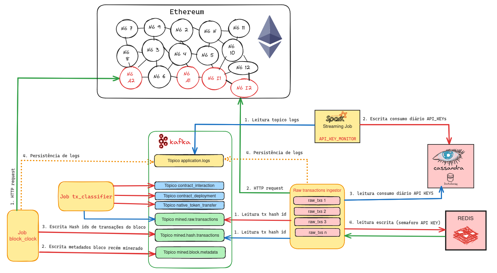

As seguintes tecnologias foram usadas para construir essa solução de captura:

- **Apache Kafka**: Plataforma de streaming distribuída que permite publicar e consumir mensagens em tópicos. É altamente escalável e tolerante a falhas. É o backbone do sistema Pub-Sub.
- **Redis**: Banco de dados chave-valor em memória usado para armazenar dados sobre uso de API KEYs.
- **Scylla**: Banco de dados NoSQL altamente escalável e tolerante a falhas usado para armazenar dados sobre uso de API KEYs.
- **Azure Key Vault**: Serviço de segredos da Azure usado para armazenar as API Keys.
- **Apache Spark**: Framework de processamento de dados em tempo real usado para monitorar o uso das API Keys.
- **Jobs implementados em python Python**: Esses jobs são responsáveis por capturar, classificar e decodificar os dados usando as ferramentas mencionadas acima. Executam em containers docker.
- **Kafka Connect**: Ferramenta usada para conectar o Kafka a diferentes fontes de dados. Nesse caso, o Kafka Connect é usado para envio dos dados de tópicos do Kafka para outros sistemas.

### 3.2. Arquitetura Técnica

A arquitetura técnica desse sistema é composta por diferentes camadas, cada uma com um conjunto de serviços que interagem entre si para determinada finalidade. As camadas são:

- **Camada Fast**: Serviços relacionados a captura e ingestão em streaming.
- **Camada Batch**: Serviços relacionados a captura e ingestão em batch.
- **Camada de aplicação**: Jobs construídos para captura e ingestão usando camadas acima.
- **Camada de operação**: Composta por serviços que realizam telemetria dos recursos de infraestrutura do **dm_v3_chain_explorer**.

Todos os serviços que compõem essas camadas são orquestrados em containers docker. Para orquestração de containers, foram utilizadas as ferramentas `Docker Compose` e `Docker Swarm`.
Além deles, o recurso **Azure Key Vault** foi usado para armazenar as API Keys.

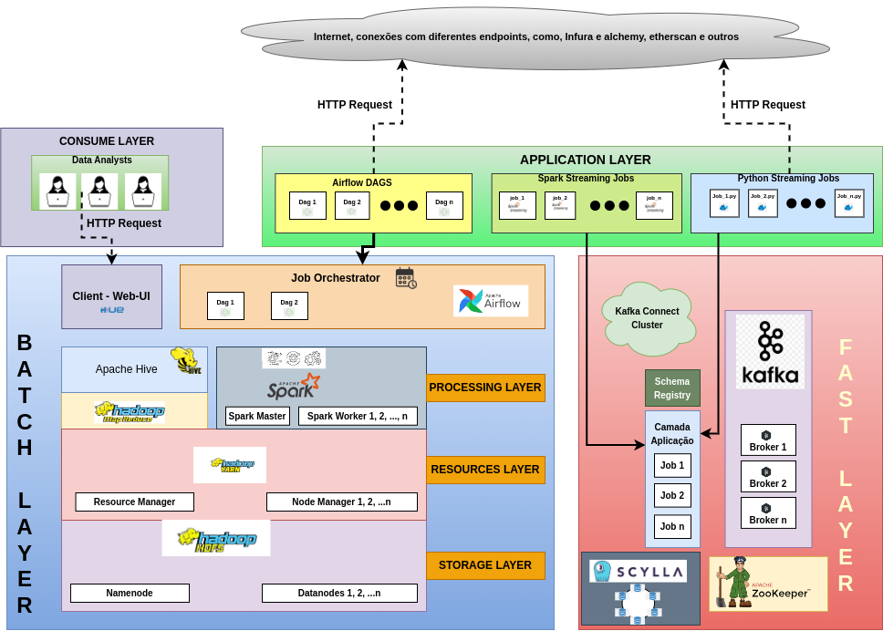

### 3.2.1. Camada Fast

Nessa camada estão definidos os serviços utilizados para ingestão de dados em tempo real e que trabalham em conjunto com os Jobs implementados na camada de aplicação. Os serviços dessa camada são:

- **3 Brokers do Apache Kafka**, usados como backbone para comunicação entre Jobs e como plataforma de armazenamento de dados para fluxos downstream.
- **Apache Zookeeper** utilizado por cluster de brokers do Kafka.
- **Confluent Control Center**: Serviço com interface gráfica para visualização de tópicos, kafka clusters, consumer groups e cluster de kafka-connect.
- **Confluent Kafka Connect**: Integra o Apache Kafka às mais diferentes plataformas através do uso de sources e sinks já implementados. Assim é possível replicar os dados entre tópicos do Kafka e Data Lakes, Databases e Data Warehouses do mais diversos tipos.
- **ScyllaDB**: Database No-SQL que permite alto throughput de operações de escrita, é por natureza distribuído de forma uniforme e pode ser escalado para atuar de forma global. Usado para update em tabela de consumo de API Keys, para que jobs tenham ciencia de chave e sua utilização em requests no tempo.
- **Redis**: Banco de dados chave-valor usado para controle de consumo de API Keys em jobs de streaming, de forma a garantir que cada API key seja usada por somente um Job a determinado instante, atuando como um semáforo.
- **Redis Commander**: Interface grafica para visualização dos dados no redis.

### 3.2.2. Camada Batch

Nessa camada estão relacionados serviços necessários para armazenamento e processamento de dados em big data e outras ferramentas necessárias para que pipelines batch sejam definidos.

### I) Apache Hadoop

Conjunto de serviços que compõem o hadoop e algumas ferramentas de seu ecossistema. Um cluster hadoop é composto pelos seguintes sistemas:

- **Hadoop Namenode**: Mantém controle de metadados, logs e outros dados relacionados ao cluster e ao HDFS. Um cluster hadoop pode ter 1 namenode e eventualmente também um namenode secundário em estado de standby. Este tem por função assumir o lugar do namenode primário, caso necessário.

- **Hadoop Datanodes**: Armazenam dados do cluster e atuam em conjunto com o **namenode** para formar o HDFS (hadoop Distributed File System). Um cluster Hadoop pode ter 1 ou mais datanodes, o que permite a escalabilidade horizontal em volume de dados a serem armazenados.

- **Resource Manager e Node managers**: Atuam em conjunto para gerenciar alocação de recursos de processamento no cluster Hadoop. Esse processamento se dá por meio de jobs de **Map reduce**,  jobs do **Apache Spark gerenciado pelo Yarn**, entre outros. 
  
  - Os **node managers** são instanciados em cada nó do cluster de forma a monitorar o uso de recursos naquele nó.
  - O **resource manager** atua como um orquestrador na alocação dos recursos para processamento nesse cluster, trocando informações com os **node managers**. Uma referencia mais completa sobre o [YARN pode ser vista aqui.](https://hadoop.apache.org/docs/stable/hadoop-yarn/hadoop-yarn-site/YARN.html)

- **History Server**: Serviço utilizado para armazenar dados referentes a execução de jobs de processamento no cluster hadoop.

O apache hadoop nesse trabalho é usado como data lake, onde chegam os dados inicialmente armazenados em tópicos do Kafka, por meio de um conector d otipo SINK do **kafka connect** e, futuramente de batches (processamento de jobs no airflow).

### II) Apache Hive

O hive é um sistema de Data Warehouse construída no topo do Apache Hadoop. É usado para fornecer uma camada de abstração sobre dados no data lake armazenados no HDFS. O hive permite a execução de queries em dados armazenados no HDFS. Esses dados são organizados em databases e tabelas, e consultados por meio de uma linguagem de query chamada HQL, similar ao SQL. O apache hive traduz então essas queries em jobs de map-reduce ou de spark, dependendo da engine de processamento configurada. O hive é composto por 3 serviços principais:

- **Hive metastore**: Armazena metadados referentes a tabelas e dados para serem utilizados por motores de processamento em lote como map-reduce, presto e spark engine na execução de queries. Por debaixo dos panos o [hive metastore](https://www.ibm.com/docs/en/watsonx/watsonxdata/1.0.x?topic=components-hive-metastore-overview) utiliza um banco de dados relacional para persistir os dados, nesse caso um postgres.

- **Hive server**: Servidor responsável por responder a de queries utilizando-se de um motor de processamento e dados do hive metastore.

O apache hive é usado então para abstrair dados armazenados no HDFS em tabelas hive, a serem consumidas por processos sistẽmicos do tipo batch, ou por análise exploratória por meio do de queries HQL.

### III) Hue

O Hue é um client com interface gráfica onde é possível visualizar o sistema de pastas e arquivos do HDFS, databases e tabelas no Hive Metastore e executar ações sobre essas entidades.

### IV) Apache Spark

O Apache spark é uma engine de processamento de dados em memória distribuída. Pode ser usada para processamento de dados em batch e streaming e é altamente escalável. Pode estar em modo standalone ou tendo o Yarn como resource manager. O spark é composto por 3 serviços principais:

- **Spark Master**: Responsável por gerenciar a execução de jobs no cluster spark.
- **Spark Worker**: Responsável por executar os jobs de processamento de dados no cluster spark.
- **Spark History Server**: Serviço que armazena dados referentes a execução de jobs no cluster spark.

### V) Apache Airflow

O Apache Airflow atua como orquestador de pipelines de dados batch. Nele é possível schedular jobs e definir relações de dependência entre esses. Os jobs são definidos em DAGs (Directed Acyclic Graphs) e são compostos por tarefas. Essas tarefas utilizam operadores específicos para execução de determinadas tarefas. É possível interagir com diferentes sistemas de armazenamento de dados, como HDFS, S3, ADLS, executar jobs de processamento de dados em spark, hive, entre outros. Também é possível realizar a transferência de arquivos usando protocolos como FTP, SFTP, entre outros.

### Observação sobre serviços descritos acima

Os serviços que compõe as camadas `batch` e `fast`, são usados para interação com aplicações desenvolvidas aqui na camada `app`.
Essas tecnologias são amplamente usadas em ecossistemas de plataformas de dados. Também são open-source e possuem serviços análogos e totalmente gerenciados, na forma de **PaaS**, nos mais diversos provedores de cloud.

- O **Apache Kafka** por exemplo, tem o **Amazon MSK**, **Confluent Cloud**, **Azure Event Hubs** e **Google Cloud Pub/Sub**.
- O **Hadoop HDFS** pode ser substituído por **Amazon S3**, **Azure ADLS** e **Google Cloud Storage**. 
- O **Apache Spark** pode ser substituído por um spark gerenciado dna plataforma **Databricks** ou por outros recursos que usam por debaixo dos panos o Spark, tais como **Synapse Analytics**, **Google Dataproc**, entre outros.

### 3.2.3.  Camada de aplicação

Nessa camada estão definidas:

- Aplicações escritas em python para interação com blockchains do tipo EVM e plataforma de dados.
- Aplicação Spark Streaming para monitoramento de consumo de API Keys.

#### Observação sobre aplicações e repositórios desse trabalho

As aplicações desenvolvidas estão encapsuladas em imagens docker para serem instanciadas em containers. Devido à conveniência no gerenciamento de imagens, cada imagem docker produzida para esse trabalho foi organizada em um repositório diferente.

Esses repositórios estão na **organização Dadaia-s-Chain-Analyser** no github. O critério para segregar as funcionalidades em um repositório foi a tecnologia usada, algo que influencia no peso da imagem. E também certo escopo de funcionalidade.

Com diferentes repositórios é possível também definir workflows de CI-CD para build e deploy das imagens usando o **github actions**. Por esse motivo existem 4 repositórios relacionados a esse trabalho.

- [dm_v3_chain_explorer](https://github.com/marcoaureliomenezes/dm_v3_chain_explorer): Repositório central onde estão definidos conjunto de serviços e forma de orquestra-los para alcançar objetivos do sistema.

- [Offchain-watchers](https://github.com/Dadaia-s-Chain-Analyser/offchain-watchers): Repositório composto por rotinas que usam a **biblioteca Web3.py** para ingestão dos dados de transações e blocos de uma rede blockchain.

- [Onchain-watchers](https://github.com/Dadaia-s-Chain-Analyser/onchain-watchers): Repositório composto por rotinas que usam **framework Brownie** para interação com contratos inteligentes e obtenção de estados dos mesmos, com o objetivo de ingestá-los no sistema.

- [Onchain-actors](https://github.com/Dadaia-s-Chain-Analyser/onchain-actors): Repositório composto por rotinas que usam a **framework Brownie** para realizar transações em blockchains. São a ponta da linha do sistema e estão habilitados a realizar swaps entre outras interações em contratos inteligentes específicos.

#### Observação sobre as aplicações

As aplicações desenvolvidas nesse trabalho são construídas em python e encapsuladas em imagens docker. Dessa forma são portáveis e podem ser instanciadas em qualquer ambiente com a engine do docker instalada. Assim, em caso de necessidade de deploy em ambiente de cloud, as imagens podem ser usadas para instanciar containers em cloud, usando serviços de orquestração de containers como **ECS**, **EKS**, **AKS** ou **GKE**.

### 3.2.4. Camada de operação

Na camada de operação estão definidos serviços necessários para realizar telemetria e monitoramento de recursos da infraestrutura. Aqui estão definidos os serviços:

- **Prometheus** para ingestão de dados de telemetria ;
- **Grafana** para visualização de dados dessa telemetria;
- **Agentes** responsáveis por coletar dados de telemetria do docker e do nó em específico e enviar para o Prometheus:
  - **Node exporter**: Agente para coletar dados de telemetria do nó em específico.
  - **Cadvisor**: Agente para coletar dados de telemetria do docker.

## 4. Aspectos técnicos desse trabalho

Nessa seção estão apresentado alguns aspectos técnicos na implementação do sistema proposto em um ambiente local. Primeiramente, são apresentados os aspectos técnicos relacionados a  escolha do da ferramenta **docker** como base na construção desse trabalho e as formas de orquestração desses containers que são utilizadas aqui.

Em seguida, será apresentada a estrutura desse projeto, explorando as pastas e arquivos que compõem o repositório **dm_v3_chain_explorer**.

## 4.1. Dockerização dos serviços

Conforme mencionado em seções anteriores, o docker foi usado amplamente na implementação desse tabalho. O seu uso pode ser embasado de acordo com 2 propósitos.

- A construção de imagens que encapsulem jobs da camada de aplicação, bem como toda stack de software necessária para executá-los torna a aplicação portável, possibilitando que:
  - Outros entusiastas do ramo possam reproduzir o sistema em sua máquina local, usando também o docker.
  - As aplicações sejam futuramente portadas para ambientes em cloud que executam containers. Algo bem adequado em um cenário produtivo utilizando-se de serviços gerenciados de orquestração de containers. Todo provedor de cloud tem um serviço de orquestração de containers, como **ECS**, **EKS**, **AKS** e **GKE**.

- A facilidade do uso de serviços como o Kafka, hadoop, Spark e toda stack de serviço definida nas camadas `batch`, `fast` e de `operações` em containers. Essa escolha também trás alguns benefícios tais como:
  - O uso de containers abstrai a complexidade de instalação dessas ferramentas em máquina local, dado, a complexidade de muitas delas e também a quantidade de dependências e número de serviços que compõem a stack, algo que facilmente pode virar um pesadelo em ambiente local.

  - Containers são ambientes isolados que comunicam-se em rede. Apesar de compartilharem a mesma máquina física e o mesmo kernel, cada container tem seu próprio ambiente de execução. Portanto podem atuar de forma análoga a clusters, onde cada container representa um nó de um cluster. Assim é possível simular clusters de Kafka, Hadoop, Spark, entre outros, em ambiente local para testes e desenvolvimento.

  - A definição de imagens e stack de serviços a serem orquestradas é suficiente para que se possa replicar o ambiente em qualquer máquina que tenha o docker instalado e os recursos de hardware necessários.

  - Tecnologias aqui deployadas em containers, tais como spark, hadoop, kafka e outros fornecem um conhecimento mais aprofundado sobre essas tecnologias, devendo-se configurar e orquestrar esses serviços manualmente e entender sobre **volume mounts**, **networking** e outras configurações específicas dos recursos que são abstraídas em serviços gerenciados em cloud.

  - Os serviços aqui deployados em containers e open source podem ser facilmente substituídos por serviços análogos em cloud, caso haja a necessidade de se construir um ambiente produtivo robusto, seguro e eficiente.
  
## 4.2. Orquestração de serviços em containers

Conforme mencionado, todos os serviços do sistema **dm_v3_chain_explorer** rodarão instanciados localmente em containers a partir de imagens docker. Então se faz necessário o uso de uma ferramenta de orquestração de execução desses containers. O docker tem 2 ferramentas para esse propósito: **docker-compose** e **docker-swarm**.

### 4.2.1. Docker-compose

O docker-compose é uma ferramenta que permite definir e executar aplicações multi-container. Com ele é possível definir os serviços que compõem a aplicação em um arquivo `docker-compose.yml` e então instanciar esses serviços em containers. O docker-compose é uma ferramenta de orquestração de containers para **ambiente local executando em um único nó**.

É a ferramenta ideal para ambiente de desenvolvimento local e testes, onde é possível definir a stack de serviços que compõem a aplicação e instanciá-los em containers. Com o docker-compose é possível definir volumes, redes, variáveis de ambiente, entre outros, para cada serviço.

### 4.2.2. Docker-swarm

O docker-swarm é uma ferramenta de orquestração de containers para **ambientes distribuídos**. Com ele é possível definir e instanciar serviços em múltiplos nós. O docker-swarm pode ser usado como ferramenta de orquestração de containers para ambientes de produção, onde é necessário alta disponibilidade, escalabilidade e tolerância a falhas. Existem outras ferramentas de orquestração de containers, como **Kubernetes**, **Mesos** e outras, que são mais robustas e possuem mais recursos que o docker-swarm. Porém, o docker-swarm é uma ferramenta simples e fácil de usar para orquestração de containers em ambientes distribuídos e default no docker.

### 4.2.3. Docker-Compose e Docker Swarm nesse trabalho

O docker compose foi usado para orquestrar diferentes serviços nesse trabalho em seu desenvolvimento. Por exemplo, as aplicações em python, desenvolvidas e encapsuladas em imagens python, e que capturam os dados da rede Ethereum, foram orquestradas em containers usando o docker-compose juntamente com o Kafka, Redis, Scylla, entre outros.

Por outro lado, a medida que o número de serviços aumentou, a necessidade de mais recursos de hardware para execução desses serviços também cresceu. Então, o docker-swarm foi usado para orquestrar esses serviços em múltiplos nós, simulando um ambiente distribuído. Da forma como foi feito, foi possível simular um ambiente de produção, onde os serviços estão distribuídos em múltiplos nós e orquestrados por um gerenciador de containers.

#### Considerações

1. Apesar de inúmeras ferramentas em cloud terem seus benefícios, o uso restrito delas pode trazer dependência de fornecedores de cloud. A construção de um sistema que usa tecnologias open source, e que de toda forma pode ser portado para cloud, é uma forma de se manter independente desses fornecedores.

2. Existem outras possibilidades de deploy e orquestração de containers que poderiam ter sido utilizadas aqui. Por exemplo o uso de clusters Kubernetes para orquestração de containers e o uso de operadores para deploy de serviços como Kafka, Spark, Hadoop, entre outros, baseados em Helm Charts. O uso de Kubernetes traria benefícios como autoescalonamento, alta disponibilidade, entre outros. Porém, a escolha do Docker Swarm foi feita por simplicidade e configuração em ambiente local, bastando o docker instalado.

## 4.3. Estrutura do projeto

### 4.3.1. Pasta Docker

Na pasta `/docker`, localizada na raiz do repositório **dm_v3_chain_explorer** estão definidas as imagens docker que compõem esse trabalho. Elas estão organizadas de acordo com suas respectivas camadas, sendo essas `app_layer`, `fast_layer`, `batch_layer`, e `ops_layer`.

- As imagens definidas em **app_layer** são as aplicações desenvolvidas em python para capturar os dados e interagircom redes EVM, como a rede Ethereum.

- As imagens definidas nos diretórios **fast_layer**, **batch_layer** e **ops_layer** se justificam por 2 motivos:

  1. Imagens construídas uma no topo da outra, com configurações adicionais, como é o caso do Hadoop, Hive e Spark. vale dar o crédito que as imagens definidas para o Hadoop, Hive e Spark foram **fortemente baseadas nos repositórios Big Data Europe** para o [Hadoop](https://github.com/big-data-europe/docker-hadoop) e o [Hive](https://github.com/big-data-europe/docker-hive).


  2. São imagens construídas no topo de serviços pré-definidos, porém com configurações adicionais necessárias para execução desse sistema. É o caso do **Scylla** e do **Postgres** que adicionam **scripts sql/cql** a serem executados no entrypoint da imagem e que criam databases/keyspaces, users e tabelas. Ou do Kafka Connect que adiciona plugins para conexão com diferentes sistemas no topo da imagem base do Kafka Connect da **Confluent**.

```bash
docker
  ├── app_layer
  │   ├── onchain-actors
  │   ├── offchain-monitors
  │   ├── offchain-stream-txs
  │   ├── spark-streaming-jobs
  │   └── onchain-watchers
  ├── batch_layer
  │   ├── hadoop
  │   │   ├── base
  │   │   ├── namenode
  │   │   ├── datanode
  │   │   ├── resourcemanager
  │   │   ├──  nodemanager
  │   │   └── historyserver
  │   ├── hive
  │   │   ├── base
  │   │   ├── metastore
  │   │   └── server
  │   ├── postgres
  │   ├── spark
  │   │   ├── hadoop-base
  │   │   ├── hive-base
  │   │   ├── spark-base
  │   │   ├── spark-master
  │   │   └── spark-worker
  │   └── hue
  ├── fast_layer
  │   ├── kafka-connect
  │   ├── scylladb
  └── ops_layer
      └── prometheus
```

Com esses arquivos é possível fazer o build das imagens que compõem esse trabalho.

### 4.3.2. Pasta Services

Na pasta `/services`, localizada na raiz do repositório **dm_v3_chain_explorer** estão definidos os serviços que compõem esse trabalho. Esses serviços estão organizados de acordo com a camada a que pertencem, sendo essas camadas `fast`, `batch`, `app` e `ops`.

```bash
services
  ├── app_layer
  │   ├── cluster_compose.yml
  │   └── cluster_swarm.yml
  ├── batch_layer
  │   ├── cluster_compose.yml
  │   └── cluster_swarm.yml
  ├── fast_layer
  │   ├── cluster_compose.yml
  │   └── cluster_swarm.yml
  └── ops_layer
      ├── cluster_compose.yml
      └── cluster_swarm.yml
```

Os serviços estão definidos em arquivos `docker-compose.yml` e `docker-swarm.yml` para orquestração de containers em ambiente local e distribuído, respectivamente. E na pasta `/services` estão organizados de acordo com a camada a que pertencem.

### 4.3.3. Arquivo Makefile

Para simplificar esse processo de execução de comandos docker, de build e deploy de serviços, publicação de imagens, entre outros, foi definido um arquivo chamado [Makefile](https://www.gnu.org/software/make/manual/make.html) na raíz desse projeto. O Makefile é um componente central, para que comandos sejam reproduzidos de maneira simples. no arquivo `/Makefile`, na base do repositório **dm_v3_chain_explorer** é possivel visualizar os comandos definidos.

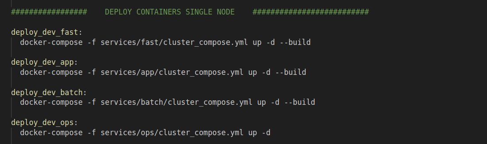

**Observação**: Essa ferramenta vem previamante instalada em sistemas operacionais Linux. Caso não possua o make instalado e tenha dificuldades para instalá-lo, uma opção não tão custosa é abrir o arquivo e executar os comandos docker manualmente.

### 4.3.4. Pasta Scripts

Na pasta `/scripts`, localizada na raiz do repositório **dm_v3_chain_explorer** estão definidos scripts shell úteis para automação de tarefas mais complexas.

### 4.3.5. Pasta Mnt

Na pasta `/mnt`, localizada na raiz do repositório **dm_v3_chain_explorer** estão definidos volumes que são montados em containers para persistência de dados localmente.
<hr>

## 5. Reprodução do sistema em ambiente local

Nessa seção está definido o passo-a-passo para reprodução do sistema **dm_v3_chain_explorer** em ambiente local.

Um dos requisitos deste trabalho é que a solução proposta seja reproduzível. Essa característica da reprodutibilidade é importante pelos seguintes motivos:

- A reprodução do trabalho permite os avaliadores executarem o sistema e entenderem como ele funciona.
- Esse trabalho é um sistema complexo, tendo diversos serviços interagindo com aplicações para que sua finalidade seja alcançada, como exposto nas seções anteriores. Provêr um passo-a-passo para o leitor possa reproduzi-lo em seu ambiente local dá a este a oportunidade de entende-lo em análise e síntese. E até mesmo extrair partes úteis para um projeto pessoal com funcionalidade parecida, após entendimento.

Esse passo a passo indica como clonar repositórios, configurar ambiente e deployar os serviços em um ambiente local, single-node com **docker-compose**. Ao final é apresentado como executá-lo em um ambiente distribuído, multi-node com **docker swarm**.

**Observação**: Um fator crucial e de maior dificuldade para reprodução desse sistema é a **necessidade de API Keys** para interagir com a rede blockchain por meio de um provedor Node-as-a-Service e capturar dados.

## 5.1. Requisitos

Para reprodução desse sistema em ambiente local, é necessário que os seguintes requisitos sejam atendidos.

### 5.1.1. Requisitos de hardware

Para execução desse sistema em ambiente local, é recomendado possuir memoria RAM de no mínimo 16 GB e processador com 4 núcleos.

### 5.1.2. Sistema Operacional

Esse sistema foi desenvolvido e testado em ambiente Linux em Ubuntu 22.04. Portanto, é recomendado que para reprodução desse o sistema operacional seja Linux.

### 5.1.3. Docker Instalado

Para reproduzir esse sistema em ambiente local, é necessário ter o docker instalado e configurado. Para verificar se o docker está instalado e configurado adequadamente, execute os comandos abaixo.

```bash
docker --version
```

A saída esperada é algo como:

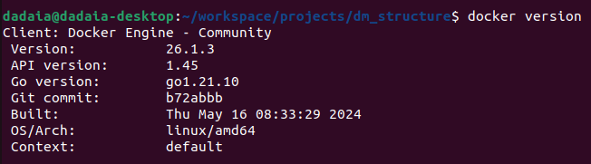

Caso não esteja instalado, siga as instruções de instalação no [site oficial do docker](https://docs.docker.com/engine/install/).

### 5.1.4.  Docker Compose e Docker Swarm instalados

As ferramentas de orquestração de containers **Docker Compose** e **Docker Swarm** são necessárias para deployar os serviços em ambiente local e distribuído, respectivamente. Contudo elas são instaladas junto com o docker. Para verificar se estão instaladas adequadamente, execute os comandos abaixo.

```bash
docker-compose --version
```

A saída esperada é algo como:

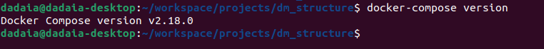

```bash
docker swarm --version
```

A saída esperada é algo como:

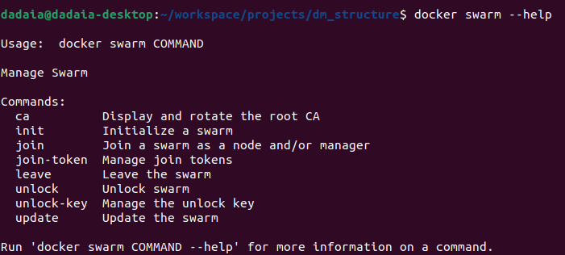

### 5.2. Clonagem de repositórios desse trabalho

Esse trabalho é composto por multiplos repositórios, conforme mencionado. O 1º passo para reprodução desse sistema é clonar o repositório base, definido como **dm_v3_chain_explorer**. Para isso, execute o comando abaixo e em seguida navegue para o diretório do projeto.

```bash
git clone git@github.com:marcoaureliomenezes/dm_v3_chain_explorer.git
```

Então, para montar a estrutura completa é necessário clonar os demais repositórios quem compõem a **camada app**. Um script shell chamado `0_create_dm_v3_chain_explorer_structure.sh` foi criado para esse proposito e pode ser chamado a partir do seguinte comando make:

```bash
make create_dm_v3_explorer_structure
```

O comando acima clonará todos os repositórios de aplicação necessários para dentro da pasta `/docker`.

### 5.2.1.  Pull e Build das imagens docker

No docker é possível construir imagens a partir de um arquivo `Dockerfile` e depois fazer o build delas. Ou ainda, é possível fazer o pull de imagens já construídas e disponíveis no docker hub entre outros repositórios de imagens.

Para esse sistema diversas imagens foram construídas, devido a necessidade de customização. Geralmente essas imagens são construídas no topo de imagens base, que são imagens oficiais ou de terceiros, e disponíveis no docker hub. Para construir as imagens desse sistema, execute o comando abaixo.

```bash
make build
```

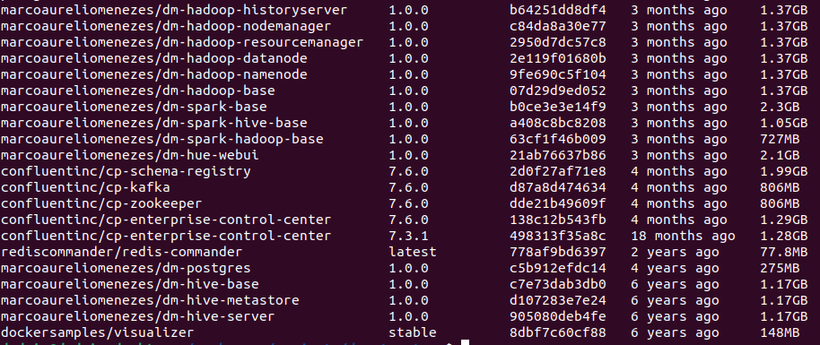

**Observação**: Todas as imagens são construídas tendo tags apontando para o repositório **marcoaureliomenezes** no docker hub.

## 5.3. Reprodução do sistema usando o Docker Compose

Caso o leitor queira deployar o sistema em ambiente local, single-node, usando o **docker-compose**, os passos a seguir devem ser seguidos.

Dado que os requisitos acima foram atendidos, o passo-a-passo para reprodução desse sistema em ambiente local é o seguinte.

## 5.3.1. Observação sobre execução usando Docker Compose

A execução de todas as camadas de serviço em uma máquina local pode ser pesada, esgotando-se os recursos de hardware disponíveis. Por tanto que além dos requisitos citados, o leitor execute as camadas de serviço de forma separada, conforme descrito abaixo.

- Camada de operações;
- Camada Fast e camada App;
- Camada Batch.

Para que fosse possível executar todos os serviços em conjunto, foi então necessária a construção de um **cluster Swarm distribuído**.

## 5.3.2.  Deploy de serviços da camada de Operações

Conforme visto na seção de arquitetura técnica, a **camada ops** é composta por serviços que realizam telemetria dos recursos de infraestrutura do **dm_v3_chain_explorer**. Ela é composta dos seguintes serviços:

- **Prometheus**: Serviço de monitoramento de telemetria.
- **Grafana**: Serviço de visualização de telemetria.
- **Node Exporter**: Agente para coletar dados de telemetria do nó em específico.
- **Cadvisor**: Agente para coletar dados de telemetria do docker.

Para realizar o deploy da **camada ops**, execute o comando abaixo.

```bash
make deploy_dev_ops && make watch_dev_ops
```

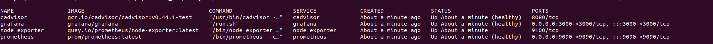

**Observação**: Após execução do comando, o terminal ficará monitorando o estado dos containers. Para sair dessa tela, pressione `Ctrl + C`. Os serviços continuarão rodando em background.

Quando os serviços estiverem saudáveis, seguintes endpoints passam a estar disponíveis para a **camada ops**:

| Serviço        | Endpoint              |
|----------------|-----------------------|
| Prometheus     | http://localhost:9090 |
| Grafana        | http://localhost:3000 |

A interface do Grafana pode ser acessada no navegador, digitando o endereço `http://localhost:3000`. O usuário e senha padrão são `admin` e `admin`, respectivamente. A tela de login do Grafana é mostrada abaixo.

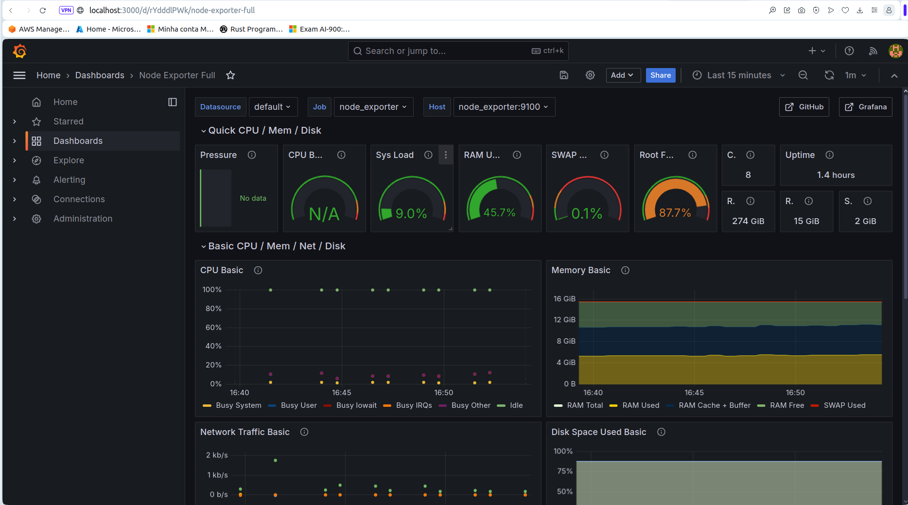

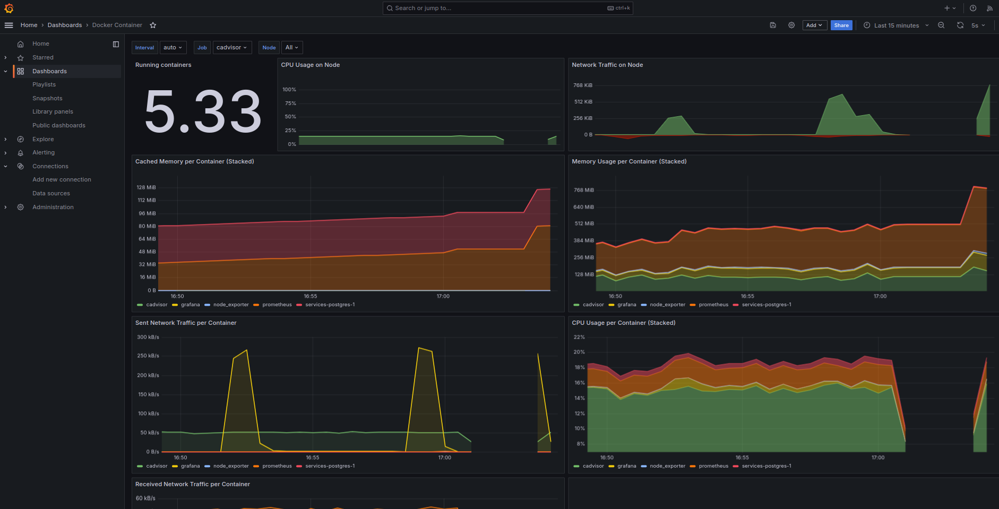

#### Adicionando dashboards ao Grafana

- Para adicionar o dashboard do Node Exporter e do docker, clique em `+` no lado esquerdo da tela, e depois em `Import`. No campo `Grafana.com Dashboard` digite o número `1860` e clique em `Load`. Em seguida, selecione o Prometheus como fonte de dados e clique em `Import`. Para adicionar o dashboard referente ao Docker, repita o processo usando o ID `193` no campo `Grafana.com Dashboard`.

Dessa forma é possível visualizar os dados de telemetria do docker e do nó em específico no Grafana.

## 5.3.4.  Deploy de serviços da camada Fast

A **camada fast** é composta pelos seguintes serviços:

- **3 Brokers do Apache Kafka**, usados como backbone para comunicação entre Jobs e como plataforma de armazenamento de dados para fluxos downstream.
- **Apache Zookeeper** utilizado por cluster de brokers do Kafka.
- **Confluent Control Center**: Serviço com interface gráfica para visualização de tópicos, kafka clusters, consumer groups e cluster de kafka-connect.
- **Confluent Kafka Connect**: Integra o Apache Kafka às mais diferentes plataformas através do uso de sources e sinks já implementados. Assim é possível replicar os dados entre tópicos do Kafka e Data Lakes, Databases e Data Warehouses do mais diversos tipos.
- **ScyllaDB**: Database No-SQL que permite alto throughput de operações de escrita, é por natureza distribuído de forma uniforme e pode ser escalado para atuar de forma global. Usado para update em tabela de consumo de API Keys, para que jobs tenham ciencia de chave e sua utilização em requests no tempo.
- **Redis**: Banco de dados chave-valor usado para controle de consumo de API Keys em jobs de streaming, de forma a garantir que cada API key seja usada por somente um Job a determinado instante, atuando como um semáforo.
- **Redis Commander**: Interface grafica para visualização dos dados no redis.
- **Spark Master e Worker**: Serviços que gerenciam a execução de jobs de processamento de dados em Spark.

Para deploy da camada `fast`, execute o comando abaixo.

```bash
make deploy_dev_fast && make watch_dev_fast
```

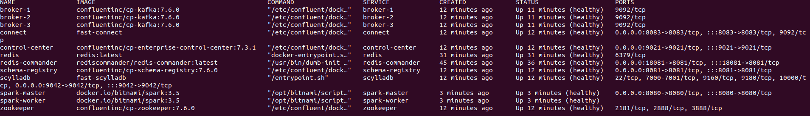

**Observação**: Após execução do comando, o terminal ficará monitorando o estado dos containers. Para sair dessa tela, pressione `Ctrl + C`. Os serviços continuarão rodando em background.

Quando os serviços estiverem saudáveis, seguintes endpoints passam a estar disponíveis para a **camada fast**:

| Serviço        | Endpoint              |
|----------------|-----------------------|
| Control Center | http://localhost:9021 |
| Redis Commander| http://localhost:8081 |
| Spark Master   | http://localhost:8080 |

- No Control Center é possível visualizar tópicos, clusters, consumer groups e cluster de kafka-connect.
- No Redis Commander é possível visualizar os dados no redis.
- No Spark Master é possível visualizar a interface do spark.

## 5.2.5.  Deploy de serviços da camada de Aplicações

A **camada app** é composta pelos seguintes serviços:

- **block-clock**: Aplicação que captura dados de blocos da rede Ethereum e os envia para um tópico do Kafka.
- **tx_processor**: Aplicação que captura dados de transações da rede Ethereum e os envia para um tópico do Kafka.
- **tx_classifier**: Aplicação que classifica transações de acordo com seu tipo e as envia para tópicos específicos do Kafka.
- **tx_input_decoder**: Aplicação que realiza decode de inputs de transações e os envia para um tópico do Kafka.
- **api_keys_log_processor**: Job Spark Streaming que monitora consumo de API Keys e atualiza tabela no ScyllaDB.

Para deploy da **camada app**, execute o comando abaixo.

```bash
make deploy_dev_app && make watch_dev_app
```


## Job Spark Streaming `api_keys_log_processor` executando

O job de Spark Streaming `api_keys_log_processor` monitora o consumo de API Keys e atualiza a tabela no ScyllaDB. Para visualizar o Job executando na Spark UI, acesse o endereço `http://localhost:8080` no navegador.

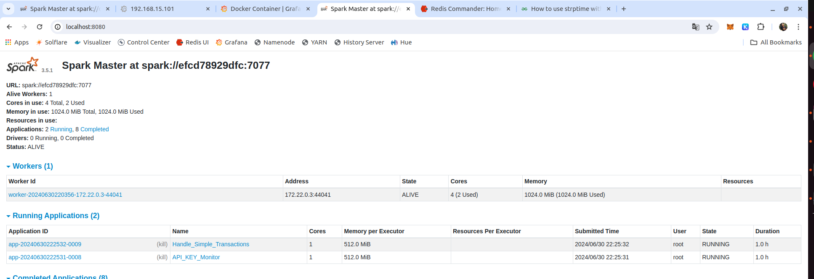
<hr>


## Visualização de consumo diário de API Keys no ScyllaDB


```bash
docker exec -it scylladb cqlsh -e "select * from operations.api_keys_node_providers"
```

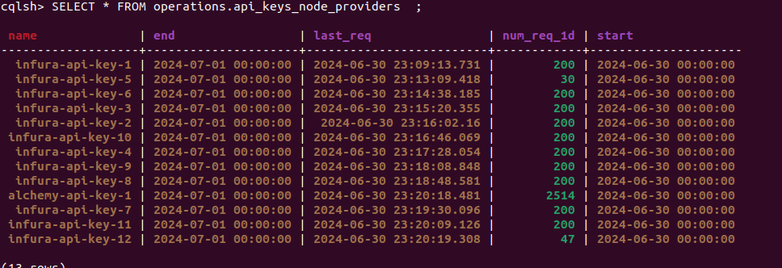
<hr>

## Semáforo de consumo de API Keys no Redis

Abaixo é mostrado o controle de consumo de API Keys no Redis. Cada chave é um hash com a API Key e o valor é o timestamp de quando foi consumida.

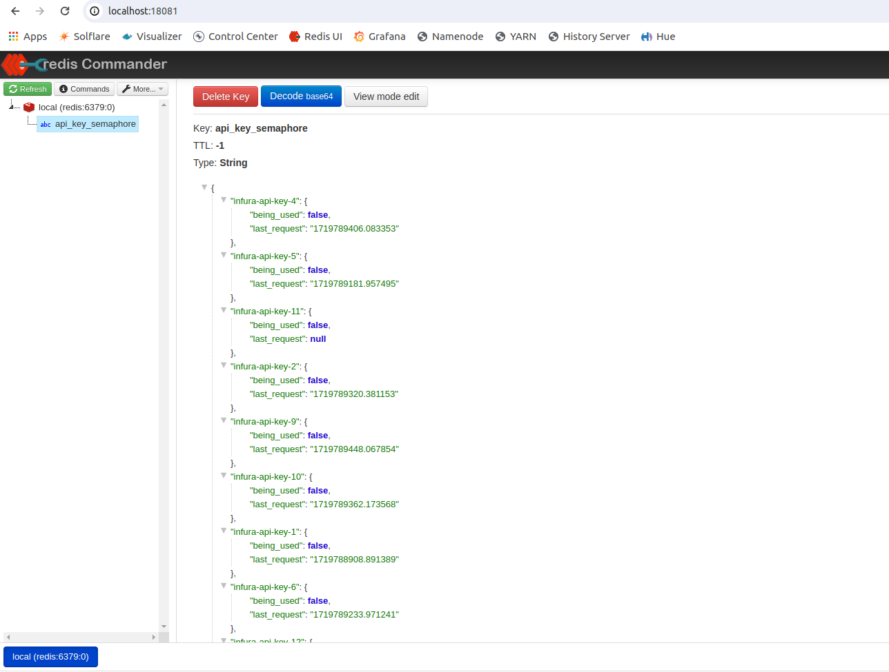
<hr>

## Dados sendo exibidos pelo Kafka Control Center

Com o mecanismo de captura de dados e de gerenciamento de API Keys para compartilhamento entre jobs funcionando os dados passam a fluir pelos tópicos do Kafka.

Abaixo é possível ver uma amostra das mensagens sendo enviadas para o tópico `ethereum-blocks` no Kafka. Essas mensagens são capturadas pela aplicação `block-clock` e enviadas para o Kafka.

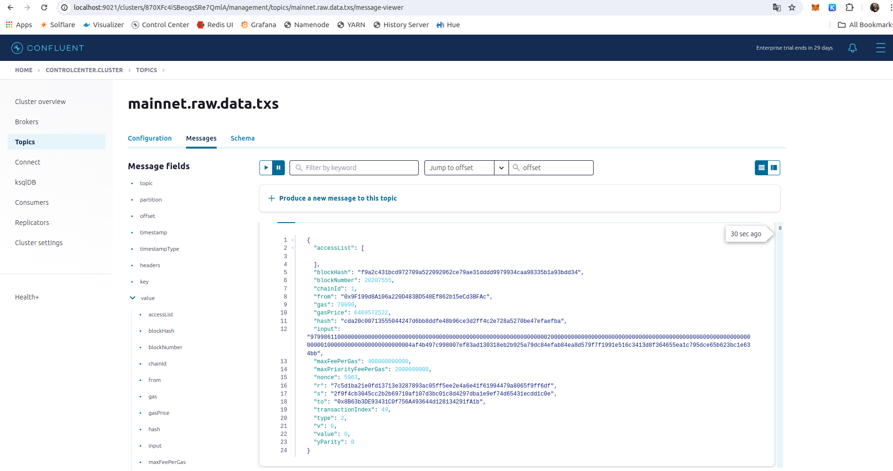
<hr>

## 5.4. Reprodução do sistema usando o Docker Swarm


## 6. Conclusão

Toda parte teórica e prática planejada para esse trabalho foi implementada. Demonstrações do workflow de captura descritos nesse documento serão feitas na apresentação, de forma que os avaliadores possam entender melhor o sistema **dm_v3_chain_explorer**, aqui proposto.

Assim os avaliadores podem colocar suas dúvidas sobre o trabalho e também dúvidas técnicas sobre as tecnologias usadas, de maneira a avaliar da melhor forma o conhecimento desse autor nos campos relacionados a engenharia de dados. É dificil mensurar o quanto conhecimento em tecnologia está contido nesse trabalho. A construção de uma plataforma de dados para captura e ingestão de dados.

## 7. Melhorias futuras

Esse trabalho, após ser submetido continuará a ser desenvolvido, visto as possibilidades que ele apresenta, mesmo que seja apenas no campo de estudos e desenvolvimento de hard skills.
Seguem abaixo listadas algumas dessa melhorias

### 7.1. Aplicações downstream para consumo dos dados

Está descrito nesse documento, somente o fluxo de captura, ingestão e algum processamento para obter dados em tempo real de uma blockchain do tipo EVM. Na apresentação serão demonstradas algumas aplicações downstream que evoluídas podem ter diversas aplicabilidades.

### 7.2. Melhoria em aplicações do repositório onchain-watchers

Como será apresentado, esse repositório tem aplicações que usam dados das transações ingestadas para obter dados de estado provenientes de contratos inteligentes. Para isso uma arquitetura voltada a eventos precisa ser implementada. Por exemplo, quando uma transação de swap de token WETH no protocolo DEFI Uniswap é feito, um evento é disparado para que dados da piscina de liquidez e preço dos tokens sejam ingestados no sistema.

### 7.3. Troca do uso de provedores Blockchain Node-as-a-Service

Conforme visto nesse trabalho o uso de provedores node-as-a-service tais como Infura e Alchemy limitam as requisições http para request dos dados. Então, a troca desses por nós proprietários é um passo importante para evolução do sistema, ao lidar com redes mais escalaveis do tipo EVM.

### 7.4. Evolução dos serviços de um ambiente local para ambiente produtivo

Conforme visto ao longo desse trabalho, todos os serviços usados, com exceção das aplicações construídas propriamente dita para esse sistema, tem versões totalmente gerenciadas em provedores de Cloud. O Kafka por exemplo pode ser substituído pelo Event Hub ou Amazon MSK ou Clonfluent Cloud. O data lake hadoop pode ser substituído por data lakes em recursos do tipo object storages, tais como S3 ou Azure ADLS. O Hive e o Spark podem ser substituídos pelo Delta Lake + Spark do Databricks. E assim por diante.
Os containers de aplicação podem ser migrados para executarem em recursos tais com EKS da AWS ou o AKS da Azure.

Essas são algumas das evoluções enumeradas no roadmap desse sistema.
