# dd_chain_explorer System

Blockchains públicas são redes P2P onde circula uma grande quantidade de capital, na forma de usuários trocando tokens entre si ou interagindo com contratos inteligentes. Por serem redes públicas os dados de transações dentro dessas redes também são de certa forma públicos e podem ser explorados. O sistema aqui implementado é uma plataforma de dados com o intuito de capturar, processar, armazenar e disponibilizar dados de redes blockchain públicas com suporte a contratos inteligentes e do tipo EVM.

## Sumário

- [1. Introdução](#1-introdução)
  - [1.1. Introdução sobre blockchain](#11-introdução-sobre-blockchain)
  - [1.2. Oportunidades em Redes Blockchain](#12-oportunidades-em-redes-blockchain)
  - [1.3. Estudo de caso com 2 contratos inteligentes](#13-estudo-de-caso-com-2-contratos-inteligentes)
  - [1.4. Nota sobre a introdução acima e esse trabalho](#14-nota-sobre-a-introdução-acima-e-esse-trabalho)
- [2. Objetivos deste trabalho](#2-objetivos-deste-trabalho)
  - [2.1. Objetivos de negócio](#21-objetivos-de-negócio)
  - [2.2. Objetivos técnicos](#22-objetivos-técnicos)
  - [2.3. Observação sobre o tema escolhido](#23-observação-sobre-o-tema-escolhido)
- [3. Explicação sobre o case desenvolvido](#3-explicação-sobre-o-case-desenvolvido)
  - [3.1. Provedores de Node-as-a-Service](#31-provedores-de-node-as-a-service)
  - [3.2. Restrições de API keys](#32-restrições-de-api-keys)
  - [3.3. Captura de dados de blocos e transações](#33-captura-de-dados-de-blocos-e-transações)
  - [3.4. Mecanismo para Captura de Dados](#34-mecanismo-para-captura-de-dados)
  - [3.5. Mecanismo de compartilhamento de API Keys](#35-mecanismo-de-compartilhamento-de-api-keys)
- [4. Arquitetura do case](45-arquitetura-do-case)
- [4.1. Arquitetura de solução](#41-arquitetura-de-solução)
- [4.2. Arquitetura técnica](#42-arquitetura-técnica)
- [5. Aspectos técnicos desse trabalho](#5-aspectos-técnicos-desse-trabalho)
  - [5.1. Dockerização dos serviços](#51-dockerização-dos-serviços)
  - [5.2. Orquestração de serviços em containers](#52-orquestração-de-serviços-em-containers)
- [6. Reprodução do sistema dm_v3_chain_explorer](#6-reprodução-do-sistema-dm_v3_chain_explorer)
  - [6.1. Requisitos](#61-requisitos)
  - [6.2. Setup do ambiente local](#62-setup-do-ambiente-local)
  - [6.3. Reprodução do sistema usando o Docker Compose](#63-reprodução-do-sistema-usando-o-docker-compose)
  - [6.4 Visualização do processo de captura e ingestão de dados](#64-visualização-do-processo-de-captura-e-ingestão-de-dados)
- [7. Conclusão](#7-conclusão)
- [8. Melhorias futuras](#8-melhorias-futuras)
  - [8.1. Aplicações downstream para consumo dos dados](#81-aplicações-downstream-para-consumo-dos-dados)
  - [8.2. Melhoria em aplicações do repositório onchain-watchers](#82-melhoria-em-aplicações-do-repositório-onchain-watchers)
  - [8.3. Troca do uso de provedores Blockchain Node-as-a-Service](#83-troca-do-uso-de-provedores-blockchain-node-as-a-service)
  - [8.4. Evolução dos serviços de um ambiente local para ambiente produtivo](#84-evolução-dos-serviços-de-um-ambiente-local-para-ambiente-produtivo)

## 1. Introdução

Para uma melhor compreensão do trabalho, é necessário uma breve introdução sobre blockchain e contratos inteligentes. Devido a extensão e complexidade do tema, essa introdução se concentra em abordar conceitos e características relevantes para o trabalho aqui proposto.

**Definição de Blockchain**: `Rede Peer-to-peer na qual usuários transacionam entre si sem a necessidade de um intermediário`. A tecnologia é baseada em 2 componentes, a **estrutura de dados** e a **rede P2P**, explorados abaixo.

### 1.1. Estrutura de dados blockchain

Estrutura de dados de blocos encadeados, dando origem ao termo **blockchain**. Um bloco é uma estrutura de dados composta por:

- Metadados do bloco, tais como número, hash, timestamp, endereço de quem o minerou, etc;
- Hash do bloco anterior (dá consistência ao blockchain);
- Lista de transações feitas por usuários da rede.

O propósito de uma rede blockchain é permitir que usuários transacionem entre si. Essas transações só serão de fato registradas quando estiverem contidas em um bloco minerado.

#### Em termos práticos e aplicado a esse trabalho

1. A estrutura de dados blockchain é a fonte de dados;
2. Para que os dados sejam capturados as seguintes características são fatores importantes, pois ditarão o volume e a velocidade de dados a serem capturados:
    - **Frequência de mineração de blocos**: Tempo médio que uma rede blockchain leva para minerar um bloco;
    - **Tamanho dos blocos em bytes**: Limite de tamanho em bytes que um bloco pode ter.

### 1.2. Rede Peer-to-peer (P2P) Blockchain

- Blockchain são redes de computadores, de topologia Peer-to-Peer com diversos nós;
- O critério para ingressar em uma rede blockchain, ou a falta deste, diferencia redes públicas de privadas;
- Os nós que integram a rede possuem uma cópia da estrutura de dados blockchain sincronizada.

#### Em termos práticos e aplicado a esse trabalho

1. Dados de blockchains públicas são públicos pois não há critérios para fazer parte da rede e todos os nós possuem uma cópia sincronizada da estrutura de dados.
2. Para se obter os dados de forma direta é necessário ter acesso a um nó da rede blockchain. Para esse caso existem 2 possibilidades:
    - **Possuir um nó próprio**: Fazer o deploy de um nó na rede blockchain, o que requer requisitos de hardware, software e rede;
    - **Usar um nó de terceiros**: Usar provedores de **Node-as-a-Service (NaaS)** que fornecem acesso a nós de redes blockchain públicas por meio de API Keys.

### 1.3. Contratos inteligentes

**Contratos inteligentes** são aplicações ou programas de computadores deployados em uma rede blockchain. Dentre suas características estão:

- Podem ser deployados por qualquer usuário da rede;
- São deployados por meio de uma transação persistida em um bloco;
- Funcionam como máquinas de estados, com métodos que podem ser chamados por usuários da rede após deployados;
- Após deployados são imutáveis;
- São passivos, ou seja, não fazem nada até que sejam chamados por um usuário da rede;
- Máquinas virtuais são usadas para o cálculo de estados dos contratos inteligentes a partir das transações submetidas na rede para esse contrato.

Para viabilizar a implementação de contratos inteligentes as redes blockchain desenvolveram **máquinas virtuais**. A **Ethereum Foundation**, que mantém a rede Ethereum criou a [EVM – Ethereum Virtual Machine](https://blog.bitso.com/pt-br/tecnologia/ethereum-virtual-machine), primeira máquina virtual de contratos inteligentes criada e open-source.

#### Em termos práticos e aplicado a esse trabalho

1. Foi escolhida a rede ethereum para implementação piloto, uma vez que essa possui suporte a contratos inteligentes, é uma rede pública e tem como base a EVM;
2. Diferentes blockchains usam a EVM como máquina virtual, o que torna o sistema proposto agnóstico à rede de blockchain, desde que usem a EVM como máquina virtual;
3. Contratos inteligentes são programas, tendo eles um endereço próprio na rede e suas funções com respectivos parâmetros;
4. A interação com os contratos inteligentes se dá por meio de transações submetidas na rede;

Portanto, ao capturar dados das transações da rede, é possível saber:
- Qual endereço de usuário interagiu com qual contrato inteligente;
- Qual método foi executado e com quais parâmetros.


## 1.4. Token nativo e Gás

- Em redes blockchain, os tokens nativos são usados para pagar taxas de transação. Essas taxas são chamadas de **Gas**;
- Contratos inteligentes consomem recursos computacionais, pois são programas deployados numa rede que se comporta como uma única máquina. 
- O **Gas** é a unidade de medida que quantifica e precifica os recursos computacionais consumidos por chamadas de funções em contratos inteligentes;
- A análise de dados relacionados ao gás podem ser uteis para entender:
  - Custo de uma transação: Calculado como `custo_transação` = `gas_usado` x `preço_gás`
  - Eficiência de contratos inteligentes e identificação de gargalos de performance.
  - Picos de demanda de transações submetidas na rede.

Dado que a frequência de mineração e o tamanho em bytes de um bloco são fixas, uma forma de lidar com aumento do número de transações é aumentar o preço do gás, retirando o incentivo para transações menos importantes.

#### Em termos práticos e aplicado a esse trabalho

1. Os dados relacionados a gás serão capturados, armazenados e disponibilizados para aplicações downstream em analytics.
2. As transações de troca de token nativo entre usuários da rede também serão capturadas, armazenadas e disponibilizadas para aplicações downstream em analytics.

Portanto, entender o que é o gás e sua relação com o token nativo e a demanda da rede é importante para a análise dos dados capturados e realização de insights.


## 1.5. Usuários e mantenedores da rede

**Usuários da rede** usam endereços de carteira para transacionar dentro dela. As transações possíveis para usuários são:
- **Transferências de token nativo da rede**: Em blockchains tokens nativos que são usados para pagar taxas de transação (gás);
- **Deploy de contratos inteligentes**: Em redes blockchain com suporte a contratos inteligentes, usuários podem deployar contratos inteligentes na rede;
- **Interação com contratos inteligentes**: Usuários podem interagir com contratos inteligentes, chamando funções e passando parâmetros.

**Mantenedores da rede** são os nós que operam tarefas para o devido funcionamento da mesma. Entre suas atividades estão:

- Competir para minerar novos blocos, recebendo recompensas em tokens nativos da rede;
- Validar a integridade de transações contidas em blocos de toda a rede, utilizando-se dos hashes dos blocos.

Os atores mencionados interagem da seguinte forma:

1. Quando usuários da rede submetem transações elas caem em uma área chamada **mempool**. 
2. Mineradores colhem transações da mempool e tentam minerar um bloco com elas. 
3. Quando um bloco minerado este é propagado para toda a rede e validado por todos os nós.

Vale mencionar que o tamanho em bytes de um bloco, bem como o tempo médio de mineração de um bloco são fatores que influenciam diretamente na latência e largura de banda dos nós da rede.

#### Em termos práticos e aplicado a esse trabalho

1. Quando se pensa em captura e ingestão de dados, volume e velocidade são fatores importantes a serem analisados para dimensionar o sistema.
2. O tamanho em bytes de um bloco e o tempo médio de mineração de um bloco são diretamente proporcionais ao volume e velocidade de dados a serem capturados.
3. Devido ao propósito de uma rede blockchain, usuários transacionarem entre si, sua escalabilidade pode ser medida em termos de transações por segundo (TPS).
4. Redes mais seguras e descentralizadas são mais lentas e menos escaláveis. Redes mais rápidas e escaláveis são menos seguras e descentralizadas.
5. A rede Ethereum é a rede EVM mais lenta e menos escalável entre as redes EVM.

**Observação**: Caso o leitor queira aprofundar no tema, o artigo [Trilema blockchain](https://ieeexplore.ieee.org/document/10411444) é uma boa referência.

### 1.6. Processo de mineração e blocos orfãos

- O processo de mineração de um bloco consiste de mineradores competindo entre si para minerar 1 bloco com transações obtidas da mempool;
- A mineração envolve geralmente a resolução de um problema matemático, o que pode acarretar que 2 mineradores minerem 2 blocos diferentes ao mesmo tempo;
- Um bloco minerado é propagado para toda a rede e validado por nós validadores;
- A rede deve conter um mecanismo para lidar com blocos minerados ao mesmo tempo. Esse mecanismo está associado a propagação dos blocos pela rede;
- O bloco com maior probabilidade de ser aceito é o que é propagado mais rápido para mais nós da rede;
- O fator de propagação depende da proximidade geográfica do minerador com os outros nós da rede;
- Quando 1 bloco é propagado mais rápido que outro, o bloco mais lento é chamado de **bloco órfão** e suas transações são devolvidas para a mempool.

#### Em termos práticos e aplicado a esse trabalho

1. Para uma captura de dados em tempo real, é necessário que o sistema esteja preparado para lidar com blocos órfãos.
2. Deve haver um mecanismo para que blocos órfãos sejam identificados e suas transações recebam o devido status, de modo a não serem duplicadas.

### 1.7. Oportunidades em Redes Blockchain

#### 1.7.1. Capital alocado em redes blockchain

- Circula uma quantidade significativa de capital na forma de transações em redes blockchain públicas do tipo EVM;
- É possivel, por meio de análise de dados, identificar oportunidades de negócio em redes blockchain;

#### 1.7.2. Contratos inteligentes passivos e Keepers

- Contratos inteligentes, conforme dito, são passivos, ou seja, não fazem nada até que sejam chamados por um usuário da rede;
- Logo, não executam ações que dependem de um monitoramento constante, como por exemplo preço de tokens, arbitragem, liquidação, etc;
- Para aplicações que dependem dessas ações constantes, os contratos inteligentes dependem de **Keepers**;
- Keepers são usuários da rede que interagem com o contrato de forma a mantê-lo ativo e seguro por meio de ações como arbitragem, liquidação, etc.
- Para incentivar os Keepers, contratos inteligentes podem oferecer recompensas.

#### 1.7.3. Contratos inteligentes são imutáveis e públicos

- Dadas as características de imutabilidade e publicidade dos contratos inteligentes, esses estão sucetíveis a bugs que podem ser explorados por hackers;
- Monitorar a interação de usuários com contratos inteligentes é identificar ações de hackers e mitigar perdas financeiras.

Com a introdução acima, é possível contextualizar o trabalho proposto e os objetivos a serem alcançados.

## 2. Objetivos

**Principal objetivo do trabalho**: Concepção e implementação de uma plataforma de dados, entitulada `dd_chain_explorer`.

**Propósito do sistema**: Capturar, ingestar, processar, armazenar e disponibilizar dados de redes blockchain públicas.

### Escopo do trabalho

- Captura de dados restrito a redes blockchain públicas do tipo EVM;
- Uso da rede Ethereum como rede piloto, devido às características mencionadas na introdução (baixo TPS e alto valor de capital alocado);
- Uso de provedores de Node-as-a-Service para captura de dados;
- Ingestão dos dados em ambiente analitico do tipo Lakehouse;
- Aplicação de arquitetura Medalhão para ingestão e enriquecimento dos dados em ambiente analítico.

### Objetivos específicos

- Criar um sistema de captura de dados deve ser agnóstico à rede de blockchain, desde que usem a EVM como máquina virtual;
- Minimizar latência e números de requisições, e maximizar a disponibilidade do sistema;
- Criar uma plataforma preparada para escalar a captura de dados em redes mais rápidas e escaláveis;
- Criar mecanismos para gerenciamento do consumo de API Keys dos provedores NaaS entre os Jobs que as usam;
- Criar mecanismos para observabilidade do sistema como um todo.

## 3. Explicação sobre o case desenvolvido


Conforme visto, para se obter dados de uma rede blockchain diretamente, é necessário possuir acesso a um nó pertencente a tal rede. Com isso, 2 possibilidades se apresentam: **(1)** possuir um nó próprio e **(2)** usar um nó de terceiros.

Devido aos requisitos de hardware, software e rede necessários para deploy de um nó, seja on-premises ou em cloud, foi escolhido nesse trabalho o uso de **provedores de Node-as-a-Service ou NaaS**.

## 3.1. Provedores de Node-as-a-Service

Provedores de NaaS são empresas que fornecem acesso a nós de redes blockchain públicas. Alguns exemplos são **Infura** e **Alchemy**. Esses provedores, como modelo de negócio, fornecem API keys para interação com os nós.

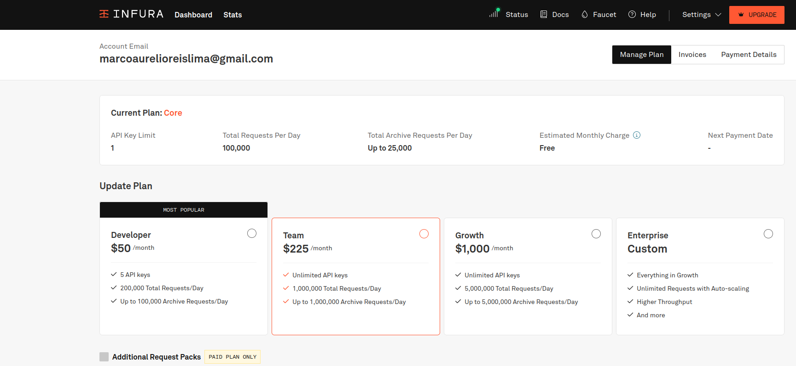

Porém, esses provedores restringem a quantidade de requisições, de acordo com planos estabelacidos (gratuito, premium, etc.) que variam o preço e o limite de requisições diárias ou por segundo permitidas.

Foi optado pelo **uso de provedores NaaS**. Contudo, devido às limitações de requisições, é preciso um mecanismo para captura de todas as transações em tempo real usando tais provedores. Por se tratar um desafio técnico, reduzir o custo para captura desses dados a zero virtualmente, satisfazendo os objetivos mencionados se mostra um caminho interessante.

## 3.2. Restrições de API keys

As requisições em nós disponibilizados por um provedores NaaS são controladas por meio de API Keys. Para o provedor infura temos as seguintes restrições para 1 API Key gratuita:

- Máximo de **10 requests por segundo**;
- Máximo de  **100.000 requests por dia**.

Na rede Ethereum, um bloco tem tamanho em bytes limitado e é minerado em média a cada 8 segundos. Cada bloco contém em média 250 transações. Isso resulta em:

- **2,7 milhões de transações por dia**;
- **31 transações por segundo**.

As limitações acima impõem um desafio. Como será visto a diante, o mecanismo **para se capturar n transações de um bloco recém-minerado** exige que sejam feitas em média **n requisições** sejam feitas. Usando o plano gratuito, claramente é necessário o uso de várias API Keys.

Porém o gerenciamento de uso dessas API Keys, que possuem recursos limitados, buscando manter a disponibilidade e confiabilidade do sistema traz a necessidade de um mecanismo engenhoso. Aqui então ela se apresenta.

## 3.3. Captura de dados de blocos e transações

Para capturar dados de blocos e transações da rede em tempo real é usada a [Biblioteca Web3.py](https://web3py.readthedocs.io/en/stable/). Ela fornece uma interface para interação com nós de redes blockchain compatíveis com EVM. Entre as várias funções disponíveis, 2 são de interesse para esse trabalho:

**get_block('latest')**: Retorna um dicionário com os **dados e metadados do bloco** e uma **lista de hash_ids** de transações pertencentes ao último bloco minerado.

```python
block_data = web3.eth.get_block('latest')
```

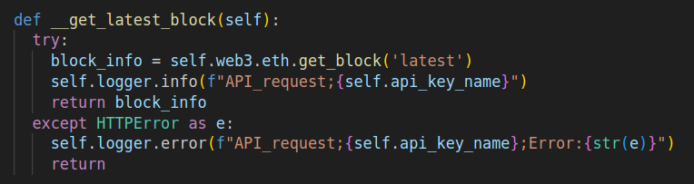

Assim é possível identificar novos blocos minerados, ao se perceber que o número do bloco foi incrementado. E então disparar um evento com os dados do bloco.

**get_transaction(tx_hash)**: Retorna um dicionário com os dados da transação referente ao `tx_hash_id` passado como parâmetro.

```python
tx_data = web3.eth.get_transaction('tx_hash_id')
```


As 2 funções mencionadas trabalhando em conjunto são o suficiente para obter dados de transações recém mineradas. Porém, é necessário que as rotinas que se utilizem delas trabalhem de forma integrada e em cooperação.

Cada chamada nas funções acima consome 1 requisição de uma API Key. Logo, um mecanismo que otimize o uso dessas chaves, minimizando o número de requisições e maximizando a disponibilidade do sistema é necessário.

## 3.4. Mecanismo para Captura de Dados

Conforme mencionado, as 2 funções são suficientes para capturar dados em tempo real de uma rede EVM. Porém, eles precisam atuar em conjunto.

1. O método **get_block('latest')** fornece uma lista de tx_hash_id para transações pertencentes àquele bloco.
2. O método **get_transaction(tx_hash_id)** usa os **tx_hash_id** obtidos do 1º método para capturar os dados de cada transação.

Para que essa cooperação mutua ocorra, são necessários alguns componentes para o sistema.

### 3.4.1. Sistema Pub / Sub

Para a captura dos dados em tempo real, é necessário que 2 jobs cooperem entre si de forma assíncrona. Para alcançar tal finalidade, a inclusão de um componente do tipo  **fila** ou **mensageria do tipo Publisher-Subscriber** se faz necessária.

Uma fila, como por exemplo o **RabbitMQ**, poderia satisfazer os requisitos de comunicação entre os Jobs de forma assíncrona.

- O 1º job captura a lista de **tx_hash_id** e publica em uma fila.
- O 2º job que pode ter réplicas consome essa fila e executa o método **get_transaction(tx_hash_id)** para obter os dados da transação.

Porém, caso se deseje utilizar uma plataforma mais robusta, o uso de um sistema de mensageria do tipo Pub/Sub como o **Apache Kafka** é mais adequado. Ele oferece:

- Comunicação inter processos através de tópicos;
- Sistema robusto e escalável de forma horizontal;
- Capacidade de processar e armazenar grandes volumes de dados, atuando como um **backbone de dados**.

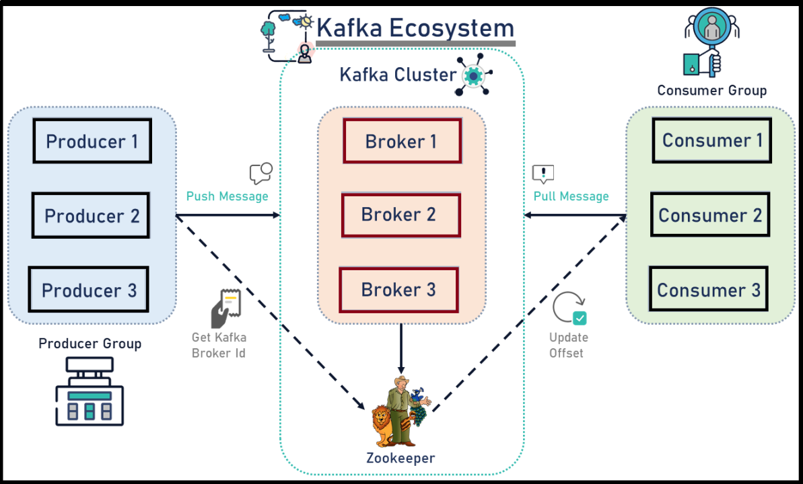

O sistema **dm_v3_chain_explorer** deve estar preparado para capturar e ingestar dados de redes blockchain do tipo EVM, não estando restrito a Ethereum.

A Ethereum é a rede mais lenta e menos escalável entre as redes EVM. Por isso, o sistema deve estar preparado para capturar dados de redes mais rápidas , o que se traduz em volumes maiores, alta throughput de dados que esse componente deve suportar. Logo, a plataforma de mensageria escolhida deve ser capaz de suportar workloads de bigdata.

Portanto, pelos requisitos apresentados de escalabilidade, resiliência e robustez. O **Apache Kafka** se mostrou o componente ideal para a finalidade apresentada.

### 3.4.2. Captura dos dados do bloco recém minerados (Mined Blocks Crawler)

O job **mined_blocks_crawler** que encapsula a chamada da função **get_block('latest')**, já mencionada. Ele opera da seguinte forma:

- A cada período de tempo, por padrão 1 segundo, ele executa a função `get_block('latest')`, capturando os dados do bloco mais recente.
- Observando o campo **blockNumber** dos dados retornados, ele identifica se houve um novo bloco minerado (block number incrementado).
- A identificação de um novo bloco minerado dispara um evento, que resulta em 2 ações:
  - Os metadados do bloco são publicados em um tópico chamado **mined.blocks.metadata**.
  - A lista de `tx_hash_id` contendo ids de transações do bloco são publicados em um tópico chamado **mined.txs.hash.ids**.

**Observação:** a cada execução do método **get_block('latest')** uma requisição é feita usando a API key. Com a **frequência 1 req/segundo**, tem-se **86.400 requisições por dia**. Portanto, para satisfazer tal número de requisições 1 chave é o suficiente.

### 3.4.3. Captura de dados de transações (Mined Transactions Crawler)

O job **mined_txs_crawler** encapsula a chamada da função **get_transaction(tx_hash_id)**. Ele opera da seguinte forma:

- Inicialmente ele se subscreve no tópico **mined.txs.hash.ids** de forma a consumir os `hash_ids` produzidos pelo job **mined_blocks_crawler**.
- A cada `hash_id` consumido, ele executa o método `get_transaction(tx_hash_id)` para obter os dados da transação.
- Com os dados da transação ele classifica essa transação em 1 dos 3 tipos:
  - **Tipo 1**: Transação de troca de token nativo entre 2 endereços de usuários (Campo `input` vazio) ;
  - **Tipo 2**: Transação realizando o deploy de um contrato inteligente (Campo `to` vazio) ;
  - **Tipo 3**: Interação de um endereço de usuário com um contrato inteligente (Campo `to` e `input` preenchidos).

Cada tipo de transação é publicado em um tópico específico:

- **mined.txs.token.transfer**: transação de troca de token nativo entre 2 endereços de usuários;
- **mined.txs.contract.deploy**: transação realizando o deploy de um contrato inteligente;
- **mined.txs.contract.call**: Interação de um endereço de usuário com um contrato inteligente.

Após classificados em tópicos, cada tipo de transação pode alimentar aplicações downstream, cada uma com sua especificidade.

#### Observação sobre a carga de trabalho nesse job

O job **mined_txs_crawler** é responsável pelo maior volume de requisições. Se o job **mined_blocks_crawler** precisa 1 requisição por intervalo de tempo, setado em 1 segundo e totalizando 86.400 requisições por dia, o job **mined_txs_crawler** precisa de 1 requisição por transação minerada. Como visto, a rede Ethereum tem uma média de 31 transações por segundo. Isso resulta em 2,7 milhões de transações por dia.

Então para que os objetivos de latência e disponibilidade do sistema sejam atendidos, é necessário que o job **mined_txs_crawler** tenha um mecanismo de controle de uso de API Keys. Esse mecanismo está detalhado na seção 3.5.

### 3.4.4.  Decode do campo input em transações (Tx Input Decoder)

As transações publicadas no tópico **mined.txs.contract.call** correspondem a interação com contratos inteligentes. Essa interação se dá por meio dos campos **to** e **input**, contidos na transação. O campo `to` contém o endereço do contrato inteligente e o campo `input` contém a chamada de função e os parâmetros passados para ela. Por exemplo, para se trocar Ethereum por outros tokens na rede Uniswap, é necessário chamar a função `swapExactETHForTokens` passando os parâmetros necessários.

Porém, a informação no campo `input` está encodada. É necessário um mecanismo para decodificar esses dados. Para essa finalidade foi criado o job **txs_input_decoder**.

Para que isso seja possível, é necessário o uso da **ABI (Application Binary Interface)** do contrato inteligente. Uma ABI é uma estrutura de dados que contém a assinatura de todas as funções do contrato. Com a ABI de um contrato é possível decodificar o campo `input` e extrair as informações valiosas ali contidas. As aplicações descritas na introdução, como arbitragem e liquidação, ou mesmo a identificação de ações de hackers dependem da decodificação desses dados.

Com as informações decodificadas, o job **txs_input_decoder** publica as informações em um tópico chamado **mined.txs.input.decoded**.

## 3.5. Mecanismo de compartilhamento de API Keys

Nesse job concentra-se o esforço em número de requisições.Como mencionado, o número de transações diárias na rede Ethereum ultrapassam em muito os limites de uma API Key para 1 plano gratuito. Logo é necessário que esse job seja escalado. Mas escalado de que forma?

Para segurança do sistema, essas API Keys não podem estar cravas no código, pois a mesma rotina será usada por diferentes instâncias do job. A 1ª solução que vem a mente é passar a API Key por parâmetro. Porém, isso não é seguro. Caso uma API Key tenha seus recursos esgotados, o job não poderá mais consumir dados e não haverá uma maneira de se manter o controle sobre isso. Para garantir os requisitos de **latência e disponibilidade do sistema**, é preciso um mecanismo mais sofisticado para que esses jobs compartilhem as API Keys de forma inteligente.

**Redução da Latência**: Cada API Key é limitada por requests por segundo. Então, se há multipals instâncias do job **raw_tx_ingestor** consumindo dados, é preciso que em dado instante de tempo t, cada API Key seja usada por somente 1 job. Dessa forma, a taxa de requisições por segundo é maximizada.

**Máxima disponibilidade**: Para garantir a disponibilidade do sistema, é preciso manter o controle de requisições nas API Keys para que somente em último caso as requisições sejam esgotadas.
Caso o número de requisições diárias seja atingido o job deve trocar de API Key. É interessante também que as instâncias do job troquem de API Keys de tempos em tempos, para que todas as API Keys sejam usadas de maneira equitativa. Para isso, é preciso um mecanismo de controle de uso das API Keys.

Para que o Job  **raw_tx_ingestor** em suas **n réplicas** consumam **m API Keys**, buscando atender aos 2 requisitos acima, se faz necessário que:

- Para **`n` réplicas de jobs raw_tx_ingestor** são necessárias **`m` chaves**, sendo **`m` > `n`**.
- Para cada **instante de tempo `T`**, uma **api key `i`** deve ser utilizada por apenas **1 job replica `j`**.

Como pode ser visualizado na seção de arquitetura de solução, o job **raw_tx_ingestor** usa o mecanismo para atender aos requisitos listados. Esse mecanismo está aqui dividido em leitura e escrita.

#### Leitura

1. Ao ser instanciado o job **raw_tx_ingestor** recebe um conjunto de API Keys que ele pode utilizar. Essas API Keys estão na forma de pseudo-nomes. Por exemplo, `api_key_1`, `api_key_2`, `api_key_3`, etc. Esses pseudo-nomes são chaves para segredos armazenados no recurso **Azure Key Vault**, de forma a garantir a segurança das API Keys.

2. O job consulta um banco de dados do tipo chave-valor, neste caso o **Redis**, para ver se dop conjunto de API Keys recebidas qual delas não está sendo usada.

3. Ao identificar quais API Keys estão livres, o job **raw_tx_ingestor** consulta um banco de dados que armazena o número de requisições daquelas API Keys nas últimas 24 horas e escolhe a API Key que tem menos requisições.

#### Escrita

1. Ao iniciar o uso de uma API Key a replicado job **raw_tx_ingestor** marca tal chave como ocupada no bando de dados chave-valor **Redis**.

2. Ao realizar uma requisição com determinada API Key, o job **raw_tx_ingestor** publica uma mensagem em um tópico do Kafka destinado a logs.

Existe então o 3º job, do tipo Spark Streaming chamado **api_key_monitor**  que tem como tarefa consumir as mensagens do tópico de logs. Usando filtros e windowing, ele calcula o número de requisições nas últimas 24 horas para cada API Key e então atualiza uma tabela no banco de dados Scylla.

É justamente essa tabela que o Job **raw_tx_ingestor** consulta para escolher a API Key a ser usada em questão de menos requisições diárias.

## 4. Arquitetura do case

Nessa seção está detalhada a arquitetura do sistema **dm_v3_chain_explorer**.O objetivo aqui é compreender como esses componentes do sistema se comunicam entre si e com serviços auxiliares, bem como os mesmos são deployados, orquestrados e monitorados.

- **Arquitetura de solução**: Descrição de alto nível de como o sistema funciona para captura e ingestão de dados no Kafka, processamento e persistência dos dados em uma camada analítica.

- **Arquitetura técnica**: Descrição detalhada de como os componentes do sistema se comunicam entre si e com serviços auxiliares, bem como os mesmos são deployados,orquestrados e monitorados.

## 4.1. Arquitetura de solução

Podemos dividir a arquitetura de solução em 2 partes:

- **Captura e ingestão de dados em tempo real**: Essa parte é responsável por capturar os dados brutos da rede Ethereum, classificar e decodificar esses dados e persistir no Apache Kafka. Com os dados no kafka, estes serão consumidos por conectores do Kafka Connect para o Hadoop.

- **Processamento e persistência dos dados**: Essa parte é responsável por processar os dados brutos capturados e persistidos HDFS e processa-los em uma arquitetura de medalhão.

O desenho abaixo ilustra como a solução para captura e ingestão de dados da Ethereum no Kafka funciona.

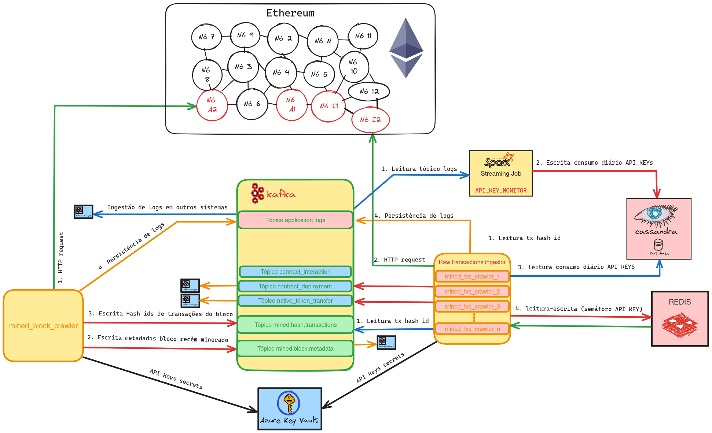

Os componentes dessa solução são:

- **Apache Kafka**: Plataforma de streaming distribuída que permite publicar e consumir mensagens em tópicos. É altamente escalável e tolerante a falhas. É o backbone do sistema Pub-Sub.
- **Redis**: Banco de dados chave-valor em memória usado para armazenar dados sobre uso de API KEYs.
- **Scylla**: Banco de dados NoSQL altamente escalável e tolerante a falhas usado para armazenar dados sobre uso de API KEYs.
- **Azure Key Vault**: Serviço de segredos da Azure usado para armazenar as API Keys.
- **Apache Spark**: Framework de processamento de dados em tempo real usado para monitorar o uso das API Keys.
- **Jobs implementados em python Python**: Esses jobs são responsáveis por capturar, classificar e decodificar os dados usando as ferramentas mencionadas acima. Executam em containers docker.
- **Kafka Connect**: Ferramenta usada para conectar o Kafka a diferentes fontes de dados. Nesse caso, o Kafka Connect é usado para envio dos dados de tópicos do Kafka para outros sistemas.

## 4.2. Arquitetura Técnica

Esse trabalho utiliza inúmeros serviços e ferramentas para captura, ingestão, processamento e persistência de dados. De forma a organizar esses serviços, eles foram divididos em camadas. Cada camada é responsável por um conjunto de serviços que realizam tarefas específicas no funcionamento do **dm_v3_chain_explorer**.

- **Camada de operação**: Serviços que realizam telemetria dos recursos computacionais da infraestrutura utilizada pelo sistema.
- **Camada de aplicação**: Aplicações construídas em Python e deployadas em containers que realizam a captura dos dados na rede Ethereum e persistem no Apache Kafka.
- **Camada Fast**: Serviços auxiliares utilizados pela camada de aplicação para captura e ingestão de dados em tempo real, tais como Redis, Spark, Kafka, etc.
- **Camada Batch**: Serviços relacionados a uma arquitetura de big data, como Hadoop, Hive, etc.

Os serviços das camadas **Fast**, **Batch** e de **Operações** são aqui também **deployados em containers docker**. Em soluções produtivas, esses serviços podem ser deployados em máquinas virtuais, kubernetes ou mesmo em serviços gerenciados de cloud, cada alternativa tendo suas vantagens e desvantagens. Porém, para finalidade de um protótipo, o uso de containers é mais que suficiente.

Além dos serviços deployados em containers docker, é utilizado também recurso em cloud **Azure Key Vault** para armazenamento das API Keys como secrets.

### 4.2.1. Ambientes de Orquestração de Containers

Para orquestração de containers, foram utilizadas as ferramentas **Docker Compose** e **Docker Swarm**.

### 1. Ambiente de desenvolvimento

O **Docker Compose** é usado para orquestrar containers em um único host. O uso de bind mounts para compartilhar volumes entre o host e o container, facilita o desenvolvimento e testes. E o `docker-compose.yml` trás facilidade, agilidade e reprodutibilidade para deploy do conjunto de serviços em containers. Definamos o deploy de serviços em um único host como **single-host** e consideremos esse como o ambiente de desenvolvimento para o sistema **dm_v3_chain_explorer**.

Esse trabalho utilizou um computador pessoal como host para deploy dos serviços em containers docker para desenvolvimento. Porém, pela quantidade de serviços e para fins de escalabilidade, foi explorado o uso de **Docker Swarm** para deploy dos serviços em múltiplos hosts.

### 2. Ambiente de produção

O **Docker Swarm** é usado para orquestrar containers em múltiplos hosts. Ele é também uma ferramenta nativa do Docker e pode ser usado para deploy de serviços em containers em ambiente produtivo, onde a alta disponibilidade e escalabilidade são necessárias. O docker swarm também usa arquivos yml de configuração, similares ao docker-compose, para definir o deploy de serviços em múltiplos hosts na forma de **Stacks**.

Para esse trabalho foi montado um cluster Swarm com 4 máquinas, sendo um nó manager e 3 nós workers. Assim é possível distribuir as cargas de trabalho entre os nós e garantir a alta disponibilidade do sistema.

- **Nó Manager**: Host **dadaia-desktop** com 16GB de RAM e 8 CPUs e 256 GB de armazenamento SSD.
- **Nó Worker 1**: Host **dadaia-HP-ZBook-15-G2** com 16GB de RAM e 8 CPUs e 256 GB de armazenamento SSD.
- **Nó Worker 2**: Host **dadaia-server** Laptop com 12GB de RAM e 8 CPUs e 256 GB de armazenamento SSD.
- **Nó Worker 3**: Host **dadaia-server-2** Computador Laptop com 4GB de RAM e 8 CPUs e 256 GB de armazenamento em Hard Disk.

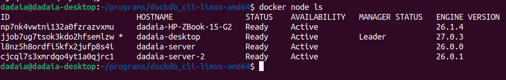

A medida que as camadas são descritas, desenhos representando a distribuição desses serviços em ambiente **single-host** e **multi-host** serão apresentados.

### 4.2.1. Camada de operação

Na camada de operação estão definidos serviços necessários para realizar telemetria e monitoramento de recursos da infraestrutura utilizados pelo sistema **dm_v3_chain_explorer**. Esses serviços são:

- **[Prometheus](https://prometheus.io/)**: Serviço usado para coleta de logs e métricas utilizadas na telemetria e monitoramento;
- **[Grafana](https://grafana.com/)**: Serviço usado para visualização de logs e métricas coletadas pelo Prometheus, provendo dashboards para monitoramento;
- **[Prometheus Agents e Exporters](https://prometheus.io/docs/instrumenting/exporters/)**: Serviços responsáveis por coletar métricas de enviar para o Prometheus. Os agentes utilizados nesse trabalho foram:
  - **[Node exporter](https://prometheus.io/docs/guides/node-exporter/)**: Agente para coletar dados de telemetria do nó em específico.
  - **[Kafka exporter](https://danielmrosa.medium.com/monitoring-kafka-b97d2d5a5434)**: Agente para coletar dados de telemetria do kafka.
  - **[Cadvisor](https://prometheus.io/docs/guides/cadvisor/)**: Agente para coletar dados de telemetria do docker.

Quando deployados em ambiente de desenvolvimento, os serviços dessa camada são deployados em um único host. Uma ilustração dessa distribuição é mostrada abaixo.

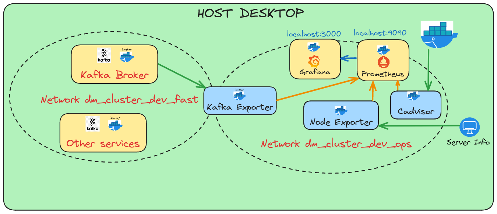

Na figura acima 2 pontos são importantes:

- As métricas coletadas pelos exporters em suas fontes (server, kafka, docker) nos fluxos das **setas verdes**.
- Os exporters coletam essas métricas e as enviam para o Prometheus, conforme fluxo das **setas laranjas**.
- O Grafana consome essas métricas do Prometheus e as exibe em dashboards, conforme fluxo das **setas azuis**.

Quando deployados em ambiente de produção (cluster swarm), os containers são instanciados em múltiplos hosts. Logo, os exporters **cadvisor** e **node exporter** são deployados em cada nó do cluster Swarm, de forma a monitorar o docker daquele nó e as métricas daquele nó.

O **kafka exporter** precisa ser deployado em apenas um nó, o nó, desde que tenha conexão de rede com os brokers do kafka. Uma ilustração dessa distribuição é mostrada abaixo.

#### Observação

Para deploy dos serviços foi feita segregação de redes. Os seviços referentes a camada de operação estão em uma rede chamada **dm_cluster_dev_ops**. Porém, o serviço **Kafka Exporter** está também attachado a rede **dm_cluster_dev_fast** para que possa se comunicar com o Kafka. Na figura abaixo o perímetro em azul representa a rede **dm_cluster_dev_fast** e o perímetro em verde a rede **dm_cluster_dev_ops**.

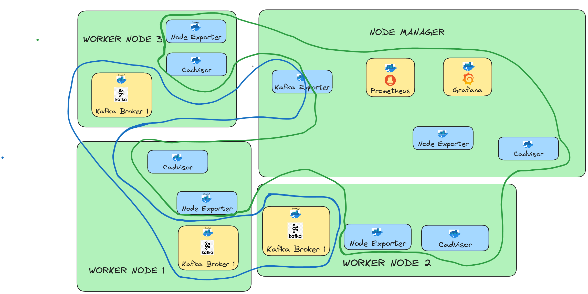

### 4.2.2. Camada Fast

Nessa camada estão definidos os serviços utilizados para ingestão de dados em tempo real e que trabalham em conjunto com os Jobs implementados na camada de aplicação. Os serviços dessa camada são:

- **Brokers do Apache Kafka**, usados como backbone de dados para fluxos de dados downstream e para comunicação entre Jobs;
- **Apache Zookeeper** utilizado por cluster de brokers do Kafka para gerenciamento de metadados e sincronização entre brokers;
- **Confluent Control Center**: Serviço com interface gráfica para visualização de tópicos, kafka clusters, consumer groups e cluster de kafka-connect.
- **Confluent Kafka Connect**: Integra o Apache Kafka às mais diferentes plataformas através de conectores do tipo sources e sinks já implementados.
- **Confluent Schema Registry**: Serviço usado para armazenar e validar schemas de dados em tópicos do Kafka.
- **ScyllaDB**: Database No-SQL que permite alto throughput de operações de escrita, é por natureza distribuído de forma uniforme e pode ser escalado para atuar de forma global. Usado para update em tabela de consumo de API Keys, para que jobs tenham ciencia de chave e sua utilização em requests no tempo.
- **Redis**: Banco de dados chave-valor usado para controle de consumo de API Keys em jobs de streaming, de forma a garantir que cada API key seja usada por somente um Job a determinado instante, atuando como um semáforo.
- **Apache Spark**: Engine de processamendo de dados. Usado para monitorar o uso de API Keys e atualizar a tabela no ScyllaDB.

A abaixo estão representados os serviços das camadas de **operações** e camada **fast** em ambiente **single-host**.

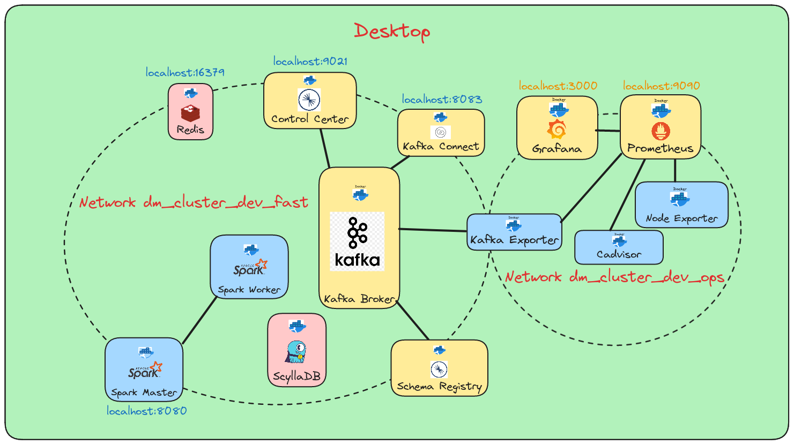

Os serviços acima deployados em ambiente de produção (cluster Swarm) são distribuídos conforme abaixo.

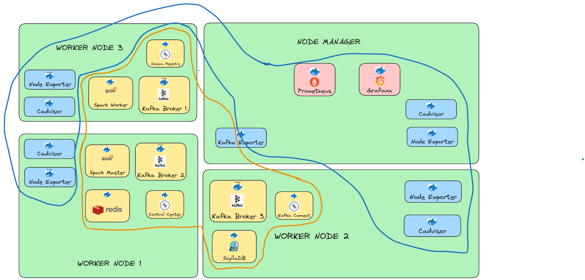

### 4.2.3.  Camada de aplicação

Nessa camada estão definidas:

- Aplicações escritas em python para interação com blockchains do tipo EVM e plataforma de dados.
- Aplicação Spark Streaming para monitoramento de consumo de API Keys.

Como informado anteriormente, as aplicações são deployadas em containers docker e interagem com os serviços da camada **Fast**. A ilustração abaixo mostra a distribuição desses serviços em ambiente **single-host**.

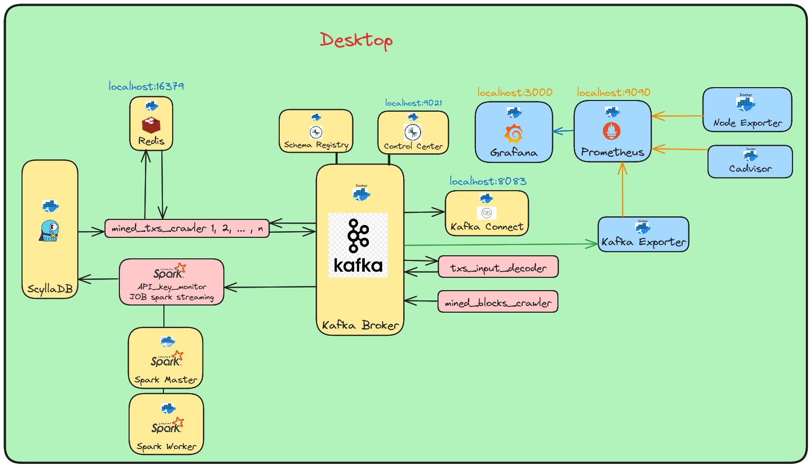

- Na figura acima, os jobs **mined_blocks_crawler**, **mined_txs_crawler** e **txs_input_decoder** são deployados em containers docker e interagem com os serviços da camada **Fast**.

- O job **api_key_monitor** é um job do tipo Spark Streaming e é deployado em container, descrito como que monitora o uso de API Keys através do tópico de logs e atualiza a tabela no ScyllaDB.

- O **Kafka Connect** é usado para enviar dados dos tópicos do Kafka para o **HDFS** e outros sistemas de armazenamento de dados em cloud como o **AWS S3** ou **Azure Data Lake Storage**.

### 4.2.4. Camada Batch

A camada batch corresponde a serviços relacionados a processamento de dados em lote. Essa camada é composta por:

### I) Apache Hadoop

Conjunto de serviços que compõem o hadoop e algumas ferramentas de seu ecossistema. Um cluster hadoop é composto pelos seguintes sistemas:

- **Hadoop Namenode**: Mantém controle de metadados, logs e outros dados relacionados ao cluster e ao HDFS. Um cluster hadoop pode ter 1 namenode e eventualmente também um namenode secundário em estado de standby. Este tem por função assumir o lugar do namenode primário, caso necessário.

- **Hadoop Datanodes**: Armazenam dados do cluster e atuam em conjunto com o **namenode** para formar o HDFS (hadoop Distributed File System). Um cluster Hadoop pode ter 1 ou mais datanodes, o que permite a escalabilidade horizontal em volume de dados a serem armazenados.

- **Resource Manager e Node managers**: Atuam em conjunto para gerenciar alocação de recursos de processamento no cluster Hadoop. Esse processamento se dá por meio de jobs de **Map reduce**,  jobs do **Apache Spark gerenciado pelo Yarn**, entre outros. 
  
  - Os **node managers** são instanciados em cada nó do cluster de forma a monitorar o uso de recursos naquele nó.
  - O **resource manager** atua como um orquestrador na alocação dos recursos para processamento nesse cluster, trocando informações com os **node managers**. Uma referencia mais completa sobre o [YARN pode ser vista aqui.](https://hadoop.apache.org/docs/stable/hadoop-yarn/hadoop-yarn-site/YARN.html)

- **History Server**: Serviço utilizado para armazenar dados referentes a execução de jobs de processamento no cluster hadoop.

O apache hadoop nesse trabalho é usado como data lake, onde chegam os dados inicialmente armazenados em tópicos do Kafka, por meio de um conector d otipo SINK do **kafka connect** e, futuramente de batches (processamento de jobs no airflow).

### II) Apache Hive

O hive é um sistema de Data Warehouse construída no topo do Apache Hadoop. É usado para fornecer uma camada de abstração sobre dados no data lake armazenados no HDFS. O hive permite a execução de queries em dados armazenados no HDFS. Esses dados são organizados em databases e tabelas, e consultados por meio de uma linguagem de query chamada HQL, similar ao SQL. O apache hive traduz então essas queries em jobs de map-reduce ou de spark, dependendo da engine de processamento configurada. O hive é composto por 3 serviços principais:

- **Hive metastore**: Armazena metadados referentes a tabelas e dados para serem utilizados por motores de processamento em lote como map-reduce, presto e spark engine na execução de queries. Por debaixo dos panos o [hive metastore](https://www.ibm.com/docs/en/watsonx/watsonxdata/1.0.x?topic=components-hive-metastore-overview) utiliza um banco de dados relacional para persistir os dados, nesse caso um postgres.

- **Hive server**: Servidor responsável por responder a de queries utilizando-se de um motor de processamento e dados do hive metastore.

O apache hive é usado então para abstrair dados armazenados no HDFS em tabelas hive, a serem consumidas por processos sistẽmicos do tipo batch, ou por análise exploratória por meio do de queries HQL.

### III) Hue

O Hue é um client com interface gráfica onde é possível visualizar o sistema de pastas e arquivos do HDFS, databases e tabelas no Hive Metastore e executar ações sobre essas entidades.

## 5. Aspectos técnicos desse trabalho

Nessa seção estão apresentado alguns aspectos técnicos na implementação do sistema proposto em um ambiente local. Primeiramente, são apresentados e justificados aspectos relacionados à escolha da ferramenta **docker** como base na construção desse trabalho e as formas de orquestração desses containers que são utilizadas aqui.

Em seguida, será apresentada a estrutura desse projeto, explorando as pastas e arquivos que compõem o repositório **dm_v3_chain_explorer**.

## 5.1. Dockerização dos serviços

Conforme mencionado em seções anteriores, o docker foi usado amplamente na implementação desse tabalho. O seu uso pode ser embasado de acordo com 2 propósitos.

- A construção de imagens que encapsulem jobs da camada de aplicação, bem como toda stack de software necessária para executá-los torna a aplicação portável, possibilitando que:
  - Outros entusiastas do ramo possam reproduzir o sistema em sua máquina local, usando também o docker.
  - As aplicações sejam futuramente portadas para ambientes em cloud que executam containers. Algo bem adequado em um cenário produtivo utilizando-se de serviços gerenciados de orquestração de containers. Todo provedor de cloud tem um serviço de orquestração de containers, como **ECS**, **EKS**, **AKS** e **GKE**.

- A facilidade do uso de serviços como o Kafka, hadoop, Spark e toda stack de serviço definida nas camadas `batch`, `fast` e de `operações` em containers. Essa escolha também trás alguns benefícios tais como:
  - O uso de containers abstrai a complexidade de instalação dessas ferramentas em máquina local, dado, a complexidade de muitas delas e também a quantidade de dependências e número de serviços que compõem a stack, algo que facilmente pode virar um pesadelo em ambiente local.

  - Containers são ambientes isolados que comunicam-se em rede. Apesar de compartilharem a mesma máquina física e o mesmo kernel, cada container tem seu próprio ambiente de execução. Portanto podem atuar de forma análoga a clusters, onde cada container representa um nó de um cluster. Assim é possível simular clusters de Kafka, Hadoop, Spark, entre outros, em ambiente local para testes e desenvolvimento.

  - A definição de imagens e stack de serviços a serem orquestradas é suficiente para que se possa replicar o ambiente em qualquer máquina que tenha o docker instalado e os recursos de hardware necessários.

  - Tecnologias aqui deployadas em containers, tais como spark, hadoop, kafka e outros fornecem um conhecimento mais aprofundado sobre essas tecnologias, devendo-se configurar e orquestrar esses serviços manualmente e entender sobre **volume mounts**, **networking** e outras configurações específicas dos recursos que são abstraídas em serviços gerenciados em cloud.

  - Os serviços aqui deployados em containers e open source podem ser facilmente substituídos por serviços análogos em cloud, caso haja a necessidade de se construir um ambiente produtivo robusto, seguro e eficiente.
  
## 5.2. Orquestração de serviços em containers

Conforme mencionado, todos os serviços do sistema **dm_v3_chain_explorer** rodarão instanciados localmente em containers a partir de imagens docker. Então se faz necessário o uso de uma ferramenta de orquestração de execução desses containers. O docker tem 2 ferramentas para esse propósito: **docker-compose** e **docker-swarm**.

### 5.2.1. Docker-compose

O docker-compose é uma ferramenta que permite definir e executar aplicações multi-container. Com ele é possível definir os serviços que compõem a aplicação em um arquivo `docker-compose.yml` e então instanciar esses serviços em containers. O docker-compose é uma ferramenta de orquestração de containers para **ambiente local executando em um único nó**.

É a ferramenta ideal para ambiente de desenvolvimento local e testes, onde é possível definir a stack de serviços que compõem a aplicação e instanciá-los em containers. Com o docker-compose é possível definir volumes, redes, variáveis de ambiente, entre outros, para cada serviço.

### 5.2.2. Docker-swarm

O docker-swarm é uma ferramenta de orquestração de containers para **ambientes distribuídos**. Com ele é possível definir e instanciar serviços em múltiplos nós. O docker-swarm pode ser usado como ferramenta de orquestração de containers para ambientes de produção, onde é necessário alta disponibilidade, escalabilidade e tolerância a falhas. Existem outras ferramentas de orquestração de containers, como **Kubernetes**, **Mesos** e outras, que são mais robustas e possuem mais recursos que o docker-swarm. Porém, o docker-swarm é uma ferramenta simples e fácil de usar para orquestração de containers em ambientes distribuídos e default no docker.

### 5.2.3. Docker-Compose e Docker Swarm nesse trabalho

O docker compose foi usado para orquestrar diferentes serviços nesse trabalho em seu desenvolvimento. Por exemplo, as aplicações em python, desenvolvidas e encapsuladas em imagens python, e que capturam os dados da rede Ethereum, foram orquestradas em containers usando o docker-compose juntamente com o Kafka, Redis, Scylla, entre outros.

Por outro lado, a medida que o número de serviços aumentou, a necessidade de mais recursos de hardware para execução desses serviços também cresceu. Então, o docker-swarm foi usado para orquestrar esses serviços em múltiplos nós, simulando um ambiente distribuído. Da forma como foi feito, foi possível simular um ambiente de produção, onde os serviços estão distribuídos em múltiplos nós e orquestrados por um gerenciador de containers.

#### Considerações

1. Apesar de inúmeras ferramentas em cloud terem seus benefícios, o uso restrito delas pode trazer dependência de fornecedores de cloud. A construção de um sistema que usa tecnologias open source, e que de toda forma pode ser portado para cloud, é uma forma de se manter independente desses fornecedores.

2. Existem outras possibilidades de deploy e orquestração de containers que poderiam ter sido utilizadas aqui. Por exemplo o uso de clusters Kubernetes para orquestração de containers e o uso de operadores para deploy de serviços como Kafka, Spark, Hadoop, entre outros, baseados em Helm Charts. O uso de Kubernetes traria benefícios como autoescalonamento, alta disponibilidade, entre outros. Porém, a escolha do Docker Swarm foi feita por simplicidade e configuração em ambiente local, bastando o docker instalado.

## 5.3. Estrutura do projeto

### 5.3.1. Pasta Docker

Na pasta `/docker`, localizada na raiz do repositório **dm_v3_chain_explorer** estão definidas as imagens docker que compõem esse trabalho. Elas estão organizadas de acordo com suas respectivas camadas, sendo essas `app_layer`, `fast_layer`, `batch_layer`, e `ops_layer`.

- As imagens definidas em **app_layer** são as aplicações desenvolvidas em python para capturar os dados e interagircom redes EVM, como a rede Ethereum.

- As imagens definidas nos diretórios **fast_layer**, **batch_layer** e **ops_layer** se justificam por 2 motivos:

  1. Imagens construídas uma no topo da outra, com configurações adicionais, como é o caso do Hadoop, Hive e Spark. vale dar o crédito que as imagens definidas para o Hadoop, Hive e Spark foram **fortemente baseadas nos repositórios Big Data Europe** para o [Hadoop](https://github.com/big-data-europe/docker-hadoop) e o [Hive](https://github.com/big-data-europe/docker-hive).

  2. São imagens construídas no topo de serviços pré-definidos, porém com configurações adicionais necessárias para execução desse sistema. É o caso do **Scylla** e do **Postgres** que adicionam **scripts sql/cql** a serem executados no entrypoint da imagem e que criam databases/keyspaces, users e tabelas. Ou do Kafka Connect que adiciona plugins para conexão com diferentes sistemas no topo da imagem base do Kafka Connect da **Confluent**.

```bash
docker
  ├── app_layer
  │   ├── onchain-actors
  │   ├── offchain-monitors
  │   ├── offchain-stream-txs
  │   ├── spark-streaming-jobs
  │   └── onchain-watchers
  ├── batch_layer
  │   ├── hadoop
  │   │   ├── base
  │   │   ├── namenode
  │   │   ├── datanode
  │   │   ├── resourcemanager
  │   │   ├──  nodemanager
  │   │   └── historyserver
  │   ├── hive
  │   │   ├── base
  │   │   ├── metastore
  │   │   └── server
  │   ├── postgres
  │   ├── spark
  │   │   ├── hadoop-base
  │   │   ├── hive-base
  │   │   ├── spark-base
  │   │   ├── spark-master
  │   │   └── spark-worker
  │   └── hue
  ├── fast_layer
  │   ├── kafka-connect
  │   ├── scylladb
  └── ops_layer
      └── prometheus
```

Com esses arquivos é possível fazer o build das imagens que compõem esse trabalho.

### 5.3.2. Pasta Services

Na pasta `/services`, localizada na raiz do repositório **dm_v3_chain_explorer** estão definidos os serviços que compõem esse trabalho. Esses serviços estão organizados de acordo com a camada a que pertencem, sendo essas camadas `fast`, `batch`, `app` e `ops`.

```bash
services
  ├── app_layer
  │   ├── cluster_compose.yml
  │   └── cluster_swarm.yml
  ├── batch_layer
  │   ├── cluster_compose.yml
  │   └── cluster_swarm.yml
  ├── fast_layer
  │   ├── cluster_compose.yml
  │   └── cluster_swarm.yml
  └── ops_layer
      ├── cluster_compose.yml
      └── cluster_swarm.yml
```

Os serviços estão definidos em arquivos `docker-compose.yml` e `docker-swarm.yml` para orquestração de containers em ambiente local e distribuído, respectivamente. E na pasta `/services` estão organizados de acordo com a camada a que pertencem.

### 5.3.3. Arquivo Makefile

Para simplificar esse processo de execução de comandos docker, de build e deploy de serviços, publicação de imagens, entre outros, foi definido um arquivo chamado [Makefile](https://www.gnu.org/software/make/manual/make.html) na raíz desse projeto. O Makefile é um componente central, para que comandos sejam reproduzidos de maneira simples. no arquivo `/Makefile`, na base do repositório **dm_v3_chain_explorer** é possivel visualizar os comandos definidos.


**Observação**: Essa ferramenta vem previamante instalada em sistemas operacionais Linux. Caso não possua o make instalado e tenha dificuldades para instalá-lo, uma opção não tão custosa é abrir o arquivo e executar os comandos docker manualmente.

### 5.3.4. Pasta Scripts

Na pasta `/scripts`, localizada na raiz do repositório **dm_v3_chain_explorer** estão definidos scripts shell úteis para automação de tarefas mais complexas.

- **0_create_dm_v3_structure.sh**: Cria a pasta `docker/app_layer` e clona os repositórios da aplicação para dentro dele.
- **1_create_swarm_networks.sh**: Cria as redes docker para orquestração de containers em ambiente distribuído.
- **2_start_prod_cluster.sh**: Cria cluster Swarm para posterior deploy de serviços em ambiente distribuído.

A chamada para execução desses scripts se dá também pelo uso de comandos definidos no `Makefile`.

### 5.3.5. Pasta Mnt

Na pasta `/mnt`, localizada na raiz do repositório **dm_v3_chain_explorer** estão definidos volumes que são montados em containers para persistência de dados localmente.

### 5.3.6. Estrutura geral do projeto

```bash
dm_v3_chain_explorer
  ├── docker
  │   ├── app_layer
  │   ├── batch_layer
  │   ├── fast_layer
  │   └── ops_layer
  ├── img
  ├── mnt
  ├── scripts
  ├── services
  │   ├── app_layer
  │   ├── batch_layer
  │   ├── fast_layer
  │   └── ops_layer
  ├── Makefile
  └── README.md
```

## 6. Reprodução do sistema `dm_v3_chain_explorer`

Nessa seção está definido o passo-a-passo para reprodução do sistema **dm_v3_chain_explorer** em ambiente local, um dos requisitos deste trabalho. A reprodutibilidade é importante pelos seguintes motivos:

- A reprodução do trabalho permite que os avaliadores executem o mesmo e compreendam como ele funciona.

- O **dm_v3_chain_explorer** é um sistema complexo, tendo diversos serviços interagindo com aplicações para que sua finalidade seja alcançada. Provêr um passo-a-passo para o leitor possa reproduzi-lo dá a este a oportunidade de entendê-lo em análise e síntese.

O passo a passo indica como clonar repositórios, configurar ambiente e deployar os serviços em um ambiente local, single-node com **Docker Compose**.

Ao final é apresentada uma maneira de deployar este em um ambiente distribuído, multi-node usando o **Docker Swarm**.

**Observação**: Um fator crucial e de maior dificuldade para reprodução desse sistema é a **necessidade de API Keys** para interagir com a rede blockchain por meio de um provedor Node-as-a-Service.

## 6.1. Requisitos

Para reprodução em ambiente local, é necessário que os seguintes requisitos sejam satisfeitos.

### 6.1.1. Requisitos de hardware

É recomendado possuir uma máquina com:

- Mínimo de 16 GB memória RAM;
- Processador com 4 núcleos.

Pelo número de containers que serão instanciados, é necessário que a máquina tenha recursos de hardware suficientes para execução desses containers.

### 6.1.2. Sistema Operacional

Esse sistema foi desenvolvido e testado em **kernel Linux, distro Ubuntu 22.04**. Portanto, é recomendado que para reprodução desse o sistema operacional seja Linux.
Algumas das ferramentas usadas nesse trabalho, como o **Makefile**, são nativas do Linux. O docker também é mais eficiente em ambiente Linux, por compartilhar o mesmo kernel.

### 6.1.3. Docker Instalado

Para reproduzir esse sistema em ambiente local, é necessário ter o docker instalado e configurado. Para verificar se o docker está instalado e configurado adequadamente, execute os comandos abaixo.

```bash
docker version
```

A saída esperada é algo como:

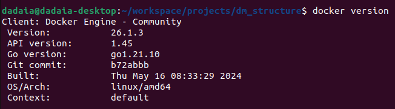

Caso não esteja instalado, siga as instruções de instalação no [site oficial do docker](https://docs.docker.com/engine/install/).

### 6.1.4.  Docker Compose e Docker Swarm instalados

As ferramentas de orquestração de containers **Docker Compose** e **Docker Swarm** são necessárias para deployar os serviços em ambiente local e distribuído, respectivamente. Contudo elas são instaladas junto com o docker. Para verificar se estão instaladas adequadamente, execute os comandos abaixo.

```bash
docker-compose version
```

A saída esperada é algo como:


```bash
docker swarm --help
```

A saída esperada é algo como:

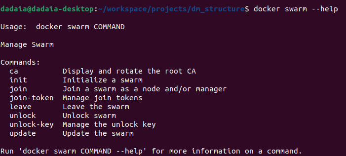

### 6.1.5.  Git instalado

O git é necessário para que o leitor possa clonar os repositórios que compõem esse trabalho. Para verificar se o git está instalado, execute o comando abaixo.

```bash
git --version
```

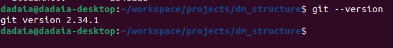

### 6.2. Setup do ambiente local

Esse trabalho é composto por multiplos repositórios, conforme mencionado. O 1º passo para reprodução desse sistema é clonar o repositório base, definido como **dm_v3_chain_explorer**.

Para isso, execute o comando abaixo e em seguida navegue para o diretório do projeto e em seguida navegue para a pasta usando o terminal.

```bash
git clone git@github.com:marcoaureliomenezes/dm_v3_chain_explorer.git
cd dm_v3_chain_explorer
```

Esse repositorio é a base do sistema. Porém, é preciso também clonar os demais repositórios da camada de aplicação. Conforme dito na seção 6, um script chamado `0_create_dm_v3_structure.sh` foi criado para esse propósito e pode ser executado a partir do seguinte comando make:

```bash
make create_dm_v3_explorer_structure
```

O comando acima clonará todos os repositórios de aplicação necessários para dentro da pasta `/docker`.

### 6.2.1.  Pull e Build das imagens docker

No docker é possível construir imagens a partir de um arquivo `Dockerfile` e depois fazer o build delas. Ou ainda, é possível fazer o pull de imagens já construídas e disponíveis no docker hub entre outros repositórios de imagens.

Para esse sistema diversas imagens foram construídas, devido a necessidade de customização. Geralmente essas imagens são construídas no topo de imagens base, que são imagens oficiais ou de terceiros, e disponíveis no docker hub. Para construir as imagens desse sistema, execute o comando abaixo.

```bash
make build
```

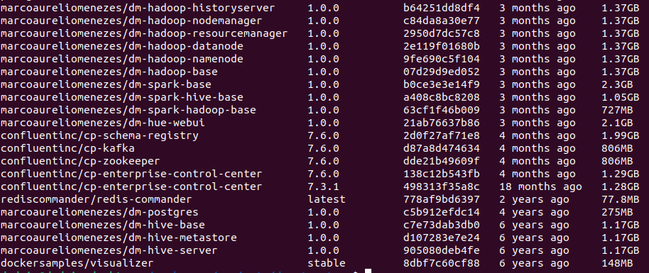

### Observação sobre o build a partir do Makefile

Todas as imagens construídas ou personalizadas possuem tags apontando para o repositório **marcoaureliomenezes** no docker hub.

É possível o leitor reapontar essa configuração para seu próprio repositório do DockerHub caso queira deployar imagens semelhantes.

**Para execução local desse sistema usando o docker-compose** não é necessário que as imagens estejam construídas ou disponíveis no docker hub. Caso não estejam, é necessário construí-las localmente. Por esse motivo, todos os arquivos de docker-compose, aqui chamados de **cluster_compose** estão configurados para fazer build das imagens localmente.

Porém, **para executar o sistema em um ambiente distribuído usando o Docker Swarm**, é necessário que as imagens estejam disponíveis em um repositório de imagens, como o Docker Hub. Isso porque diferentes nós do cluster precisam acessar as mesmas imagens para instanciar os serviços. Por esse motivo, é necessário que as imagens sejam construídas e publicadas no Docker Hub. Para publicar as imagens no Docker Hub, execute o comando abaixo.

```bash
make publish
```

## 6.3. Reprodução do sistema usando o Docker Compose

Caso o leitor queira deployar o sistema em **ambiente local**, **single-node**, usando o **docker-compose** como orquestrador, os passos a seguir devem ser seguidos.

## 6.3.1. Observação sobre execução usando Docker Compose

A execução de todas as camadas de serviço em uma máquina local será, esgotando-se os recursos de hardware disponíveis. Portanto que além dos requisitos citados, o leitor execute as camadas de serviço de forma separada, conforme descrito abaixo.

- Camada de operações;
- Camada Fast e camada App;
- Camada Batch.

Esse foi o principal motivador para divisão de serviços em camadas e criação de um Cluster Swarm.

## 6.3.2.  Deploy de serviços da camada de Operações

Conforme visto na seção de arquitetura técnica, a **camada ops** é composta por serviços que realizam telemetria dos recursos de infraestrutura do **dm_v3_chain_explorer**. Ela é composta dos seguintes serviços:

- **Prometheus**: Serviço de monitoramento de telemetria.
- **Grafana**: Serviço de visualização de telemetria.
- **Node Exporter**: Agente para coletar dados de telemetria do nó em específico.
- **Cadvisor**: Agente para coletar dados de telemetria do docker.

Para realizar o deploy da **camada ops**, execute o comando abaixo.

```bash
make deploy_dev_ops && make watch_dev_ops
```

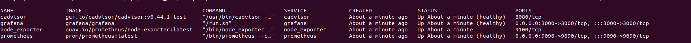

**Observação**: Após execução do comando, o terminal ficará monitorando o estado dos containers. Para sair dessa tela, pressione `Ctrl + C`. Os serviços continuarão rodando em background.

Quando os serviços estiverem saudáveis, seguintes endpoints passam a estar disponíveis para a **camada ops**:

| Serviço        | Endpoint              |
|----------------|-----------------------|
| Prometheus     | http://localhost:9090 |
| Grafana        | http://localhost:3000 |

A interface do Grafana pode ser acessada no navegador, digitando o endereço `http://localhost:3000`. O usuário e senha padrão são `admin` e `admin`, respectivamente.

### Adicionando dashboards ao Grafana

- Para adicionar o dashboard do Node Exporter e do docker, clique em `+` no lado esquerdo da tela, e depois em `Import`. No campo `Grafana.com Dashboard` digite o número `1860` e clique em `Load`. Em seguida, selecione o Prometheus como fonte de dados e clique em `Import`.

- Para adicionar o dashboard referente ao Docker, repita o processo usando o ID `193` no campo `Grafana.com Dashboard`.

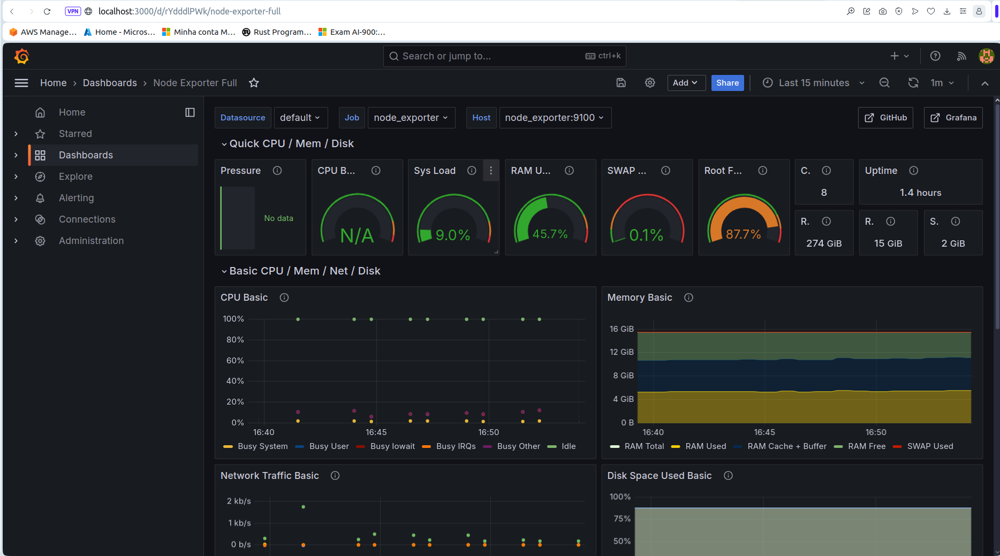

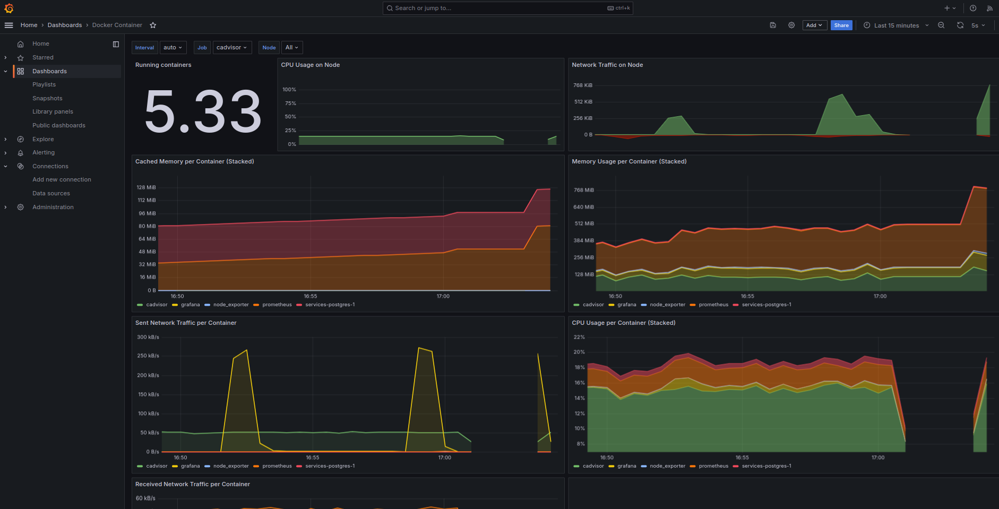

## 6.3.4.  Deploy de serviços da camada Fast

A **camada fast** é composta pelos seguintes serviços, deployados em containers:

- **1 Apache Zookeeper**: Utilizado por cluster de brokers Kafka para gestão de metadados e sincronização entre eles.
- **1 Broker Apache Kafka**: Utilizado como pub-sub para comunicação entre Jobs e como e backbone de dados, provendo esses dados em tempo real para fluxos downstream.
- **1 Confluent Schema Registry**: Serviço para registro de schemas de dados, usado para garantir compatibilidade entre diferentes versões de dados.
- **1 Confluent Kafka Connect**: Usado para integração do Kafka com o HDFS e com o S3.
- **1 Confluent Control Center**: Serviço com interface gráfica para visualização de tópicos, kafka clusters, consumer groups, schemas, clusters e jobs de kafka-connect.
- **1 Database ScyllaDB**: Banco de dados NoSQL persistente usado para controle de consumo de API Keys em processos de captura dos dados.
- **1 Redis**: Banco de dados em memória usado para garantir que uma API Key não será utilizada ao mesmo tempo por 2 processos.
- **1 Spark Master e 1 Spark Worker**: Cluster Spark utilizado em job streaming que processa logs e registra consumo de API Key.

Para deploy da camada `fast`, execute o comando abaixo.

```bash
make deploy_dev_fast && make watch_dev_fast
```

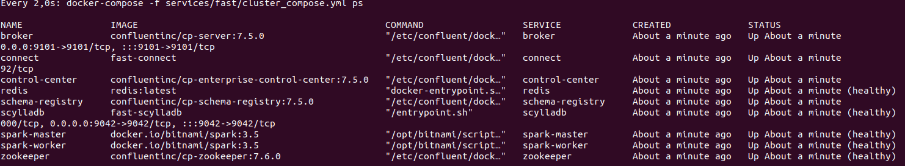

**Observação**: Após execução do comando, o terminal ficará monitorando o estado dos containers. Para sair dessa tela, pressione `Ctrl + C`. Os serviços continuarão rodando em background.

Quando os serviços estiverem saudáveis, seguintes endpoints passam a estar disponíveis para a **camada fast**:

| Serviço        | Endpoint              |
|----------------|-----------------------|
| Control Center | http://localhost:9021 |
| Redis Commander| http://localhost:8081 |
| Spark Master   | http://localhost:8080 |

Os conectores do Kafka Connect podem ser gerenciados tanto pelo Control Center quanto por interações com sua API Rest disponibilizada. O mesmo vale para o Schema Registry. No Makefile estão definidos comandos para interação com esses serviços.

## 6.3.5.  Deploy de serviços da camada de Aplicações

A **camada de aplicação** é composta pelos seguintes serviços:

- **mined-blocks-crawler**: Aplicação que captura dados de blocos minerados e os ids de transações contidas nesse bloco os envia para tópicos do Kafka.
- **mined-txs-crawler**: Aplicação que usa hash_ids de transações para obter dados dessas transações, classifica-las de acordo com o tipo e enviar para se respectivo tópico do Kafka.
- **txs-input-decoder**: Aplicação que busca converter
- **api_keys_log_processor**: Job Spark Streaming que consume tópico de logs e registra consumo de API Keys em tabela do ScyllaDB.

Para deploy da **camada app**, execute o comando abaixo.

```bash
make deploy_dev_app && make watch_dev_app
```

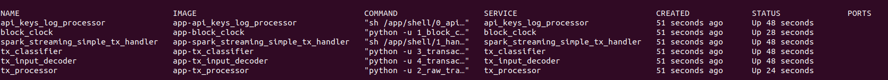

Com os serviços da camada **fast** e **app** deployados irá começar o fluxo de captura e ingestão de dados. Na seção seguinte será mostrado como visualizar esse fluxo em funcionamento.

## 6.4. Visualização do processo de captura e ingestão de dados

Com os serviços das camadas **fast** e **app** deployados é possível visualizar o sistema de captura e ingestão em funcionamento. Seguem abaixo os passos para visualização do processo de captura e ingestão de dados.

### 6.4.1. Job Spark Streaming `api_keys_log_processor`

Na camada de aplicação foi deployado o job de spark streaming `api_keys_log_processor`. Nas seções anteriores foi detalhado o funcionamento desse Job. Em resumo ele consome o tópico de logs e monitora o consumo de API Keys, registrando esse consumo em uma tabela no ScyllaDB.

Para visualizar o Job executando na Spark UI, acesse o endereço `http://localhost:8080` no navegador.

 monitora o consumo de API Keys e atualiza a tabela no ScyllaDB. Para visualizar o Job executando na Spark UI, acesse o endereço `http://localhost:8080` no navegador.

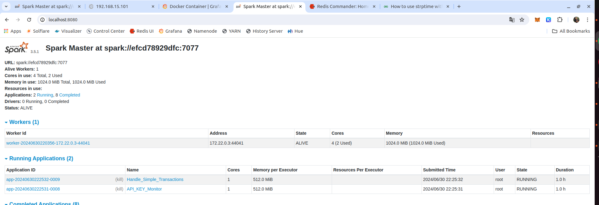

### 6.4.2. Visualização de consumo diário de API Keys no ScyllaDB

O Job de Spark Streaming `api_keys_log_processor` monitora o consumo de API Keys e atualiza a tabela `api_keys_node_providers` no ScyllaDB. Para visualizar o consumo diário de API Keys, execute o comando abaixo.

```bash
docker exec -it scylladb cqlsh -e "select * from operations.api_keys_node_providers"
# OU
make query_api_keys_consumption_table
```

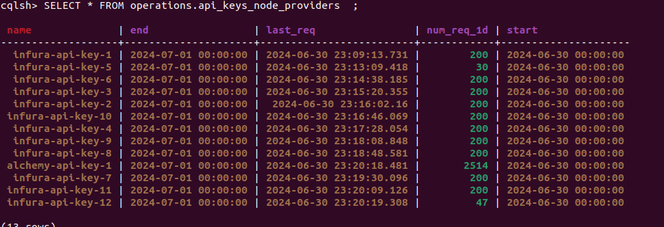

Será possivel acompanhar o consumo de API Keys em tempo real, conforme os dados são capturados e processados pelo Job de Spark Streaming `api_keys_log_processor`.

### 6.4.3. Semáforo para consumo de API Keys no Redis

Abaixo é mostrado o controle de consumo de API Keys no Redis.

Conforme mencionado, para manter a integridade dos dados, é necessário que uma API Key não seja consumida ao mesmo tempo por 2 processos. Para isso, um semáforo é implementado no Redis utilizando uma estrutura chamada hash, estrutura no formato:

- Chave é a API Key.
- O valor é um timestamp da última vez que foi consumida e o nome do job que a consumiu.

Na figura abaixo é possível visualizar esse semáforo de API Keys no Redis.

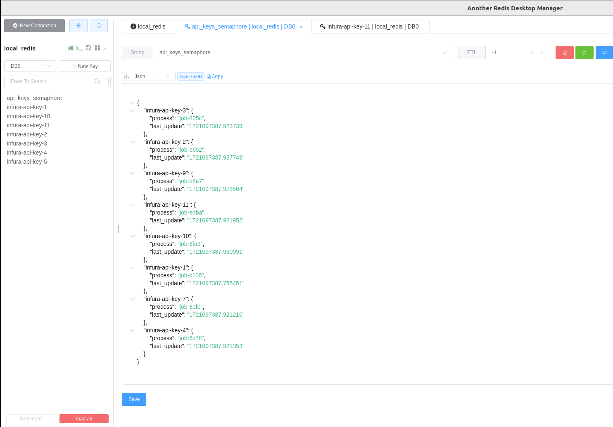

**Observação**: Foi criado um job específico para coletar com frequência de 500 ms as API Keys registradas no redis e juntá-las em uma só chave, chamada **api_keys_semaphore**. Assim o leitor pode visualizar melhor o semáforo de API Keys em funcionamento, conforme a figura acima.

### 6.4.4. Dados sendo exibidos pelo Kafka Control Center

Com o mecanismo de captura de dados e de gerenciamento de API Keys para compartilhamento entre jobs funcionando os dados passam a fluir pelos tópicos do Kafka.

Abaixo é possível ver uma amostra das mensagens sendo enviadas para o tópico `ethereum-blocks` no Kafka. Essas mensagens são capturadas pela aplicação `block-clock` e enviadas para o Kafka.

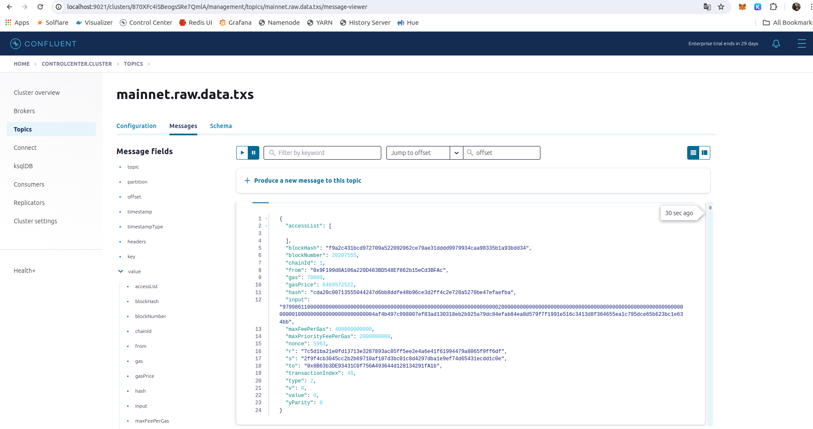
<hr>

## 6.5.  Deploy de serviços da camada Batch

## 6.6. Deploy de conectores Kafka Connect

Os conectores Kafka Connect são responsáveis por integrar o Kafka com outros sistemas, como o HDFS e o S3. Para deploy dos conectores, execute o comando abaixo.

```bash
make deploy_dev_connectors
```


## 6.4. Reprodução do sistema usando o Docker Swarm

Comando para iniciação de cluster

Comandos para deploy de serviços

## 7. Conclusão

Toda parte teórica e prática planejada para esse trabalho foi implementada. Demonstrações do workflow de captura descritos nesse documento serão feitas na apresentação, de forma que os avaliadores possam entender melhor o sistema **dm_v3_chain_explorer**, aqui proposto.

Assim os avaliadores podem colocar suas dúvidas sobre o trabalho e também dúvidas técnicas sobre as tecnologias usadas, de maneira a avaliar da melhor forma o conhecimento desse autor nos campos relacionados a engenharia de dados. É dificil mensurar o quanto conhecimento em tecnologia está contido nesse trabalho. A construção de uma plataforma de dados para captura e ingestão de dados.

## 8. Melhorias futuras

Esse trabalho, após ser submetido continuará a ser desenvolvido, visto as possibilidades que ele apresenta, mesmo que seja apenas no campo de estudos e desenvolvimento de hard skills.
Seguem abaixo listadas algumas dessa melhorias

### 8.1. Aplicações downstream para consumo dos dados

Está descrito nesse documento, somente o fluxo de captura, ingestão e algum processamento para obter dados em tempo real de uma blockchain do tipo EVM. Na apresentação serão demonstradas algumas aplicações downstream que evoluídas podem ter diversas aplicabilidades.

### 8.2. Melhoria em aplicações do repositório onchain-watchers

Como será apresentado, esse repositório tem aplicações que usam dados das transações ingestadas para obter dados de estado provenientes de contratos inteligentes. Para isso uma arquitetura voltada a eventos precisa ser implementada. Por exemplo, quando uma transação de swap de token WETH no protocolo DEFI Uniswap é feito, um evento é disparado para que dados da piscina de liquidez e preço dos tokens sejam ingestados no sistema.

### 8.3. Troca do uso de provedores Blockchain Node-as-a-Service

Conforme visto nesse trabalho o uso de provedores node-as-a-service tais como Infura e Alchemy limitam as requisições http para request dos dados. Então, a troca desses por nós proprietários é um passo importante para evolução do sistema, ao lidar com redes mais escalaveis do tipo EVM.

### 8.4. Evolução dos serviços de um ambiente local para ambiente produtivo

Conforme visto ao longo desse trabalho, todos os serviços usados, com exceção das aplicações construídas propriamente dita para esse sistema, tem versões totalmente gerenciadas em provedores de Cloud. O Kafka por exemplo pode ser substituído pelo Event Hub ou Amazon MSK ou Clonfluent Cloud. O data lake hadoop pode ser substituído por data lakes em recursos do tipo object storages, tais como S3 ou Azure ADLS. O Hive e o Spark podem ser substituídos pelo Delta Lake + Spark do Databricks. E assim por diante.
Os containers de aplicação podem ser migrados para executarem em recursos tais com EKS da AWS ou o AKS da Azure.

Essas são algumas das evoluções enumeradas no roadmap desse sistema.
