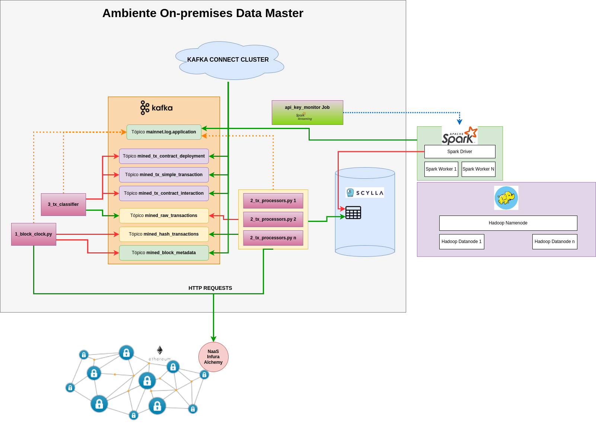
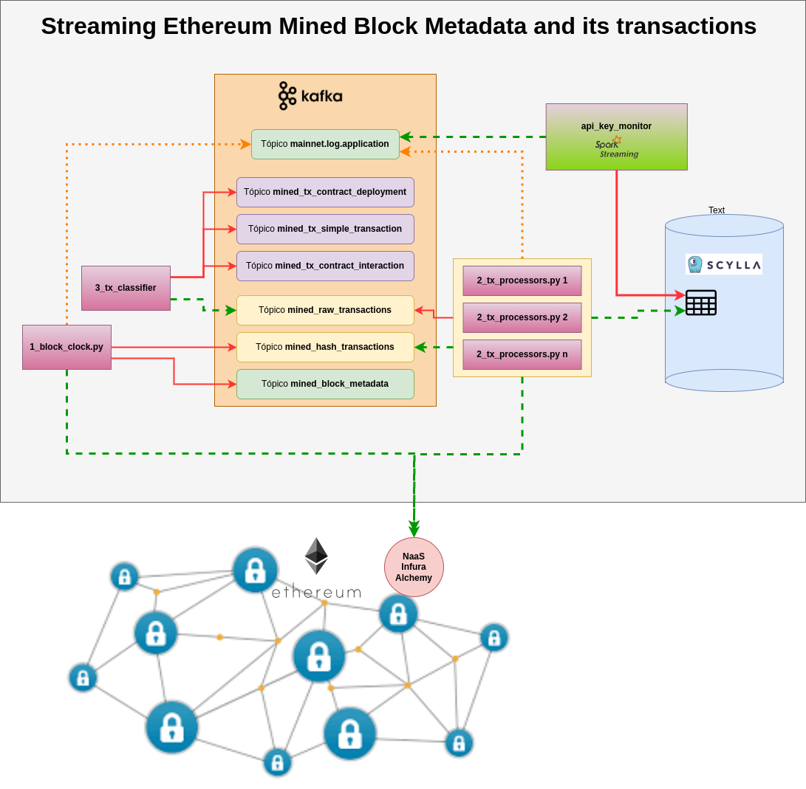
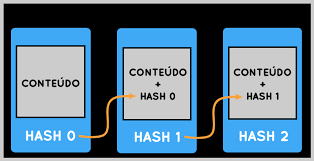
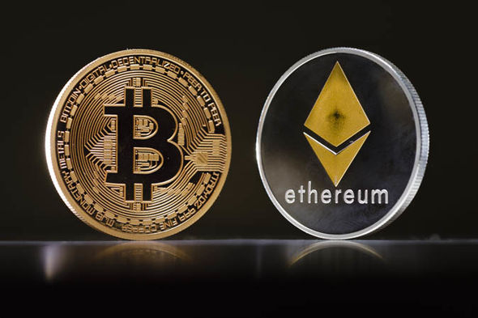

# dm_v3_chain_explorer System

O **dm_v3_chain_explorer** é um repositório no qual estão implementadas e documentadas as rotinas de extração, ingestão, processamento, armazenamento e uso de dados com origem em protocolos P2P do tipo blockchain. Esse trabalho foi desenvolvido para o case do programa Data Master.

## Sumário

1. [Objetivo do Case](#1---objetivo-do-case)
2. [Arquitetura de solução e Arquitetura Técnica](#2---arquitetura-de-solução-e-arquitetura-técnica)
3. [Explicação sobre o case desenvolvido](#3---explicação-sobre-o-case-desenvolvido)
4. [Aspectos técnicos desse trabalho](#4---aspectos-técnicos)
5. [Melhorias e considerações finais](#4---melhorias-e-considerações-finais)
6. [Reprodução da arquitetura](#5---reprodução-da-arquitetura)
7. [Appendice](#6---appendice)

## 1 - Objetivo do Case

O objetivo final desse trabalho é sua submissão para o programa Data Master, e posterior apresentação do mesmo a uma banca. Nessa apresentação serão avaliados conceitos e técnicas de engenharia de dados, entre outros campos, aplicados na construção prática deste sistema entitulado **dm_v3_chain_explorer**.

Para alcançar tal objetivo final e, dados os requisitos do case, especificados estes pela organização do programa, para a construção desse sistema foram definidos objetivos específicos, categorizados em objetivos de negócio e objetivos técnicos.

### 1.1 - Objetivos de negócio

Nesse trabalho o objetivo de negócio é prover uma solução capaz de analisar e obter insights de dados com origem em **redes P2P do tipo blockchain**. Dois fatores que embasam tal escolha e que são de conhecimento geral:

- **Dados públicos**: Blockchains são redes ponto-a-ponto que armazenam transações e contratos inteligentes em blocos. Blockchains públicas permitem que qualquer nó possa ingressar na rede. Isso significa que é possível acessar esses dados e utilizá-los para análises, dashboards, bots, entre outras aplicações. Obviamente desde que os requisitos necessários para acessar um nó da rede em questão e também os meios de interagir com esse nó e processar os dados obtidos a partir dele sejam satisfeitos.

- **Oportunidades reais**: Atualmente existem inúmeras redes blockchain que hospedam aplicações descentralizadas (dApps), na forma de contratos inteligentes, para as mais diversas finalidades. Existe um tipo específico de dApps denominado DeFi (Decentralized Finance) que são aplicações financeiras descentralizadas que permitem empréstimos, trocas de tokens, entre outras funcionalidades. Em [Defi Llama](https://defillama.com/) é possível ver uma lista de aplicações DeFi e o volume de capital bloqueado em cada uma delas.

#### Observação sobre o tema escolhido

Dado que a tecnologia blockchain não é assunto trivial e também não é um requisito especificado no case, no corpo principal desse trabalho evitou-se detalhar o funcionamento de contratos inteligentes e aplicações DeFi. Porém, é entendido pelo autor desse trabalho que, apesar de não ser um requisito especificado no case, inúmeros conceitos usados nesse trabalho e intríscecos à tecnologia blockchain exploram com profundidade campos como:

- Estruturas de dados complexas (o próprio blockchain);
- Arquiteturas de sistemas distribuídos e descentralizados;
- Conceitos ralacionados a finanças.

Portanto, a escolha de blockchains para esse case é uma oportunidade de aprendizado e de aplicação de conhecimentos de engenharia de dados, arquitetura de sistemas, segurança da informação, entre outros. Caso o leitor deseje se aprofundar mais nesse tema, a **seção Appendice** desse documento é um ótimo ponto de partida.

### 1.2 - Objetivos técnicos

Para alcançar os objetivos de negócio, é preciso implementar um sistema capaz de capturar, ingestar, processar, persistir e utilizar dados da origem mencionada. Para isso, foram definidos os seguintes objetivos técnicos:

- Criar sistema de captura de dados de redes de blockchain públicas.
- Criar um sistema de captura agnóstico à rede de blockchain, desde que a rede seja do tipo EVM (Ethereum Virtual Machine).
- Criar uma arquitetura de solução que permita a ingestão e processamento de dados em tempo real.
- Minimizar latência e números de requisições, e maximizar a disponibilidade do sistema.
- Criar um ambiente reproduzível e escalável com serviços necessários à execução de papeis necessários ao sistema.
- Armazenar e consumir dados pertinentes a operação e análises em bancos analíticos e transacionais.
- Implementar formas de monitorar o sistema (dados de infraestrutura, logs, etc).

## 2 - Arquitetura de solução e Arquitetura Técnica

O `dm_v3_chain_explorer` é um sistema de ingestão e processamento de dados de blockchains em tempo real. O sistema é composto por 3 camadas:

- **Camada Fast**: Camada de ingestão de dados em tempo real.
- **Camada Batch**: Camada de processamento de dados em batch.
- **Camada de Aplicação**: Camada com aplicações que interagem com blockchain.
- **Camada de Operação**: Camada com serviços necessários ao monitoramento do sistema.

Foi optado nesse trabalho pela construção de um ambiente híbrido para desenvolvimento e teste do sistema.

**Observações**:

- Na camada `Batch` estão definidos serviços relacionados a um Cluster Hadoop, junto a ferramentas que trabalham com tal cluster de forma conjunta, tais como o Apache Spark, Apache Airflow, entre outros.

- Na camada `Fast` estão definidos serviços relacionados a um cluster Kafka e ferramentas de seu ecossistema, tais como Kafka Connect, Zookeeper, Schema Registry, entre outros.

- Na camada de `Operação`, estão definidos serviços que monitoram a infraestrutura do sistema, como Prometheus, Grafana e exporters de métricas necessários para monitoramento.

- Na camada de `Aplicação`, estão definidas rotinas que interagem com a rede de blockchain para capturar os dados e com as ferramentas de Big Data para ingestar, processar e armazenar estes mesmo dados.

### 2.1 - Arquitetura de Solução

Desenho de arquitetura:



### 2.2 - Arquitetura Técnica

A arquitetura técnica deste sistema é composta de 2 ambientes, um para desenvolvimento e outro para produção. Essa decisão foi tomada para que fosse possível desenvolver e testar o sistema em um ambiente controlado e depois subir o sistema em um ambiente realmente distribuído.

Para ambos os ambientes a ferramenta básica foi o Docker, que foi utilizada para criar containers que simulam clusters de serviços. A escolha do Docker se deu pelos seguintes motivos:

- **Portabilidade**: Com o docker, é possível criar containers que podem ser executados em qualquer ambiente, independente do sistema operacional ou da infraestrutura.
- **Isolamento**: Cada container é isolado do restante do sistema, o que permite que diferentes serviços sejam executados em um mesmo ambiente sem que haja conflitos.
- **Reprodutibilidade**: Conforme um dos requisitos do case, é necessário que a solução proposta seja reproduzível. Com o docker, é possível criar imagens que podem ser compartilhadas e instanciadas como containers em qualquer ambiente, desde que o docker esteja instalado e requisitos mínimos de hardware sejam atendidos.

Para orquestrar a execução dos containers, foram utilizadas as ferramentas `Docker Compose` e `Docker Swarm`, para os ambientes de "Desenvolvimento" e "Produção", respectivamente.

#### 2.2.1 Ambiente de "Desenvolvimento"

O ambiente de desenvolvimento é composto por um clusters de serviços que executam em um único nó. A escolha de um único nó para o ambiente de desenvolvimento se deu por questões de custo e praticidade. A seguir estão listados os clusters de serviços que compõem o ambiente de desenvolvimento:

#### 2.2.2 - Recursos computacionais usados em cluster de "Desenvolvimento"

| Node          | IP            | Hostname                  | Usuário  | OS Version         | CPUs | Arquitetura | Model                                     | Memória RAM | Memória SWAP |
|---------------|---------------|---------------------------|----------|--------------------|------|-------------|-------------------------------------------|--------------|-------------|
| Node Master   | 192.168.15.101| `dadaia@dadaia-desktop`   | dadaia   | Ubuntu 22.04.4 LTS | 8    | x86_64      | Intel(R) Core(TM) i7-2600 CPU @ 3.40GHz   | 15866,8 MB   | 2048,0 MB   |

#### 2.2.3 Ambiente de "Produção"

O ambiente de produção é composto por 4 clusters de serviços que executam em 4 nós diferentes. Para isso foram utilizados 4 nós de uma rede local, compostos por computadores com recursos listados no tópico a seguir. A decisão de criação deste ambiente se fez pelos seguintes motivos:

- A quantidade de serviços orquestrados para exibir a funcionalidade completa do sistema é grande. E quando junto de uma apresentação compartilhando a tela, a execução de todos os serviços em um único nó pode ser inviável.

- Neste trabalho estão sendo utilizadas ferramentas de Big Data, como Apache Kafka e ScyllaDB, Apache Spark, entre outras. Por esse motivo, agrega valor a construção de um ambiente distribuído, onde seja possível deployar serviços como o Kafka, Spark e o ScyllaDB em clusters e também se deparar com desafios desses ambientes, como por exemplo o workflow de deploy de serviços no cluster.

- A construção de um ambiente distribuído é uma oportunidade de aprendizado e de aplicação de conhecimentos de engenharia de dados, arquitetura de sistemas, segurança da informação, entre outros.

#### 2.2.4 Recursos computacionais usados em cluster de "Produção

| Node          | IP            | Hostname                  | Usuário  | OS Version         | CPUs | Arquitetura | Model                                     | Memória RAM | Memória SWAP |
|---------------|---------------|---------------------------|----------|--------------------|------|-------------|-------------------------------------------|--------------|-------------|
| Node Master   | 192.168.15.101| `dadaia@dadaia-desktop`   | dadaia   | Ubuntu 22.04.4 LTS | 8    | x86_64      | Intel(R) Core(TM) i7-2600 CPU @ 3.40GHz   | 15866,8 MB   | 2048,0 MB   |
| Node Marcinho | 192.168.15.88 | `dadaia-HP-ZBook-15-G2`   | dadaia   | Ubuntu 22.04.4 LTS | 8    | x86_64      | Intel(R) Core(TM) i7-4810MQ CPU @ 2.80GHz | 15899,1 MB   | 2048,0 MB   |
| Node Ana      | 192.168.15.8  | `dadaia3-Lenovo-Y50-70`   | dadaia-3 | Ubuntu 22.04.4 LTS | 8    | x86_64      | Intel(R) Core(TM) i7-4720HQ CPU @ 2.60GHz | 11864,0 MB   | 0           |
| Node Arthur   | 192.168.15.83 | `dadaia2-ThinkPad-E560`   | dadaia2  | Ubuntu 22.04.4 LTS | 4    | x86_64      | Intel(R) Core(TM) i5-6200U CPU @ 2.30GHz  | 3790,3 MB    | 2048,0 MB   |


## 3 - Explicação sobre o case desenvolvido

### 3.1 - Obtenção de dados da Origem

Nesse case foram utilizados dados de origem em redes de blockchain públicas do tipo EVM. Neste tipo de rede a seguinte variedade de dados pode ser obtida:

- Dados de blocos minerados e suas respectivas transações;
- Dados de variáveis de estado em contratos inteligentes deployados na rede.

### 3.1.1 - Dados de blocos e transações

Em redes Blockchain do tipo EVM, a cada intervalo de tempo, um novo bloco é minerado contendo transações. É possível visualizar esse processo em websites como [Etherscan](https://etherscan.io/) para a rede Ethereum ou [Polyscan](https://polygonscan.com/) para a Polygon. As transações efetuadas podem ser dos seguintes tipos:

- Transações de transferência de tokens entre endereços;
- Transações de com chamadas para execução de contratos inteligentes;
- Transações de deploy de novos contratos inteligentes;

Como pode ser visto com mais profundidade na seção de apendice deste documento, redes de blockchain públicas possuem as seguintes características:

- São denominadas públicas por serem redes P2P que permitem que qualquer pessoa possa se tornar um nó da rede.
- A estrutura dedados blockchain é por natureza distribuída. Todos os nós da rede P2P possuem uma cópia do ledger (estrutura de dados que contém todos os blocos) e são sincronizados entre si, para que possam validar transações e minerar novos blocos.

Então para se ter acesso a dados de uma rede blockchain pública, é necessário que se tenha acesso a um nó da rede. A interação com um nó da rede é feita por meio de APIs oferecidas pela comunidade de desenvolvedores de cada protocolo para diferentes linguagens de programação.

### 3.1.2 - Nós de Blockchain e Provedores Node-as-a-Service

Dada a conclusão acima, é preciso acessar um nó da rede para se ter acesso aos dados. Para isso, existem 2 possibilidades

#### Deploy de um nó na rede

É possível fazer o deploy de um nó em ambiente on-premises ou em cloud. Isso pode ser feito por meio de um provedor de cloud, como AWS, Azure, Google Cloud, entre outros. E então, por meio de APIs, é possível acessar os dados da rede.

- **Vantagem**: Número de requisições não é limitado por um provedor.
- **Desvantagem**: Requisitos de hardware e de software necessários para deploy de um nó on-premises ou em cloud.

#### Utilização de provedores de Node-as-a-Service

Existem no mercado provedores de Node-as-a-Service, que oferecem acesso a nós de redes de blockchain públicas por meio de APIs. Esses provedores oferecem planos de acesso que variam de acordo com o número de requisições e o tipo de requisição. Alguns exemplos de provedores são:

- [Infura](https://infura.io/)
- [Alchemy](https://www.alchemy.com/)

A utilização de provedores de Node-as-a-Service é uma opção interessante para esse case, em período de prototipação.

- **Vantagem**: Número de requisições é limitado por um provedor.
- **Desvantagem**: Requisitos de hardware e de software necessários para deploy de um nó on-premises ou em cloud.

Para esse case, foi utilizada a opção de provedores de Node-as-a-Service. Os provedores escolhidos foram **infura** e **alchemy**, que oferece planos de acesso gratuitos e pagos. A desvantagem citada, sobre o número de requisições ser limitado por um provedor, torna necessária a implementação de mecanismos para minimizar o mesmo.

Porém, esse fator, ao invés de limitar a solução, agrega valor a mesma, visto que a implementação de mecanismos para minimizar o número de requisições é uma oportunidade de aprendizado e de aplicação de estratégias engenhosas para sobrepor tal limitação.

#### Tabela de limites de requisições dos provedores de Node-as-a-Service:

| Provedor | Limite de requisições por segundo | Limite de requisições por dia |
|----------|-----------------------------------|-------------------------------|
| Infura   | 10                                | 100.000                       |
| Alchemy  | 5                                 | 1.000.00                      |

A rede etherem possui uma média de 1 Bloco a cada 8 segundos e 250 transações por bloco, o que resulta em média de 31,25 transações por segundo ou 2.700.000 transações por dia. Portanto, para atender aos objetivos desse trabalho foram necessários os seguintes recursos:

- Mobilização de amigos e familiares para que eles pudessem se cadastrar com o e-mail nos sites dos provedores e cederem as APIs Keys. Foram obtidas nesse processo **22 API Keys**, visto que cada pessoa poderia criar 1 conta em cada provedor.

- Construção de mecanismo para capturar essas transações que minimiza o número de requisições e também que compartilhe o uso das APIs Keys para que não haja problemas de limites de requisições e as aplicações funcionem de forma distribuída compartilhando o uso das APIs Keys.

#### 3.1.3 - Acesso a dados de blockchain por meio de APIs

Como comentado, os dados dentro de um nó se tornam acessiveis através do uso de APIs. Uma delas, oferecidas pela comunidade na linguagem Python, é a [Web3.py](https://web3py.readthedocs.io/en/stable/). Ela é uma biblioteca que permite a interação com nós da rede blockchain do tipo EVM. A seguir está um exemplo de código que utiliza a biblioteca **Web3.py** para acessar dados do último bloco minerado **get_block(latest)** e de uma transação com o método **get_transaction('0xTX_HASH_ID')**.

```python
from web3 import Web3

# Conexão com um nó da rede Ethereum
w3 = Web3(Web3.HTTPProvider('https://mainnet.infura.io/v3/API_KEY_INFURA'))

# Acessando dados de um bloco
block = w3.eth.get_block('latest')
print(block)

# Acessando dados de uma transação
tx = w3.eth.get_transaction('0xTX_HASH_ID')
print(tx)

```


- **Dados de contratos inteligentes**: Em protocolos EVM, contratos inteligentes são programas de computadores que são deployados em um bloco da rede com endereço próprio. Após deployados esses contratos passam a estar disponíveis para interação. Isso permite que aplicações descentralizadas (dApps) sejam criadas dentro do protocolo.

### 3.1 - Ferramentas utilizadas

#### 3.1.1 Docker


Servidor NFS

sudo ssh dadaia-server@192.168.15.83

#### Serviços e portas abertas

- **Namenode**: 9870 - Link: `http://localhost:9870/dfshealth.html#tab-overview`
- **Datanode**: 9864 - Link: `http://localhost:9864/datanode.html#tab-overview`
- **Resource Manager**: 18088 - Link: `http://localhost:18088/cluster`
- **Node Manager**: 18042 - Link: `http://localhost:18042/node/allApplications`
- **History Server**: 19888 - Link: `http://localhost:19888/applicationhistory`
- **Hue Web UI**: 8888 - Link: `http://localhost:32762/hue/home`
- **Apache Airflow**: 8080 - Link: `http://localhost:8080`


#### 3.1.2 Orquestração de containers


#### Docker Compose e ambiente local

Devido a quantidade de serviços a serem orquestrados, foi utilizado o `Docker Compose` para orquestração de containers no localhost.

Vantagens desse ambiente de DEV:

- **Facilidade de uso**: Com o `Docker Compose`, é possível orquestrar a execução de vários containers com um único comando.
- **Desenvolvimento Integrado**: É possivel desenvolver as rotinas de ingestão e processamento de dados de maneira integrada aos serviços também deployados (Kafka, Hadoop e outros). Isso se dá concretamente da seguinte forma:
  - Usando volumes monta-se diretórios locais aos diretórios de trabalho dos containers.
  - O container é deployado no docker-compose com o entrypoint de loop infinito, para que o container não finalize sua execução.
  - O container é acessado via `docker exec -it {container_id} bash`.
  - Dentro do container a rotina em desenvolvimento é executada por linha de comando.
  - O resultado é observado em tempo real no diretório local montado como volume.

### 1.2.2 Inicialização do ambiente de Desenvolvimento

No shell script `start_dm_dev_cluster.sh` é possível observar a inicialização do ambiente de desenvolvimento. O script é responsável por:

- Inicializar os containers referentes a serviços da camada fast, definidos em `cluster_dev_fast.yml`.
- Inicializar os containers referentes a serviços da camada de aplicação web, definidos em `cluster_dev_app.yml`.
- Inicializar os containers referentes a serviços da camada batch, definidos em `cluster_dev_batch.yml`.

**OBS**: Na primeira execução as imagens serão baixadas do Docker Hub, o que pode levar um tempo considerável. Nas execuções seguintes, as imagens já estarão disponíveis localmente.

É possível monitorar os containers e pará-los com os scripts `monitor_dm_dev_cluster.sh` e `stop_dm_dev_cluster.sh`, respectivamente.


## 3 - Explicação sobre o case desenvolvido


## 5 Reprodução do Case

Como foi visto na seção de arquitetura Técnica, esse trabalho foi desenvolvido com vistas a 2 ambientes diferentes. Um primeiro denominado "Desenvolvimento" e um segundo denominado "Produção".


### 1.3 Inicialização de ambiente de Produção

Utilizando o `Docker Swarm` para subir os containers em um ambiente distribuído, foram desenvolvidos os serviços de persistência de dados e os serviços de visualização de dados.


1. **Inicialização do cluster Swarm**: Dado que os nós do cluster estão disponíveis, então o cluster pode ser inicializado com o comando:
2. **Listagem de nós do cluster Swarm**: Lista os nós do cluster Swarm e verifica status e disponibilidade dos mesmos.
3. **Deploy de stack de serviços no cluster Swarm**: O comando abaixo pode ser executado com os arquivos. Nesse projetos as stacks definidas estão são os arquivos `cluster_prod_fast.yml`, `cluster_prod_app.yml`e `cluster_prod_batch.yml`.
4. **Deleção de um stack de serviços**:
5. **Listagem de serviços deployados no cluster Swarm**:

```bash
./start_cluster.sh
docker node ls
docker stack deploy -c {stack_file_name.yml} {stack_name}
docker stack rm {stack_name}
docker service ls
```


## 2 - Arquitetura do projeto


Desenho de arquitetura:




## 6 - appendice


### 2.1 - O que é um blockchain?

Abaixo estão enumerados alguns conceitos da tecnologia blockchain compilados a partir de estudos durante alguns anos. Essa breve introdução busca resumidamente descrever conceitos, fundamentos dessa tecnologia, abordando alguns aspectos da estrutura de dados Blockchain e das redes P2P.

É importante salientar que para um engenheiro de dados, o combo "sistemas com tecnologia distribuída e descentralizada" mais "estrutura de dados disruptiva" é um prato cheio para aplicar conhecimentos de engenharia de dados e ainda explorar novos horizontes.

#### 2.1.1. Blockhchain como estrutura de dados

Um termo blockchain deriva de uma estrutura de dados que armazena informações de maneira encadeada, na forma de blocos. Cada bloco contém, entre outros dados um conjunto de transações e um hash que aponta para o bloco anterior. Isso garante a integridade dos dados da seguinte forma: O hash de um bloco é calculado usando os dados do próprio bloco. Então suponha que transações de um bloco da cadeia sejam modificadas. O bloco passaria a ter um hash diferente do hash anterior armazenado no bloco posterior. O website [Data Science Tools](https://tools.superdatascience.com/blockchain/hash) oferece uma ótima ilustração didática sobre o funcionamento de um blockchain.



#### 2.1.2. Blockhchain como rede P2P

A principal característica de um blockchain é a sua natureza descentralizada. Isso significa que não existe um servidor central validando transações, mas sim uma rede de P2P que governa o blockchain. A estrutura de dados em blocos do blockchain é armazenada em cada nó da rede P2P. Isso torna possivel que cada validar transações, minerar blocos e garantir a segurança e a integridade dos dados analisando sequências de Hash por exemplo. 

Como uma blockchain é uma estruturas de dados dinâmica dentro de uma rede P2P, um dos pontos de maior importância nesses protocolos de é o consenso, o processo pelo qual a rede escolhe quem vai minerar o próximo bloco.

Cada protocolo blockchain têm especificados entre outros parâmetros:

- Mecanismos de consenso;
- Mecanismo de validação de transações;
- Tamanho de blocos: Especificação em bytes do tamanho máximo de um bloco (Fator que influencia diretamente na escalabilidade da rede);
- Tempo de bloco: Intervalo de tempo entre a mineração de 1 bloco e outro.


#### 2.1.3. Blockchains públicas

Blockchains públicas são redes de blockchain onde qualquer pessoa pode ser um nó da rede. Esse tipo de blockchain é bem conveniente para esse trabalho, pois os dados de transações e contratos inteligentes são públicos e podem ser acessados. Se qualquer pessoa pode ser um nó da rede e se todos os nós possuem uma cópia do ledger, então é possível acessar os dados de um blockchain público, desde que se tenha acesso um nó da rede. A interação com um nó da rede é feita por meio de APIs oferecidas pela comunidade de desenvolvedores de cada protocolo para diferentes linguagens de programação.

#### 2.1.4. Principais protocolos de blockchain Públicos

O principal protocolo de blockchain é o **Bitcoin**, criado por Satoshi Nakamoto em 2008. Ele básicamente consiste de uma cadeia de blocos que armazena transações de sua moeda (Bitcoin) entre endereços da rede. Então cada bloco contém um conjunto de transações (endereços trocando bitcoins) e um hash que aponta para o bloco anterior. Para que 1 bloco seja minerado a rede entra em consenso sobre o minerador do bloco após esse resolver 1 problema matemático P e os outros nós validarem a prova da solução. Esse minerador é recompensado com uma quantidade de bitcoins e as transações contidas no bloco são validadas e adicionadas ao ledger. O problema P é resolvido por meio de um processo de tentativa e erro, que é chamado de proof-of-work (PoW).

O segundo protocolo de blockchain mais conhecido é o **Ethereum**, criado por Vitalik Buterin em 2015. A rede Ethereum possui as funcionalidades citadas acima, na qual 2 [endereços](https://etherscan.io/address/0x95222290DD7278Aa3Ddd389Cc1E1d165CC4BAfe5) podem trocar o token nativo do protocolo, e também a capacidade de hospedar contratos inteligentes. Os [contratos inteligentes](https://www.infomoney.com.br/guias/smart-contracts/) consistem de programas de computadores, muito similares a classes, mas que ao invés de serem instanciados, são deployados em um bloco da rede com endereço próprio. Após deployados esses contratos passam a estar disponíveis para interação. Isso permite que aplicações descentralizadas (dApps) sejam criadas dentro do protocolo.



Após a Ethereum surgiram inúmeros outros protocolos de blockchain baseados na máquina virtual Ethereum, como Binance Smart Chain, Polygon, Avalanche, entre outros, herdando características e funcionalidades do Ethereum. Esse tópico tem relevância para o case proposto, pois a rede Ethereum é a rede que será utilizada para a ingestão e processamento de dados em tempo real. Porém como será demonstrado mais adiante, a arquitetura de solução proposta é genérica e pode ser aplicada a qualquer rede de blockchain EVM.


### 2.2 - Por que escolher blockchains para esse trabalho?

**Causa**: Esse case consiste fundamentalmente na apresentação de um trabalho onde possam ser avaliados conceitos e técnicas de engenharia de dados, aplicados na construção prática de um sistema. Logo, como fator essencial e primordial para o desenvolvimento de um bom trabalho, está a escolha do tema a ser abordado e consequentemente quais serão as origens dos dados, arquitetura de solução, ferramentas e tecnologias a serem utilizadas.

**Motivo**: Para esse trabalho a origem dos dados escolhida foram redes de blockchains EVM. Nessas redes, conforme descrito acima, novos blocos são minerados a cada intervalo de tempo e esses blocos contém transações. Portanto, é possível que sejam desenvolvidas soluções que possam capturar, ingestar, processar, persistir e usar esses dados para bots, dashboards, analytics, entre outras aplicações.

**Justificativa**: Alguns dos pontos que embasam a escolha de blockchains para esse case são:

- **Conhecimento**: Visto que um blockchain é fundamentalmente uma estrutura de dados que armazena informações de maneira encadeada, na forma de blocos e por natureza descentralizada, abordar esse tema é uma oportunidade de aprendizado em diferentes áreas e fortalecimento de fundamentos de engenharia de dados.

- **Nível de dificuldade**: O fato de os dados serem públicos apenas torna possível que sejam obtidos. Desenvolver um sistema que possa ingestar e processar dados de blockchains em tempo real é um desafio técnico que envolve conhecimentos de engenharia de dados, arquitetura de sistemas, segurança da informação, entre outros. Como será visto mais adiante, para resolver o desafio proposto aqui, com os recursos disponíveis, foi necessária a construção de um sistema distribuído, que envolveu o uso de ferramentas de Big Data, orquestração de containers, entre outros. E o mais importante, decisões de arquitetura de solução que envolvem trade-offs entre diferentes tecnologias e ferramentas precisaram ser tomadas.

- **Casos de uso e oportunidades reais**: Dado que blockchains possuem dados públicos e dadas também as aplicações que atualmente existem nessas redes, é possível que sejam desenvolvidas soluções para resolver problemas reais de negócio com esse sistema proposto. Dois exemplos de aplicações de contratos inteligentes são [AAVE](https://app.aave.com/) e [Uniswap](https://app.uniswap.org/swap), protocolos de [finanças descentralizadas (DeFi)](https://defillama.com/) que permitem empréstimos e trocas de tokens, respectivamente. Essas aplicações são documentadas para desenvolvedores em [Uniswap Docs](https://docs.uniswap.org/) e [AAVE Docs](https://docs.aave.com/developers).

**OBS**: Não é escopo desse trabalho detalhar o funcionamento dos contratos inteligentes citados. Porém vale a pena comentar brevemente que:

- Aave é um protocolo de empréstimos, onde os usuários podem emprestar e tomar empréstimos de tokens. É possivel prover liquidez para o protocolo e obter juros sobre os empréstimos. É possível tomar empréstimos de tokens com garantia de outros tokens.
Para o protocolo se manter saudável financeiramente, é necessário que as posições de empréstimos e liquidez provida como garantia desses empréstimos sejam balanceadas, tarefa que se torna mais dificil visto a volatividade dos preços dos tokens. Como os protocolos são agentes passivos, eles delegam a tarefa de manter a saúde financeira do protocolo, liquidando posições de risco a agentes ativos, que podem ser bots ou pessoas. Esses bots são programados para monitorar as posições de empréstimos e liquidez provida e liquidar posições de risco, obtendo lucro com isso.

O protocolo também possibilita a execução de [Flash Loans](https://etherscan.io/address/0x7a250d5630b4cf539739df2c5dacb4c659f2488d#writeContract), que são empréstimos sem garantia que devem ser pagos de volta no mesmo bloco.

- A Uniswap é uma exchange de tokens descentralizada, onde os usuários fazem swap tokens (criptomoedas). O protocolo é composto por piscinas de liquidez de pares de tokens. É possível prover liquidez para o protocolo e obter juros sobre os swaps. E também é possível fazer swaps de tokens. O interessante desse contrato está na forma como ele calcula o preço de um token em relação a outro, usando um mecanismo de [Automated Market Makers](https://academy.binance.com/pt/articles/what-is-an-automated-market-maker-amm), que permite a realização de arbitragens entre diferentes piscinas de liquidez.

Usuários da uniswap também podem executar uma funcionalidade chamada [Flash Swap](https://etherscan.io/address/0xc2e9f25be6257c210d7adf0d4cd6e3e881ba25f8#writeContract) que são swaps realizados sem garantia, ou seja, sem que o usuário tenha os tokens que está trocando. Isso é possível devido a natureza descentralizada da rede e atômica do bloco.

Esses fatores citados acima são só alguns dos que embasam a escolha de blockchains para esse trabalho. Ingestar, analisar e processar dados de blockchain pode ser uma tarefa desafiadora, mas também pode ser uma oportunidade de aprendizado e de desenvolvimento de soluções para problemas reais.

A seguir será descrita a arquitetura de solução proposta para o sistema de ingestão e processamento de dados de blockchains em tempo real.