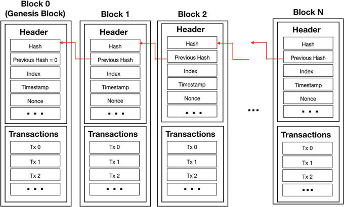
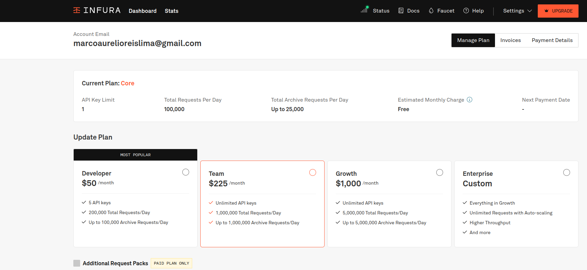
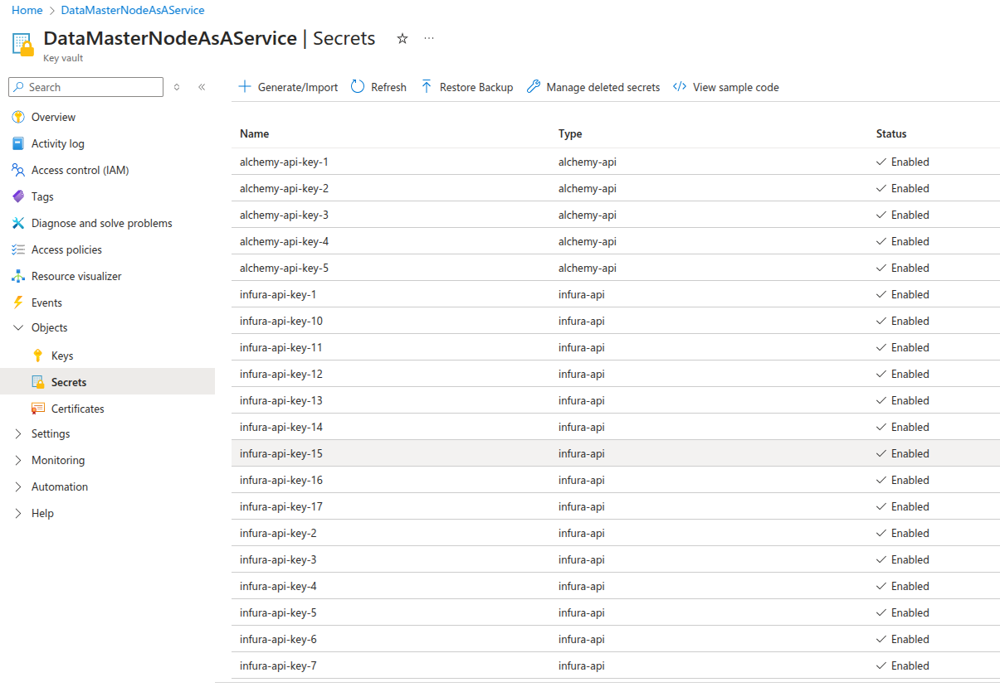
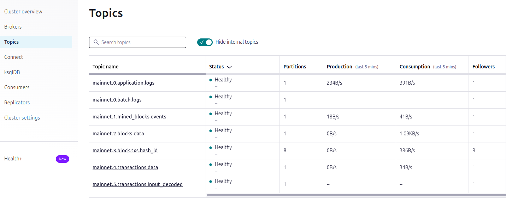
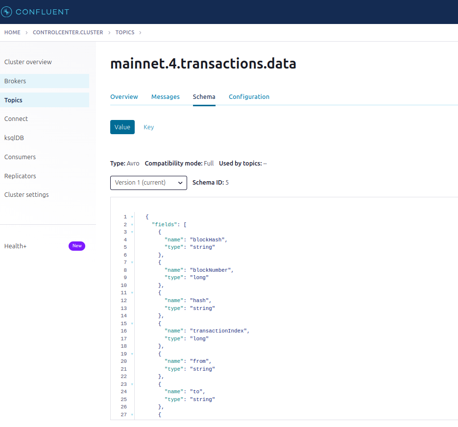
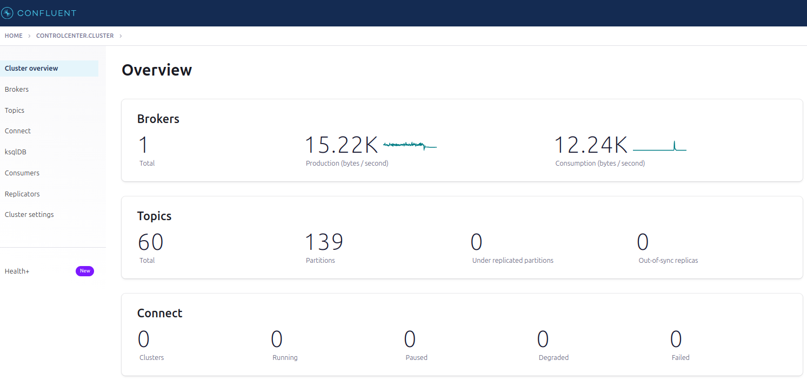
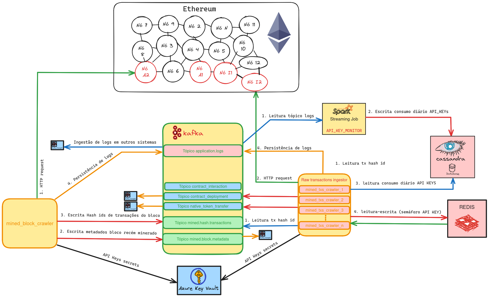

# dd_chain_explorer System

**Abstract**: Blockchains públicas são redes Peer-to-peer nas quais circula uma grande quantidade de capital. Essa troca se dá por usuários trocando tokens entre si ou interagindo com contratos inteligentes dos mais diversos tipos. Pela arquitetura da rede, dados dessas transações são públicos. Então uma plataforma de dados, usando essa origem, tem potencial de fornecer valiosos insights.

## Sumário

- [1. Objetivos deste trabalho](#2-objetivos-deste-trabalho)
  - [1.1. Escopo do trabalho](#11-escopo-do-trabalho)
  - [1.2. Objetivos específicos](#12-objetivos-específicos)
- [2. Introdução](#2-introdução)
  - [2.1. Blockchain como Estrutura de Dados](#21-blockchain-como-estrutura-de-dados)
  - [2.2. Blockchain como Rede P2P](#22-blockchain-como-rede-p2p)
  - [2.3. Tipos de Rede Blockchain](#23-tipos-de-rede-blockchain)
  - [2.4. Transações e Contratos Inteligentes](#24-transações-e-contratos-inteligentes)
- [3. Explicação sobre o case desenvolvido](#3-explicação-sobre-o-case-desenvolvido)
  - [3.1. Provedores de Node-as-a-Service](#31-provedores-de-node-as-a-service)
  - [3.2. Restrições de API keys](#32-restrições-de-api-keys)
  - [3.3. Captura de dados de blocos e transações](#33-captura-de-dados-de-blocos-e-transações)
  - [3.4. Mecanismo para Captura de Dados](#34-mecanismo-para-captura-de-dados)
  - [3.5. Mecanismo de compartilhamento de API Keys](#35-mecanismo-de-compartilhamento-de-api-keys)
- [4. Arquitetura do case](45-arquitetura-do-case)
- [4.1. Arquitetura de solução](#41-arquitetura-de-solução)
- [4.2. Arquitetura técnica](#42-arquitetura-técnica)
- [5. Aspectos técnicos desse trabalho](#5-aspectos-técnicos-desse-trabalho)
  - [5.1. Dockerização dos serviços](#51-dockerização-dos-serviços)
  - [5.2. Orquestração de serviços em containers](#52-orquestração-de-serviços-em-containers)
- [6. Reprodução do sistema dm_v3_chain_explorer](#6-reprodução-do-sistema-dm_v3_chain_explorer)
  - [6.1. Requisitos](#61-requisitos)
  - [6.2. Setup do ambiente local](#62-setup-do-ambiente-local)
  - [6.3. Reprodução do sistema usando o Docker Compose](#63-reprodução-do-sistema-usando-o-docker-compose)
  - [6.4 Visualização do processo de captura e ingestão de dados](#64-visualização-do-processo-de-captura-e-ingestão-de-dados)
- [7. Conclusão](#7-conclusão)
- [8. Melhorias futuras](#8-melhorias-futuras)
  - [8.1. Aplicações downstream para consumo dos dados](#81-aplicações-downstream-para-consumo-dos-dados)
  - [8.2. Melhoria em aplicações do repositório onchain-watchers](#82-melhoria-em-aplicações-do-repositório-onchain-watchers)
  - [8.3. Troca do uso de provedores Blockchain Node-as-a-Service](#83-troca-do-uso-de-provedores-blockchain-node-as-a-service)
  - [8.4. Evolução dos serviços de um ambiente local para ambiente produtivo](#84-evolução-dos-serviços-de-um-ambiente-local-para-ambiente-produtivo)

## 1. Objetivo desse trabalho

**Principal objetivo**: Concepção e implementação de plataforma de dados, entitulada `dd_chain_explorer`, com propósito de capturar, ingestar, processar, armazenar e disponibilizar dados de redes blockchain públicas compatíveis EVM para análises da rede em tempo real.

### 1.1. Escopo do trabalho

- Captura de dados restrito a redes blockchain públicas do tipo EVM;
- Uso da rede Ethereum como origem, devido às características de:
  - Baixo número de transações por segundo TPS.
  - Alto valor de capital alocado.
  - Compatibilidade com outras blockchains que também usam a EVM.
- Uso de provedores de Node-as-a-Service para captura de dados;
- Ingestão dos dados em ambiente analitico do tipo Lakehouse;
- Aplicação de arquitetura Medalhão para ingestão e enriquecimento dos dados em ambiente analítico.

### 1.2. Objetivos específicos

- Criar um sistema de captura de dados deve ser agnóstico à rede de blockchain, compatível com EVM;
- Minimizar latência e números de requisições, e maximizar a disponibilidade do sistema;
- Criar uma plataforma preparada para escalar a captura de dados em redes mais rápidas e escaláveis;
- Criar mecanismos para gerenciamento do consumo de API Keys dos provedores NaaS entre os Jobs que as usam;
- Criar mecanismos para observabilidade do sistema como um todo.


## 2. Introdução

Por definição uma blockchain é uma rede decentralizada na qual usuários conseguem transacionar entre si, e em muitas redes também com contratos inteligentes, sem a necessidade de uma entidade mediadora.

Para limitar o escopo desse trabalho, a rede blockchain Ethereum é tida como caso de uso. Contudo, vale ressaltar que diversas redes, públicas ou privadas, são baseadas na EVM, incluíndo a rede do DREX.

A tecnologia blockchain é baseada em 2 pilares, a `estrutura de dados` e a `rede Peer-to-Peer`.


### 2.1. Blockchain como Estrutura de Dados

Uma blockchain, como estrutura de dados, é uma sequência de blocos encadeados, sendo conectados através do uso de um mecanismo de hash, como uso do `hash atual` e `hash do bloco anterior`.

Essa estrutura de dados é persistida em todos os nós de uma rede blockchain e armazena todas as transações realizadas na mesma.

#### 2.1.1. Dados de blocos

**Header**: Dados de cabeçalho de um bloco, tais como:

| **Campo**                  | **Descrição**                                                          |
|----------------------------|------------------------------------------------------------------------|
| *`Número do bloco`*        | Identificador único do bloco                                           |
| *`Timestamp`*              | Data e hora em que o bloco foi minerado                                |
| *`Miner`*                  | Endereço do minerador que minerou o bloco                              |
| *`Hash do bloco anterior`* | Hash do bloco anterior, que conecta os blocos                          |
| *`Hash do bloco atual`*    | Hash do bloco atual, que conecta os blocos 

**Lista de transações**: Lista de ids para transações contidas no bloco.



#### 2.1.2. Frequência de mineração

Em uma rede novos blocos são minerados contendo `n transações` a cada `X segundos`. Os 2 parâmetros mencionados abaixo influenciam diretamente no volume e velocidade de dados a serem capturados:
- **Frequência de mineração**: A cada X segundos, 1 novo bloco é minerado.
- **Tamanho do bloco**: Cada bloco têm um limite de tamanho em bytes.

Cada rede tem sua especificação, o que ditará características fundamentais da rede, como o número de transações por segundo (TPS).

### 2.2. Blockchain como Rede P2P

Uma rede blockchain é uma rede de topologia Peer-to-Peer onde cada nó da rede possui uma cópia da estrutura de dados de blocos encadeados.

Esses nós podem exercer papel de:
- **Mineradores**: Nós que mineram novos blocos, validando as transações e garantindo a integridade da rede.
- **Nós validadores**: Nós que validam transações e blocos minerados na rede.
- **Nós comuns**: Podem submeter transações e consultar dados da rede, mas não mineram blocos.

Portanto, o acesso a um nó da rede é suficiente para se obter dados da rede, pois esse nó terá uma cópia sincronizada da blockchain da rede.

### 2.3. Tipos de Rede Blockchain
As redes blockchain podem ser classificadas em 2 tipos: públicas e privadas.

- **Redes Públicas**: Qualquer nó pode fazer parte da rede, e qualquer pessoa pode criar um nó. `Exemplo`: Bitcoin, Ethereum, Solana, etc.
- **Redes Privadas**: Existem restrições de quem pode fazer parte da rede. `Exemplo`: Hyperledger, Corda, etc.

Logo, blockchains pública apresenta as características ideais, pois:

1. Redes públicas não possuem restrições para fazer parte da rede.
2. Nós da rede possuem uma cópia sincrinizada dos blocos da rede.

E por consequência, com acesso a um nó da rede, é possível capturar dados de transações e blocos minerados.

#### 2.3.1. Ethereum Virtual Machine

A Ethereum Virtual Machine é uma máquina virtual distribuída rodando no topo da rede, seja Ethereum ou DREX.

Uma exploração a fundo da EVM foge do escopo desse trabalho. Porém, algumas características de padronização, entre redes que usam a EVM, são relevantes para esse trabalho, dado que compartilham:

1. Mesmo padrão de dados (schema) para transações e blocos.
2. Mesmo padrão de API para captura de dados.
3. Mesmo padrão de linguagem de programação para desenvolvimento de contratos inteligentes.

Por consequência, a forma como os dados são capturados é independente da rede, desde que essa rede use a EVM como máquina virtual, o que torna o método de captura desse trabalho agnóstico a redes EVM.

### 2.4. Transações e Contratos Inteligentes

Conforme o objetivo desse trabalho é usar como fonte de dados blocos (headers) e e dados transações para fazer analytics de uma rede blockchain, é importante compreender o que são as transações.


#### 2.4.1. Troca de Token Nativo

A Ethereum, bem como a maioria das blockchains, possui um token nativo, que é criado na mineração de blocos. Esse token nativo, para além da especulação de criptomoedas, tem a função de pagar taxas de transação na rede. Para a Ethereum, esse token nativo é o Ether (ETH).

- Nós da ethereum podem criar carteiras na rede.
- Carteiras são constituídas basicamente de um endereço um saldo em token nativo da rede. 

**Exemplo**: Posso criar uma carteira na ethereum e terei um endereço para armazenar e transacionar Ether.

Portanto, ao explorar esse tipo de transação é possível obter insights de como endereços estão trocando tokens nativos.

#### 2.4.2. Deploy e interação com contratos inteligentes

Contratos inteligentes são programas desenvolvidos através de uma linguagem de programação e deployados numa blockchain.

Características dos contratos inteligentes:
- São programas desenvolvidos em uma linguagem de programação específica para a blockchain.
- Esses programas são compilados em bytecode e armazenados na blockchain.
- Esses programas são deployados em blockchains por meio de uma transação.
- Após o deploy, eles ficam disponíveis para serem chamados clientes que podem ser outros contratos inteligentes ou usuários.

Para diferentes tipos de transações os 4 campos a seguir são os mais relevantes para esse trabalho:

| Campo     | Descrição                                                              |
|-----------|------------------------------------------------------------------------|
| `From`    | Endereço de origem da transação.                                       |
| `To`      | Endereço de destino da transação.                                      |
| `Value`   | Quantidade de token nativo transferido na transação.                   |
| `Input`   | Contém o bytecode da função chamada e os parâmetros passados para ela. |

Isso porque:

- Para transações de troca de token nativo entre endereços, o campo `input` é vazio.
- Para transações de deploy de contratos inteligentes:
  - O campo `to` é vazio
  - O campo `input` contém o bytecode do contrato.
- Para transações de interação com contratos inteligentes:
  - O campo `to` contém o endereço do contrato
  - O campo `input` contém o bytecode da função chamada e os parâmetros passados para ela.


## 3. Explicação sobre o case desenvolvido

Essa sessão é dedicada a descrição do case desenvolvido. aqui são apresentados os detalhes técnicos do sistema desenvolvido.

### 3.1. Captura de dados

Conforme mencionado nas sessão de objetivos, esse trabalho tem os dados com origem na rede Ethereum. Para se ter acesso aos dados de blocos e transações é necessário acessar um nó da rede. Existem 2 formas de se fazer isso:

**Deploy de um nó próprio**: Dado que a rede é pública, qualquer pessoa pode associar um nó rede. Porém, isso requer investimento em hardware, software e rede. Para sistemas produtivos, essa é a abordagem mais comum. Porém, para fins de desenvolvimento e teste, essa abordagem não é viável.

**Uso de nós de terceiros**: Devido a dificuldade de se manter um nó próprio, existem empresas que disponibilizam nós de blockchain como serviço. Esses nós podem ser acessados por meio de uma API Keys. Essa opção é mais viável, pois não requer investimento em hardware e software.

Alguns exemplos de empresas do tipo são [**infura.io**](https://www.infura.io/) e [**Alchemy**](https://www.alchemy.com/). Como modelo de negócio, fornecem API keys para interação com os nodes gerenciados por eles. Em contrapartida, oferecem planos com diferentes limites de requisições.



Foi optado pelo **uso de provedores NaaS**. Contudo, devido às limitações de requisições, é preciso um mecanismo para captura de todas as transações em tempo real usando tais provedores. A relação de proporção para captura de transações para Requests de API Keys é de `1 para 1`. Portanto são necessárias algumas API Keys para tanto.

#### 3.1.1. Restrições de API keys

Para o provedor infura as restrições para uma API Key gratuita são:

- Máximo de **10 requests por segundo**;
- Máximo de  **100.000 requests por dia**.

Na rede Ethereum, um bloco é minerado em média a cada 8 segundos e contém em média 170 transações, o que resulta em resulta em:
- 21 transações por segundo - TPS;
- 1.836.000 transações por dia.

#### 3.1.2. Armazenamento e Consumo de API Keys

Para o armazenamento e recuperação de API Keys, foi utilizado o **Azure Key Vault**. As API Keys são armazenadas como segredos, e o acesso a esses segredos é controlado por meio de permissões. Dessa forma, o sistema pode acessar as API Keys de forma segura.



Para autenticação e autorização, foi criado um **Service Principal** com permissões mínimas necessárias para acessar os segredos. Esse Service Principal é usado pelos jobs para acessar as API Keys. As credenciais do Service Principal são armazenadas em variáveis de ambiente, garantindo a segurança das credenciais.

Dessa forma os Jobs podem acessar as API Keys de forma segura e controlada.

#### 3.1.3. Interfaces para Captura de Dados

Para capturar dados de blocos e transações da rede em tempo real é usada a [Biblioteca Web3.py](https://web3py.readthedocs.io/en/stable/). Ela fornece uma interface para interação com nós de redes blockchain compatíveis com EVM através de IPC (Inter-Process Communication) ou HTTP.
Entre as várias funções disponíveis, 2 são de interesse para esse trabalho:

**get_block(block_number)**: Retorna dados do bloco. Entre esses dados estão:
- Informações de header do bloco, como o número do bloco, timestamp, minerador e a
- Lista de IDs de transações contidas no bloco.

```python
def get_block(block_number) -> block_data:
  """
  @param block_number: Número do bloco ou 'latest' para o bloco mais recente
  @return: Estrutura em formato dicionário com os dados do bloco.
  """
block_data = web3.eth.get_block('latest')
```

**get_transaction(tx_hash)**: Retorna um dicionário com os dados da transação apartir de um ID de transação passado.

```python
def get_transaction(tx_hash_id: str) -> transaction_data:
  """
  @param tx_hash_id: ID de uma transação, na forma de hash.
  @return: Estrutura em formato dicionário com os dados da transação.
  """
tx_data = web3.eth.get_transaction(tx_hash_id)
```

Com o uso de API Keys mais essas 2 funções, é possível capturar dados de blocos e transações da rede Ethereum. Porém para que se otimize o consumo das API Keys e maximize a disponibilidade do sistema é necessário um design de solução voltado para isso.

### 3.4. Sistema para Captura de Dados

Nessa seção estão descritos os componentes e mecanismos que compõem o sistema de captura de dados.

Para o uso sistêmico das funções `get_block(block_number)` e `get_transaction(tx_hash_id)`, ambos da biblioteca `Web3.py`, foram implementados jobs em python. Esses jobs estão encapsulados em uma imagem docker, no repositório desse projeto em `docker/app_layer/onchain-stream-txs`.

Para atingir o objetivo de captura de dados em tempo real, os jobs trabalham em conjunto, de forma assíncrona.
A arquitetura do sistema é baseada em um padrão de **Pub/Sub**, onde os dados são publicados em tópicos e consumidos por diferentes jobs. 

### 3.4.1. Apache Kafka

Nesse trabalho foi utilizado o **Apache Kafka** como sistema de mensageria. O Kafka é uma plataforma de streaming distribuída que permite publicar e consumir mensagens em tópicos. É altamente escalável e tolerante a falhas.

Nesse trabalho, o Kafka nesse trabalho pode ser visualizada ao analizarmos os tópicos publicados e consumidos pelos jobs.



Os tópicos são:

- **mainnet.0.application.logs**: Tópico para mensagens de log das aplicações.
- **mainnet.1.mined_blocks.events**: Tópico para mensagens de eventos de blocos minerados.
- **mainnet.2.blocks.data**: Tópico para mensagens de dados de blocos, output de `get_block(block_number)`.
- **mainnet.3.block.txs.hash_ids**: Tópico para mensagens de IDs de transações contidas no bloco, saída da função `get_block(block_number)`.
- **mainnet.4.transactions.data**: Tópico para mensagens de dados de transações, saída da função `get_transaction(tx_hash_id)`.

Esses tópicos são utilizados para:

- Comunicação assíncrona entre os jobs python que capturam os dados da rede Ethereum.
- Origem dos dados para aplicações downstream. São ingestados para o Lakehouse com o uso de Spark Streaming usando a técnica de **Multiplex Ingestion**.

Além do Kafka, foram usados os seguintes componentes de seu ecosistema:

#### Schema Registry

- Deployado por meio de imagem docker da Confluent em cluster Swarm.
- Usado para armazenar os schemas dos dados publicados nos tópicos.
- Garante a compatibilidade dos dados entre os produtores e consumidores.
- Schema podem ser registrados nos formatos Avro, JSON ou Protobuf.

Todos os tópicos mencionados tem schema em formato Avro, definidos em `docker/app_layer/onchain-stream-txs/src/schemas`.



#### Confluent Control Center

- Deployado por meio de imagem docker da Confluent em cluster Swarm.
- Interface web para monitoramento do Kafka.
- Permite visualizar Cluster Kafka, tópicos, Cluster Connect, e mais.



#### 3.4.2. Jobs Python Onchain-Stream-Txs

A seguir estão descritos os jobs python que compõem o sistema de captura de dados.


O job **mined_blocks_crawler** que encapsula a chamada da função **get_block('latest')**, já mencionada. Ele opera da seguinte forma:

- A cada período de tempo, por padrão 1 segundo, ele executa a função `get_block('latest')`, capturando os dados do bloco mais recente.
- Observando o campo **blockNumber** dos dados retornados, ele identifica se houve um novo bloco minerado (block number incrementado).
- A identificação de um novo bloco minerado dispara um evento, que resulta em 2 ações:
  - Os metadados do bloco são publicados em um tópico chamado **mined.blocks.metadata**.
  - A lista de `tx_hash_id` contendo ids de transações do bloco são publicados em um tópico chamado **mined.txs.hash.ids**.

**Observação:** a cada execução do método **get_block('latest')** uma requisição é feita usando a API key. Com a **frequência 1 req/segundo**, tem-se **86.400 requisições por dia**. Portanto, para satisfazer tal número de requisições 1 chave é o suficiente.

### 3.4.3. Captura de dados de transações (Mined Transactions Crawler)

O job **mined_txs_crawler** encapsula a chamada da função **get_transaction(tx_hash_id)**. Ele opera da seguinte forma:

- Inicialmente ele se subscreve no tópico **mined.txs.hash.ids** de forma a consumir os `hash_ids` produzidos pelo job **mined_blocks_crawler**.
- A cada `hash_id` consumido, ele executa o método `get_transaction(tx_hash_id)` para obter os dados da transação.
- Com os dados da transação ele classifica essa transação em 1 dos 3 tipos:
  - **Tipo 1**: Transação de troca de token nativo entre 2 endereços de usuários (Campo `input` vazio) ;
  - **Tipo 2**: Transação realizando o deploy de um contrato inteligente (Campo `to` vazio) ;
  - **Tipo 3**: Interação de um endereço de usuário com um contrato inteligente (Campo `to` e `input` preenchidos).

Cada tipo de transação é publicado em um tópico específico:

- **mined.txs.token.transfer**: transação de troca de token nativo entre 2 endereços de usuários;
- **mined.txs.contract.deploy**: transação realizando o deploy de um contrato inteligente;
- **mined.txs.contract.call**: Interação de um endereço de usuário com um contrato inteligente.

Após classificados em tópicos, cada tipo de transação pode alimentar aplicações downstream, cada uma com sua especificidade.

#### Observação sobre a carga de trabalho nesse job

O job **mined_txs_crawler** é responsável pelo maior volume de requisições. Se o job **mined_blocks_crawler** precisa 1 requisição por intervalo de tempo, setado em 1 segundo e totalizando 86.400 requisições por dia, o job **mined_txs_crawler** precisa de 1 requisição por transação minerada. Como visto, a rede Ethereum tem uma média de 31 transações por segundo. Isso resulta em 2,7 milhões de transações por dia.

Então para que os objetivos de latência e disponibilidade do sistema sejam atendidos, é necessário que o job **mined_txs_crawler** tenha um mecanismo de controle de uso de API Keys. Esse mecanismo está detalhado na seção 3.5.

### 3.4.4.  Decode do campo input em transações (Tx Input Decoder)

As transações publicadas no tópico **mined.txs.contract.call** correspondem a interação com contratos inteligentes. Essa interação se dá por meio dos campos **to** e **input**, contidos na transação. O campo `to` contém o endereço do contrato inteligente e o campo `input` contém a chamada de função e os parâmetros passados para ela. Por exemplo, para se trocar Ethereum por outros tokens na rede Uniswap, é necessário chamar a função `swapExactETHForTokens` passando os parâmetros necessários.

Porém, a informação no campo `input` está encodada. É necessário um mecanismo para decodificar esses dados. Para essa finalidade foi criado o job **txs_input_decoder**.

Para que isso seja possível, é necessário o uso da **ABI (Application Binary Interface)** do contrato inteligente. Uma ABI é uma estrutura de dados que contém a assinatura de todas as funções do contrato. Com a ABI de um contrato é possível decodificar o campo `input` e extrair as informações valiosas ali contidas. As aplicações descritas na introdução, como arbitragem e liquidação, ou mesmo a identificação de ações de hackers dependem da decodificação desses dados.

Com as informações decodificadas, o job **txs_input_decoder** publica as informações em um tópico chamado **mined.txs.input.decoded**.

## 3.5. Mecanismo de compartilhamento de API Keys

Nesse job concentra-se o esforço em número de requisições.Como mencionado, o número de transações diárias na rede Ethereum ultrapassam em muito os limites de uma API Key para 1 plano gratuito. Logo é necessário que esse job seja escalado. Mas escalado de que forma?

Para segurança do sistema, essas API Keys não podem estar cravas no código, pois a mesma rotina será usada por diferentes instâncias do job. A 1ª solução que vem a mente é passar a API Key por parâmetro. Porém, isso não é seguro. Caso uma API Key tenha seus recursos esgotados, o job não poderá mais consumir dados e não haverá uma maneira de se manter o controle sobre isso. Para garantir os requisitos de **latência e disponibilidade do sistema**, é preciso um mecanismo mais sofisticado para que esses jobs compartilhem as API Keys de forma inteligente.

**Redução da Latência**: Cada API Key é limitada por requests por segundo. Então, se há multipals instâncias do job **raw_tx_ingestor** consumindo dados, é preciso que em dado instante de tempo t, cada API Key seja usada por somente 1 job. Dessa forma, a taxa de requisições por segundo é maximizada.

**Máxima disponibilidade**: Para garantir a disponibilidade do sistema, é preciso manter o controle de requisições nas API Keys para que somente em último caso as requisições sejam esgotadas.
Caso o número de requisições diárias seja atingido o job deve trocar de API Key. É interessante também que as instâncias do job troquem de API Keys de tempos em tempos, para que todas as API Keys sejam usadas de maneira equitativa. Para isso, é preciso um mecanismo de controle de uso das API Keys.

Para que o Job  **raw_tx_ingestor** em suas **n réplicas** consumam **m API Keys**, buscando atender aos 2 requisitos acima, se faz necessário que:

- Para **`n` réplicas de jobs raw_tx_ingestor** são necessárias **`m` chaves**, sendo **`m` > `n`**.
- Para cada **instante de tempo `T`**, uma **api key `i`** deve ser utilizada por apenas **1 job replica `j`**.

Como pode ser visualizado na seção de arquitetura de solução, o job **raw_tx_ingestor** usa o mecanismo para atender aos requisitos listados. Esse mecanismo está aqui dividido em leitura e escrita.

#### Leitura

1. Ao ser instanciado o job **raw_tx_ingestor** recebe um conjunto de API Keys que ele pode utilizar. Essas API Keys estão na forma de pseudo-nomes. Por exemplo, `api_key_1`, `api_key_2`, `api_key_3`, etc. Esses pseudo-nomes são chaves para segredos armazenados no recurso **Azure Key Vault**, de forma a garantir a segurança das API Keys.

2. O job consulta um banco de dados do tipo chave-valor, neste caso o **Redis**, para ver se dop conjunto de API Keys recebidas qual delas não está sendo usada.

3. Ao identificar quais API Keys estão livres, o job **raw_tx_ingestor** consulta um banco de dados que armazena o número de requisições daquelas API Keys nas últimas 24 horas e escolhe a API Key que tem menos requisições.

#### Escrita

1. Ao iniciar o uso de uma API Key a replicado job **raw_tx_ingestor** marca tal chave como ocupada no bando de dados chave-valor **Redis**.

2. Ao realizar uma requisição com determinada API Key, o job **raw_tx_ingestor** publica uma mensagem em um tópico do Kafka destinado a logs.

Existe então o 3º job, do tipo Spark Streaming chamado **api_key_monitor**  que tem como tarefa consumir as mensagens do tópico de logs. Usando filtros e windowing, ele calcula o número de requisições nas últimas 24 horas para cada API Key e então atualiza uma tabela no banco de dados Scylla.

É justamente essa tabela que o Job **raw_tx_ingestor** consulta para escolher a API Key a ser usada em questão de menos requisições diárias.

## 4. Arquitetura do case

Nessa seção está detalhada a arquitetura do sistema **dm_v3_chain_explorer**.O objetivo aqui é compreender como esses componentes do sistema se comunicam entre si e com serviços auxiliares, bem como os mesmos são deployados, orquestrados e monitorados.

- **Arquitetura de solução**: Descrição de alto nível de como o sistema funciona para captura e ingestão de dados no Kafka, processamento e persistência dos dados em uma camada analítica.

- **Arquitetura técnica**: Descrição detalhada de como os componentes do sistema se comunicam entre si e com serviços auxiliares, bem como os mesmos são deployados,orquestrados e monitorados.

## 4.1. Arquitetura de solução

Podemos dividir a arquitetura de solução em 2 partes:

- **Captura e ingestão de dados em tempo real**: Essa parte é responsável por capturar os dados brutos da rede Ethereum, classificar e decodificar esses dados e persistir no Apache Kafka. Com os dados no kafka, estes serão consumidos por conectores do Kafka Connect para o Hadoop.

- **Processamento e persistência dos dados**: Essa parte é responsável por processar os dados brutos capturados e persistidos HDFS e processa-los em uma arquitetura de medalhão.

O desenho abaixo ilustra como a solução para captura e ingestão de dados da Ethereum no Kafka funciona.



Os componentes dessa solução são:

- **Apache Kafka**: Plataforma de streaming distribuída que permite publicar e consumir mensagens em tópicos. É altamente escalável e tolerante a falhas. É o backbone do sistema Pub-Sub.
- **Redis**: Banco de dados chave-valor em memória usado para armazenar dados sobre uso de API KEYs.
- **Scylla**: Banco de dados NoSQL altamente escalável e tolerante a falhas usado para armazenar dados sobre uso de API KEYs.
- **Azure Key Vault**: Serviço de segredos da Azure usado para armazenar as API Keys.
- **Apache Spark**: Framework de processamento de dados em tempo real usado para monitorar o uso das API Keys.
- **Jobs implementados em python Python**: Esses jobs são responsáveis por capturar, classificar e decodificar os dados usando as ferramentas mencionadas acima. Executam em containers docker.
- **Kafka Connect**: Ferramenta usada para conectar o Kafka a diferentes fontes de dados. Nesse caso, o Kafka Connect é usado para envio dos dados de tópicos do Kafka para outros sistemas.
