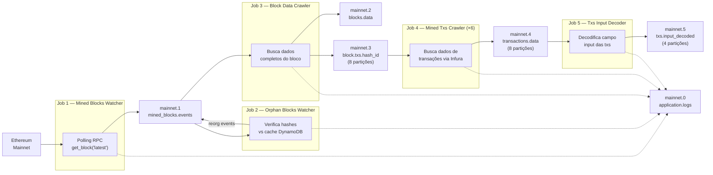
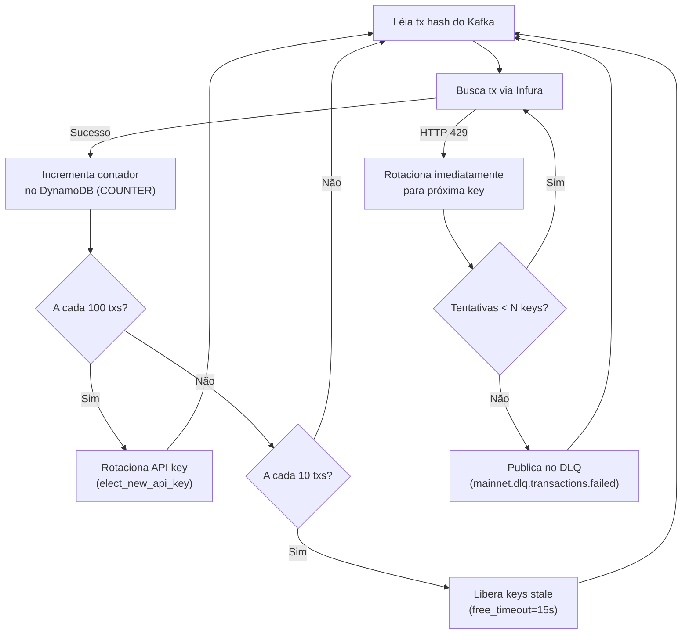
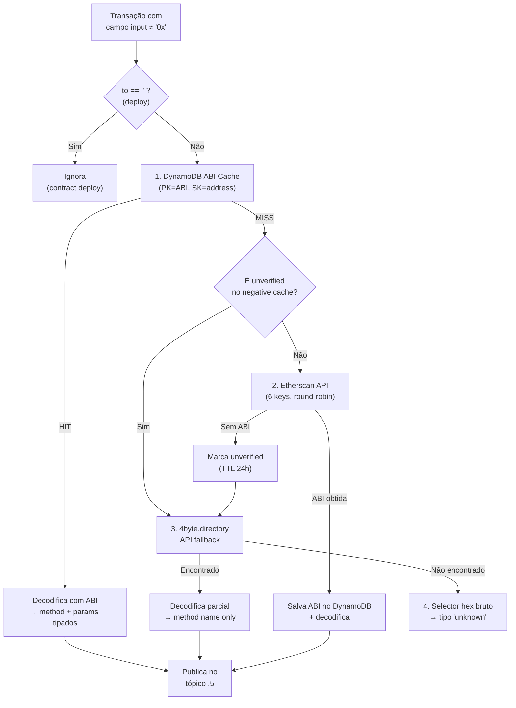

# 02 — Captura de Dados

## Visão Geral

A camada de captura é responsável por extrair dados brutos da blockchain Ethereum e prepará-los para processamento analítico no Databricks. Opera em dois modos complementares:

1. **Streaming**: Pipeline de 5 jobs Python encadeados via Kafka, executando em tempo real.
2. **Batch**: Jobs sob demanda para ingestão de contratos, manutenção de tópicos Kafka e limpeza de dados.
3. **Spark Streaming**: Job PySpark de ponte Kafka→S3 (apenas DEV).

Toda a comunicação entre jobs utiliza **Apache Kafka** com serialização **Avro** e **Confluent Schema Registry**.

---

## 1. Pipeline de Streaming

### 1.1 Fluxo Geral



Todos os jobs também publicam logs estruturados no tópico `mainnet.0.application.logs` via `KafkaLoggingHandler`.

### 1.2 Detalhamento por Job

#### Job 1 — Mined Blocks Watcher

| Aspecto | Detalhe |
|---------|---------|
| **Classe** | `MinedBlocksWatcher` |
| **Entrada** | Ethereum RPC — `eth_getBlock("latest")` via Alchemy |
| **Saída Kafka** | `mainnet.1.mined_blocks.events` (1 partição) |
| **Schema Avro** | `1_mined_block_event_schema_avro.json` — campos: `block_timestamp`, `block_number`, `block_hash` |
| **Concorrência** | Single-thread, loop infinito com `time.sleep(CLOCK_FREQUENCY)` |
| **Lógica** | Faz polling periódico, compara `block_number` com o anterior e só publica se houve novo bloco |
| **API Provider** | Alchemy (`eth-mainnet.g.alchemy.com`) — 1 API key do SSM Parameter Store |
| **DynamoDB** | Não utiliza |

**Variáveis de Ambiente:**

| Variável | Descrição | Exemplo |
|----------|-----------|---------|
| `SSM_SECRET_NAME` | Path SSM da API key Alchemy | `/web3-api-keys/alchemy/api-key-1` |
| `CLOCK_FREQUENCY` | Intervalo de polling em segundos | `1` |
| `TOPIC_MINED_BLOCKS_EVENTS` | Nome do tópico Kafka de saída | `mainnet.1.mined_blocks.events` |
| `NETWORK` | Rede Ethereum | `mainnet` |
| `KAFKA_BROKERS` | Endereço do cluster Kafka | `kafka-broker-1:19092` |
| `SCHEMA_REGISTRY_URL` | URL do Schema Registry | `http://schema-registry:8081` |

#### Job 2 — Orphan Blocks Watcher

| Aspecto | Detalhe |
|---------|---------|
| **Classe** | `OrphanBlocksProcessor(ChainExtractor)` |
| **Entrada Kafka** | `mainnet.1.mined_blocks.events` |
| **Saída Kafka** | `mainnet.1.mined_blocks.events` (eventos de orphan com key=`"orphan"`) |
| **Schema Avro** | Mesmo schema do tópico 1 |
| **Concorrência** | Single-thread, consumer loop |
| **Lógica** | Para cada bloco recebido, busca o bloco na chain via RPC e compara o hash com o cache no DynamoDB. Se o hash divergir, emite evento de orphan. Mantém cache com TTL de 3600s (auto-expiração). |
| **DynamoDB** | Entidade `BLOCK_CACHE`: PK=`BLOCK_CACHE`, SK=`{block_number}`, valor=`block_hash`, TTL=3600s. |

**Variáveis de Ambiente:**

| Variável | Descrição | Exemplo |
|----------|-----------|---------|
| `SSM_SECRET_NAME` | API key Alchemy | `/web3-api-keys/alchemy/api-key-2` |
| `CONSUMER_GROUP_ID` | Consumer group Kafka | `cg_orphan_block_events` |
| `DYNAMODB_TABLE` | Nome da tabela DynamoDB | `dm-chain-explorer` |

#### Job 3 — Block Data Crawler

| Aspecto | Detalhe |
|---------|---------|
| **Classe** | `BlockDataCrawler(ChainExtractor)` |
| **Entrada Kafka** | `mainnet.1.mined_blocks.events` |
| **Saídas Kafka** | `mainnet.2.blocks.data` (1 partição) + `mainnet.3.block.txs.hash_id` (8 partições) |
| **Schemas Avro** | `2_block_data_schema_avro.json` (18+ campos) + `3_transaction_hash_ids_schema_avro.json` |
| **Concorrência** | Single-thread |
| **Lógica** | Busca dados completos do bloco via RPC. Publica dados do bloco em um tópico e faz fan-out de hashes de transações em 8 partições via **round-robin** manual. Limita transações por bloco com `TXS_PER_BLOCK` (default 50). |
| **Schema do Bloco** | `number`, `timestamp`, `hash`, `parentHash`, `difficulty`, `totalDifficulty`, `nonce`, `size`, `miner`, `baseFeePerGas`, `gasLimit`, `gasUsed`, `logsBloom`, `extraData`, `transactionsRoot`, `stateRoot`, `transactions[]`, `withdrawals[{index, validatorIndex, address, amount}]` |

**Variáveis de Ambiente:**

| Variável | Descrição | Exemplo |
|----------|-----------|---------|
| `TOPIC_MINED_BLOCKS` | Tópico para dados do bloco | `mainnet.2.blocks.data` |
| `TOPIC_TXS_HASH_IDS` | Tópico para hashes de txs | `mainnet.3.block.txs.hash_id` |
| `TOPIC_TXS_HASH_IDS_PARTITIONS` | Número de partições para fan-out | `8` |
| `TXS_PER_BLOCK` | Máximo de txs publicadas por bloco | `50` |
| `CONSUMER_GROUP` | Consumer group | `cg_block_data_crawler` |

#### Job 4 — Mined Txs Crawler

| Aspecto | Detalhe |
|---------|---------|
| **Classe** | `RawTransactionsProcessor(ChainExtractor)` |
| **Entrada Kafka** | `mainnet.3.block.txs.hash_id` (8 partições) |
| **Saída Kafka** | `mainnet.4.transactions.data` (8 partições) |
| **Schema Avro** | `4_transactions_schema_avro.json` — 16 campos incluindo `blockHash`, `blockNumber`, `hash`, `from`, `to`, `value`, `input`, `gas`, `gasPrice`, `type`, `accessList[]` |
| **Concorrência** | **6 réplicas** (Docker Compose `deploy.replicas: 6`), cada uma single-thread. Coordenação via Kafka consumer group + DynamoDB semaphore. |
| **API Provider** | Infura (`mainnet.infura.io`) — 17 API keys do SSM |
| **DynamoDB (Semáforo)** | Entidade `SEMAPHORE`: PK=`SEMAPHORE`, SK=`{api_key_name}`, campos `process`, `last_update`, TTL=60s. |
| **DynamoDB (Contador)** | Entidade `COUNTER`: PK=`COUNTER`, SK=`{api_key_name}`, campos `num_req_1d`, `end`. |

**Mecanismo de Rotação de API Keys:**



- O `APIKeysManager` mantém um semáforo distribuído no DynamoDB (entidade SEMAPHORE com TTL de 60s).
- Cada réplica gera um `PROC_ID` (UUID) único e registra qual API key está usando.
- A cada 100 transações, a réplica libera a key atual e elege uma nova.
- Keys consideradas "stale" (sem atualização há >15s) são liberadas para reuso.
- O formato compacto `infura-api-key-1-17` se expande para 17 keys (1 a 17).
- Quando todas as keys estão bloqueadas no semáforo (deadlock), a transação é publicada no tópico DLQ (`mainnet.dlq.transactions.failed`) em vez de ser descartada silenciosamente.

**Variáveis de Ambiente:**

| Variável | Descrição | Exemplo |
|----------|-----------|---------|
| `SSM_SECRET_NAMES` | Keys Infura compactadas | `/web3-api-keys/infura/api-key-1-17` |
| `TOPIC_DLQ` | Tópico Dead Letter Queue para transações irrecuperáveis | `mainnet.dlq.transactions.failed` |
| `CONSUMER_GROUP` | Consumer group | `cg_mined_raw_txs` |
| `TOPIC_TXS_DATA` | Tópico de saída | `mainnet.4.transactions.data` |
| `DYNAMODB_TABLE` | Nome da tabela DynamoDB | `dm-chain-explorer` |

#### Job 5 — Txs Input Decoder

| Aspecto | Detalhe |
|---------|---------|
| **Classe** | `TransactionInputDecoder(ChainExtractor)` |
| **Entrada Kafka** | `mainnet.4.transactions.data` (8 partições) |
| **Saída Kafka** | `mainnet.5.txs.input_decoded` (8 partições) |
| **Schema Avro** | `txs_contract_call_decoded.json` — campos: `tx_hash`, `contract_address`, `method`, `parms`, `decode_type` |
| **Concorrência** | **3 réplicas** (ECS `desired_count = 3`; Docker Compose `deploy.replicas: 3`). O consumer group distribui as 8 partições entre as réplicas ativas. |
| **DynamoDB** | Cache de ABIs: entidade `ABI` (PK=`ABI`, SK=`{address}`, permanente) + entidade `ABI_NEG` (PK=`ABI_NEG`, SK=`{address}`, TTL 24h) |

**Pipeline de Decodificação (4 estágios):**



**Tipos de decodificação (`decode_type`):**
- `abi_cache` — ABI encontrada no DynamoDB
- `etherscan` — ABI obtida via Etherscan e armazenada
- `4byte` — Apenas nome do método via 4byte.directory
- `unknown` — Não decodificado (apenas selector hex)

**Variáveis de Ambiente:**

| Variável | Descrição | Exemplo |
|----------|-----------|---------|
| `SSM_ETHERSCAN_PATH` | Path SSM das keys Etherscan | `/etherscan-api-keys` |
| `UNVERIFIED_TTL` | TTL do negative cache em segundos | `86400` |
| `TOPIC_TXS_DECODED` | Tópico de saída | `mainnet.5.txs.input_decoded` |

> **Nota**: O antigo job auxiliar Semaphore Collector (`n_semaphore_collect.py`) foi eliminado. O DynamoDB pode ser consultado diretamente via console ou queries programáticas.

---

## 2. Infraestrutura Kafka

### 2.1 Tópicos

| Tópico | Nº | Partições | Schema Avro | Produtor | Consumidor |
|--------|----|-----------|-------------|----------|------------|
| `mainnet.0.application.logs` | 0 | 1 | `Application_Logs` (6 campos) | Todos os jobs | DLT Pipeline (Bronze→Silver) |
| `mainnet.1.mined_blocks.events` | 1 | 1 | `mined_block_event_schema` (3 campos) | Jobs 1, 2 | Jobs 2, 3 |
| `mainnet.2.blocks.data` | 2 | 1 | `BlockClock` (18+ campos) | Job 3 | Spark Kafka→S3 |
| `mainnet.3.block.txs.hash_id` | 3 | 8 | `transactions_hash_ids` (1 campo) | Job 3 | Job 4 (×6) |
| `mainnet.4.transactions.data` | 4 | 8 | `Transaction` (16 campos) | Job 4 (×6) | Job 5 (×3), Spark Kafka→S3 |
| `mainnet.5.txs.input_decoded` | 5 | 8 | `Input_Transaction` (5 campos) | Job 5 (×3) | DLT Pipeline |
| `mainnet.dlq.transactions.failed` | DLQ | 4 | JSON (sem Schema Registry) | Job 4 | Monitoramento / reprocessamento |

### 2.2 Configuração Kafka

**Retenção:** 7 dias (DEV padrão), 12 horas (`topics_dev.ini`), 1 hora (`topics_prd.ini`)
**Cleanup policy:** `delete`
**Serialização:** Avro com Confluent Schema Registry (5-byte magic header: 1 byte magic + 4 bytes schema ID)

**Configuração do Producer:**
- `acks=all` (garante durabilidade)
- `retries=3`
- `enable.idempotence=true` (exatamente-uma vez)
- `linger.ms=200`, `batch.size=32768` (config P1, padrão)

**Configuração do Consumer:**
- `auto.offset.reset=earliest`
- `enable.auto.commit=true`, `auto.commit.interval.ms=1000`

### 2.3 DynamoDB — Entidades (Single-Table)

Tabela: `dm-chain-explorer` (PK=`pk` string, SK=`sk` string, TTL no atributo `ttl`)

| PK | SK | Finalidade | TTL | Leitura | Escrita |
|----|----|-----------| --- |---------|--------|
| `SEMAPHORE` | `{api_key_name}` | Lock distribuído de API keys | 60s | Job 4 | Job 4 |
| `COUNTER` | `{api_key_name}` | Contador de requisições por API key | — | Gold DLT Views | Job 4 |
| `BLOCK_CACHE` | `{block_number}` | Cache de hashes de blocos (detecção de orphans) | 3600s | Job 2 | Job 2 |
| `CONTRACT` | `{contract_address}` | Contratos populares monitorados | — | Batch ingestão | DABs periodic |
| `ABI` | `{contract_address}` | Cache de ABIs verificadas | — | Job 5 | Job 5 |
| `ABI_NEG` | `{contract_address}` | Negative cache (contratos sem ABI) | 86400s | Job 5 | Job 5 |
| `CONSUMPTION` | `{source}#{api_key_name}` | Métricas de consumo de API keys (Gold views) | — | App (API) | Lambda S3→DynamoDB |

---

## 3. Spark Streaming (DEV)

### 3.1 Kafka → S3 Multiplex

| Aspecto | Detalhe |
|---------|---------|
| **Arquivo** | `docker/spark-stream-txs/src/pyspark/2_kafka_to_s3_multiplex.py` |
| **Entrada** | 5 tópicos Kafka simultaneamente (tópicos 0 a 4) |
| **Saída** | S3 — `s3a://{bucket}/bronze/kafka_multiplex/topic_name=.../` (Parquet Snappy) |
| **Lógica** | Lê todos os tópicos via `subscribe`, adiciona coluna `topic_name` a partir do campo `topic` do Kafka. Salva colunas: `topic_name`, `kafka_partition`, `kafka_offset`, `kafka_timestamp`, `key` (string), `value` (binary). |
| **Trigger** | A cada 60 segundos (DEV) |
| **Propósito** | Ponte entre Kafka local e Databricks Free Edition, que não tem acesso direto ao broker. Em PROD, o Databricks lê MSK diretamente. |

**Configuração Spark:**
- Master: `local[*]` (DEV) ou `spark://spark-master:7077`
- JARs: `spark-sql-kafka`, `spark-avro`, `hadoop-aws`, `aws-java-sdk-bundle`
- S3: `DefaultAWSCredentialsProviderChain`, endpoint `s3.sa-east-1.amazonaws.com`

---

## 4. Jobs Batch

### 4.1 Ingestão de Contratos

| Aspecto | Detalhe |
|---------|---------|
| **Arquivo** | `docker/onchain-batch-txs/src/batch_ingestion/1_capture_and_ingest_contracts_txs.py` |
| **Classe** | `ContractTransactionsCrawler` |
| **Entrada** | DynamoDB (entidade CONTRACT — PK=`CONTRACT`, SK=`{address}`) + Etherscan API |
| **Saída** | S3 — `s3://{bucket}/{prefix}/year=Y/month=M/day=D/hour=H/txs_{contract_addr}.json` |
| **Lógica** | Para cada contrato listado no DynamoDB (query PK=`CONTRACT`), usa Etherscan `txlist` para buscar transações paginadas (page=1, offset=1000). Particiona output por data. |
| **Frequência** | Orquestrado pelo Airflow — a cada 1 hora |

### 4.2 Manutenção Kafka

| Job | Arquivo | Descrição |
|-----|---------|-----------|
| Criação de tópicos | `kafka_maintenance/0_create_topics.py` | Cria todos os tópicos definidos em `topics_dev.ini` ou `topics_prd.ini` |
| Recriação de logs | `kafka_maintenance/2_recreate_logs_topic.py` | Deleta e recria o tópico de logs (libera espaço) |

### 4.3 Manutenção S3

| Job | Arquivo | Descrição |
|-----|---------|-----------|
| Limpeza de objetos | `s3_maintenance/1_delete_s3_objects.py` | Deleta todos objetos sob um prefixo S3. CLI args: `--bucket`, `--prefix` |

### 4.4 Utilitários

| Job | Arquivo | Descrição |
|-----|---------|-----------|
| Teste de API keys | `chain_utilities/dm_test_api_keys.py` | Testa conectividade de todas API keys (Alchemy, Infura, Etherscan) do SSM |
| Cleanup DynamoDB | Airflow DAG `dag_eventual_2_delete_environment` | Scan + delete de todos itens na tabela DynamoDB |

---

## 5. Schemas Avro

### 5.1 Application Logs (`0_application_logs_avro.json`)

```json
{
  "type": "record",
  "name": "Application_Logs",
  "namespace": "io.streamr.onchain",
  "fields": [
    {"name": "timestamp", "type": "int"},
    {"name": "logger", "type": "string"},
    {"name": "level", "type": "string"},
    {"name": "filename", "type": "string"},
    {"name": "function_name", "type": "string"},
    {"name": "message", "type": "string"}
  ]
}
```

### 5.2 Mined Block Event (`1_mined_block_event_schema_avro.json`)

```json
{
  "fields": [
    {"name": "block_timestamp", "type": "int"},
    {"name": "block_number", "type": "int"},
    {"name": "block_hash", "type": "string"}
  ]
}
```

### 5.3 Block Data (`2_block_data_schema_avro.json`)

Registro `BlockClock` com 18+ campos: `number`, `timestamp`, `hash`, `parentHash`, `difficulty`, `totalDifficulty`, `nonce`, `size`, `miner`, `baseFeePerGas`, `gasLimit`, `gasUsed`, `logsBloom`, `extraData`, `transactionsRoot`, `stateRoot`, `transactions[]`, `withdrawals[{index, validatorIndex, address, amount}]`.

### 5.4 Transaction Hash IDs (`3_transaction_hash_ids_schema_avro.json`)

```json
{
  "fields": [
    {"name": "tx_hash", "type": "string"}
  ]
}
```

### 5.5 Transaction Data (`4_transactions_schema_avro.json`)

Registro `Transaction` com 16 campos: `blockHash`, `blockNumber`, `hash`, `transactionIndex`, `from`, `to`, `value`, `input`, `gas`, `gasPrice`, `nonce`, `v`, `r`, `s`, `type`, `accessList[{address, storageKeys[]}]`.

### 5.6 Decoded Input (`txs_contract_call_decoded.json`)

```json
{
  "fields": [
    {"name": "tx_hash", "type": "string"},
    {"name": "contract_address", "type": "string"},
    {"name": "method", "type": "string"},
    {"name": "parms", "type": "string"},
    {"name": "decode_type", "type": "string"}
  ]
}
```

---

## 6. Biblioteca Compartilhada (`dm-chain-utils`)

A biblioteca `dm-chain-utils` (versão 1.0.0) é o pacote Python interno compartilhado entre todos os módulos de captura. Ela substitui o antigo repositório externo `lib-dm-utils` (`dm-33-utils` 0.0.5) e os diretórios `utils/` duplicados que existiam em cada imagem Docker.

**Localização:** `utils/src/dm_chain_utils/` (dentro do repositório `dd_chain_explorer`)

| Módulo | Classe/Função | Funcionalidade |
|--------|--------------|----------------|
| `dm_web3_client.py` | `Web3Client` | Cliente Web3 com SSM Parameter Store (sem Azure KV) |
| `dm_kafka_client.py` | `KafkaHandler` | Factory de Producer/Consumer Avro + callbacks; broker pre-warm |
| `dm_kafka_admin.py` | `DMClusterAdmin` | Admin Kafka: criar/deletar/listar tópicos |
| `dm_schema_reg_client.py` | `get_schema` | DEV → Confluent SR; PROD → AWS Glue Schema Registry |
| `dm_logger.py` | `KafkaLoggingHandler`, `ConsoleLoggingHandler` | Logging para Kafka e console |
| `dm_parameter_store.py` | `ParameterStoreClient` | CRUD completo no AWS SSM Parameter Store |
| `dm_dynamodb.py` | `DMDynamoDB` | Cliente DynamoDB single-table (boto3 wrapper com PK/SK, TTL, batch ops) |
| `dm_etherscan.py` | `EtherscanClient` | Cliente Etherscan com call tracking e múltiplas API keys |
| `api_keys_manager.py` | `APIKeysManager` | Semáforo distribuído de API keys via DynamoDB |

**Estratégia de distribuição:**
- **DEV (Docker Compose)**: volume mount `utils/src/dm_chain_utils:/app/dm_chain_utils` para hot-reload durante desenvolvimento.
- **PROD (Docker build)**: `COPY utils/src/dm_chain_utils /app/dm_chain_utils` no Dockerfile, com build context expandido para `dd_chain_explorer/`.

```dockerfile
# Build context: dd_chain_explorer/
COPY docker/onchain-stream-txs/requirements.txt /app/requirements.txt
COPY utils/src/dm_chain_utils /app/dm_chain_utils
COPY docker/onchain-stream-txs/src /app
```

> **Nota**: A biblioteca anterior `dm-33-utils` não é mais usada. Os módulos `web3_utils.py` e `etherscan_utils.py` que usavam Azure Key Vault foram substituídos por equivalentes que usam exclusivamente AWS SSM.

---

## Referências de Arquivos

| Escopo | Arquivos |
|--------|----------|
| Jobs Streaming (source) | `docker/onchain-stream-txs/src/1_*.py` a `5_*.py` |
| Base abstrata | `docker/onchain-stream-txs/src/chain_extractor.py` |
| Utilitários streaming | `utils/src/dm_chain_utils/` (pacote compartilhado) |
| Decode utilities | `docker/onchain-stream-txs/src/utils_decode/abi_cache.py`, `etherscan_multi.py` |
| Schemas Avro | `docker/onchain-stream-txs/src/schemas/*.json` |
| Configs Kafka | `docker/onchain-stream-txs/src/configs/producers.ini`, `consumers.ini`, `topics.ini` |
| Spark Streaming | `docker/spark-stream-txs/src/pyspark/2_kafka_to_s3_multiplex.py` |
| Spark Config | `docker/spark-stream-txs/conf/spark-defaults.conf` |
| Jobs Batch | `docker/onchain-batch-txs/src/batch_ingestion/`, `kafka_maintenance/`, `s3_maintenance/`, `chain_utilities/` |
| Batch topics config | `docker/onchain-batch-txs/src/kafka_maintenance/conf/topics_dev.ini`, `topics_prd.ini` |
| Compose (dev apps) | `services/dev/compose/app_services.yml` |
| Compose (dev batch) | `services/dev/compose/batch_services.yml` |
| Compose (dev infra) | `services/dev/compose/local_services.yml` |
| Utilitários compartilhados | `utils/src/dm_chain_utils/` (pacote `dm-chain-utils` 1.0.0) |
| Docker (streaming) | `docker/onchain-stream-txs/Dockerfile`, `requirements.txt` |
| Docker (batch) | `docker/onchain-batch-txs/Dockerfile`, `requirements.txt` |
| Docker (spark) | `docker/spark-stream-txs/Dockerfile`, `requirements.txt` |

---

## TODOs — Captura de Dados

- [ ] **TODO-C07**: Avaliar substituição do Spark Kafka→S3 Multiplex por Kafka Connect S3 Sink Connector em PROD.
- [ ] **TODO-C08**: Implementar métricas Prometheus nos jobs de streaming (ex: taxa de processamento, latência, erros por minuto).
- [ ] **TODO-C10**: Adicionar suporte a batched RPC calls (JSON-RPC batch) nos Jobs 3 e 4 para reduzir latência de rede.
