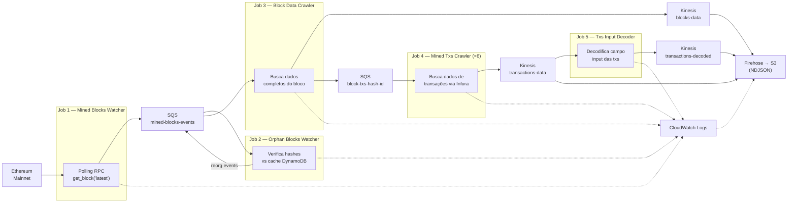
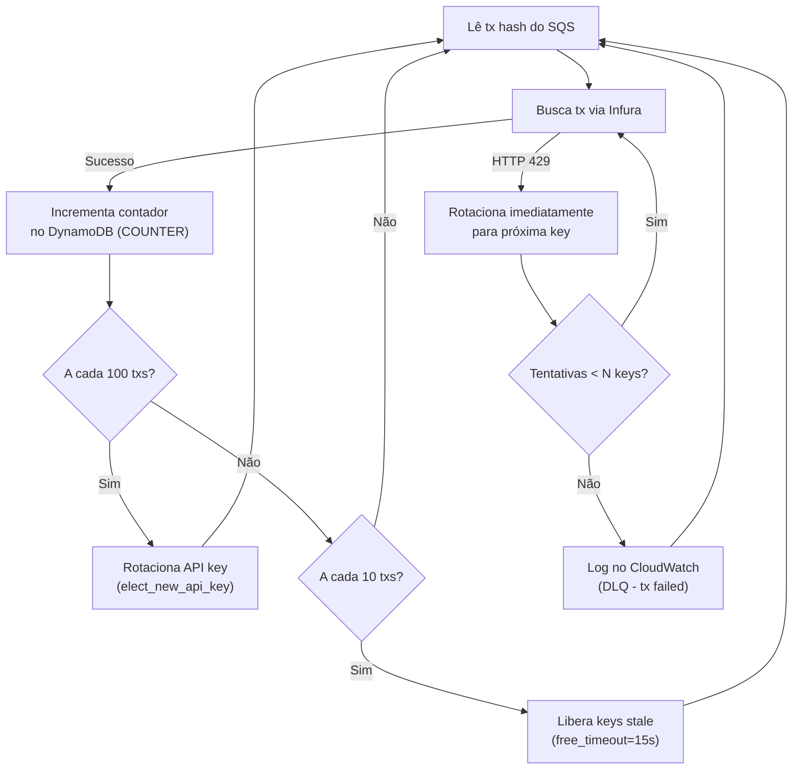
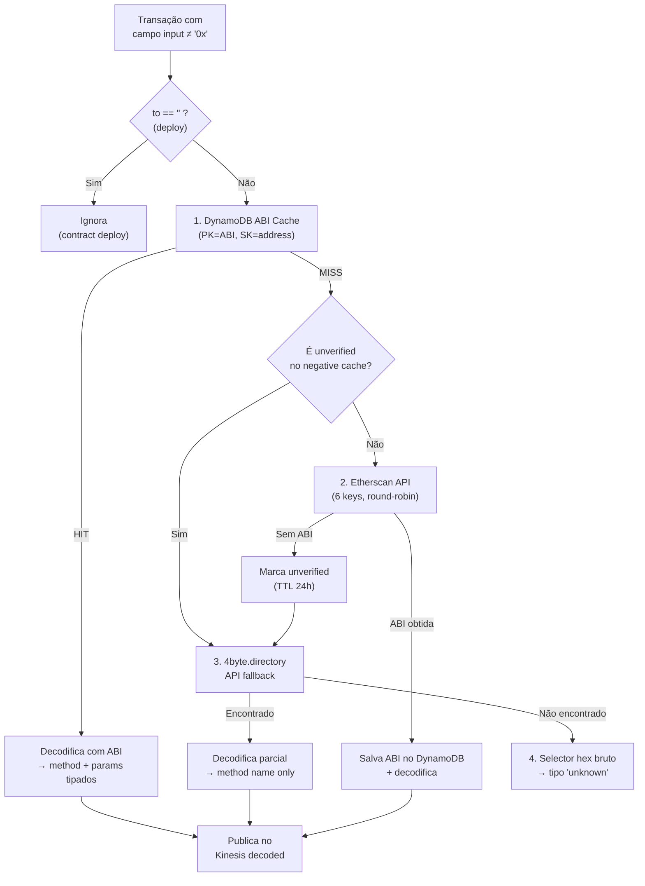

# 02 — Captura de Dados

## Visão Geral

A camada de captura é responsável por extrair dados brutos da blockchain Ethereum e prepará-los para processamento analítico no Databricks. Opera em dois modos complementares:

1. **Streaming**: Pipeline de 5 jobs Python encadeados via AWS Kinesis/SQS, executando em tempo real. Dados entregues no S3 pelo Firehose como NDJSON.
2. **Batch**: Jobs sob demanda para ingestão de contratos e limpeza de dados.

Toda a comunicação entre jobs utiliza serviços gerenciados AWS: **Kinesis Data Streams** (dados), **SQS** (coordenação inter-job) e **CloudWatch Logs** (logs de aplicação). Serialização é JSON nativo (sem Avro/Schema Registry).

---

## 1. Pipeline de Streaming

### 1.1 Fluxo Geral



Todos os jobs enviam logs estruturados para CloudWatch Logs via `CloudWatchLoggingHandler`. O Firehose entrega os logs no S3 como NDJSON.

### 1.2 Detalhamento por Job

#### Job 1 — Mined Blocks Watcher

| Aspecto | Detalhe |
|---------|---------|
| **Classe** | `MinedBlocksWatcher` |
| **Entrada** | Ethereum RPC — `eth_getBlock("latest")` via Alchemy |
| **Saída SQS** | `mainnet-mined-blocks-events-{env}` |
| **Formato** | JSON (`block_timestamp`, `block_number`, `block_hash`) |
| **Concorrência** | Single-thread, loop infinito com `time.sleep(CLOCK_FREQUENCY)` |
| **Lógica** | Faz polling periódico, compara `block_number` com o anterior e só publica se houve novo bloco |
| **API Provider** | Alchemy (`eth-mainnet.g.alchemy.com`) — 1 API key do SSM Parameter Store |
| **DynamoDB** | Não utiliza |
| **Logs** | CloudWatch Logs via `CloudWatchLoggingHandler` |

**Variáveis de Ambiente:**

| Variável | Descrição | Exemplo |
|----------|-----------|--------|
| `SSM_SECRET_NAME` | Path SSM da API key Alchemy | `/web3-api-keys/alchemy/api-key-1` |
| `CLOCK_FREQUENCY` | Intervalo de polling em segundos | `1` |
| `SQS_QUEUE_URL` | URL da fila SQS de saída | `https://sqs.sa-east-1.amazonaws.com/.../mainnet-mined-blocks-events-prd` |
| `CLOUDWATCH_LOG_GROUP` | Log group para logs da aplicação | `/apps/dm-chain-explorer-prd` |
| `NETWORK` | Rede Ethereum | `mainnet` |

#### Job 2 — Orphan Blocks Watcher

| Aspecto | Detalhe |
|---------|---------|
| **Classe** | `OrphanBlocksProcessor` |
| **Entrada SQS** | `mainnet-mined-blocks-events-{env}` |
| **Saída SQS** | `mainnet-mined-blocks-events-{env}` (eventos de orphan) |
| **Formato** | JSON (mesmo formato do Job 1) |
| **Concorrência** | Single-thread, consumer loop (SQS long-polling) |
| **Lógica** | Para cada bloco recebido, busca o bloco na chain via RPC e compara o hash com o cache no DynamoDB. Se o hash divergir, emite evento de orphan. Mantém cache com TTL de 3600s (auto-expiração). |
| **DynamoDB** | Entidade `BLOCK_CACHE`: PK=`BLOCK_CACHE`, SK=`{block_number}`, valor=`block_hash`, TTL=3600s. |
| **Logs** | CloudWatch Logs via `CloudWatchLoggingHandler` |

**Variáveis de Ambiente:**

| Variável | Descrição | Exemplo |
|----------|-----------|--------|
| `SSM_SECRET_NAME` | API key Alchemy | `/web3-api-keys/alchemy/api-key-2` |
| `SQS_QUEUE_URL` | URL da fila SQS | `https://sqs.../mainnet-mined-blocks-events-prd` |
| `DYNAMODB_TABLE` | Nome da tabela DynamoDB | `dm-chain-explorer` |
| `CLOUDWATCH_LOG_GROUP` | Log group | `/apps/dm-chain-explorer-prd` |

#### Job 3 — Block Data Crawler

| Aspecto | Detalhe |
|---------|---------|
| **Classe** | `BlockDataCrawler` |
| **Entrada SQS** | `mainnet-mined-blocks-events-{env}` |
| **Saída Kinesis** | `mainnet-blocks-data-{env}` (dados completos do bloco) |
| **Saída SQS** | `mainnet-block-txs-hash-id-{env}` (hashes de transações) |
| **Formato** | JSON (18+ campos do bloco + hashes de txs) |
| **Concorrência** | Single-thread |
| **Lógica** | Busca dados completos do bloco via RPC. Publica dados do bloco em Kinesis e faz fan-out de hashes de transações em SQS. Limita transações por bloco com `TXS_PER_BLOCK` (default 50). |
| **Schema do Bloco** | `number`, `timestamp`, `hash`, `parentHash`, `difficulty`, `totalDifficulty`, `nonce`, `size`, `miner`, `baseFeePerGas`, `gasLimit`, `gasUsed`, `logsBloom`, `extraData`, `transactionsRoot`, `stateRoot`, `transactions[]`, `withdrawals[{index, validatorIndex, address, amount}]` |
| **Logs** | CloudWatch Logs via `CloudWatchLoggingHandler` |

**Variáveis de Ambiente:**

| Variável | Descrição | Exemplo |
|----------|-----------|--------|
| `KINESIS_STREAM_BLOCKS` | Stream Kinesis para dados do bloco | `mainnet-blocks-data-prd` |
| `SQS_QUEUE_URL_TXS_HASH` | Fila SQS para hashes de txs | `https://sqs.../mainnet-block-txs-hash-id-prd` |
| `TXS_PER_BLOCK` | Máximo de txs publicadas por bloco | `50` |
| `CLOUDWATCH_LOG_GROUP` | Log group | `/apps/dm-chain-explorer-prd` |

#### Job 4 — Mined Txs Crawler

| Aspecto | Detalhe |
|---------|---------|
| **Classe** | `RawTransactionsProcessor` |
| **Entrada SQS** | `mainnet-block-txs-hash-id-{env}` |
| **Saída Kinesis** | `mainnet-transactions-data-{env}` |
| **Formato** | JSON — 16 campos incluindo `blockHash`, `blockNumber`, `hash`, `from`, `to`, `value`, `input`, `gas`, `gasPrice`, `type`, `accessList[]` |
| **Concorrência** | **6 réplicas** (Docker Compose `deploy.replicas: 6`), cada uma single-thread. Coordenação via SQS visibility timeout + DynamoDB semaphore. |
| **API Provider** | Infura (`mainnet.infura.io`) — 17 API keys do SSM |
| **DynamoDB (Semáforo)** | Entidade `SEMAPHORE`: PK=`SEMAPHORE`, SK=`{api_key_name}`, campos `process`, `last_update`, TTL=60s. |
| **DynamoDB (Contador)** | Entidade `COUNTER`: PK=`COUNTER`, SK=`{api_key_name}`, campos `num_req_1d`, `end`. |

**Mecanismo de Rotação de API Keys:**



- O `APIKeysManager` mantém um semáforo distribuído no DynamoDB (entidade SEMAPHORE com TTL de 60s).
- Cada réplica gera um `PROC_ID` (UUID) único e registra qual API key está usando.
- A cada 100 transações, a réplica libera a key atual e elege uma nova.
- Keys consideradas "stale" (sem atualização há >15s) são liberadas para reuso.
- O formato compacto `infura-api-key-1-17` se expande para 17 keys (1 a 17).
- Quando todas as keys estão bloqueadas no semáforo (deadlock), a transação é logada como erro no CloudWatch em vez de ser descartada silenciosamente.

**Variáveis de Ambiente:**

| Variável | Descrição | Exemplo |
|----------|-----------|---------|
| `SSM_SECRET_NAMES` | Keys Infura compactadas | `/web3-api-keys/infura/api-key-1-17` |
| `SQS_QUEUE_URL` | Fila SQS de entrada (hashes de txs) | `https://sqs.../mainnet-block-txs-hash-id-prd` |
| `KINESIS_STREAM_TXS` | Stream Kinesis de saída | `mainnet-transactions-data-prd` |
| `DYNAMODB_TABLE` | Nome da tabela DynamoDB | `dm-chain-explorer` |
| `CLOUDWATCH_LOG_GROUP` | Log group | `/apps/dm-chain-explorer-prd` |

#### Job 5 — Txs Input Decoder

| Aspecto | Detalhe |
|---------|---------|
| **Classe** | `TransactionInputDecoder` |
| **Entrada Kinesis** | `mainnet-transactions-data-{env}` |
| **Saída Kinesis** | `mainnet-transactions-decoded-{env}` |
| **Formato** | JSON — campos: `tx_hash`, `contract_address`, `method`, `parms`, `decode_type` |
| **Concorrência** | **3 réplicas** (ECS `desired_count = 3`; Docker Compose `deploy.replicas: 3`). Cada réplica consome do shard via `KinesisHandler.consume_stream()`. |
| **DynamoDB** | Cache de ABIs: entidade `ABI` (PK=`ABI`, SK=`{address}`, permanente) + entidade `ABI_NEG` (PK=`ABI_NEG`, SK=`{address}`, TTL 24h) |

**Pipeline de Decodificação (4 estágios):**



**Tipos de decodificação (`decode_type`):**
- `abi_cache` — ABI encontrada no DynamoDB
- `etherscan` — ABI obtida via Etherscan e armazenada
- `4byte` — Apenas nome do método via 4byte.directory
- `unknown` — Não decodificado (apenas selector hex)

**Variáveis de Ambiente:**

| Variável | Descrição | Exemplo |
|----------|-----------|---------|
| `SSM_ETHERSCAN_PATH` | Path SSM das keys Etherscan | `/etherscan-api-keys` |
| `UNVERIFIED_TTL` | TTL do negative cache em segundos | `86400` |
| `KINESIS_STREAM_IN` | Stream Kinesis de entrada | `mainnet-transactions-data-prd` |
| `KINESIS_STREAM_OUT` | Stream Kinesis de saída | `mainnet-transactions-decoded-prd` |
| `CLOUDWATCH_LOG_GROUP` | Log group | `/apps/dm-chain-explorer-prd` |

> **Nota**: O antigo job auxiliar Semaphore Collector (`n_semaphore_collect.py`) foi eliminado. O DynamoDB pode ser consultado diretamente via console ou queries programáticas.

---

## 2. Infraestrutura de Mensageria AWS

### 2.1 Recursos

| Serviço | Recurso | Formato | Produtor | Consumidor | Entrega S3 |
|---------|---------|---------|----------|------------|------------|
| **CloudWatch Logs** | `/apps/dm-chain-explorer-{env}` | JSON (6 campos) | Todos os jobs | — | Firehose → `raw/app_logs/` |
| **SQS** | `mainnet-mined-blocks-events-{env}` | JSON (3 campos) | Jobs 1, 2 | Jobs 2, 3 | — (coordenação apenas) |
| **Kinesis** | `mainnet-blocks-data-{env}` | JSON (18+ campos) | Job 3 | — | Firehose → `raw/mainnet-blocks-data/` |
| **SQS** | `mainnet-block-txs-hash-id-{env}` | JSON (1 campo) | Job 3 | Job 4 (×6) | — (coordenação apenas) |
| **Kinesis** | `mainnet-transactions-data-{env}` | JSON (16 campos) | Job 4 (×6) | Job 5 (×3) | Firehose → `raw/mainnet-transactions-data/` |
| **Kinesis** | `mainnet-transactions-decoded-{env}` | JSON (5 campos) | Job 5 (×3) | — | Firehose → `raw/mainnet-transactions-decoded/` |

### 2.2 Configuração

**Kinesis Data Streams:** On-demand (1 shard, auto-scaling)
**SQS:** Standard queues com long-polling (20s), DLQ com 3 retries
**Firehose:** Buffer 1 MB / 60s, entrega NDJSON particionado por hora no S3
**Serialização:** JSON nativo (sem Schema Registry, sem Avro)
**S3 Prefix:** `raw/{stream-name}/year=YYYY/month=MM/day=DD/hour=HH/`

### 2.3 DynamoDB — Entidades (Single-Table)

Tabela: `dm-chain-explorer` (PK=`pk` string, SK=`sk` string, TTL no atributo `ttl`)

| PK | SK | Finalidade | TTL | Leitura | Escrita |
|----|----|-----------| --- |---------|--------|
| `SEMAPHORE` | `{api_key_name}` | Lock distribuído de API keys | 60s | Job 4 | Job 4 |
| `COUNTER` | `{api_key_name}` | Contador de requisições por API key | — | Gold DLT Views | Job 4 |
| `BLOCK_CACHE` | `{block_number}` | Cache de hashes de blocos (detecção de orphans) | 3600s | Job 2 | Job 2 |
| `CONTRACT` | `{contract_address}` | Contratos populares monitorados | — | Batch ingestão | DABs periodic |
| `ABI` | `{contract_address}` | Cache de ABIs verificadas | — | Job 5 | Job 5 |
| `ABI_NEG` | `{contract_address}` | Negative cache (contratos sem ABI) | 86400s | Job 5 | Job 5 |
| `CONSUMPTION` | `{source}#{api_key_name}` | Métricas de consumo de API keys (Gold views) | — | App (API) | Lambda S3→DynamoDB |

---

## 3. Jobs Batch

### 3.1 Ingestão de Contratos (Lambda)

| Aspecto | Detalhe |
|---------|--------|
| **Arquivo** | `lambda/contracts_ingestion/handler.py` |
| **Classe** | `ContractTransactionsCrawler` |
| **Entrada** | DynamoDB (entidade CONTRACT — PK=`CONTRACT`, SK=`{address}`) + Etherscan API |
| **Saída** | S3 — `s3://{bucket}/batch/year=Y/month=M/day=D/hour=H/txs_{contract_addr}.json` |
| **Lógica** | Para cada contrato listado no DynamoDB (query PK=`CONTRACT`), usa Etherscan `txlist` para buscar transações paginadas (page=1, offset=1000). Particiona output por data. |
| **Frequência** | EventBridge Scheduler — a cada 1 hora |
| **Terraform** | `services/prd/10_lambda/lambda_contracts_ingestion.tf` |
| **Processamento** | Workflow Databricks `dm-periodic-processing` carrega S3 → Bronze → Silver |

### 3.2 Scripts de Ambiente

| Script | Arquivo | Descrição |
|--------|---------|----------|
| Limpeza S3 | `scripts/environment/cleanup_s3.py` | Deleta todos objetos sob um prefixo S3. Args: `--bucket`, `--prefix`, `--dry-run` |
| Limpeza DynamoDB | `scripts/environment/cleanup_dynamodb.py` | Scan + batch delete de todos itens de uma tabela DynamoDB. Args: `--table-name`, `--dry-run` |

---

## 4. Biblioteca Compartilhada (`dm-chain-utils`)

A biblioteca `dm-chain-utils` (versão 1.0.0) é o pacote Python interno compartilhado entre todos os módulos de captura. Ela substitui o antigo repositório externo `lib-dm-utils` (`dm-33-utils` 0.0.5) e os diretórios `utils/` duplicados que existiam em cada imagem Docker.

**Localização:** `utils/src/dm_chain_utils/` (dentro do repositório `dd_chain_explorer`)

| Módulo | Classe/Função | Funcionalidade |
|--------|--------------|----------------|
| `dm_web3_client.py` | `Web3Client` | Cliente Web3 com SSM Parameter Store (sem Azure KV) |
| `dm_kinesis.py` | `KinesisHandler` | Producer/consumer para Kinesis Data Streams (put_record, consume_stream) |
| `dm_sqs.py` | `SQSHandler` | Producer/consumer para SQS (send_message, consume_queue, long-polling) |
| `dm_cloudwatch_logger.py` | `CloudWatchLoggingHandler` | Logging handler para CloudWatch Logs (batched, async flush) |
| `dm_logger.py` | `ConsoleLoggingHandler` | Logging para console |
| `dm_parameter_store.py` | `ParameterStoreClient` | CRUD completo no AWS SSM Parameter Store |
| `dm_dynamodb.py` | `DMDynamoDB` | Cliente DynamoDB single-table (boto3 wrapper com PK/SK, TTL, batch ops) |
| `dm_etherscan.py` | `EtherscanClient` | Cliente Etherscan com call tracking e múltiplas API keys |
| `api_keys_manager.py` | `APIKeysManager` | Semáforo distribuído de API keys via DynamoDB |

**Estratégia de distribuição:**
- **DEV (Docker Compose)**: volume mount `utils/src/dm_chain_utils:/app/dm_chain_utils` para hot-reload durante desenvolvimento.
- **PROD (Docker build)**: `COPY utils/src/dm_chain_utils /app/dm_chain_utils` no Dockerfile, com build context expandido para `dd_chain_explorer/`.

```dockerfile
# Build context: dd_chain_explorer/
COPY docker/onchain-stream-txs/requirements.txt /app/requirements.txt
COPY utils/src/dm_chain_utils /app/dm_chain_utils
COPY docker/onchain-stream-txs/src /app
```

> **Nota**: A biblioteca anterior `dm-33-utils` não é mais usada. Os módulos `web3_utils.py` e `etherscan_utils.py` que usavam Azure Key Vault foram substituídos por equivalentes que usam exclusivamente AWS SSM.

---

## Referências de Arquivos

| Escopo | Arquivos |
|--------|----------|
| Jobs Streaming (source) | `docker/onchain-stream-txs/src/1_*.py` a `5_*.py` |
| Utilitários streaming | `utils/src/dm_chain_utils/` (pacote compartilhado) |
| Decode utilities | `docker/onchain-stream-txs/src/utils_decode/abi_cache.py`, `etherscan_multi.py` |
| Jobs Batch (Lambda) | `lambda/contracts_ingestion/` |
| Scripts Ambiente | `scripts/environment/cleanup_s3.py`, `cleanup_dynamodb.py` |
| Compose (dev apps) | `services/dev/compose/app_services.yml` |
| Compose (dev infra) | `services/dev/compose/local_services.yml` |
| Utilitários compartilhados | `utils/src/dm_chain_utils/` (pacote `dm-chain-utils` 1.0.0) |
| Docker (streaming) | `docker/onchain-stream-txs/Dockerfile`, `requirements.txt` |

---

## TODOs — Captura de Dados

- [x] **TODO-C07**: ~~Avaliar substituição do Spark Kafka→S3 Multiplex.~~ Eliminado — Firehose entrega NDJSON no S3 nativamente. Spark Streaming e Kafka removidos.
- [ ] **TODO-C08**: Implementar métricas CloudWatch Metrics nos jobs de streaming (ex: taxa de processamento, latência, erros por minuto).
- [ ] **TODO-C10**: Adicionar suporte a batched RPC calls (JSON-RPC batch) nos Jobs 3 e 4 para reduzir latência de rede.
