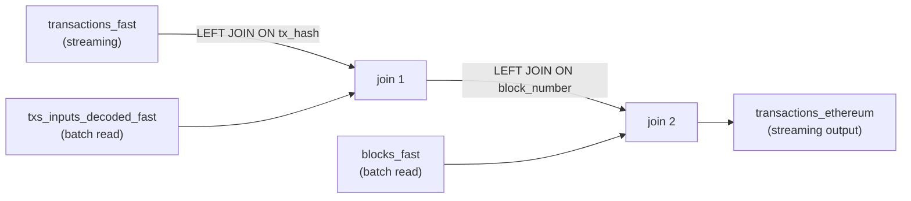
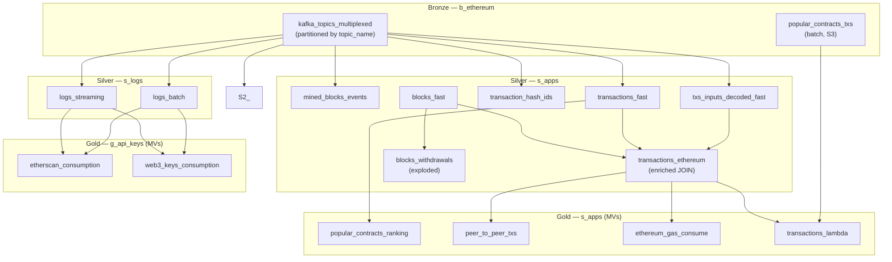
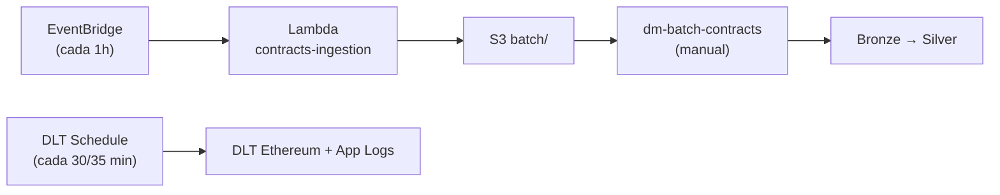

# 03 — Processamento de Dados

## Visão Geral

O processamento analítico é implementado no **Databricks** com **Delta Live Tables (DLT)** seguindo a arquitetura medalhão (Bronze → Silver → Gold). Dois pipelines DLT processam os dados, complementados por workflows batch para ingestão de contratos, setup/teardown e manutenção.

A orquestração é feita nativamente pelo **Databricks Workflows** (schedules Quartz cron) e **AWS Lambda + EventBridge** para ingestão batch de contratos.

---

## 1. Pipelines DLT

### 1.1 Pipeline `dm-ethereum` (Principal)

Pipeline unificado Bronze + Silver + Gold definido em `4_pipeline_ethereum.py`. Contém a lógica completa de transformação dos dados on-chain.

**Configuração:**

| Parâmetro | DEV | PROD |
|-----------|-----|------|
| `source.type` | `s3` (Auto Loader sobre NDJSON) | `s3` (Auto Loader sobre NDJSON via Firehose) |
| `dlt_continuous` | `false` (triggered por schedule cron direto no pipeline, `availableNow`) | `false` (triggered por schedule cron direto no pipeline) |
| `dlt_development` | `true` | `false` |
| `serverless` | `true` | `true` |
| Catalog | `dev` | `dd_chain_explorer` |

#### Bronze — `b_ethereum.kafka_topics_multiplexed`

Tabela única multiplexada com todos os streams Kinesis, particionada por `topic_name`.

**Fonte (DEV e PROD):**
- Lê NDJSON do S3 via Auto Loader (`cloudFiles`). Dados escritos pelo Kinesis Firehose em PROD e pelos jobs de streaming em DEV.

| Coluna | Tipo | Descrição |
|--------|------|-----------|
| `topic_name` | string | Nome do stream Kinesis (coluna de partição) |
| `kafka_partition` | int | Partição (shard Kinesis) original |
| `kafka_offset` | long | Sequence number Kinesis |
| `kafka_timestamp` | timestamp | Timestamp de ingestão |
| `key` | string | Chave da mensagem (cast para string) |
| `value` | binary | Payload Avro com header Confluent (5 bytes) |

#### Silver — Tabelas Individuais

A camada Silver deserializa o payload, aplica validações (`expect_or_drop`) e produz tabelas limpas.

**Tabelas no schema `s_apps`:**

| Tabela | Tópico Kafka Fonte | Campos Principais | Validações |
|--------|-------------------|-------------------|------------|
| `mined_blocks_events` | `mainnet.1.mined_blocks.events` | `block_number`, `block_hash`, `block_timestamp`, `event_time` | `block_number IS NOT NULL`, `block_hash IS NOT NULL` |
| `blocks_fast` | `mainnet.2.blocks.data` | `block_number`, `block_hash`, `parent_hash`, `block_time`, `miner`, `gas_limit`, `gas_used`, `base_fee_per_gas`, `transaction_count`, `transactions[]`, `withdrawals[]` | `block_number IS NOT NULL`, `block_hash IS NOT NULL` |
| `transaction_hash_ids` | `mainnet.3.block.txs.hash_id` | `tx_hash`, `block_hash` | `tx_hash IS NOT NULL` |
| `transactions_fast` | `mainnet.4.transactions.data` | `tx_hash`, `block_number`, `block_hash`, `from_address`, `to_address`, `value`, `input`, `gas`, `gas_price`, `tx_type`, `access_list[]`, **`event_date`** | `tx_hash IS NOT NULL`, `block_number IS NOT NULL`, **`valid_from_address`** (`^0x[a-fA-F0-9]{40}$`), **`valid_to_address`** (null ou `^0x[a-fA-F0-9]{40}$`) |
| `txs_inputs_decoded_fast` | `mainnet.5.transactions.input_decoded` | `tx_hash`, `contract_address`, `method`, `parms`, `decode_type` | `tx_hash IS NOT NULL` |
| `transactions_ethereum` | JOIN: `transactions_fast` + `txs_inputs_decoded_fast` + `blocks_fast` | Todos campos da tx + `tx_timestamp`, `block_gas_limit`, `block_gas_used`, `base_fee_per_gas`, `contract_address`, `method`, `parms`, `decode_type`, `input_etherscan`, **`event_date`** | `tx_hash IS NOT NULL`, `block_number IS NOT NULL`, **`valid_from_address`**, **`valid_to_address`** |
| `blocks_withdrawals` | Explode `blocks_fast.withdrawals[]` | `block_number`, `block_timestamp`, `miner`, `withdrawal_index`, `validator_index`, `withdrawal_address`, `amount_gwei`, `amount_eth` | — |

> **Particionamento:** `transactions_fast` e `transactions_ethereum` são particionadas por `event_date = to_date(kafka_timestamp)`, reduzindo o scan de queries por janela temporal.

**Tabela `transactions_ethereum`** — Detalhamento do JOIN:



O join é implementado como stream-static: `transactions_fast` é lido via `dlt.read_stream()`, enquanto `txs_inputs_decoded_fast` e `blocks_fast` são lidos via `dlt.read()` (snapshot estático).

**Tabela `blocks_withdrawals`** — Explode os dados de saques ETH da Beacon Chain (EIP-4895). Cada withdrawal do bloco gera uma linha com `amount_gwei` e `amount_eth` (÷1e9).

#### Gold — Materialized Views

Quatro materialized views no schema `s_apps`:

| MV / Tabela | Descrição | Lógica |
|-------------|-----------|--------|
| `popular_contracts_ranking` | Top 100 contratos por volume de txs na última hora | Agrupa por `to_address` de `transactions_fast`, conta txs, endereços únicos (`unique_senders`), filtra última 1h |
| `peer_to_peer_txs` | Transferências ETH diretas (EOA→EOA) | Filtra `transactions_ethereum` onde `input` é nulo/vazio/`"0x"` (sem chamada de contrato) |
| `ethereum_gas_consume` | Consumo de gas por transação | Classifica transações em: `contract_deploy` (to=null, input≠vazio), `peer_to_peer` (input vazio), `contract_interaction` (demais). Calcula `gas_pct_of_block`. |
| `transactions_lambda` | Visão Lambda unificando streaming + batch | Faz UNION de `transactions_ethereum` (streaming) com `popular_contracts_txs` (batch), deduplica por `tx_hash` com prioridade por `decode_type`: `full (1) > full_4byte (2) > partial (3) > batch_sem_decode (4) > unknown (5)`. |
| `g_network.network_metrics_hourly` | Métricas de rede Ethereum agregadas por hora | JOIN `blocks_fast` + `transactions_fast`, agrupa por `hour_bucket = date_trunc('hour', kafka_timestamp)`. Calcula: `block_count`, `tx_count`, `tps_avg` (tx_count/3600), `avg_gas_price_gwei`, `avg_block_gas_used`, `avg_block_gas_limit`, `avg_block_utilization_pct`, `avg_txs_per_block`. |

### 1.2 Pipeline `dm-app-logs`

Pipeline dedicado ao processamento de logs das aplicações, definido em `5_pipeline_app_logs.py`.

**Configuração:**
- Catalog: variável (`dev` ou `dd_chain_explorer`)
- Lê da bronze `b_ethereum.kafka_topics_multiplexed` (produzida pelo pipeline `dm-ethereum`)
- Target schema: `s_logs`

#### Silver — `s_logs`

| Tabela | Filtro | Descrição |
|--------|--------|-----------|
| `logs_streaming` | `logger IN ('MINED_BLOCKS_EVENTS', 'ORPHAN_BLOCKS_CRAWLER', 'BLOCK_DATA_CRAWLER', 'RAW_TXS_CRAWLER', 'TRANSACTION_INPUT_DECODER')` | Logs dos 5 jobs de streaming |
| `logs_batch` | `logger IN ('CONTRACT_TRANSACTIONS_CRAWLER')` | Logs dos jobs batch |

#### Gold — `g_api_keys`

| MV | Descrição | Lógica |
|----|-----------|--------|
| `etherscan_consumption` | Consumo de API keys Etherscan | Filtra mensagens com `etherscan;api_call;`, extrai `api_key_name`, `action`, `status` via regex. Agrega por key com janelas de 1h/2h/12h/24h/48h. |
| `web3_keys_consumption` | Consumo de API keys Web3 (Infura/Alchemy) | Filtra `API_request;`, extrai key name e vendor. Classifica status (ok/error/http_error). Agrega por key+vendor com mesmas janelas. |

---

## 2. Modelo de Dados

### 2.1 Catalogs e Schemas

```
Unity Catalog
├── dev (DEV) / dd_chain_explorer (PROD)
│   ├── b_ethereum              ← Bronze
│   │   ├── kafka_topics_multiplexed (streaming table)
│   │   └── popular_contracts_txs    (batch table — S3)
│   │
│   ├── s_apps                  ← Silver (apps)
│   │   ├── mined_blocks_events      (streaming table)
│   │   ├── blocks_fast               (streaming table)
│   │   ├── transaction_hash_ids      (streaming table)
│   │   ├── transactions_fast         (streaming table — partitioned by event_date)
│   │   ├── txs_inputs_decoded_fast   (streaming table)
│   │   ├── transactions_ethereum     (streaming table — enriched, partitioned by event_date)
│   │   ├── blocks_withdrawals        (streaming table)
│   │   ├── popular_contracts_ranking (materialized view)
│   │   ├── peer_to_peer_txs          (materialized view)
│   │   ├── ethereum_gas_consume      (materialized view)
│   │   └── transactions_lambda       (materialized view)
│   │
│   ├── s_logs                  ← Silver (logs)
│   │   ├── logs_streaming            (streaming table)
│   │   └── logs_batch                (streaming table)
│   │
│   ├── g_api_keys              ← Gold (API keys)
│   │   ├── etherscan_consumption     (materialized view)
│   │   └── web3_keys_consumption     (materialized view)
│   │
│   ├── g_network               ← Gold (métricas de rede)
│   │   └── network_metrics_hourly    (materialized view)
│   │
│   └── g_contracts             ← Gold (contratos)
│       └── popular_contracts_history (Delta — SCD Type 2)
```

### 2.2 Diagrama de Linhagem



---

## 3. Workflows Batch (Databricks)

Definidos como Databricks Workflows via DABs (`apps/dabs/resources/workflows/`):

### 3.1 DDL Setup (`dm-ddl-setup`)

Cria todas as tabelas e views no Unity Catalog. Executado uma vez na preparação do ambiente.

```
create_bronze_tables
    ├── create_silver_apps_tables
    └── create_silver_logs_table
          └── create_gold_views
```

### 3.2 Batch Contratos (`dm-batch-contracts`)

Pipeline unificado: S3 `batch/` → Bronze → Silver para dados de transações de contratos.

```
s3_to_bronze_contracts_txs → bronze_to_silver_contracts_txs
```

Substituiu os workflows individuais `dm-batch-s3-to-bronze` e `dm-batch-bronze-to-silver`.

### 3.3 Manutenção (`dm-iceberg-maintenance`)

Executado a cada 12 horas:
```
optimize_bronze → optimize_silver → vacuum_all → monitor_tables
```
- **OPTIMIZE**: Compacta arquivos pequenos em Delta Lake
- **VACUUM**: Remove arquivos antigos não referenciados (após retention period)
- **Monitor**: Coleta métricas das tabelas

### 3.4 Full Refresh DLT (`dm-dlt-full-refresh`)

Acionado manualmente. Executa ambos os pipelines DLT com `full_refresh: true`, descartando checkpoints e reprocessando todos os dados disponíveis na fonte:
```
full_refresh_ethereum → full_refresh_app_logs
```

---

## 4. Orquestração (Databricks Workflows + Lambda)

### 4.1 Pipelines DLT com Schedule

Os schedules dos pipelines DLT são configurados diretamente nos arquivos YAML (`trigger.cron`), sem necessidade de um workflow separado de trigger:

| Pipeline | Schedule (PROD) | Offset |
|----------|-----------------|--------|
| `dm-ethereum` | A cada 30 min | minuto 0 |
| `dm-app-logs` | A cada 35 min | minuto 5 (offset pós-ethereum) |

> **Nota**: Os pipelines são deployados com `pause_status: PAUSED`. Em PROD, despausar manualmente após validação inicial.

### 4.2 Lambda + EventBridge

| Recurso | Schedule | Descrição |
|---------|----------|----------|
| Lambda `contracts-ingestion` | A cada 1h (EventBridge) | Etherscan API → JSON → S3 `batch/` |

### 4.3 Workflows Agendados

| Workflow | Schedule | Descrição |
|----------|----------|----------|
| `dm-iceberg-maintenance` | A cada 12h (4h e 16h) | OPTIMIZE + VACUUM nas tabelas Delta |

### 4.4 Workflows Manuais

| Workflow | Descrição |
|----------|----------|
| `dm-ddl-setup` | Criação de tabelas Databricks |
| `dm-batch-contracts` | S3 `batch/` → Bronze → Silver (contratos) |
| `dm-dlt-full-refresh` | Reprocessamento completo DLT (full_refresh) |

### 4.4 Scripts de Limpeza (standalone)

| Script | Descrição |
|--------|----------|
| `scripts/environment/cleanup_s3.py` | Deleta objetos S3 por prefixo |
| `scripts/environment/cleanup_dynamodb.py` | Deleta todos itens de uma tabela DynamoDB |



---

## 5. Deserialização Avro no DLT

Os dados na camada Bronze são armazenados como binário (`value` column) no formato **Confluent Wire Format**:

```
Byte 0:      Magic byte (0x00)
Bytes 1-4:   Schema ID (int32 big-endian)
Bytes 5+:    Payload Avro binário
```

Para deserializar no Spark:
```python
df.withColumn("avro_payload", F.expr("substring(value, 6)"))
  .withColumn("parsed", from_avro(F.col("avro_payload"), avro_schema_json))
```

Os schemas Avro são definidos centralizados no notebook `avro_schemas.py` e carregados nos pipelines DLT via `%run ./avro_schemas`. Isso elimina duplicação entre `4_pipeline_ethereum.py` e `5_pipeline_app_logs.py` e facilita manutenção.

Os 6 schemas disponíveis são: `AVRO_SCHEMA_APP_LOGS`, `AVRO_SCHEMA_MINED_BLOCKS_EVENTS`, `AVRO_SCHEMA_BLOCKS`, `AVRO_SCHEMA_TX_HASH_IDS`, `AVRO_SCHEMA_TRANSACTIONS`, `AVRO_SCHEMA_INPUT_DECODED`.

---

## 6. Diferenças DEV vs PROD no Processamento

| Aspecto | DEV | PROD |
|---------|-----|------|
| **Fonte Bronze** | S3 NDJSON via Auto Loader (`cloudFiles`) | S3 NDJSON via Auto Loader (Firehose) |
| **DLT Mode** | Triggered (`availableNow`, acionar manualmente em DEV) | Triggered (schedule cron no pipeline, PAUSED até ativação) |
| **Development Flag** | `true` (permite refresh rápido) | `false` |
| **Workers** | 0 (single-node) | 1+ |
| **Catalog** | `dev` | `dd_chain_explorer` |
| **Batch Ingestion** | Manual / scripts | Lambda + EventBridge (hourly) |

---

## Referências de Arquivos

| Escopo | Arquivos |
|--------|----------|
| Pipeline Ethereum (Bronze+Silver+Gold) | `apps/dabs/src/streaming/4_pipeline_ethereum.py` |
| Pipeline App Logs (Silver+Gold) | `apps/dabs/src/streaming/5_pipeline_app_logs.py` |
| Config DLT Ethereum (+ schedule) | `apps/dabs/resources/dlt/pipeline_ethereum.yml` |
| Config DLT App Logs (+ schedule) | `apps/dabs/resources/dlt/pipeline_app_logs.yml` |
| Databricks Bundle | `apps/dabs/databricks.yml` |
| Workflows (DDL, batch, maint, refresh) | `apps/dabs/resources/workflows/*.yml` |
| Batch scripts | `apps/dabs/src/batch/batch_contracts/`, `ddl/`, `maintenance/` |
| Workflow Batch Contratos | `apps/dabs/resources/workflows/workflow_batch_contracts.yml` |
| Workflow Full Refresh DLT | `apps/dabs/resources/workflows/workflow_dlt_full_refresh.yml` |
| Lambda Ingestion | `apps/lambda/contracts_ingestion/handler.py` |
| Terraform Lambda PRD | `services/prd/06_lambda/lambda_contracts_ingestion.tf` |
| Scripts Ambiente | `scripts/environment/cleanup_s3.py`, `cleanup_dynamodb.py` |

