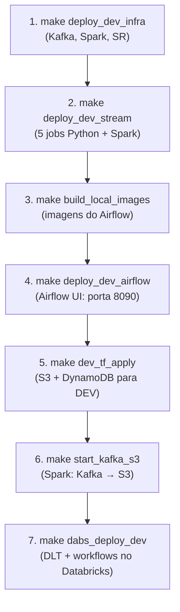
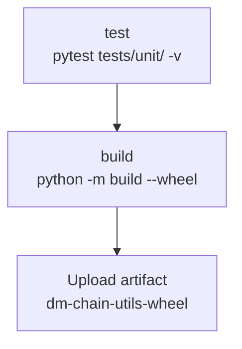
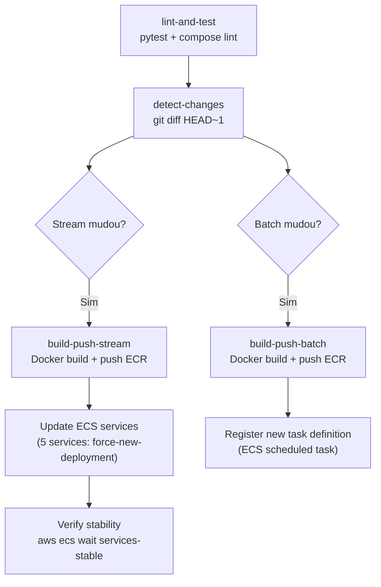
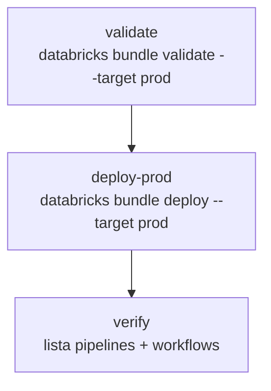
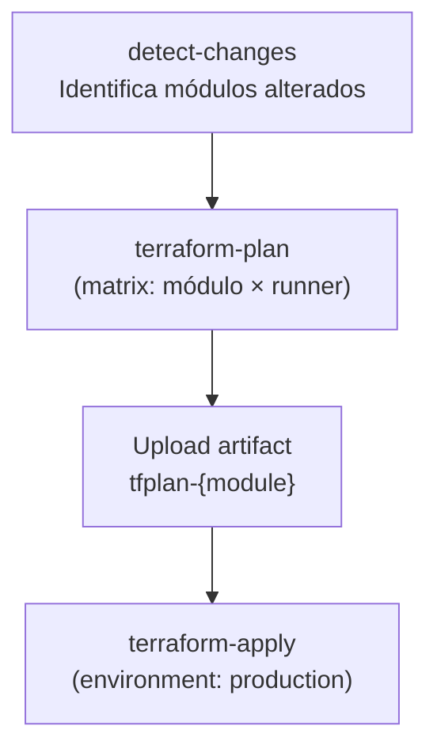
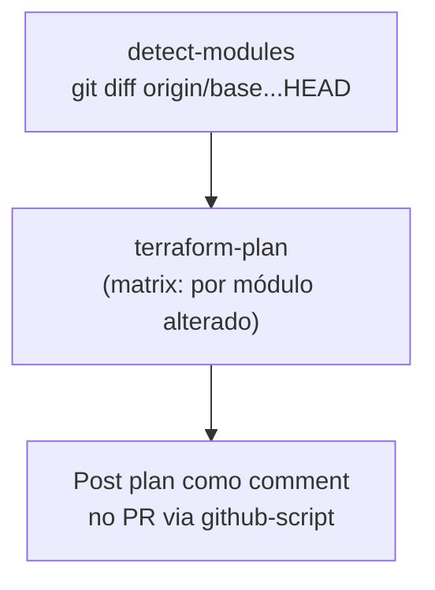
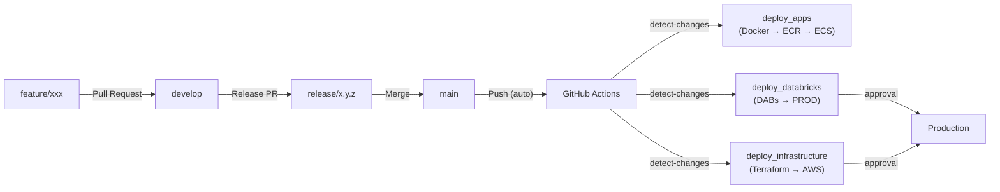

# 04 — DataOps

## Visão Geral

O DataOps do DD Chain Explorer engloba o ciclo completo de desenvolvimento, deploy e operação da plataforma:

1. **Desenvolvimento local** — Docker Compose + Makefile para orquestração.
2. **Infrastructure as Code** — Terraform para provisionamento de DEV e PROD na AWS.
3. **Deploy de aplicações** — Databricks Asset Bundles (DABs) + Docker + ECS.
4. **CI/CD** — GitHub Actions para automatizar builds, deploys e provisionamento.
5. **Observabilidade** — Scripts de monitoramento para ECS e MSK.

---

## 1. Desenvolvimento Local (DEV)

### 1.1 Fluxo de Setup

O ambiente de desenvolvimento é inteiramente baseado em Docker Compose e controlado pelo Makefile:



### 1.2 Comandos do Makefile

#### Infraestrutura Local

| Comando | Descrição |
|---------|-----------|
| `make deploy_dev_infra` | Sobe Kafka (KRaft), Schema Registry, Control Center, Spark master/worker |
| `make stop_dev_infra` | Para infraestrutura local |
| `make watch_dev_infra` | Monitora status dos containers |

#### Aplicações de Streaming

| Comando | Descrição |
|---------|-----------|
| `make deploy_dev_stream` | Sobe 5 jobs Python + 2 jobs Spark (com `--build`) |
| `make stop_dev_stream` | Para aplicações de streaming |
| `make watch_dev_stream` | Monitora status |

#### Jobs Batch

| Comando | Descrição |
|---------|-----------|
| `make deploy_dev_batch` | Executa jobs batch (criação de tópicos, etc.) |

#### Airflow

| Comando | Descrição |
|---------|-----------|
| `make deploy_dev_airflow` | Build da imagem + init + scheduler + webserver (porta 8090) |
| `make stop_dev_airflow` | Para Airflow |
| `make logs_dev_airflow` | Logs do scheduler e webserver |
| `make deploy_prd_airflow` | Airflow PROD local (porta 8091) |

#### Databricks (DABs)

| Comando | Descrição |
|---------|-----------|
| `make dabs_deploy_dev` | Deploy do bundle no Databricks Free Edition |
| `make dabs_deploy_prod` | Deploy do bundle no Databricks PROD |
| `make dabs_run_dev JOB=<nome>` | Executar um workflow em DEV |
| `make dabs_status_dev` | Ver status dos recursos deployados |

#### Kafka → S3 (Bridge)

| Comando | Descrição |
|---------|-----------|
| `make start_kafka_s3` | Inicia job Spark Kafka→S3 multiplex |
| `make stop_kafka_s3` | Para o job |
| `make logs_kafka_s3` | Logs do job |

#### Docker Build/Push

| Comando | Descrição |
|---------|-----------|
| `make build_stream VERSION=x.y.z` | Build da imagem onchain-stream-txs (context: `dd_chain_explorer/`) |
| `make push_stream VERSION=x.y.z` | Push para Amazon ECR |
| `make build_and_push_stream VERSION=x.y.z` | Build + push |
| `make build_batch VERSION=x.y.z` | Build da imagem onchain-batch-txs |

### 1.3 Docker Compose — Composição de Serviços

| Arquivo | Serviços | Rede |
|---------|----------|------|
| `local_services.yml` | kafka-broker-1, schema-registry, control-center, spark-master, spark-worker-1 | `vpc_dm` |
| `app_services.yml` | 5 python-job-*, 1 spark-app-kafka-s3 | `vpc_dm` |
| `batch_services.yml` | batch-job-kafka-create-topics, batch-job-recreate-logs-topic | `vpc_dm` |
| `airflow_services.yml` (DEV) | airflow-scheduler, airflow-webserver, airflow-postgres, airflow-init | `vpc_dm` |
| `airflow_services.yml` (PRD) | airflow-scheduler, airflow-webserver, airflow-postgres, airflow-init | `airflow_prd_net` |

---

## 2. Terraform — Infrastructure as Code

### 2.1 Organização dos Módulos

**DEV** (`services/dev/terraform/`):

| Módulo | Recursos |
|--------|----------|
| `s3.tf` (raiz) | Bucket S3 `dm-chain-explorer-dev-ingestion` |
| `dynamodb.tf` (raiz) | Tabela DynamoDB `dm-chain-explorer` (single-table, PK/SK, TTL) — substitui Redis local |
| `lambda.tf` (raiz) | Lambda `dd-chain-explorer-dev-gold-to-dynamodb` (S3 event `exports/gold_api_keys/` → DynamoDB sync) |
| `1_databricks/` | External location no Databricks Free Edition |
| `2_s3/` | Configurações adicionais S3 (lifecycle, versioning) |
| `3_iam/` | IAM role para acesso Databricks → S3 |

**PROD** (`services/prd/terraform/`):

| Módulo | Recursos | Custo |
|--------|----------|-------|
| `0_remote_state` | S3 backend + DynamoDB lock para state remoto | Gratuito |
| `1_vpc` | VPC, subnets (pub/priv), IGW, security groups, S3 endpoint | Gratuito |
| `2_iam` | Roles: ECS execution, ECS task, Databricks cross-account, cluster | Gratuito |
| `3_msk` | Cluster MSK (Kafka 3.6.0, 2 brokers `kafka.t3.small`, KMS) | **Pago** |
| `4_s3` | 3 buckets: raw, lakehouse, databricks + lifecycle rules | Gratuito |
| `6_ecs` | Cluster Fargate + 6 task definitions + services + Cloud Map DNS | **Pago** |
| `7_databricks` | Workspace MWS, Unity Catalog, metastore, external locations, cluster | **Pago** |
| `8_elasticache` | *(Descomissionado — substituído por DynamoDB)* | — |
| `9_dynamodb` | Tabela DynamoDB single-table (PK/SK, TTL, PITR, SSE) | Gratuito (PAY_PER_REQUEST) |
| `10_lambda` | Lambda gold_to_dynamodb (S3 event → DynamoDB sync) | Gratuito |

### 2.2 Comandos Terraform via Makefile

O Makefile organiza os módulos em **3 grupos** por perfil de custo:

**Grupo 1 — Recursos Gratuitos (VPC + IAM + S3):**
```bash
make tf_apply_free_resources    # apply sequencial: VPC → IAM → S3
make tf_destroy_free_resources  # destroy reverso: S3 → IAM → VPC
```

**Grupo 2 — Recursos AWS Pagos (MSK + ECS):**
```bash
make tf_apply_aws_resources     # MSK → ECS SR → ECS tasks
make tf_destroy_aws_resources   # ECS → MSK
```

> **Nota**: O apply do ECS é feito em 2 estágios com `-target` — primeiro o Schema Registry (que depende do MSK), depois os demais serviços.

**Grupo 3 — Databricks:**
```bash
make tf_apply_databricks        # Workspace + Unity Catalog + cluster
make tf_destroy_databricks
```

**Deploy/Destroy Completo:**
```bash
make prod_deploy_infra    # Grupo 1 → 2 → 3
make prod_destroy_infra   # Grupo 3 → 2 → 1
```

---

## 3. CI/CD — GitHub Actions

> ~~**⚠️ Nota**: Os workflows atuais estão **parcialmente obsoletos**. O `deploy_infrastructure.yml` referencia o path antigo `dd_chain_explorer/terraform_prd/`.~~ ✅ Corrigido (TODO-O01): path atualizado para `services/prd/terraform/`.

### 3.1 CI — Lib `dm-chain-utils` (`ci_lib.yml`)

**Trigger**: Push ou PR com mudanças em `dd_chain_explorer/utils/**`.



**Detalhes:**
- Python 3.12, instala extras `[dev]` do `pyproject.toml`
- Testes unitários com mocks (sem dependências de serviços externos)
- Wheel publicado como artifact com retenção de 7 dias (sem PyPI por ora)

### 3.2 Deploy Apps (`deploy_apps.yml`)

**Trigger**: Push na `main` com mudanças em `docker/onchain-stream-txs/`, `docker/onchain-batch-txs/` ou `utils/`. Também via `workflow_dispatch`.



**Detalhes:**
- **Gate**: job `lint-and-test` executa pytest e valida compose antes de qualquer build
- Tag da imagem: `git rev-parse --short HEAD`
- Registry: **Amazon ECR** (`<account>.dkr.ecr.sa-east-1.amazonaws.com`); autenticado via `aws ecr get-login-password`
- Build context: `dd_chain_explorer/` (root) para incluir `utils/src/dm_chain_utils`
- ECS services atualizados: `dm-mined-blocks-watcher`, `dm-orphan-blocks-watcher`, `dm-block-data-crawler`, `dm-mined-txs-crawler`, `dm-txs-input-decoder`
- Após o loop de deploys, o pipeline executa `aws ecs wait services-stable` para aguardar a estabilização de todos os serviços. Se o ECS acionar o `deployment_circuit_breaker` e reverter a task definition, o passo falha e o pipeline termina com erro, impedindo um deploy silenciosamente corrompido.
- Batch: atualiza task definition `dm-contracts-txs-crawler` (não tem ECS service — roda via EventBridge Scheduler)

### 3.3 Deploy Databricks (`deploy_databricks.yml`)

**Trigger**: Push na `main` com mudanças em `dabs/`. Também via `workflow_dispatch`.



**Detalhes:**
- Environment: `production` (requer aprovação manual)
- Variáveis de deploy: `prod_workspace_host`, `kafka_bootstrap_servers`, `dynamodb_*_table`
- Secrets: `DATABRICKS_PROD_HOST`, `DATABRICKS_PROD_TOKEN`, `MSK_BOOTSTRAP_SERVERS`

### 3.4 Deploy Infrastructure (`deploy_infrastructure.yml`)

**Trigger**: Push na `main` com mudanças em `dd_chain_explorer/services/prd/terraform/**`. Também via `workflow_dispatch`.



**Detalhes:**
- Detecção de módulos: `git diff` extrai pastas alteradas em `services/prd/terraform/`
- Strategy matrix: aplica cada módulo alterado independentemente
- Aprovação manual via GitHub environment `production`
- Secrets Databricks: `DATABRICKS_ACCOUNT_ID`, `DATABRICKS_CLIENT_ID`, `DATABRICKS_CLIENT_SECRET`

### 3.5 CI — Terraform Plan em PRs (`ci_terraform_plan.yml`)

**Trigger**: `pull_request` com mudanças em `services/prd/terraform/**`.



**Detalhes:**
- Módulos suportados: `0_remote_state`, `1_vpc`, `2_iam`, `3_msk`, `4_s3`, `6_ecs`, `7_databricks`, `9_dynamodb`, `10_lambda`
- Cada módulo é validado com `terraform init` + `validate` + `plan`
- Plano postado como comentário no PR; mudanças no `*.tf` raiz re-planejam todos os módulos
- Não executa `apply` (somente CI de validação)

### 3.6 Secrets Necessários no GitHub

| Secret | Usado por | Descrição |
|--------|-----------|-----------|
| `AWS_ACCESS_KEY_ID` | deploy_apps, deploy_infrastructure, ci_terraform_plan | Credencial AWS |
| `AWS_SECRET_ACCESS_KEY` | deploy_apps, deploy_infrastructure, ci_terraform_plan | Credencial AWS |
| `DATABRICKS_PROD_HOST` | deploy_databricks | URL do workspace PROD |
| `DATABRICKS_PROD_TOKEN` | deploy_databricks | PAT do Databricks PROD |
| `MSK_BOOTSTRAP_SERVERS` | deploy_databricks | Bootstrap servers do MSK |
| `DATABRICKS_ACCOUNT_ID` | deploy_infrastructure | Account ID Databricks |
| `DATABRICKS_CLIENT_ID` | deploy_infrastructure | Service Principal client ID |
| `DATABRICKS_CLIENT_SECRET` | deploy_infrastructure | Service Principal secret |
| `DYNAMODB_SEMAPHORE_TABLE` | deploy_databricks | Nome da tabela DynamoDB |
| `DYNAMODB_CONSUMPTION_TABLE` | deploy_databricks | Nome da tabela DynamoDB |
| `DYNAMODB_POPULAR_CONTRACTS_TABLE` | deploy_databricks | Nome da tabela DynamoDB |

> **Secrets removidos** após migração DockerHub → ECR: `DOCKERHUB_USERNAME`, `DOCKERHUB_TOKEN`.
> Execute `scripts/setup_github_secrets.sh` para configurar todos os secrets via `gh` CLI.

---

## 4. GitFlow

### 4.1 Modelo de Branches

O projeto utiliza um modelo GitFlow completo:

```
main
 └── release/x.y.z     ← RC branch; merged em main + develop após release
       └── develop      ← branch de integração; todos os PRs de feature/fix apontam aqui
             ├── feature/<descricao>
             ├── fix/<descricao>
             └── chore/<descricao>
```

| Branch | Propósito | Push direto |
|--------|-----------|-------------|
| `main` | Código pronto para produção | ❌ PRs only |
| `develop` | Integração de features concluídas | ❌ PRs only |
| `release/*` | Release candidates | ❌ PRs only |
| `feature/*` | Novas funcionalidades | ✅ autor |
| `fix/*` | Correção de bugs | ✅ autor |
| `chore/*` | Manutenção / deps | ✅ autor |
| `infra/*` | Mudanças de infraestrutura | ✅ autor |

**Convenção de commits:**
```
feat(stream): add broker pre-warm on producer init
fix(batch): handle empty Etherscan response
chore(deps): bump confluent-kafka to 2.5.0
infra(ecs): add ECR repositories to Terraform
ci(deploy): migrate DockerHub → ECR
```

### 4.2 Template de PR

O arquivo `.github/PULL_REQUEST_TEMPLATE.md` fornece um checklist obrigatório com:
- Tipo de mudança (feat/fix/chore/infra/ci/docs)
- Checklist de testes (pytest, compose validate, DEV, terraform plan)
- Verificação de breaking changes e referências a issues

### 4.3 Fluxo de Deploy



---

## 5. Observabilidade (PROD)

### 5.1 Scripts de Monitoramento

| Comando | Script | Descrição |
|---------|--------|-----------|
| `make prod_logs_ecs` | `scripts/prod_ecs_logs.py` | Últimas 100 linhas de logs de todas as tasks ECS |
| `make prod_logs_ecs_svc SVC=<nome>` | `scripts/prod_ecs_logs.py` | Logs de um serviço ECS específico |
| `make prod_msk_metrics` | `scripts/prod_msk_metrics.py` | Métricas e logs do MSK (janela 30 min) |
| `make prod_msk_metrics_1h` | `scripts/prod_msk_metrics.py` | Métricas MSK (janela 60 min) |

### 5.2 Monitoramento no Airflow

- Airflow UI: `http://localhost:8090` (DEV) / `http://localhost:8091` (PROD)
- DAG runs, task logs e gantt charts disponíveis na interface web
- `email_on_failure: False` em todas as DAGs (a configurar)

### 5.3 Monitoramento Kafka (DEV)

- **Control Center**: `http://localhost:9021` — dashboard visual de tópicos, consumers, throughput
- **DynamoDB**: Consultas diretas via console AWS ou queries programáticas (PK=`SEMAPHORE`, PK=`COUNTER`)

---

## 6. Databricks Asset Bundles (DABs)

### 6.1 Estrutura

```
dabs/
├── databricks.yml             ← Config principal (targets dev/prod, variáveis)
├── resources/
│   ├── dlt/
│   │   ├── pipeline_ethereum.yml    ← Pipeline DLT principal
│   │   └── pipeline_app_logs.yml    ← Pipeline DLT de logs
│   └── workflows/
│       ├── workflow_trigger_dlt_ethereum.yml
│       ├── workflow_trigger_dlt_app_logs.yml
│       ├── workflow_batch_s3_to_bronze.yml
│       ├── workflow_batch_bronze_to_silver.yml
│       ├── workflow_ddl_setup.yml
│       ├── workflow_maintenance.yml
│       ├── workflow_periodic_processing.yml
│       └── workflow_teardown.yml
└── src/
    ├── streaming/             ← Notebooks DLT
    └── batch/                 ← Scripts batch (DDL, maintenance, periodic, contracts)
```

### 6.2 Targets

| Target | Workspace | Catalog | Source | DLT Mode | Prefix |
|--------|-----------|---------|--------|----------|--------|
| `dev` | Free Edition (`dbc-*.cloud.databricks.com`) | `dev` | S3 (Auto Loader) | Triggered (development=true) | `[dev dd_chain_explorer]` |
| `prod` | AWS workspace | `dd_chain_explorer` | Kafka MSK | Contínuo | — |

---

## Referências de Arquivos

| Escopo | Arquivos |
|--------|----------|
| Makefile | `Makefile` |
| CI/CD Lib | `.github/workflows/ci_lib.yml` |
| CI/CD Apps | `.github/workflows/deploy_apps.yml` |
| CI/CD Databricks | `.github/workflows/deploy_databricks.yml` |
| CI/CD Infra (deploy) | `.github/workflows/deploy_infrastructure.yml` |
| CI/CD Infra (plan PRs) | `.github/workflows/ci_terraform_plan.yml` |
| PR Template | `.github/PULL_REQUEST_TEMPLATE.md` |
| Docs CI/CD | `.github/README.md` |
| Scripts | `scripts/prod_ecs_logs.py`, `scripts/prod_msk_metrics.py`, `scripts/setup_databricks_profiles.sh`, `scripts/setup_github_secrets.sh` |
| Compose DEV | `services/dev/compose/*.yml` |
| Compose PRD | `services/prd/compose/*.yml` |
| Terraform DEV | `services/dev/terraform/` |
| Terraform PRD | `services/prd/terraform/0_remote_state/` a `10_lambda/` |
| ECR Repositories | `services/prd/terraform/6_ecs/ecs.tf` (recursos `aws_ecr_repository.stream/batch`) |
| Shared Library | `utils/src/dm_chain_utils/` + `utils/pyproject.toml` |
| DABs Config | `dabs/databricks.yml` |
| DABs Resources | `dabs/resources/dlt/`, `dabs/resources/workflows/` |
| Dockerfile stream | `docker/onchain-stream-txs/Dockerfile` |
| Dockerfile batch | `docker/onchain-batch-txs/Dockerfile` |
| Dockerfile Airflow | `docker/customized/airflow/Dockerfile` |
| Dockerfile Spark | `docker/spark-stream-txs/Dockerfile` |

---

## TODOs — DataOps

- [ ] **TODO-O08**: Implementar monitoramento com CloudWatch Dashboards ou Grafana para métricas de ECS + MSK + DynamoDB.
- [ ] **TODO-O10**: Implementar notificações Slack/Teams para falhas de CI/CD e alertas de infraestrutura.
- [ ] **TODO-O11** 🔴 P0: Hardening do pipeline de CI/CD. Testar e validar os 4 tipos de deploy no GitHub Actions: (1) Docker images → push DockerHub → deploy ECS (`deploy_apps.yml`), (2) publicação da lib Python `dm-chain-utils`, (3) Terraform plan/apply com aprovação manual (`deploy_infrastructure.yml`), (4) DABs bundle deploy para Databricks (`deploy_databricks.yml`). Todos os workflows devem estar funcionais e testados.
- [ ] **TODO-O12** 🔴 P0: Validar ambiente PROD end-to-end. Garantir que o fluxo completo funciona: jobs de streaming rodando no ECS Fargate → produzindo para MSK → DLT Databricks consumindo do MSK → tabelas Gold populadas e atualizando. Depende de TODO-P01 (DLT contínuo com MSK).
