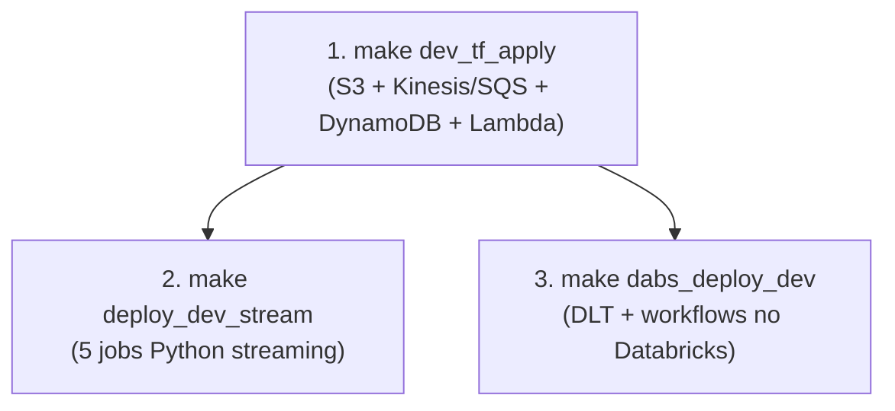
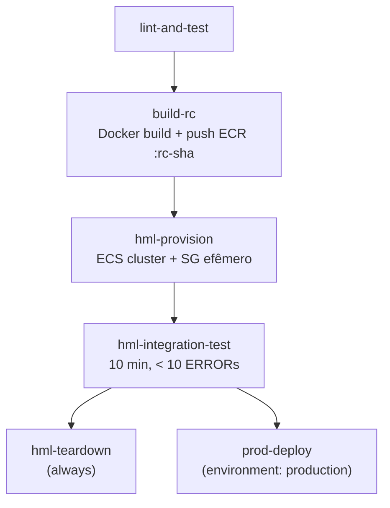
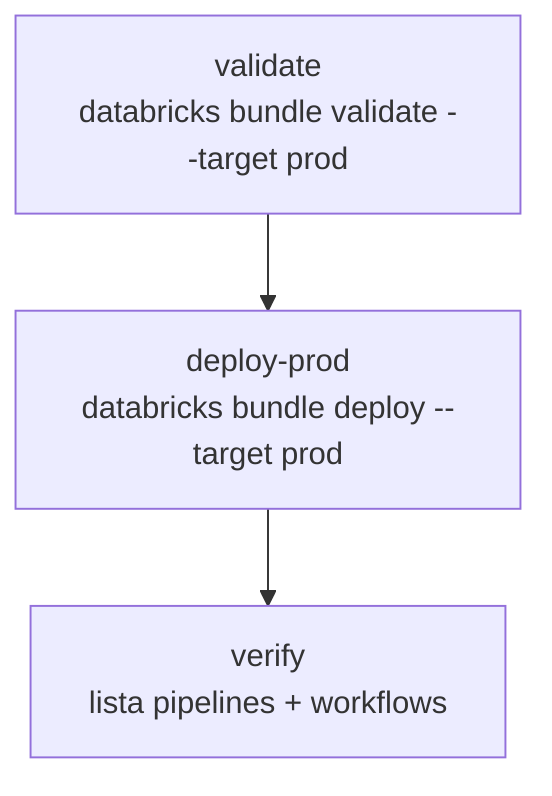
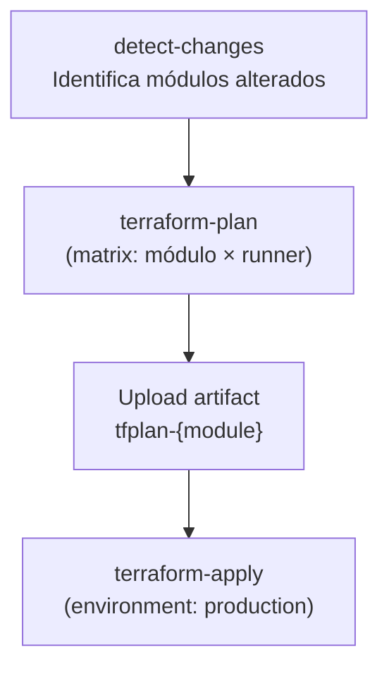
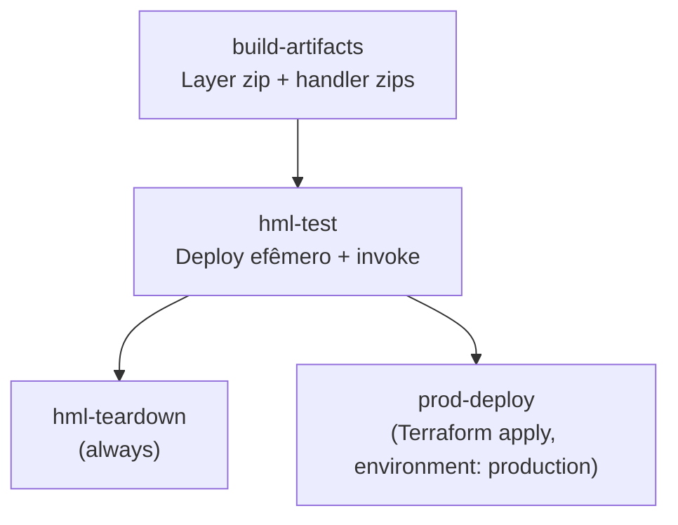
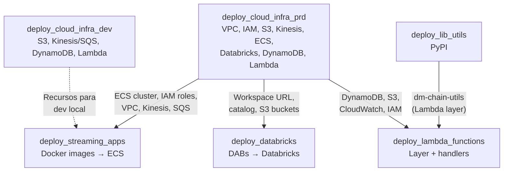
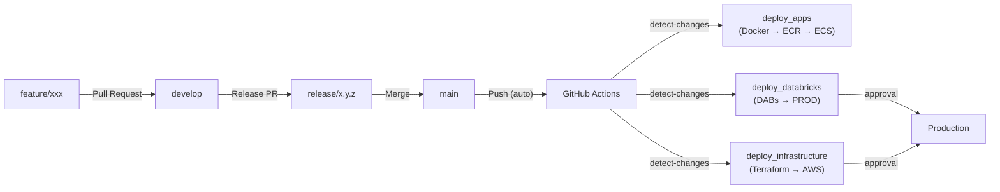

# 04 — DataOps

## Visão Geral

O DataOps do DD Chain Explorer engloba o ciclo completo de desenvolvimento, deploy e operação da plataforma:

1. **Desenvolvimento local** — Docker Compose + Makefile para orquestração.
2. **Infrastructure as Code** — Terraform para provisionamento de DEV e PROD na AWS.
3. **Deploy de aplicações** — Databricks Asset Bundles (DABs) + Docker + ECS.
4. **CI/CD** — GitHub Actions para automatizar builds, deploys e provisionamento.
5. **Observabilidade** — Scripts de monitoramento para ECS e Databricks.

---

## 1. Desenvolvimento Local (DEV)

### 1.1 Fluxo de Setup

O ambiente de desenvolvimento é inteiramente baseado em Docker Compose e controlado pelo Makefile:



### 1.2 Comandos do Makefile

#### Aplicações de Streaming

| Comando | Descrição |
|---------|-----------|
| `make deploy_dev_stream` | Sobe 5 jobs Python streaming (com `--build`) |
| `make stop_dev_stream` | Para aplicações de streaming |
| `make watch_dev_stream` | Monitora status |

#### Databricks (DABs)

| Comando | Descrição |
|---------|-----------|
| `make dabs_deploy_dev` | Deploy do bundle no Databricks Free Edition |
| `make dabs_deploy_prod` | Deploy do bundle no Databricks PROD |
| `make dabs_run_dev JOB=<nome>` | Executar um workflow em DEV |
| `make dabs_status_dev` | Ver status dos recursos deployados |

#### Docker Build/Push

| Comando | Descrição |
|---------|-----------|
| `make build_stream VERSION=x.y.z` | Build da imagem onchain-stream-txs (context: `dd_chain_explorer/`) |
| `make push_stream VERSION=x.y.z` | Push para Amazon ECR |
| `make build_and_push_stream VERSION=x.y.z` | Build + push |

### 1.3 Docker Compose — Composição de Serviços

| Arquivo | Serviços | Rede |
|---------|----------|------|
| `app_services.yml` | 5 python-job-* (streaming) — conectam a recursos AWS de DEV | `vpc_dm` |

---

## 2. Terraform — Infrastructure as Code

### 2.1 Organização dos Módulos

**DEV** (`services/dev/terraform/1_aws_core/`) — módulo único, estado S3 remoto (`dev/terraform.tfstate`):

| Arquivo tf | Recursos |
|------------|----------|
| `s3.tf` | Bucket S3 `dm-chain-explorer-dev-ingestion` (ingestão) |
| `dynamodb.tf` | Tabela DynamoDB `dm-chain-explorer` (single-table, PK/SK, TTL, on-demand) |
| `kinesis.tf` | 3 Kinesis Data Streams + Firehose (blocks, txs, txs-decoded) |
| `sqs.tf` | SQS + DLQs (mined-blocks-events, block-txs-hash-id) |
| `lambda.tf` | Lambda `dd-chain-explorer-dev-gold-to-dynamodb` (S3 event → DynamoDB sync) |
| `cloudwatch.tf` | Log groups CloudWatch → Firehose subscription |

**HML** (`services/hml/1_aws_core/`) — módulo único, estado S3 remoto (`hml/terraform.tfstate`).
**Apenas recursos persistentes** (DynamoDB, Kinesis, SQS, ECS cluster são efêmeros — criados/destruídos pelo CI/CD de apps):

| Arquivo tf | Recursos |
|------------|----------|
| `s3.tf` | Bucket S3 `dm-chain-explorer-hml-ingestion` (7-day lifecycle, versioning, AES256) |
| `iam.tf` | IAM roles ECS: `dm-hml-ecs-task-execution-role` + `dm-hml-ecs-task-role` (scoped) |
| `cloudwatch.tf` | Log group `/apps/dm-chain-explorer-hml` + Firehose `firehose-app-logs-hml` → S3 `raw/app_logs/` |

**PROD** (`services/prd/`) — módulos numerados, estado S3 remoto. Ordem de deploy: `0→1→2→3→4→6→7→9→10`:

| Módulo | Recursos | Custo |
|--------|----------|-------|
| `0_remote_state/` | S3 backend + DynamoDB lock para state remoto | Gratuito |
| `1_vpc/` | VPC, subnets (pub/priv), IGW, security groups, VPC endpoints | Gratuito |
| `2_iam/` | Roles: ECS execution, ECS task, Databricks cross-account, Lambda | Gratuito |
| `3_kinesis_sqs/` | 3 Kinesis Data Streams + Firehose + 2 SQS + DLQs + CloudWatch | **Pago** |
| `4_s3/` | Buckets: raw ingestion + lakehouse + lifecycle rules | Gratuito |
| `6_ecs/` | Cluster Fargate + task definitions + ECR repos | **Pago** |
| `7_databricks/` | Workspace MWS, Unity Catalog, metastore, external locations | **Pago** |
| `9_dynamodb/` | Tabela DynamoDB single-table (PK/SK, TTL, PITR, SSE) | Gratuito (on-demand) |
| `10_lambda/` | Lambda `contracts-ingestion` + Layer + EventBridge Scheduler | Gratuito |

### 2.2 Comandos Terraform via Makefile

O Makefile organiza os módulos em **3 grupos** por perfil de custo:

**Grupo 1 — Recursos Gratuitos (VPC + IAM + S3):**
```bash
make tf_apply_free_resources    # apply sequencial: VPC → IAM → S3
make tf_destroy_free_resources  # destroy reverso: S3 → IAM → VPC
```

**Grupo 2 — Recursos AWS Pagos (Kinesis/SQS + DynamoDB + ECS + Lambda):**
```bash
make tf_apply_aws_resources     # 3_kinesis_sqs → 9_dynamodb → 6_ecs → 10_lambda
make tf_destroy_aws_resources   # reverso: 10_lambda → 6_ecs → 9_dynamodb → 3_kinesis_sqs
```

**Grupo 3 — Databricks:**
```bash
make tf_apply_databricks        # Workspace + Unity Catalog + cluster
make tf_destroy_databricks
```

**Deploy/Destroy Completo:**
```bash
make prod_deploy_infra    # Grupo 1 → 2 → 3
make prod_destroy_infra   # Grupo 3 → 2 → 1
```

---

## 3. CI/CD — GitHub Actions

### 3.1 Deploy Lib Utils (`deploy_lib_utils.yml`)

**Trigger**: `workflow_dispatch` na branch `develop`.

**Fluxo**: branch-guard → check-version → test → build wheel → publish PyPI → create release branch → git tag `v{VERSION}-lib`

**Detalhes:**
- Python 3.12, instala extras `[dev]` do `pyproject.toml`
- Testes unitários com mocks (sem dependências de serviços externos)
- Publicação via OIDC trusted publisher no PyPI

### 3.2 Deploy Streaming Apps (`deploy_streaming_apps.yml`)

**Trigger**: `workflow_dispatch` na branch `develop`.



**Detalhes:**
- **HML efêmero**: cria ECS cluster, SG, DynamoDB table; destrói após teste
- **Idempotency**: compara SHA do HEAD com última tag no ECR
- Tag da imagem: `git rev-parse --short HEAD`
- Registry: **Amazon ECR** (`<account>.dkr.ecr.sa-east-1.amazonaws.com`)
- ECS services PRD: `dm-mined-blocks-watcher`, `dm-orphan-blocks-watcher`, `dm-block-data-crawler`, `dm-mined-txs-crawler`, `dm-txs-input-decoder`
- Circuit breaker: `aws ecs wait services-stable` falha se rollback ocorrer

### 3.3 Deploy Databricks (`deploy_databricks.yml`)

**Trigger**: Push na `main` com mudanças em `dabs/`. Também via `workflow_dispatch`.



**Detalhes:**
- Environment: `production` (requer aprovação manual)
- Variáveis de deploy: `prod_workspace_host`, `dynamodb_table`, `lakehouse_s3_bucket`
- Secrets: `DATABRICKS_PROD_HOST`, `DATABRICKS_PROD_TOKEN`

### 3.4 Deploy Infrastructure DEV (`deploy_cloud_infra_dev.yml`)

**Trigger**: `workflow_dispatch` na branch `develop`.

**Detalhes:**
- Input: `force_apply` (força apply mesmo sem mudanças)
- Detecção de mudanças via `git diff` em `services/dev/terraform/1_aws_core`
- DEV: plan → apply (environment: `dev`)
- Estado remoto S3 (`dev/terraform.tfstate`)

> **Nota**: HML possui infra **persistente** (`services/hml/1_aws_core/`) gerenciada pelo `deploy_cloud_infra_prd.yml` (flag `apply_hml=true`). Recursos efêmeros (ECS cluster, Kinesis, SQS, DynamoDB) são criados/destruídos dentro dos workflows de apps (`deploy_streaming_apps.yml`, `deploy_databricks.yml`, `deploy_lambda_functions.yml`).

### 3.5 Deploy Infrastructure PRD (`deploy_cloud_infra_prd.yml`)

**Trigger**: `workflow_dispatch` na branch `develop`.



**Detalhes:**
- Detecção de módulos: `git diff` extrai pastas alteradas em `services/prd/`
- Strategy matrix: aplica cada módulo alterado independentemente
- HML apply automático antes do PRD (quando há mudanças)
- Aprovação manual via GitHub environment `production`
- Secrets Databricks: `DATABRICKS_ACCOUNT_ID`, `DATABRICKS_CLIENT_ID`, `DATABRICKS_CLIENT_SECRET`

### 3.6 Destroy Infrastructure (`destroy_cloud_infra.yml`)

**Trigger**: `workflow_dispatch` na branch `develop`.

**Detalhes:**
- Input: `environment` (choice: `dev`, `hml`, `prd`)
- DEV/HML: plan -destroy → approval via GitHub Environment → destroy
- PRD: plan -destroy por módulo → approval via `production` → destroy sequencial em ordem reversa de dependências
- `0_remote_state` é **excluído** do destroy (gerencia o próprio state)

### 3.7 Deploy Lambda Functions (`deploy_lambda_functions.yml`)

**Trigger**: `workflow_dispatch` na branch `develop`.



**Detalhes:**
- **Build**: layer zip (`dm_chain_utils` + deps) + handler zips (`contracts_ingestion`, `gold_to_dynamodb`)
- **HML efêmero**: cria Lambda functions temporárias, invoca com payload de teste, limpa após validação
- **PRD deploy**: copia artifacts para `services/prd/10_lambda/.lambda_zip/`, executa `terraform apply`
- **Dependências**: lê outputs do Terraform remote state (DynamoDB, S3, CloudWatch) para configurar env vars
- Git tag: `v{VERSION}-lambda`

### 3.9 Secrets Necessários no GitHub

| Secret | Usado por | Descrição |
|--------|-----------|----------|
| `AWS_ACCESS_KEY_ID` | Todos os workflows | Credencial AWS |
| `AWS_SECRET_ACCESS_KEY` | Todos os workflows | Credencial AWS |
| `DATABRICKS_PROD_HOST` | deploy_databricks | URL do workspace PROD |
| `DATABRICKS_HML_HOST` | deploy_databricks | URL do workspace HML (Free Edition) |
| `DATABRICKS_HML_TOKEN` | deploy_databricks | PAT do Databricks HML |
| `DATABRICKS_ACCOUNT_ID` | deploy_cloud_infra_prd, destroy_cloud_infra | Account ID Databricks |
| `DATABRICKS_CLIENT_ID` | deploy_cloud_infra_prd, destroy_cloud_infra | Service Principal client ID |
| `DATABRICKS_CLIENT_SECRET` | deploy_cloud_infra_prd, destroy_cloud_infra | Service Principal secret |
| `HML_VPC_ID` | deploy_streaming_apps | VPC ID do ambiente HML |
| `HML_SUBNET_ID` | deploy_streaming_apps | Subnet pública do HML |
| `ECS_TASK_EXECUTION_ROLE_ARN` | deploy_streaming_apps | IAM role para execução de ECS tasks HML |
| `ECS_TASK_ROLE_ARN` | deploy_streaming_apps | IAM role para ECS tasks HML |

> Execute `scripts/setup_github_secrets.sh` para configurar todos os secrets via `gh` CLI.
> **GitHub Environments**: `dev`, `hml`, `production` (PRD requer aprovação manual).

### 3.10 Dependências entre Workflows



| Workflow | Pré-requisito Infra PRD | Dados obtidos via |
|----------|-------------------------|-------------------|
| `deploy_streaming_apps` | Módulos 1–6, 9 (ECS, VPC, IAM, Kinesis, SQS, DynamoDB) | TF remote state + GitHub Secrets (HML VPC/subnet) |
| `deploy_databricks` | Módulo 7 (Workspace Databricks) | GitHub Secrets (OAuth creds, workspace URL) |
| `deploy_lambda_functions` | Módulos 3, 4, 9, 10 (Kinesis, S3, DynamoDB, Lambda) | TF remote state (S3) |
| `deploy_cloud_infra_dev` | Nenhum (independente) | — |

**Fontes de dados cross-workflow:**

| Fonte | Quando usar | Exemplos |
|-------|-------------|----------|
| **Terraform remote state** (S3) | Outputs de infra gerenciada por TF | VPC ID, IAM ARNs, bucket names, DynamoDB table, ECS cluster |
| **SSM Parameter Store** | Secrets de aplicação não gerenciados por TF | Etherscan API keys |
| **GitHub Secrets** | Credenciais de autenticação | AWS keys, Databricks OAuth, PATs |

### 3.11 DevOps Best Practices & Sugestões

1. **Infra-as-prerequisite gates** — Workflows de deploy de apps devem verificar se a infra PRD existe antes de deployar. Exemplo: checar se o ECS cluster está ativo via `aws ecs describe-clusters` antes de atualizar services.

2. **HML efêmero como padrão** — Todos os workflows de deploy de apps (streaming, DABs, Lambda) devem provisionar/destruir recursos HML dentro do próprio pipeline. Isso evita custo de recursos ociosos e garante ambientes limpos.

3. **TF remote state como service discovery** — Usar `terraform output -json` ou leitura direta do state S3 para obter ARNs, nomes e IDs de recursos. Evitar hardcode de valores em workflows.

4. **Idempotency checks em todos os workflows** — Já implementado em `deploy_streaming_apps` (comparação SHA no ECR). Replicar padrão em DABs (comparar bundle hash) e Lambda (comparar layer hash).

5. **Lambda layer versionado** — Cada deploy de Lambda deve publicar nova versão do layer com `dm_chain_utils`. Handlers referenciam a versão específica para rollback seguro.

6. **Dependency injection via TF outputs** — Configurar env vars de Lambda/ECS dinamicamente a partir de outputs do Terraform, não hardcoded. Exemplo: `DYNAMODB_TABLE` lido de `9_dynamodb/outputs.tf`.

7. **Pipeline de Lambda Functions** — Workflow dedicado (`deploy_lambda_functions.yml`) com build de artifacts, teste HML efêmero e deploy PRD via Terraform. Evolução futura: adicionar testes de integração mais robustos e canary deploys.

---

## 4. GitFlow

### 4.1 Modelo de Branches

O projeto utiliza um modelo GitFlow completo:

```
main
 └── release/x.y.z     ← RC branch; merged em main + develop após release
       └── develop      ← branch de integração; todos os PRs de feature/fix apontam aqui
             ├── feature/<descricao>
             ├── fix/<descricao>
             └── chore/<descricao>
```

| Branch | Propósito | Push direto |
|--------|-----------|-------------|
| `main` | Código pronto para produção | ❌ PRs only |
| `develop` | Integração de features concluídas | ❌ PRs only |
| `release/*` | Release candidates | ❌ PRs only |
| `feature/*` | Novas funcionalidades | ✅ autor |
| `fix/*` | Correção de bugs | ✅ autor |
| `chore/*` | Manutenção / deps | ✅ autor |
| `infra/*` | Mudanças de infraestrutura | ✅ autor |

**Convenção de commits:**
```
feat(stream): add broker pre-warm on producer init
fix(batch): handle empty Etherscan response
chore(deps): bump confluent-kafka to 2.5.0
infra(ecs): add ECR repositories to Terraform
ci(deploy): migrate DockerHub → ECR
```

### 4.2 Template de PR

O arquivo `.github/PULL_REQUEST_TEMPLATE.md` fornece um checklist obrigatório com:
- Tipo de mudança (feat/fix/chore/infra/ci/docs)
- Checklist de testes (pytest, compose validate, DEV, terraform plan)
- Verificação de breaking changes e referências a issues

### 4.3 Fluxo de Deploy



---

## 5. Observabilidade (PROD)

### 5.1 Scripts de Monitoramento

| Comando | Script | Descrição |
|---------|--------|-----------|
| `make prod_logs_ecs` | `scripts/prod_ecs_logs.py` | Últimas 100 linhas de logs de todas as tasks ECS |
| `make prod_logs_ecs_svc SVC=<nome>` | `scripts/prod_ecs_logs.py` | Logs de um serviço ECS específico |
| `python scripts/pause_databricks_clusters.py` | `scripts/pause_databricks_clusters.py` | Termina clusters interativos (economia de custo) |
| `bash scripts/prod_standby.sh` | `scripts/prod_standby.sh` | Escala ECS para 0 + pausa clusters Databricks |
| `bash scripts/prod_resume.sh` | `scripts/prod_resume.sh` | Restaura ECS + clusters a partir do standby |

### 5.2 Monitoramento de Estado

- **DynamoDB**: Consultas diretas via console AWS ou queries programáticas (PK=`SEMAPHORE`, PK=`COUNTER`)
- **Databricks Workflows**: Dashboard nativo de execuções, logs e métricas de cada task
- **Lambda**: CloudWatch Logs para `contracts-ingestion`

---

## 6. Databricks Asset Bundles (DABs)

### 6.1 Estrutura

```
dabs/
├── databricks.yml             ← Config principal (targets dev/prod, variáveis)
├── resources/
│   ├── dlt/
│   │   ├── pipeline_ethereum.yml    ← Pipeline DLT principal
│   │   └── pipeline_app_logs.yml    ← Pipeline DLT de logs
│   └── workflows/
│       ├── workflow_trigger_dlt_all.yml         ← Consolidado: ethereum → app_logs (5 min)
│       ├── workflow_trigger_dlt_ethereum.yml      ← Individual (PAUSADO)
│       ├── workflow_trigger_dlt_app_logs.yml      ← Individual (PAUSADO)
│       ├── workflow_batch_s3_to_bronze.yml
│       ├── workflow_batch_bronze_to_silver.yml
│       ├── workflow_ddl_setup.yml
│       ├── workflow_maintenance.yml               ← Schedule 12h
│       ├── workflow_periodic_processing.yml       ← Schedule 1h
│       ├── workflow_dlt_full_refresh.yml
│       └── workflow_teardown.yml
└── src/
    ├── streaming/             ← Notebooks DLT
    └── batch/                 ← Scripts batch (DDL, maintenance, periodic, contracts)
```

### 6.2 Targets

| Target | Workspace | Catalog | DLT Mode |
|--------|-----------|---------|----------|
| `dev` | Databricks Free Edition | `dev` | `development=true`, serverless |
| `hml` | Databricks Free Edition | `hml` | `development=false`, serverless |
| `prod` | AWS Workspace | `prd` | serverless, triggered por schedule |

---

## Referências de Arquivos

| Escopo | Arquivos |
|--------|----------|
| Makefile | `Makefile` |
| CI/CD Lib | `.github/workflows/deploy_lib_utils.yml` |
| CI/CD Streaming Apps | `.github/workflows/deploy_streaming_apps.yml` |
| CI/CD Databricks | `.github/workflows/deploy_databricks.yml` |
| CI/CD Lambda | `.github/workflows/deploy_lambda_functions.yml` |
| CI/CD Infra DEV | `.github/workflows/deploy_cloud_infra_dev.yml` |
| CI/CD Infra PRD | `.github/workflows/deploy_cloud_infra_prd.yml` |
| CI/CD Destroy | `.github/workflows/destroy_cloud_infra.yml` |
| PR Template | `.github/PULL_REQUEST_TEMPLATE.md` |
| Docs CI/CD | `.github/README.md` |
| Scripts Monitoring | `scripts/prod_ecs_logs.py`, `scripts/prod_standby.sh`, `scripts/prod_resume.sh` |
| Scripts Setup | `scripts/setup_databricks_profiles.sh`, `scripts/setup_github_secrets.sh`, `scripts/setup_github_environments.sh` |
| Scripts Cost | `scripts/pause_databricks_clusters.py`, `scripts/resume_databricks_clusters.py` |
| Compose DEV | `services/dev/compose/app_services.yml` |
| Terraform DEV | `services/dev/terraform/1_aws_core/` |
| Terraform HML | `services/hml/1_aws_core/` |
| Terraform PRD | `services/prd/0_remote_state/` a `10_lambda/` |
| ECR Repositories | `services/prd/6_ecs/ecs.tf` |
| Shared Library | `utils/src/dm_chain_utils/` + `utils/pyproject.toml` |
| DABs Config | `dabs/databricks.yml` |
| DABs Resources | `dabs/resources/dlt/`, `dabs/resources/workflows/` |
| Dockerfile stream | `docker/onchain-stream-txs/Dockerfile` |
| Lambda | `lambda/contracts_ingestion/handler.py`, `lambda/gold_to_dynamodb/handler.py` |
| Scripts Ambiente | `scripts/environment/cleanup_s3.py`, `cleanup_dynamodb.py` |

---

## TODOs — DataOps

- [ ] **TODO-O08**: Implementar monitoramento com CloudWatch Dashboards para métricas de ECS + Kinesis + DynamoDB.
- [ ] **TODO-O10**: Implementar notificações Slack/Teams para falhas de CI/CD e alertas de infraestrutura.
- [x] **TODO-O11** 🔴 P0: ~~Hardening do pipeline de CI/CD.~~ Concluído: 6 workflows implementados e testados — `deploy_streaming_apps`, `deploy_databricks`, `deploy_lib_utils`, `deploy_cloud_infra_dev`, `deploy_cloud_infra_prd`, `deploy_lambda_functions`. Destroy workflow (`destroy_cloud_infra`) com approval gates. HML efêmero integrado nos workflows de app.
- [ ] **TODO-O12** 🔴 P0: Validar ambiente PROD end-to-end. Garantir que o fluxo completo funciona: jobs de streaming no ECS Fargate → Kinesis/Firehose → S3 → DLT Databricks → tabelas Gold populadas. Lambda contracts-ingestion → S3 batch/ → Databricks Workflow → Silver/Gold.
- [ ] **TODO-O13**: Validar `deploy_lambda_functions.yml` end-to-end: build artifacts, HML test, PRD deploy via Terraform apply.
- [ ] **TODO-O14**: Implementar infra-as-prerequisite gates nos workflows de deploy de apps (verificar existência de ECS cluster/Databricks workspace antes de deployar).
