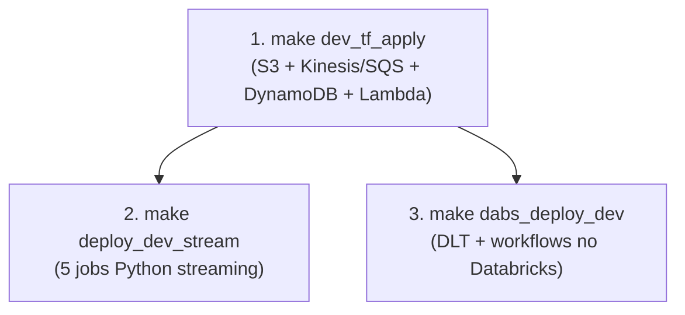
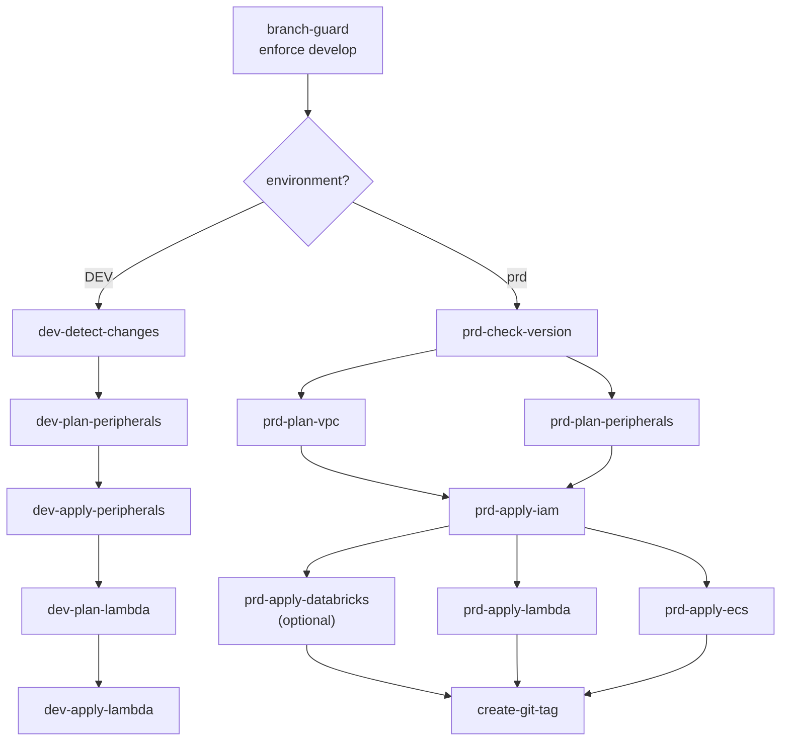
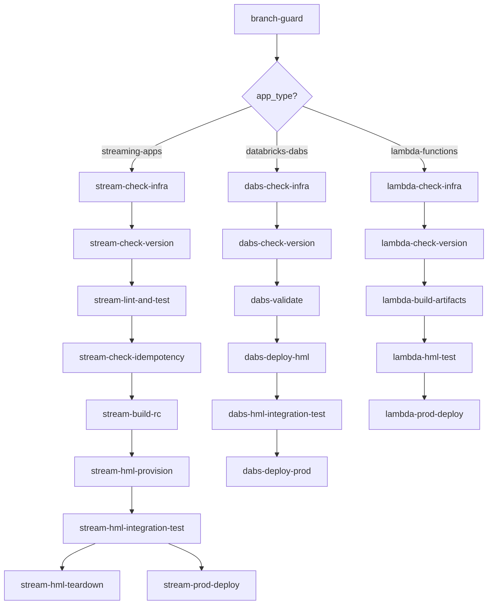
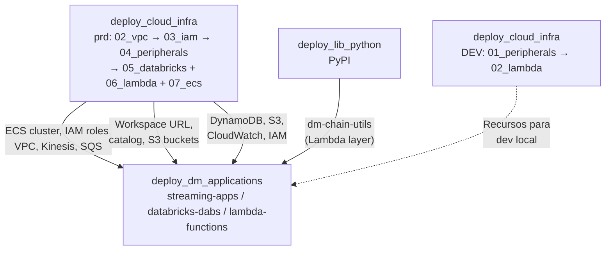
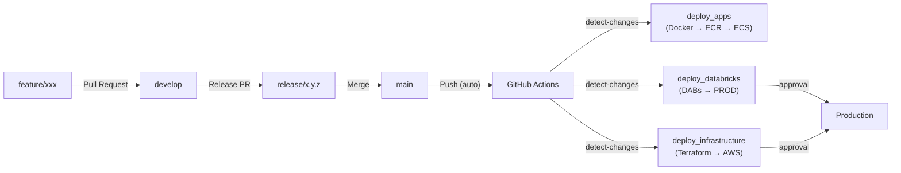

# 04 — DataOps

## Visão Geral

O DataOps do DD Chain Explorer engloba o ciclo completo de desenvolvimento, deploy e operação da plataforma:

1. **Desenvolvimento local** — Docker Compose + Makefile para orquestração.
2. **Infrastructure as Code** — Terraform para provisionamento de DEV e PROD na AWS.
3. **Deploy de aplicações** — Databricks Asset Bundles (DABs) + Docker + ECS.
4. **CI/CD** — GitHub Actions para automatizar builds, deploys e provisionamento.
5. **Observabilidade** — Scripts de monitoramento para ECS e Databricks.

---

## 1. Desenvolvimento Local (DEV)

### 1.1 Fluxo de Setup

O ambiente de desenvolvimento é inteiramente baseado em Docker Compose e controlado pelo Makefile:



### 1.2 Comandos do Makefile

#### Aplicações de Streaming

| Comando | Descrição |
|---------|-----------|
| `make deploy_dev_stream` | Sobe 5 jobs Python streaming (com `--build`) |
| `make stop_dev_stream` | Para aplicações de streaming |
| `make watch_dev_stream` | Monitora status |

#### Databricks (DABs)

| Comando | Descrição |
|---------|-----------|
| `make dabs_deploy_dev` | Deploy do bundle no Databricks Free Edition |
| `make dabs_deploy_prod` | Deploy do bundle no Databricks PROD |
| `make dabs_run_dev JOB=<nome>` | Executar um workflow em DEV |
| `make dabs_status_dev` | Ver status dos recursos deployados |

#### Docker Build/Push

| Comando | Descrição |
|---------|-----------|
| `make build_stream VERSION=x.y.z` | Build da imagem onchain-stream-txs (context: `dd_chain_explorer/`) |
| `make push_stream VERSION=x.y.z` | Push para Amazon ECR |
| `make build_and_push_stream VERSION=x.y.z` | Build + push |

### 1.3 Docker Compose — Composição de Serviços

| Arquivo | Serviços | Rede |
|---------|----------|------|
| `app_services.yml` | 5 python-job-* (streaming) — conectam a recursos AWS de DEV | `vpc_dm` |

---

## 2. Terraform — Infrastructure as Code

### 2.1 Organização dos Módulos

**DEV** — dois módulos independentes, estado S3 remoto (`dev/peripherals/terraform.tfstate` e `dev/lambda/terraform.tfstate`):

| Módulo | Arquivo tf | Recursos |
|--------|------------|----------|
| `services/dev/01_peripherals/` | `main.tf` | S3, DynamoDB, Kinesis (3 streams + Firehose), SQS + DLQs, CloudWatch Logs + Firehose |
| `services/dev/02_lambda/` | `main.tf` | Lambda `dm-chain-explorer-dev-gold-to-dynamodb` (S3 event → DynamoDB sync) |

> **HML**: todos os recursos são **100% efêmeros** — criados e destruídos dentro dos workflows de deploy de apps (`deploy_dm_applications.yml`). Não há infra persistente de HML gerenciada por Terraform.

**PROD** (`services/prd/`) — módulos numerados, estado S3 remoto. Ordem de deploy: `01→02→03→04→05→06+07` (06 e 07 em paralelo):

| Módulo | Recursos | Custo |
|--------|----------|-------|
| `01_tf_state/` | S3 backend + DynamoDB lock para state remoto | Gratuito |
| `02_vpc/` | VPC, subnets (pub/priv), IGW, security groups, VPC endpoints | Gratuito |
| `03_iam/` | Roles: ECS execution, ECS task, Databricks cross-account, Lambda | Gratuito |
| `04_peripherals/` | Kinesis (3 streams + Firehose) + SQS + DLQs + CloudWatch + S3 (raw/lakehouse/databricks) + DynamoDB | **Pago** |
| `05_databricks/` | Workspace MWS, Unity Catalog, metastore, external locations | **Pago** |
| `06_lambda/` | Lambda `contracts-ingestion` + `gold-to-dynamodb` + Layer + EventBridge Scheduler | Gratuito |
| `07_ecs/` | Cluster Fargate + task definitions + ECR repos | **Pago** |

> **S3 Versioning**: por padrão desabilitado em todos os buckets de dados (`versioning_enabled = false` no módulo `services/modules/s3/`). O bucket de TF state (`01_tf_state`) gerencia versionamento diretamente.

### 2.2 Comandos Terraform via Makefile

O Makefile organiza os módulos em **3 grupos** por perfil de custo:

**Grupo 1 — Recursos Gratuitos (VPC + IAM + S3):**
```bash
make tf_apply_free_resources    # apply sequencial: VPC → IAM → S3
make tf_destroy_free_resources  # destroy reverso: S3 → IAM → VPC
```

**Grupo 2 — Recursos AWS Pagos (Kinesis/SQS + DynamoDB + ECS + Lambda):**
```bash
make tf_apply_aws_resources     # 3_kinesis_sqs → 9_dynamodb → 6_ecs → 10_lambda
make tf_destroy_aws_resources   # reverso: 10_lambda → 6_ecs → 9_dynamodb → 3_kinesis_sqs
```

**Grupo 3 — Databricks:**
```bash
make tf_apply_databricks        # Workspace + Unity Catalog + cluster
make tf_destroy_databricks
```

**Deploy/Destroy Completo:**
```bash
make prod_deploy_infra    # Grupo 1 → 2 → 3
make prod_destroy_infra   # Grupo 3 → 2 → 1
```

---

## 3. CI/CD — GitHub Actions

A plataforma usa **4 workflows consolidados** (reduzidos de 8 anteriores):

| Workflow | Trigger | Propósito |
|----------|---------|----------|
| `deploy_cloud_infra.yml` | `workflow_dispatch` (develop) | Terraform DEV e PRD |
| `destroy_cloud_infra.yml` | `workflow_dispatch` (develop) | Destruição com confirmação |
| `deploy_dm_applications.yml` | `workflow_dispatch` (develop) | Streaming apps, DABs e Lambda |
| `deploy_lib_python.yml` | `workflow_dispatch` (develop) | Publicação da lib `dm-chain-utils` no PyPI |

### 3.1 Deploy Infra Cloud (`deploy_cloud_infra.yml`)

**Inputs**: `environment` (DEV/prd), `force_apply`, `skip_databricks`.



**Detalhes:**
- DEV: detecção de mudanças por `git diff`; aplica `01_peripherals` → `02_lambda` sequencialmente
- PRD: verifica tag de versão; aplica VPC+peripherals em paralelo → IAM → Databricks+Lambda+ECS em paralelo → git tag `v{VERSION}`
- `force_apply=true` ignora detecção de mudanças (DEV) e verificação de versão (PRD)
- `skip_databricks=true` ignora `05_databricks` no PRD

### 3.2 Destroy Infra Cloud (`destroy_cloud_infra.yml`)

**Inputs**: `environment` (DEV/prd), `confirm` (deve digitar `DESTROY`).

**Detalhes:**
- Validação dupla: branch guard + confirmação textual
- DEV: esvazia buckets S3 → destroy `02_lambda` → destroy `01_peripherals`
- PRD: esvazia buckets S3 + ECR → destroy `06_lambda` + `07_ecs` → `05_databricks` → `04_peripherals` → `03_iam` → `02_vpc`
- `01_tf_state` **nunca é destruído** (preserva o state remoto)
- Usa `scripts/empty_s3_bucket.sh` para esvaziar buckets antes do destroy

### 3.3 Deploy DM Applications (`deploy_dm_applications.yml`)

**Input**: `app_type` (streaming-apps / databricks-dabs / lambda-functions).



**Detalhes comuns:**
- Branch guard enforce develop em todos
- Todos criam git tag no deploy PRD: `v{VERSION}` / `v{VERSION}-dabs` / `v{VERSION}-lambda`
- HML 100% efêmero (todos os recursos criados/destruídos no pipeline)
- Infra PRD verificada como pré-requisito antes de deployar

### 3.4 Deploy Lib Python (`deploy_lib_python.yml`)

**Trigger**: `workflow_dispatch` na branch `develop`.

**Fluxo**: branch-guard → check-version (valida VERSION == pyproject.toml) → test → build wheel → verify PyPI version → publish PyPI (OIDC) → create release branch → GitHub Release + git tag `v{VERSION}-lib`

**Detalhes:**
- Python 3.12, instala extras `[dev]` do `pyproject.toml`
- Versão validada contra PyPI (nova versão deve ser maior)
- Publicação via OIDC trusted publisher no PyPI (sem token hardcoded)

### 3.5 Secrets Necessários no GitHub

| Secret | Usado por | Descrição |
|--------|-----------|----------|
| `AWS_ACCESS_KEY_ID` | Todos os workflows | Credencial AWS |
| `AWS_SECRET_ACCESS_KEY` | Todos os workflows | Credencial AWS |
| `DATABRICKS_PROD_HOST` | deploy_dm_applications, deploy_cloud_infra | URL do workspace PROD |
| `DATABRICKS_HML_HOST` | deploy_dm_applications | URL do workspace HML (Free Edition) |
| `DATABRICKS_HML_TOKEN` | deploy_dm_applications | PAT do Databricks HML |
| `DATABRICKS_ACCOUNT_ID` | deploy_cloud_infra, destroy_cloud_infra | Account ID Databricks |
| `DATABRICKS_CLIENT_ID` | deploy_cloud_infra, destroy_cloud_infra | Service Principal client ID |
| `DATABRICKS_CLIENT_SECRET` | deploy_cloud_infra, destroy_cloud_infra | Service Principal secret |
| `HML_VPC_ID` | deploy_dm_applications (streaming) | VPC ID do ambiente HML |
| `HML_SUBNET_ID` | deploy_dm_applications (streaming) | Subnet pública do HML |
| `ECS_TASK_EXECUTION_ROLE_ARN` | deploy_dm_applications (streaming) | IAM role para execução de ECS tasks HML |
| `ECS_TASK_ROLE_ARN` | deploy_dm_applications (streaming) | IAM role para ECS tasks HML |

> Execute `scripts/setup_github_secrets.sh` para configurar todos os secrets via `gh` CLI.
> **GitHub Environments**: `dev`, `production` (PRD requer aprovação manual).

### 3.6 Dependências entre Workflows



| Workflow | Pré-requisito Infra PRD | Dados obtidos via |
|----------|-------------------------|-------------------|
| `deploy_dm_applications` (streaming) | `02_vpc`, `03_iam`, `04_peripherals`, `07_ecs` | TF remote state + GitHub Secrets (HML VPC/subnet) |
| `deploy_dm_applications` (dabs) | `05_databricks` | GitHub Secrets (OAuth creds, workspace URL) |
| `deploy_dm_applications` (lambda) | `03_iam`, `04_peripherals`, `06_lambda` | TF remote state (S3) |
| `deploy_cloud_infra` (DEV) | Nenhum (independente) | — |

**Fontes de dados cross-workflow:**

| Fonte | Quando usar | Exemplos |
|-------|-------------|----------|
| **Terraform remote state** (S3) | Outputs de infra gerenciada por TF | VPC ID, IAM ARNs, bucket names, DynamoDB table, ECS cluster |
| **SSM Parameter Store** | Secrets de aplicação não gerenciados por TF | Etherscan API keys |
| **GitHub Secrets** | Credenciais de autenticação | AWS keys, Databricks OAuth, PATs |

### 3.7 DevOps Best Practices

1. **Infra-as-prerequisite gates** — Todos os jobs de deploy de apps verificam existência da infra PRD antes de prosseguir (ECS cluster ativo, Databricks workspace acessível, IAM roles existentes).

2. **HML 100% efêmero** — Todos os recursos HML (ECS cluster, Kinesis, SQS, DynamoDB, Firehose, SG) são criados e destruídos dentro do próprio pipeline. Zero custo de recursos ociosos.

3. **TF remote state como service discovery** — Leitura direta do state S3 para obter ARNs, nomes e IDs de recursos. Sem hardcode de valores em workflows.

4. **Idempotency checks** — Streaming apps compara SHA do HEAD com tag no ECR; DABs e Lambda verificam tag de versão antes de deployar.

5. **Destroy com confirmação dupla** — `destroy_cloud_infra.yml` exige branch develop + digitação literal de `DESTROY` para prevenir destruição acidental.

6. **Esvaziamento S3 antes do destroy** — `scripts/empty_s3_bucket.sh` remove todos os objetos, versões e delete markers antes do `terraform destroy`, evitando falhas por buckets não-vazios.

---

## 4. GitFlow

### 4.1 Modelo de Branches

O projeto utiliza um modelo GitFlow completo:

```
main
 └── release/x.y.z     ← RC branch; merged em main + develop após release
       └── develop      ← branch de integração; todos os PRs de feature/fix apontam aqui
             ├── feature/<descricao>
             ├── fix/<descricao>
             └── chore/<descricao>
```

| Branch | Propósito | Push direto |
|--------|-----------|-------------|
| `main` | Código pronto para produção | ❌ PRs only |
| `develop` | Integração de features concluídas | ❌ PRs only |
| `release/*` | Release candidates | ❌ PRs only |
| `feature/*` | Novas funcionalidades | ✅ autor |
| `fix/*` | Correção de bugs | ✅ autor |
| `chore/*` | Manutenção / deps | ✅ autor |
| `infra/*` | Mudanças de infraestrutura | ✅ autor |

**Convenção de commits:**
```
feat(stream): add broker pre-warm on producer init
fix(batch): handle empty Etherscan response
chore(deps): bump confluent-kafka to 2.5.0
infra(ecs): add ECR repositories to Terraform
ci(deploy): migrate DockerHub → ECR
```

### 4.2 Template de PR

O arquivo `.github/PULL_REQUEST_TEMPLATE.md` fornece um checklist obrigatório com:
- Tipo de mudança (feat/fix/chore/infra/ci/docs)
- Checklist de testes (pytest, compose validate, DEV, terraform plan)
- Verificação de breaking changes e referências a issues

### 4.3 Fluxo de Deploy



---

## 5. Observabilidade (PROD)

### 5.1 Scripts de Monitoramento

| Comando | Script | Descrição |
|---------|--------|-----------|
| `make prod_logs_ecs` | `scripts/prod_ecs_logs.py` | Últimas 100 linhas de logs de todas as tasks ECS |
| `make prod_logs_ecs_svc SVC=<nome>` | `scripts/prod_ecs_logs.py` | Logs de um serviço ECS específico |
| `python scripts/pause_databricks_clusters.py` | `scripts/pause_databricks_clusters.py` | Termina clusters interativos (economia de custo) |
| `bash scripts/prod_standby.sh` | `scripts/prod_standby.sh` | Escala ECS para 0 + pausa clusters Databricks |
| `bash scripts/prod_resume.sh` | `scripts/prod_resume.sh` | Restaura ECS + clusters a partir do standby |
| `bash scripts/empty_s3_bucket.sh <bucket> [region]` | `scripts/empty_s3_bucket.sh` | Esvazia bucket S3 (objetos, versões e delete markers) — usado pelo `destroy_cloud_infra.yml` |

### 5.2 Monitoramento de Estado

- **DynamoDB**: Consultas diretas via console AWS ou queries programáticas (PK=`SEMAPHORE`, PK=`COUNTER`)
- **Databricks Workflows**: Dashboard nativo de execuções, logs e métricas de cada task
- **Lambda**: CloudWatch Logs para `contracts-ingestion`

---

## 6. Databricks Asset Bundles (DABs)

### 6.1 Estrutura

```
apps/dabs/
├── databricks.yml             ← Config principal (targets dev/hml/prod, variáveis)
├── resources/
│   ├── dlt/
│   │   ├── pipeline_ethereum.yml    ← Pipeline DLT principal (+ trigger cron 30min)
│   │   └── pipeline_app_logs.yml    ← Pipeline DLT de logs (+ trigger cron 35min)
│   └── workflows/
│       ├── workflow_ddl_setup.yml
│       ├── workflow_batch_contracts.yml  ← S3 batch/ → Bronze → Silver (unificado)
│       ├── workflow_maintenance.yml      ← Schedule 12h (4h e 16h)
│       └── workflow_dlt_full_refresh.yml ← Manual: full refresh ambos os pipelines
└── src/
    ├── streaming/             ← Notebooks DLT (4_pipeline_ethereum, 5_pipeline_app_logs)
    └── batch/                 ← Scripts batch (DDL, maintenance, batch_contracts)
```

### 6.2 Targets

| Target | Workspace | Catalog | DLT Mode |
|--------|-----------|---------|----------|
| `dev` | Databricks Free Edition | `dev` | `development=true`, serverless |
| `hml` | Databricks Free Edition | `hml` | `development=false`, serverless |
| `prod` | AWS Workspace | `dd_chain_explorer` | serverless, triggered por schedule |

---

## Referências de Arquivos

| Escopo | Arquivos |
|--------|----------|
| Makefile | `Makefile` |
| CI/CD Infra | `.github/workflows/deploy_cloud_infra.yml` |
| CI/CD Destroy | `.github/workflows/destroy_cloud_infra.yml` |
| CI/CD Aplicações | `.github/workflows/deploy_dm_applications.yml` |
| CI/CD Lib Python | `.github/workflows/deploy_lib_python.yml` |
| PR Template | `.github/PULL_REQUEST_TEMPLATE.md` |
| Docs CI/CD | `.github/README.md` |
| Scripts Monitoring | `scripts/prod_ecs_logs.py`, `scripts/prod_standby.sh`, `scripts/prod_resume.sh` |
| Scripts Destroy | `scripts/empty_s3_bucket.sh` |
| Scripts Setup | `scripts/setup_databricks_profiles.sh`, `scripts/setup_github_secrets.sh`, `scripts/setup_github_environments.sh` |
| Scripts Cost | `scripts/pause_databricks_clusters.py`, `scripts/resume_databricks_clusters.py` |
| Compose DEV | `services/dev/00_compose/app_services.yml` |
| Terraform DEV | `services/dev/01_peripherals/` (S3, Kinesis, SQS, DynamoDB, CloudWatch) + `services/dev/02_lambda/` (Lambda) |
| Terraform PRD | `services/prd/01_tf_state/` a `07_ecs/` |
| Shared Modules TF | `services/modules/s3/`, `services/modules/lambda/`, `services/modules/ecs/`, etc. |
| ECR Repositories | `services/prd/07_ecs/ecs.tf` |
| Shared Library | `utils/src/dm_chain_utils/` + `utils/pyproject.toml` |
| DABs Config | `apps/dabs/databricks.yml` |
| DABs Resources | `apps/dabs/resources/dlt/`, `apps/dabs/resources/workflows/` |
| Dockerfile stream | `apps/docker/onchain-stream-txs/Dockerfile` |
| Lambda | `apps/lambda/contracts_ingestion/handler.py`, `apps/lambda/gold_to_dynamodb/handler.py` |
| Scripts Ambiente | `scripts/environment/cleanup_s3.py`, `cleanup_dynamodb.py` |

