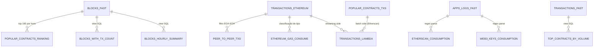
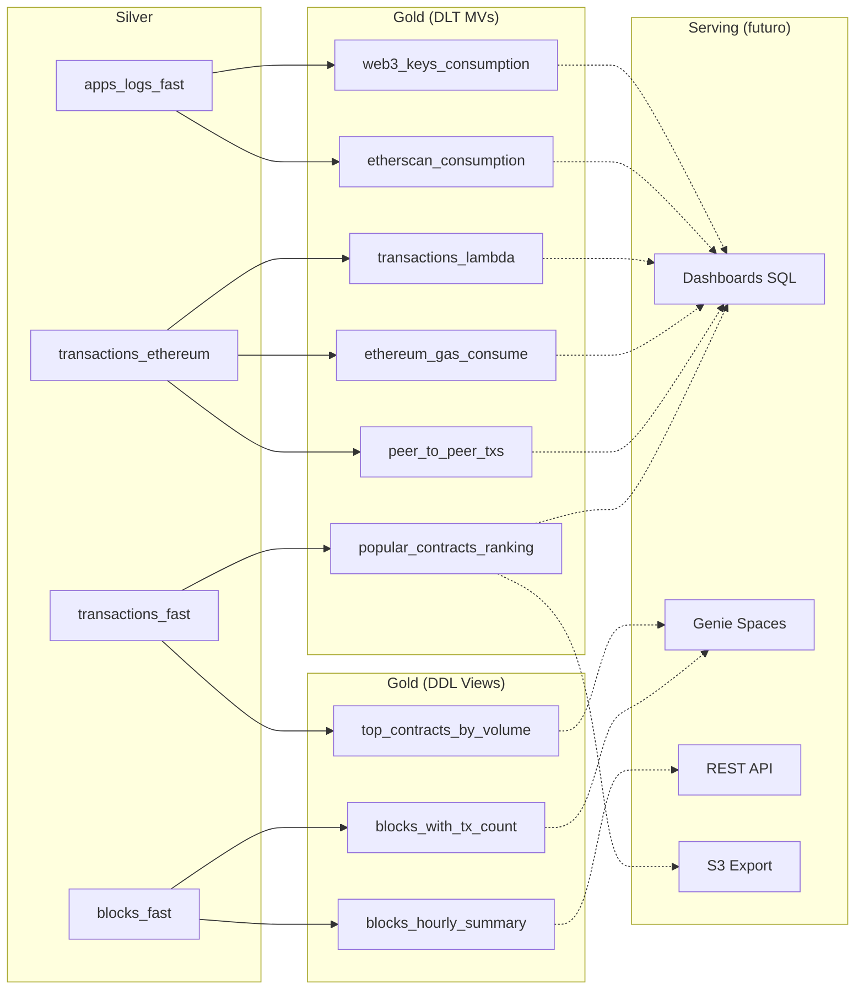

# 05 — Data Serving

## Visão Geral

A camada de **Data Serving** é responsável por disponibilizar os dados processados para consumo final — dashboards, APIs, relatórios e aplicações analíticas. Atualmente, o projeto possui **9 objetos Gold** (6 Materialized Views DLT + 3 SQL Views DDL) que representam o resultado final do processamento, mas **não há infraestrutura dedicada de serving** implementada.

Este documento detalha os objetos Gold disponíveis e propõe a arquitetura de serving futura.

---

## 1. Objetos Gold — Inventário

### 1.1 Materialized Views DLT (Pipeline `dm-ethereum`)

Localizadas no schema `s_apps`:

| Materialized View | Описание | Fonte | Atualização |
|-------------------|----------|-------|-------------|
| `popular_contracts_ranking` | Top 100 contratos por volume de transações (janela 1h) | `transactions_fast` | Contínua (DLT) |
| `peer_to_peer_txs` | Transferências diretas ETH (EOA→EOA), sem interação com contratos | `transactions_ethereum` | Contínua (DLT) |
| `ethereum_gas_consume` | Consumo de gas por transação com classificação de tipo | `transactions_ethereum` | Contínua (DLT) |
| `transactions_lambda` | Visão unificada streaming + batch (Lambda Architecture) com deduplicação | `transactions_ethereum` ∪ `popular_contracts_txs` | Contínua (DLT) |

#### Detalhamento das Colunas

**`popular_contracts_ranking`**:
- `contract_address` — Endereço do contrato
- `tx_count` — Total de transações recebidas
- `unique_senders` — Número de endereços únicos que interagiram
- `first_seen`, `last_seen` — Timestamps da primeira e última transação
- `computed_at` — Timestamp do cálculo do ranking

**`peer_to_peer_txs`**:
- `tx_hash`, `block_number`, `from_address`, `to_address`
- `value` — Valor em wei
- `gas`, `gas_price`, `base_fee_per_gas`
- `tx_timestamp` — Timestamp do bloco

**`ethereum_gas_consume`**:
- `block_number`, `tx_hash`, `from_address`, `to_address`, `value`
- `gas_price`, `gas_limit`, `block_gas_limit`, `block_gas_used`
- `gas_pct_of_block` — Percentual do gas do bloco consumido por esta transação
- `type_transaction` — `contract_deploy` | `peer_to_peer` | `contract_interaction`
- `base_fee_per_gas`, `tx_timestamp`

**`transactions_lambda`**:
- `tx_hash`, `block_number`, `from_address`, `contract_address`, `value`
- `gas`, `gas_price`, `input`, `method`, `parms`
- `decode_type` — Tipo de decodificação do input data
- `input_etherscan` — Input data enriquecido via Etherscan
- `event_time` — Timestamp do evento
- `source_layer` — `streaming` ou `batch` (prioridade batch na deduplicação)

### 1.2 Materialized Views DLT (Pipeline `dm-app-logs`)

Localizadas no schema `g_api_keys`:

| Materialized View | Descrição | Fonte | Atualização |
|-------------------|-----------|-------|-------------|
| `etherscan_consumption` | Consumo de API keys Etherscan com contadores por janela temporal | `apps_logs_fast` (regex parse) | Contínua (DLT) |
| `web3_keys_consumption` | Consumo de API keys Web3 (Infura/Alchemy) com contadores por janela | `apps_logs_fast` (regex parse) | Contínua (DLT) |

**Colunas comuns (ambas views)**:
- `api_key_name` — Nome da chave de API
- `vendor` — (apenas `web3_keys_consumption`) `alchemy` ou `infura`
- `calls_total`, `calls_ok_total`, `calls_error_total` — Contadores globais
- `calls_1h`, `calls_2h`, `calls_12h`, `calls_24h`, `calls_48h` — Contadores por janela temporal
- `last_call_at` — Timestamp da última chamada

### 1.3 SQL Views DDL (Schema `gold`)

Criadas pelo script `4_create_gold_views.py` no workflow `ddl_setup`:

| View | Descrição | Fonte |
|------|-----------|-------|
| `blocks_with_tx_count` | Dados de cabeçalho de blocos com contagem de transações | `s_apps.blocks_fast` |
| `top_contracts_by_volume` | Ranking de contratos por volume de transações (bucketed por hora) | `s_apps.transactions_fast` |
| `blocks_hourly_summary` | Agregação horária: contagem de blocos, média de txs/bloco, média de gas used, média de base fee | `s_apps.blocks_fast` |

---

## 2. Modelo de Dados Gold

### Fluxo de Dados para Serving

---

## 3. Casos de Uso Analítico

A camada Gold suporta os seguintes domínios de análise:

### 3.1 Análise de Transações Ethereum

| Caso de Uso | Objetos Gold | Perguntas Respondidas |
|-------------|--------------|------------------------|
| Contratos populares | `popular_contracts_ranking`, `top_contracts_by_volume` | Quais contratos têm mais interações? Quantos endereços únicos interagem? |
| Transferências P2P | `peer_to_peer_txs` | Qual o volume de ETH transferido entre EOAs? Distribuição de valores? |
| Consumo de gas | `ethereum_gas_consume` | Quais transações consomem mais gas? Qual a distribuição por tipo? |
| Lambda (streaming+batch) | `transactions_lambda` | Visão completa de transações incluindo dados históricos do Etherscan |
| Resumo de blocos | `blocks_with_tx_count`, `blocks_hourly_summary` | Throughput da rede por hora, evolução de base fee |

### 3.2 Monitoramento Operacional

| Caso de Uso | Objetos Gold | Perguntas Respondidas |
|-------------|--------------|------------------------|
| Consumo Etherscan | `etherscan_consumption` | Quais API keys estão próximas do rate limit? |
| Consumo Web3 | `web3_keys_consumption` | Distribuição de carga entre Alchemy e Infura? Keys com erro? |

---

## 4. Arquitetura de Serving — Proposta

### 4.1 Databricks SQL Dashboards

O caminho mais natural para visualização dos dados Gold é via **Databricks SQL Dashboards**, pois:

- Os dados já residem no Unity Catalog
- MVs são atualizadas continuamente pelo DLT
- SQL Warehouses (serverless) fornecem compute on-demand
- Não requer infraestrutura adicional

**Dashboards propostos:**

| Dashboard | Objetos | Métricas Principais |
|-----------|---------|---------------------|
| **Network Overview** | `blocks_hourly_summary`, `blocks_with_tx_count` | TPS, gas price médio, blocos/hora |
| **Hot Contracts** | `popular_contracts_ranking`, `top_contracts_by_volume` | Top 100 contratos, trend de interações |
| **Gas Analytics** | `ethereum_gas_consume` | Distribuição de gas por tipo de transação |
| **P2P Transfers** | `peer_to_peer_txs` | Volume ETH transferido, distribuição de valores |
| **Lambda Analysis** | `transactions_lambda` | Transações enriquecidas com dados Etherscan |
| **API Health** | `etherscan_consumption`, `web3_keys_consumption` | Rate limit proximity, distribuição de carga |

### 4.2 Genie Spaces

O Genie Space **Ethereum Explorer** permite consultas em linguagem natural sobre os dados Ethereum mainnet diretamente no Databricks. Provisionado via Databricks Asset Bundles (`dabs/resources/genie/genie_ethereum.yml`), utiliza o mesmo SQL Warehouse dos dashboards.

**Tabelas disponíveis:**

| Tabela | Schema | Descrição |
|--------|--------|-----------|
| `transactions_fast` | `s_apps` | Transações em tempo real (streaming) |
| `blocks_fast` | `s_apps` | Blocos minerados em tempo real |
| `popular_contracts_ranking` | `s_apps` | Contratos mais populares por volume |
| `transactions_lambda` | `s_apps` | Visão Lambda: streaming + batch enriquecido |
| `network_metrics_hourly` | `g_network` | TPS médio, gas price, utilização de bloco |
| `etherscan_consumption` | `g_api_keys` | Consumo e taxa de erro das keys Etherscan |
| `web3_keys_consumption` | `g_api_keys` | Consumo e taxa de erro das keys Infura |

**Exemplos de perguntas suportadas:**
- "Quais contratos tiveram mais transações na última hora?"
- "Qual foi o TPS médio da rede Ethereum nas últimas 24 horas?"
- "Qual API key tem a maior taxa de erro atualmente?"
- "Quantas transações foram decodificadas com sucesso?"

**Arquivo de recurso:** `dabs/resources/genie/genie_ethereum.yml`

### 4.3 Export para S3

A configuração do pipeline já inclui `s3.export.path` para `exports/popular_contracts`. Isso pode ser expandido para exportar:

- CSVs/Parquet para consumo externo
- Feeds para dashboards externos (Grafana, Metabase)
- Dados para APIs REST

### 4.4 REST API (Futuro)

Para disponibilizar dados publicamente, considerações:

- **API Gateway + Lambda**: Lê do S3 exportado ou do Databricks via JDBC
- **FastAPI em ECS**: Container dedicado consultando Unity Catalog via Databricks SQL Connector
- **Databricks SQL Statement API**: Endpoint HTTP nativo para queries SQL

---

## 5. Segurança no Serving

### 5.1 Controle de Acesso Atual

- Unity Catalog gerencia permissões por catalog → schema → table
- Não há políticas de Row-Level Security ou Column Masking configuradas
- API keys de monitoramento (`g_api_keys`) são dados sensíveis

### 5.2 Recomendações

- Aplicar Row-Level Security nas views que expõem `api_key_name`
- Configurar Column Masking para `from_address` / `to_address` em exports públicos
- Utilizar Databricks SQL Warehouses com perfis de acesso segregados (admin vs viewer)

---

## Referências de Arquivos

| Escopo | Arquivos |
|--------|----------|
| Pipeline dm-ethereum (Gold MVs) | `dabs/src/streaming/4_pipeline_ethereum.py` |
| Pipeline dm-app-logs (Gold MVs) | `dabs/src/streaming/5_pipeline_app_logs.py` |
| DDL Gold Views | `dabs/src/batch/ddl/4_create_gold_views.py` |
| Popular contracts (batch) | `dabs/src/batch/periodic/1_get_popular_contracts.py` |
| Ingest contracts txs | `dabs/src/batch/periodic/2_ingest_contracts_txs.py` |
| Lambda batch data | `dabs/src/batch/batch_contracts/1_s3_to_bronze_contracts_txs.py`, `2_bronze_to_silver_contracts_txs.py` |
| DABs config | `dabs/databricks.yml` |
| DLT pipeline config | `dabs/resources/dlt/pipeline_ethereum.yml`, `pipeline_app_logs.yml` |
