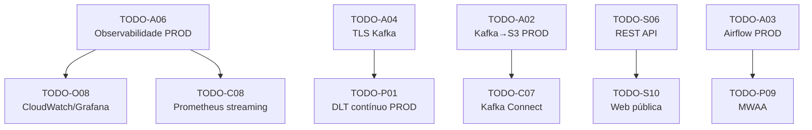

# 06 — Roadmap

## Visão Geral

Este documento consolida as melhorias pendentes do projeto, organizadas por prioridade e fase de execução. Cada item referencia o TODO original para rastreabilidade.

> Os itens concluídos foram removidos do roadmap. Consulte o histórico de commits e os documentos 01–05 para o registro completo de implementações.

**TODOs em aberto: 15** (6 Arquitetura + 3 Captura + 2 Processamento + 2 DataOps + 2 Serving)

---

## Fase 1 — Resiliência e Observabilidade

Melhorias que aumentam a confiabilidade e visibilidade do sistema.

| Prioridade | TODO | Área | Descrição | Esforço |
|------------|------|------|-----------|---------|
| 🟡 P1 | TODO-A06 | Arquitetura | Implementar observabilidade PROD (CloudWatch/Prometheus+Grafana) | Alto |
| 🟡 P1 | TODO-O08 | DataOps | CloudWatch Dashboards ou Grafana para ECS + MSK + DynamoDB | Alto |
| 🟡 P1 | TODO-C08 | Captura | Métricas Prometheus nos jobs de streaming (throughput, latência, erros) | Médio |
| 🟡 P1 | TODO-O10 | DataOps | Notificações Slack/Teams para falhas CI/CD e alertas de infra | Médio |

---

## Fase 2 — Otimizações de Performance e Processamento

Melhorias na pipeline de processamento e qualidade de dados.

| Prioridade | TODO | Área | Descrição | Esforço |
|------------|------|------|-----------|---------|
| 🟠 P2 | TODO-P01 | Processamento | Validar DLT contínuo end-to-end com MSK + IAM auth em PROD (`dlt_continuous: true` já configurado no target `prod`) | Alto |

| 🟠 P2 | TODO-C10 | Captura | Batched RPC calls nos Jobs 3 e 4 | Médio |

---

## Fase 3 — Infraestrutura Avançada

Melhorias de segurança, rede e escalabilidade.

| Prioridade | TODO | Área | Descrição | Esforço |
|------------|------|------|-----------|---------|
| 🟠 P2 | TODO-A04 | Arquitetura | TLS para Kafka em PROD (avaliar SASL/TLS vs security groups) | Médio |

| 🟠 P2 | TODO-A07 | Arquitetura | Avaliar NAT Gateway na VPC (segurança vs custo) | Baixo |
| 🟠 P2 | TODO-A02 | Arquitetura | Resolver ponte Kafka→S3 em PROD (Kafka Connect ou DLT direto) | Médio |
| 🟠 P2 | TODO-C07 | Captura | Avaliar Kafka Connect S3 Sink Connector em PROD | Médio |

---

## Fase 4 — Evolução da Plataforma

Funcionalidades novas e expansão do escopo.

| Prioridade | TODO | Área | Descrição | Esforço |
|------------|------|------|-----------|---------|
| 🔵 P3 | TODO-A03 | Arquitetura | Airflow PROD (MWAA vs ECS Fargate vs Docker Swarm) | Alto |
| 🔵 P3 | TODO-P09 | Processamento | Avaliar migração para MWAA em PROD | Alto |
| 🔵 P3 | TODO-A10 | Arquitetura | Criar ambiente de staging/homologação | Alto |
| 🔵 P3 | TODO-S06 | Serving | REST API (FastAPI no ECS ou Databricks SQL Statement API) | Alto |

| 🔵 P3 | TODO-S10 | Serving | Página web pública com métricas Ethereum (depende de TODO-S06) | Alto |

---

## Resumo por Área

| Área | Total | Fase 1 | Fase 2 | Fase 3 | Fase 4 |
|------|-------|--------|--------|--------|--------|
| Arquitetura (A) | 6 | 1 | — | 3 | 2 |
| Captura (C) | 3 | 1 | 1 | 1 | — |
| Processamento (P) | 2 | — | 1 | — | 1 |
| DataOps (O) | 2 | 2 | — | — | — |
| Serving (S) | 2 | — | — | — | 2 |
| **Total** | **15** | **4** | **2** | **4** | **5** |

---

## Critérios de Priorização

| Prioridade | Critério |
|------------|----------|
| 🔴 P0 | **Blocker** — Bug, path quebrado, ou configuração incorreta que impede operação normal |
| 🟡 P1 | **Alta** — Melhoria de resiliência, observabilidade ou segurança que reduz risco operacional |
| 🟠 P2 | **Média** — Otimização de performance, maturidade de CI/CD ou novas funcionalidades planejadas |
| 🔵 P3 | **Baixa** — Evolução futura, funcionalidades novas de alto esforço ou decisões arquiteturais complexas |

---

## Dependências entre TODOs

---

## Referências de Arquivos

| Documento | Arquivo | TODOs |
|-----------|---------|-------|
| 01 — Arquitetura | `docs/01_architecture.md` | TODO-A02, A03, A04, A06, A07, A10 |
| 02 — Captura de Dados | `docs/02_data_capture.md` | TODO-C07, C08, C10 |
| 03 — Processamento de Dados | `docs/03_data_processing.md` | TODO-P01, P09 |
| 04 — DataOps | `docs/04_data_ops.md` | TODO-O08, O10 |
| 05 — Data Serving | `docs/05_data_serving.md` | TODO-S06, S10 |

