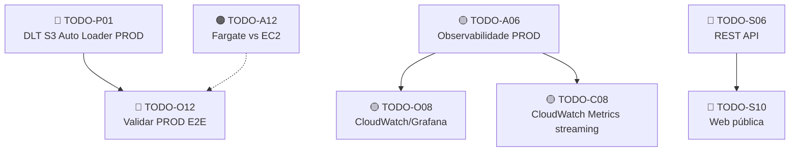

# 06 — Roadmap

## Visão Geral

Este documento consolida as melhorias pendentes do projeto, organizadas por prioridade e fase de execução. Cada item referencia o TODO original para rastreabilidade.

> Os itens concluídos foram removidos do roadmap. Consulte o histórico de commits e os documentos 01–05 para o registro completo de implementações.
> TODOs consolidados (A02→A11, C07→A11) permanecem marcados com `[x]` nos documentos de origem.

**TODOs em aberto: 11** (3 Arquitetura + 2 Captura + 1 Processamento + 3 DataOps + 2 Serving)

---

## Fase CI/CD — Deploy Pipelines & Ambiente HML

> **Iniciada em:** 2026-03. Esta fase cobre a implementação de todos os fluxos de deploy com ambiente de homologação efêmero (HML) na AWS e modo standby de produção.

### Decisões de Design

| Tópico | Decisão |
|---|---|
| Branch de integração | `develop` (padronizado) |
| Deploy prod | Mesmo workflow, 2ª stage com **GitHub Environment `production`** (approval gate) |
| Mensageria | Kinesis/SQS/CloudWatch/Firehose (MSK e Schema Registry eliminados) |
| HML infra | **100% efêmero** — todos os recursos (Kinesis, SQS, CloudWatch, DynamoDB, ECS cluster, SG, S3, IAM) criados/destruídos dentro de `deploy_dm_applications.yml`. Sem infra persistente de HML. |
| HML Databricks | Databricks Free Edition (mesmo workspace do DEV), catálogo `hml` |

### Gitflow Revisado

```
master  (push direto proibido)
  └── release/*  ← criada automaticamente pela esteira após HML pass
        └── develop  ← PRs somente aqui; push direto proibido
              ├── feature/*
              └── hotfix/*
```

### Critérios de Conclusão (Validation)

| ID | Critério de Done | Status |
|---|---|---|
| VAL-01 | `Deploy Streaming Apps` executado end-to-end: HML passa 10 min, prod atualizado, ECS estável | 🔲 |
| VAL-02 | ~~`Deploy Batch Apps`~~ — **N/A**: batch apps substituídas por Lambda `contracts-ingestion` (EventBridge). Sem Docker. | ❌ N/A |
| VAL-03 | `Deploy DABs` executado end-to-end (HML Free Edition + deploy prod Databricks) | 🔲 |
| VAL-04 | `Deploy Lib Python` publicação PyPI validada | 🔲 |
| VAL-05 | `Deploy Cloud Infra` DEV e PRD validados end-to-end (plan + apply + destroy) | 🔲 |
| VAL-06 | `make prod_standby` → custo ~$0/h; `make prod_resume` → ambiente funcional | 🔲 |

### Novos Secrets Necessários para HML

| Secret | Usado por | Status |
|---|---|---|
| `HML_VPC_ID` | deploy_dm_applications (streaming) | Adicionado em `setup_github_secrets.sh` |
| `HML_SUBNET_ID` | deploy_dm_applications (streaming) | Adicionado em `setup_github_secrets.sh` |
| `ECS_TASK_EXECUTION_ROLE_ARN` | deploy_dm_applications (streaming) | Adicionado em `setup_github_secrets.sh` |
| `ECS_TASK_ROLE_ARN` | deploy_dm_applications (streaming) | Adicionado em `setup_github_secrets.sh` |
| `DATABRICKS_HML_HOST` | deploy_dm_applications (dabs) | Adicionado em `setup_github_secrets.sh` |
| `DATABRICKS_HML_TOKEN` | deploy_dm_applications (dabs) | Adicionado em `setup_github_secrets.sh` |
| `HML_ETHERSCAN_SSM_PATH` | deploy_dm_applications (streaming, HML test) | Adicionado em `setup_github_secrets.sh` |

---

## Fase 0 — Blockers (P0)

Itens que impedem a operação em produção. Devem ser resolvidos antes de qualquer outro trabalho.

| Prioridade | TODO | Área | Descrição | Esforço |
|------------|------|------|-----------|--------|
| 🔴 P0 | TODO-O12 | DataOps | Validar PROD end-to-end: streaming ECS → Kinesis/SQS → Firehose → S3 → DLT Databricks → Gold tables | Alto |
| 🔴 P0 | TODO-P01 | Processamento | Validar DLT com S3 Auto Loader em PROD (pré-requisito para TODO-O12) | Alto |

---

## Fase 1 — Resiliência, Observabilidade e Ingestão

Melhorias que aumentam a confiabilidade, visibilidade e paridade DEV/PROD.

| Prioridade | TODO | Área | Descrição | Esforço |
|------------|------|------|-----------|--------|
| 🟡 P1 | TODO-A06 | Arquitetura | Implementar observabilidade PROD (CloudWatch/Prometheus+Grafana) | Alto |
| 🟡 P1 | TODO-O08 | DataOps | CloudWatch Dashboards ou Grafana para ECS + Kinesis + DynamoDB | Alto |
| 🟡 P1 | TODO-C08 | Captura | Métricas Prometheus nos jobs de streaming (throughput, latência, erros) | Médio |
| 🟡 P1 | TODO-O10 | DataOps | Notificações Slack/Teams para falhas CI/CD e alertas de infra | Médio |

---

## Fase 2 — Otimizações e Eficiência

Performance, custo e maturidade operacional.

| Prioridade | TODO | Área | Descrição | Esforço |
|------------|------|------|-----------|--------|
| 🟠 P2 | TODO-A12 | Arquitetura | Estudo de custo ECS Fargate vs EC2: duplicar services, rodar 24h, comparar consumo | Médio |
| 🟠 P2 | TODO-C10 | Captura | Batched RPC calls nos Jobs 3 e 4 (JSON-RPC batch) | Médio |
| 🟠 P2 | TODO-A07 | Arquitetura | Avaliar NAT Gateway na VPC (segurança vs custo) | Baixo |

---

## Fase 3 — Evolução da Plataforma

Funcionalidades novas e expansão do escopo.

| Prioridade | TODO | Área | Descrição | Esforço |
|------------|------|------|-----------|--------|
| 🔵 P3 | TODO-S06 | Serving | REST API (FastAPI no ECS ou Databricks SQL Statement API) | Alto |
| 🔵 P3 | TODO-S10 | Serving | Página web pública com métricas Ethereum (depende de TODO-S06) | Alto |

---

## Resumo por Área

| Área | Total | Fase 0 | Fase 1 | Fase 2 | Fase 3 |
|------|-------|--------|--------|--------|--------|
| Arquitetura (A) | 3 | — | 1 | 2 | — |
| Captura (C) | 2 | — | 1 | 1 | — |
| Processamento (P) | 1 | 1 | — | — | — |
| DataOps (O) | 3 | 1 | 2 | — | — |
| Serving (S) | 2 | — | — | — | 2 |
| **Total** | **11** | **2** | **4** | **3** | **2** |

---

## Critérios de Priorização

| Prioridade | Critério |
|------------|----------|
| 🔴 P0 | **Blocker** — Impede operação em produção. CI/CD não validado, ambiente PROD não funcional |
| 🟡 P1 | **Alta** — Resiliência, observabilidade, paridade DEV/PROD, segurança |
| 🟠 P2 | **Média** — Otimização de performance, custo, maturidade operacional |
| 🔵 P3 | **Baixa** — Evolução futura, funcionalidades novas de alto esforço |

---

## Dependências entre TODOs



---

## Referências de Arquivos

| Documento | Arquivo | TODOs |
|-----------|---------|-------|
| 01 — Arquitetura | `docs/01_architecture.md` | A03, ~~A04~~, A06, A07, A10, ~~A11~~, **A12** |
| 02 — Captura de Dados | `docs/02_data_capture.md` | C08, C10 |
| 03 — Processamento de Dados | `docs/03_data_processing.md` | TODO-P01, P09 |
| 04 — DataOps | `docs/04_data_ops.md` | TODO-O08, O10, O12, O13 |
| 05 — Data Serving | `docs/05_data_serving.md` | TODO-S06, S10 |

