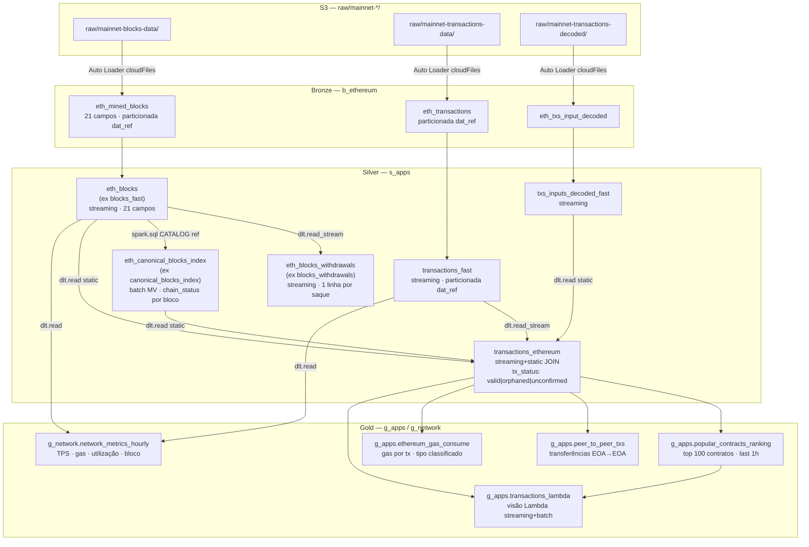

# Análise de Dados — `b_ethereum.eth_mined_blocks`

> Relatório técnico: classificação semântica dos campos Bronze, propostas de expansão
> da camada Gold e documentação das otimizações da camada Silver.
> Pipeline: `dlt_ethereum` · Catálogo Unity Catalog (`dev`/`dd_chain_explorer`)

---

## Sumário

1. [Classificação Semântica dos Campos Bronze](#1-classificação-semântica-dos-campos-bronze)
2. [Diagrama do Pipeline Bronze → Silver → Gold](#2-diagrama-do-pipeline-bronze--silver--gold)
3. [Propostas para a Camada Gold](#3-propostas-para-a-camada-gold)
4. [Tarefa 1 — Renomeação `blocks_fast` → `eth_blocks`](#4-tarefa-1--renomeação-blocks_fast--eth_blocks)
5. [Tarefa 2 — Renomeação `blocks_withdrawals` → `eth_blocks_withdrawals`](#5-tarefa-2--renomeação-blocks_withdrawals--eth_blocks_withdrawals)
6. [Tarefa 3 — Renomeação `canonical_blocks_index` → `eth_canonical_blocks_index`](#6-tarefa-3--renomeação-canonical_blocks_index--eth_canonical_blocks_index)
7. [Referências de Arquivos](#7-referências-de-arquivos)

---

## 1. Classificação Semântica dos Campos Bronze

A tabela Bronze `b_ethereum.eth_mined_blocks` contém **21 campos** entregues pelo Firehose
via Kinesis Stream `mainnet-blocks-data` → S3 NDJSON → Auto Loader. Os campos estão
organizados em seis categorias semânticas abaixo.

### 1.1 Identidade & Estrutura da Cadeia

Campos que identificam o bloco e estabelecem sua posição na blockchain.

| Campo Bronze | Tipo | Alias Silver | Descrição |
|---|---|---|---|
| `number` | long | `block_number` | Altura do bloco (índice sequencial monotônico). Identifica a posição na cadeia canônica. |
| `hash` | string | `block_hash` | Hash keccak256 dos campos do cabeçalho do bloco. Identificador único e imutável. |
| `parentHash` | string | `parent_hash` | Hash do bloco predecessor imediato. Utilizado pelo `eth_canonical_blocks_index` para detectar forks via comparação de `block_hash` de filhos com `parent_hash`. |
| `transactionsRoot` | string | `transactions_root` | Raiz da Merkle Patricia Trie de todas as transações do bloco. Garante integridade criptográfica — **não tem valor analítico direto**; serve para verificação de prova de inclusão (provas SPV). |
| `stateRoot` | string | `state_root` | Raiz da Merkle Patricia Trie do estado global da EVM após execução do bloco (saldos, nonces, bytecodes, storage). **Não tem valor analítico direto** — é uma impressão digital do estado completo da rede. |

> **stateRoot e transactionsRoot** são hashes criptográficos opacos. Embora garantam a
> integridade da cadeia, não aportam informação analítica por si só. São candidatos à
> remoção em versões futuras da Silver (ver [Tarefa 1](#4-tarefa-1--renomeação-blocks_fast--eth_blocks)).

### 1.2 Timing & Produtor do Bloco

Campos temporais e de autoria do bloco.

| Campo Bronze | Tipo | Alias Silver | Descrição |
|---|---|---|---|
| `timestamp` | long | `block_timestamp` | Tempo Unix em segundos (epoch). Usado em JOINs e janelas temporais via `FROM_UNIXTIME`. |
| `timestamp` (derivado) | timestamp | `block_time` | Conversão de `block_timestamp` para `TimestampType` via `to_timestamp()`. Essencial para `date_trunc()` e window functions. |
| `miner` | string | `miner` | Endereço Ethereum do validador que produziu o bloco (em PoS, equivale ao *fee recipient* configurado no cliente). Utlizado para análise de concentração de stake (ver [G3](#g3-concentração-de-validadores--gnetworkvalidator_activity)). |
| `size` | long | `size` | Tamanho do bloco em bytes. Relaciona-se indiretamente com o `gas_used` (mais transações = bloco maior). |

> **Sobre o `miner` em PoS**: após The Merge (setembro 2022), o campo `miner` passou a
> representar o endereço de destino da taxa de prioridade (`maxPriorityFeePerGas`), não
> mais o endereço do minerador PoW. O nome persiste por compatibilidade de API.

### 1.3 Economia de Gas — Alto Valor Analítico ★

Os três campos mais relevantes para análise econômica da rede Ethereum pós-EIP-1559.
Sua relação determina o custo efetivo das transações e o ETH destruído por bloco.

| Campo Bronze | Tipo | Alias Silver | Descrição |
|---|---|---|---|
| `baseFeePerGas` | long | `base_fee_per_gas` | **Por protocolo**: preço mínimo por unidade de gas neste bloco, em Wei. Totalmente **queimado** (destruído) pelo protocolo — não vai para o validador. Aumenta ≤12,5% se o bloco anterior ultrapassou 50% de utilização; diminui se abaixo. Introduzido pelo EIP-1559. |
| `gasLimit` | long | `gas_limit` | Capacidade máxima do bloco em unidades de gas. Meta atual ≈30M units; hard cap ≈60M. Validadores podem ajustar ±1/1024 do valor corrente por bloco. |
| `gasUsed` | long | `gas_used` | Gas efetivamente consumido por todas as transações do bloco. `gas_used / gas_limit × 100` = **taxa de utilização** do bloco. ETH queimado = `base_fee_per_gas × gas_used / 1e18`. |

**Correlação entre os três campos:**

```
Bloco t-1: gas_used > 50% gas_limit
→ base_fee_per_gas[t] aumenta até +12,5%
→ usuários pagam mais caro por gas
→ ETH queimado no bloco t é maior
→ incentivo econômico para maior utilização e burn deflacionário
```

Exemplo numérico típico (bloco mainnet):
- `gas_limit` = 30.000.000
- `gas_used` = 15.000.000 (50% uso)
- `base_fee_per_gas` = 25.000.000.000 Wei = 25 Gwei
- ETH queimado = 25e9 × 15e6 / 1e18 = **0,375 ETH** por bloco
- A ~7.200 blocos/dia → ~2.700 ETH/dia queimados apenas por base fee

### 1.4 Conteúdo de Transações & Saques da Beacon Chain

| Campo Bronze | Tipo | Alias Silver | Descrição |
|---|---|---|---|
| `transactions` | array\<string\> | `transactions` (Silver) / `transaction_count` (derivado) | Lista de hashes das transações incluídas no bloco. Na Silver, o **array completo é mantido** para uso no `eth_canonical_blocks_index`; `transaction_count` = `size(transactions)` é o campo analítico. |
| `withdrawals` | array\<struct\> | `withdrawals` (Silver raw) → explodido em `eth_blocks_withdrawals` | Saques de validadores Beacon Chain (excedente acima de 32 ETH). Introduzido pelo EIP-4895 (Shanghai/Capella, abril 2023). Máximo de **16 saques por bloco**. Cada elemento tem: `{index, validatorIndex, address, amount}` (amount em Gwei). |

> **withdrawals — EIP-4895**: os saques da Beacon Chain não são transações EVM comuns —
> são operações do sistema fora do ciclo de gas normal, executadas diretamente pelo
> cliente de consenso. O campo `amount` está em **Gwei** (÷1e9 = ETH). A pipeline explode
> este array em `eth_blocks_withdrawals` para análise granular por validador.

### 1.5 Campos Legados de PoW — **Zeros Permanentes em PoS** ⚠️

Estes campos existiam no protocolo PoW (pre-Merge) e foram mantidos para compatibilidade
de API. Após The Merge (bloco 15.537.393, setembro 2022), **todos são zero ou constante**.

| Campo Bronze | Alias Silver | Valor pós-Merge | Origem |
|---|---|---|---|
| `difficulty` | `difficulty` | `0` (inteiro) | PoW: esforço computacional para consertar o hash do bloco. Em PoS = sempre 0. |
| `totalDifficulty` | `total_difficulty` | `58750003716598352816469` (constante) | PoW: dificuldade acumulada da cadeia inteira. Fixo desde The Merge. |
| `nonce` | `nonce` | `"0x0000000000000000"` (string) | PoW: solução do puzzle de mineração. Em PoS = sempre `0x0000000000000000`. |

> **Recomendação de otimização**: estes três campos consomem espaço de armazenamento
> sem afetar qualquer consulta analítica atual ou prevista. São candidatos prioritários
> à remoção da tabela Silver `eth_blocks` em futura revisão do pipeline.

### 1.6 Campos Operacionais & Metadados

| Campo Bronze | Alias Silver | Descrição |
|---|---|---|
| `logsBloom` | `logs_bloom` | Bloom filter de 2048 bits que indexa os endereços e topics de todos os event logs do bloco. Permite ao cliente EVM verificar em O(1) se um log específico pode existir no bloco antes de buscar o receipt. **Artefato operacional — não tem valor analítico direto.** Candidato à remoção da Silver. |
| `extraData` | `extra_data` | Até 32 bytes arbitrários inseridos pelo validador. Usado historicamente como identidade de minerador/pool; em PoS, usado por MEV builders e relays para incluir IDs (ex.: `0x526f636b65744d6578` = "RocketMEX" em hex→ASCII). Contém string hexadecimal. Valor analítico: decodificado para ASCII pode identificar client diversity. |
| `_ingested_at` | `_ingested_at` | Timestamp de ingestão pelo Auto Loader (adicionado pelo pipeline, não vem do Firehose). Usado para particionamento temporal em Bronze via `dat_ref`. |

> **extraData decodificado**: converter `extra_data` de hex para ASCII pode revelar o
> software do validador ou a identity tag do MEV relay. Exemplo de DML:
> `UNHEX(SUBSTRING(extra_data, 3))` (remove o `0x` e decodifica). Proposto como campo
> derivado `extra_data_decoded` em versões futuras da Silver.

---

## 2. Diagrama do Pipeline Bronze → Silver → Gold



---

## 3. Propostas para a Camada Gold

Com base na análise semântica dos campos de `eth_mined_blocks`, o pipeline atual já
cobre métricas aggregate de rede no `g_network.network_metrics_hourly`. As propostas
abaixo expandem o portfólio de insights exploráveis sem novo dado de origem.

### G1. Taxa de ETH Queimado — `g_network.eth_burn_hourly`

**Motivação**: o ETH burn é o indicador de deflação do protocolo. Monitorar sua tendência
horária revela a pressão de demanda da rede em tempo real, correlacionando com preço, DeFi
e eventos on-chain.

**Fonte de dados**: `s_apps.eth_blocks`
**Granularidade**: 1 hora

```sql
SELECT
    date_trunc('hour', block_time)         AS hour_bucket,
    COUNT(block_number)                    AS block_count,
    SUM(base_fee_per_gas * gas_used) / 1e18 AS eth_burned_total,
    AVG(base_fee_per_gas * gas_used) / 1e18 AS eth_burned_per_block_avg,
    MAX(base_fee_per_gas * gas_used) / 1e18 AS eth_burned_per_block_max,
    AVG(base_fee_per_gas) / 1e9            AS avg_base_fee_gwei
FROM s_apps.eth_blocks
GROUP BY 1
```

**Target table**: `g_network.eth_burn_hourly`
**Colunas**: `hour_bucket`, `block_count`, `eth_burned_total`, `eth_burned_per_block_avg`, `eth_burned_per_block_max`, `avg_base_fee_gwei`, `computed_at`

---

### G2. Concentração de Validadores — `g_network.validator_activity`

**Motivação**: o campo `miner` (fee recipient em PoS) identifica o validador que produziu
cada bloco. Alta concentração de um único endereço indica risco sistêmico de centralização.
O **Índice Herfindahl-Hirschman (HHI)** é a métrica padrão de concentração de mercado.

**Fórmula HHI**: $HHI = \sum_{i=1}^{N} s_i^2$ onde $s_i$ é a participação percentual do validador $i$.
HHI < 1500 = descentralizado; 1500–2500 = moderado; > 2500 = concentrado.

**Fonte de dados**: `s_apps.eth_blocks`
**Granularidade**: janela deslizante de 24h

```sql
WITH validator_shares AS (
    SELECT
        miner,
        COUNT(*) AS blocks_produced,
        COUNT(*) * 100.0 / SUM(COUNT(*)) OVER () AS pct_share
    FROM s_apps.eth_blocks
    WHERE block_time >= current_timestamp() - INTERVAL 24 HOURS
    GROUP BY miner
)
SELECT
    miner,
    blocks_produced,
    ROUND(pct_share, 4)                  AS pct_share,
    ROUND(pct_share * pct_share, 4)      AS hhi_component,
    SUM(pct_share * pct_share) OVER ()   AS hhi_total,
    current_timestamp()                  AS computed_at
FROM validator_shares
ORDER BY blocks_produced DESC
```

**Target table**: `g_network.validator_activity`

---

### G3. Saúde da Cadeia — `g_network.chain_health_metrics`

**Motivação**: a tabela `eth_canonical_blocks_index` classifica blocos como
`canonical | orphan | unconfirmed`. A **taxa de orphans por hora** é um indicador de
instabilidade da rede (latência de propagação, ataques de reorganização).

**Fonte de dados**: `s_apps.eth_canonical_blocks_index` + `s_apps.eth_blocks`

```sql
WITH block_status AS (
    SELECT
        b.block_time,
        date_trunc('hour', b.block_time) AS hour_bucket,
        c.chain_status
    FROM s_apps.eth_canonical_blocks_index c
    JOIN s_apps.eth_blocks b ON c.block_number = b.block_number
                             AND c.block_hash = b.block_hash
)
SELECT
    hour_bucket,
    COUNT(*)                                                   AS total_blocks,
    SUM(CASE WHEN chain_status = 'canonical'    THEN 1 END)    AS canonical_count,
    SUM(CASE WHEN chain_status = 'orphan'       THEN 1 END)    AS orphan_count,
    SUM(CASE WHEN chain_status = 'unconfirmed'  THEN 1 END)    AS unconfirmed_count,
    ROUND(SUM(CASE WHEN chain_status = 'orphan' THEN 1 END)
          * 100.0 / COUNT(*), 2)                               AS orphan_rate_pct
FROM block_status
GROUP BY 1
```

**Target table**: `g_network.chain_health_metrics`

---

### G4. Fluxo de Saques Beacon Chain — `g_network.withdrawal_metrics`

**Motivação**: os saques (EIP-4895) refletem pressão de venda em potencial.
Monitorar o ETH retirado por hora e por validador identifica concentração de stakes e
possíveis liquidações de stakers institucionais.

**Fonte de dados**: `s_apps.eth_blocks_withdrawals`

```sql
SELECT
    date_trunc('hour', block_timestamp)          AS hour_bucket,
    COUNT(*)                                     AS withdrawal_count,
    COUNT(DISTINCT validator_index)              AS unique_validators,
    SUM(amount_eth)                              AS total_eth_withdrawn,
    AVG(amount_eth)                              AS avg_eth_per_withdrawal,
    MAX(amount_eth)                              AS max_single_withdrawal_eth,
    COUNT(DISTINCT withdrawal_address)           AS unique_addresses,
    current_timestamp()                          AS computed_at
FROM s_apps.eth_blocks_withdrawals
GROUP BY 1
```

**Target table**: `g_network.withdrawal_metrics`

---

### G5. Saúde da Produção de Blocos — `g_network.block_production_health`

**Motivação**: no PoS Ethereum, cada slot tem **12 segundos** exatos. Quando
`block_timestamp[n] - block_timestamp[n-1] > 12s`, isso indica **slots perdidos** (o
validador escalado naquele slot falhou em propor um bloco). Taxa de slots perdidos é
indicador direto de saúde do conjunto de validadores.

**Fonte de dados**: `s_apps.eth_blocks`

```sql
WITH block_intervals AS (
    SELECT
        block_number,
        block_time,
        block_timestamp,
        LAG(block_timestamp) OVER (ORDER BY block_number) AS prev_timestamp,
        block_timestamp - LAG(block_timestamp) OVER (ORDER BY block_number) AS slot_gap_seconds
    FROM s_apps.eth_blocks
)
SELECT
    date_trunc('hour', block_time)       AS hour_bucket,
    COUNT(*)                             AS block_count,
    SUM(CASE WHEN slot_gap_seconds > 12 THEN FLOOR(slot_gap_seconds / 12) - 1 ELSE 0 END)
                                         AS missed_slots_estimated,
    AVG(slot_gap_seconds)                AS avg_slot_gap_sec,
    MAX(slot_gap_seconds)                AS max_slot_gap_sec,
    ROUND(
        SUM(CASE WHEN slot_gap_seconds > 12 THEN FLOOR(slot_gap_seconds / 12) - 1 ELSE 0 END)
        * 100.0 / (COUNT(*) + SUM(CASE WHEN slot_gap_seconds > 12 THEN FLOOR(slot_gap_seconds / 12) - 1 ELSE 0 END)),
    2)                                   AS missed_slot_rate_pct,
    current_timestamp()                  AS computed_at
FROM block_intervals
WHERE slot_gap_seconds IS NOT NULL
GROUP BY 1
```

**Target table**: `g_network.block_production_health`

---

### G6. Correlação Gas × Demanda — extensão de `g_network.network_metrics_hourly`

**Motivação**: a correlação entre `base_fee_per_gas` e `transaction_count` por hora
revela a elasticidade de preço da rede. Alta correlação positiva indica que usuários
continuam transacionando mesmo com fee alto (inelasticidade).

**Campos adicionais propostos para `g_network.network_metrics_hourly`**:

| Campo | Fórmula | Interpretação |
|---|---|---|
| `total_eth_burned` | `SUM(base_fee_per_gas * gas_used) / 1e18` | ETH destruído naquela hora |
| `avg_block_utilization_pct` | Já existe | Percentual de uso do gas limit |
| `p50_base_fee_gwei` | `PERCENTILE(base_fee_per_gas, 0.5) / 1e9` | Mediana do base fee (robusta a outliers) |
| `p95_base_fee_gwei` | `PERCENTILE(base_fee_per_gas, 0.95) / 1e9` | Fee no percentil 95 (pico de congestionamento) |

---

### Resumo das Propostas Gold

| ID | Tabela Target | Fonte Principal | Métrica Chave |
|---|---|---|---|
| G1 | `g_network.eth_burn_hourly` | `eth_blocks` | ETH queimado por hora |
| G2 | `g_network.validator_activity` | `eth_blocks` | HHI de concentração de validadores |
| G3 | `g_network.chain_health_metrics` | `eth_canonical_blocks_index` + `eth_blocks` | Taxa de orphan blocks por hora |
| G4 | `g_network.withdrawal_metrics` | `eth_blocks_withdrawals` | ETH sacado por hora |
| G5 | `g_network.block_production_health` | `eth_blocks` | Slots perdidos estimados/hora |
| G6 | `g_network.network_metrics_hourly` (extensão) | `eth_blocks` | ETH queimado + percentis de fee |

---

## 4. Tarefa 1 — Renomeação `blocks_fast` → `eth_blocks`

### Motivação

O nome `blocks_fast` foi criado em uma fase anterior do projeto (migração Kafka → Kinesis)
com o sufixo `_fast` para distinguir de uma tabela batch `blocks_full` que nunca foi
implementada. O sufixo não é mais informativo e viola o padrão de nomenclatura `eth_*`
adotado nas tabelas Bronze (`eth_mined_blocks`, `eth_transactions`).

### Status

**✅ Implementado** — renomeação aplicada em `dlt_ethereum/src/streaming/ethereum_pipeline.py`:

| Antes | Depois |
|---|---|
| `name="s_apps.blocks_fast"` | `name="s_apps.eth_blocks"` |
| `dlt.read("s_apps.blocks_fast")` × 3 | `dlt.read("s_apps.eth_blocks")` × 3 |
| `dlt.read_stream("s_apps.blocks_fast")` | `dlt.read_stream("s_apps.eth_blocks")` |
| `{CATALOG}.s_apps.blocks_fast` × 3 (SQL) | `{CATALOG}.s_apps.eth_blocks` × 3 |
| `def silver_blocks_fast()` | `def silver_eth_blocks()` |

Referências downstream atualizadas:
- `silver_eth_blocks_withdrawals()` — `dlt.read_stream("s_apps.eth_blocks")`
- `silver_eth_canonical_blocks_index()` — SQL `{CATALOG}.s_apps.eth_blocks` × 3
- `silver_transactions_ethereum()` — `dlt.read("s_apps.eth_blocks")`
- `gold_network_metrics_hourly()` — `dlt.read("s_apps.eth_blocks")`

### Schema atual — `s_apps.eth_blocks`

| Campo | Tipo | Origem JSON | Categoria | Manter? |
|---|---|---|---|---|
| `block_number` | long | `number` | Identidade | ✅ |
| `block_hash` | string | `hash` | Identidade | ✅ |
| `parent_hash` | string | `parentHash` | Identidade | ✅ |
| `block_time` | timestamp | `timestamp` (derivado) | Timing | ✅ |
| `block_timestamp` | long | `timestamp` | Timing | ✅ |
| `miner` | string | `miner` | Produtor | ✅ |
| `base_fee_per_gas` | long | `baseFeePerGas` | Gas Economics | ✅ ★ |
| `gas_limit` | long | `gasLimit` | Gas Economics | ✅ ★ |
| `gas_used` | long | `gasUsed` | Gas Economics | ✅ ★ |
| `transaction_count` | int | `size(transactions)` | Conteúdo | ✅ |
| `transactions` | array\<string\> | `transactions` | Conteúdo | ✅ (usado no `eth_canonical_blocks_index`) |
| `withdrawals` | array\<struct\> | `withdrawals` | Beacon Chain | ⚠️ (explodido em `eth_blocks_withdrawals`) |
| `size` | long | `size` | Metadata | ✅ |
| `extra_data` | string | `extraData` | Metadata | ✅ (hex, decodificação pendente) |
| `_ingested_at` | timestamp | (Auto Loader) | Metadata | ✅ |
| `difficulty` | long | `difficulty` | **PoW Legacy** | ❌ (sempre 0 em PoS) |
| `total_difficulty` | string | `totalDifficulty` | **PoW Legacy** | ❌ (constante em PoS) |
| `nonce` | string | `nonce` | **PoW Legacy** | ❌ (sempre `0x0000000000000000` em PoS) |
| `logs_bloom` | string | `logsBloom` | Operacional | ❌ (Bloom filter, não analítico) |
| `transactions_root` | string | `transactionsRoot` | Criptográfico | ❌ (Merkle hash, não analítico) |
| `state_root` | string | `stateRoot` | Criptográfico | ❌ (Merkle hash, não analítico) |

> **6 campos candidatos à remoção**: `difficulty`, `total_difficulty`, `nonce`,
> `logs_bloom`, `transactions_root`, `state_root`. Removê-los da Silver reduziria
> o schema de 21 para 15 campos, eliminando ruído e economizando armazenamento.
> **Observação**: a remoção requer full-refresh do pipeline; versão futura após validação.

### Campos Derivados Propostos para Versão Futura

```python
# gas_utilization_pct: percentual de uso do gas limit por bloco
F.round(F.col("gas_used").cast("double") / F.col("gas_limit") * 100, 2).alias("gas_utilization_pct"),

# eth_burned: ETH efetivamente destruído por bloco (via EIP-1559)
F.round((F.col("base_fee_per_gas").cast("double") * F.col("gas_used")) / 1e18, 8).alias("eth_burned"),

# extra_data_decoded: decodificação hex → string UTF-8 do extraData
# (identifica software do validador / MEV relay)
F.expr("decode(unhex(substring(extra_data, 3)), 'UTF-8')").alias("extra_data_decoded"),
```

---

## 5. Tarefa 2 — Renomeação `blocks_withdrawals` → `eth_blocks_withdrawals`

### Motivação

Padronização de prefixo `eth_` em todas as tabelas Silver relacionadas a dados
de bloco Ethereum, consistente com a renomeação de `blocks_fast` → `eth_blocks`.

### Status

**✅ Implementado** — renomeação aplicada em `ethereum_pipeline.py`:

| Antes | Depois |
|---|---|
| `name="s_apps.blocks_withdrawals"` | `name="s_apps.eth_blocks_withdrawals"` |
| `def silver_blocks_withdrawals()` | `def silver_eth_blocks_withdrawals()` |

### Documentação da Tabela

**`s_apps.eth_blocks_withdrawals`** — Silver Streaming

Explode do array `withdrawals` de `s_apps.eth_blocks`. Cada registro representa um
saque individual de um validador da Beacon Chain ao endereço de retirada configurado.

**Condição de filtro**: `withdrawals IS NOT NULL AND size(withdrawals) > 0`

**Schema**:

| Campo | Tipo | Origem | Descrição |
|---|---|---|---|
| `block_number` | long | `eth_blocks.block_number` | Número do bloco onde ocorreu o saque |
| `block_timestamp` | string | `FROM_UNIXTIME(eth_blocks.block_timestamp)` | Data/hora do bloco formatada |
| `miner` | string | `eth_blocks.miner` | Fee recipient do bloco (validador produtor) |
| `withdrawal_index` | long | `wd.index` | Índice global sequencial do saque na cadeia |
| `validator_index` | long | `wd.validatorIndex` | Índice do validador no registro de consenso |
| `withdrawal_address` | string | `wd.address` | Endereço Ethereum de destino dos fundos |
| `amount_gwei` | long | `wd.amount` | Valor em Gwei (÷ 1.000.000.000 = ETH) |
| `amount_eth` | double | `wd.amount / 1e9` | Valor em ETH (conveniência analítica) |
| `_ingested_at` | timestamp | Auto Loader | Timestamp de ingestão |

**Contexto — EIP-4895 (Shanghai/Capella, 12 de abril de 2023)**:

- Cada validador com saldo > 32 ETH tem o excedente automaticamente sacado
- O saque é processado pelo camada de consenso, não consome gas
- Máximo de **16 saques por bloco** (limitação de throughput de consenso)
- O `withdrawal_index` é global e monotônico — pode ser usado para detectar gaps

**Consultas típicas**:

```sql
-- ETH sacado por hora (últimas 24h)
SELECT date_trunc('hour', block_timestamp) AS hour_bucket,
       COUNT(*)                            AS withdrawal_count,
       SUM(amount_eth)                     AS eth_withdrawn
FROM dev.s_apps.eth_blocks_withdrawals
WHERE block_timestamp >= current_timestamp() - INTERVAL 24 HOURS
GROUP BY 1 ORDER BY 1;

-- Top 10 validadores por volume sacado
SELECT validator_index, withdrawal_address,
       COUNT(*) AS withdrawals, SUM(amount_eth) AS total_eth
FROM dev.s_apps.eth_blocks_withdrawals
GROUP BY 1, 2 ORDER BY total_eth DESC LIMIT 10;
```

---

## 6. Tarefa 3 — Renomeação `canonical_blocks_index` → `eth_canonical_blocks_index`

### Motivação

Mesmo motivo das outras renomeações: padronização do prefixo `eth_` para marcar
claramente a origem de dados (protocolo Ethereum). O nome genérico `canonical_blocks_index`
não indica a qual blockchain pertence — em um projeto multi-chain isso geraria ambiguidade.

### Status

**✅ Implementado** — renomeação aplicada em `ethereum_pipeline.py`:

| Antes | Depois |
|---|---|
| `name="s_apps.canonical_blocks_index"` | `name="s_apps.eth_canonical_blocks_index"` |
| `dlt.read("s_apps.canonical_blocks_index")` | `dlt.read("s_apps.eth_canonical_blocks_index")` |
| `def silver_canonical_blocks_index()` | `def silver_eth_canonical_blocks_index()` |

### Documentação da Tabela

**`s_apps.eth_canonical_blocks_index`** — Silver Batch (Materialized View)

Classifica cada bloco da Silver `eth_blocks` usando a **cadeia de `parent_hash`** como
prova forense de canonicidade. É recomputada integralmente a cada execução do pipeline.

**Algoritmo de Classificação**:

```
1. Coletar todos os parent_hash distintos de eth_blocks
   → esses hashes são os "blocos filho reconhecidos"

2. Para cada bloco em eth_blocks:
   a. Se block_number > (MAX(block_number) - 64):
      chain_status = 'unconfirmed'   ← janela Casper FFG
   b. Elif block_hash IN (parent_refs):
      chain_status = 'canonical'     ← block_hash é pai de algum filho
   c. Else:
      chain_status = 'orphan'        ← mesmo block_number, hash não referenciado
```

**Por que 64 blocos?** O protocolo de finalização Casper FFG do Ethereum PoS garante
finalidade econômica após ~2 épocas (~64 blocos ≈ 12,8 minutos). Blocos dentro deste
intervalo ainda podem ser reorganizados teoricamente, por isso são marcados como
`unconfirmed` até ultrapassarem essa janela.

**Schema**:

| Campo | Tipo | Descrição |
|---|---|---|
| `block_number` | long | Altura do bloco |
| `block_hash` | string | Hash único do bloco |
| `chain_status` | string | `'canonical'` \| `'orphan'` \| `'unconfirmed'` |

**Cardinalidade esperada**:
- `canonical`: ~99,9% dos blocos (forks são raros na mainnet PoS)
- `orphan`: < 0,1% (principalmente em períodos de alta latência de rede)
- `unconfirmed`: exatamente 64 registros sempre (janela deslizante dos últimos 64 blocos)

**Uso downstream**:

A tabela é lida como static snapshot (`dlt.read`) em `silver_transactions_ethereum`
para derivar `tx_status` de cada transação:

```python
tx_status = CASE
  WHEN chain_status = 'canonical'    THEN 'valid'
  WHEN chain_status = 'orphan'       THEN 'orphaned'
  ELSE /* NULL ou 'unconfirmed' */     'unconfirmed'
END
```

Todas as tabelas Gold filtram `tx_status = 'valid'` para excluir transações de
blocos orphan e não-finalizados.

**Limitação atual**: o `spark.sql()` que recomputa esta tabela usa JOIN
`CROSS JOIN max_block`, o que implica shuffle completo a cada execução. À medida
que `eth_blocks` crescer, o tempo de recomputação pode se tornar um gargalo.
Mitigação futura: filtrar apenas blocos dos últimos N dias + janela Casper.

---

## 7. Referências de Arquivos

| Escopo | Caminho |
|---|---|
| Pipeline DLT principal | `apps/dabs/dlt_ethereum/src/streaming/ethereum_pipeline.py` |
| Bundle config DLT Ethereum | `apps/dabs/dlt_ethereum/databricks.yml` |
| Silver `eth_blocks` (definição) | `ethereum_pipeline.py` · função `silver_eth_blocks()` |
| Silver `eth_blocks_withdrawals` | `ethereum_pipeline.py` · função `silver_eth_blocks_withdrawals()` |
| Silver `eth_canonical_blocks_index` | `ethereum_pipeline.py` · função `silver_eth_canonical_blocks_index()` |
| Silver `transactions_ethereum` | `ethereum_pipeline.py` · função `silver_transactions_ethereum()` |
| Gold `network_metrics_hourly` | `ethereum_pipeline.py` · função `gold_network_metrics_hourly()` |
| Documentação Ethereum Blocks | https://ethereum.org/developers/docs/blocks/ |
| Documentação EIP-1559 (Gas) | https://ethereum.org/developers/docs/gas/ |
| Documentação EIP-4895 (Withdrawals) | https://eips.ethereum.org/EIPS/eip-4895 |
