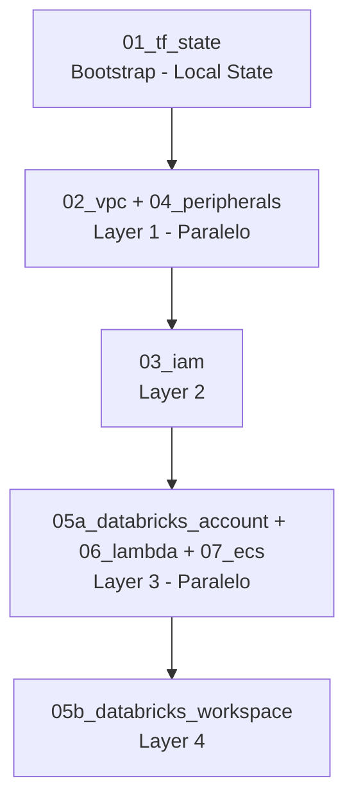

# Relatório — Gestão de Terraform State: dd_chain_explorer

> **Data:** Abril 2026  
> **Escopo:** `services/` (DEV, HML, PRD) + `.github/workflows/` + `scripts/ci/`  
> **Objetivo:** Avaliar a maturidade da gestão de estado Terraform, identificar riscos e propor roadmap de melhorias

---

## Índice

1. [AS-IS: Arquitetura de Estado](#1-as-is-arquitetura-de-estado)
2. [O que está bem implementado](#2-o-que-está-bem-implementado)
3. [Problemas Identificados](#3-problemas-identificados)
4. [Fundamentos: Terraform State Locking](#4-fundamentos-terraform-state-locking)
5. [Melhores Práticas HashiCorp — CI/CD com Terraform](#5-melhores-práticas-hashicorp--cicd-com-terraform)
6. [Roadmap de TODOs](#6-roadmap-de-todos)

---

## 1. AS-IS: Arquitetura de Estado

### 1.1 Backend Compartilhado

Todos os ambientes (DEV, HML, PRD) utilizam um único backend S3+DynamoDB:

| Recurso | Nome | Região |
|---------|------|--------|
| S3 Bucket | `dm-chain-explorer-terraform-state` | `sa-east-1` |
| DynamoDB Table | `dm-chain-explorer-terraform-lock` | `sa-east-1` |
| Hash Key DynamoDB | `LockID` | — |
| Billing Mode | `PAY_PER_REQUEST` | — |

Configuração de backend aplicada em todos os módulos remotos:

```hcl
terraform {
  backend "s3" {
    bucket         = "dm-chain-explorer-terraform-state"
    key            = "{env}/{module}/terraform.tfstate"
    region         = "sa-east-1"
    dynamodb_table = "dm-chain-explorer-terraform-lock"
    encrypt        = true
  }
}
```

### 1.2 Inventário de State Keys

| Ambiente | Módulo | State Key S3 | Tipo |
|----------|--------|--------------|------|
| BOOTSTRAP | `01_tf_state` | *(local — git)* | ⚠️ LOCAL |
| DEV | `01_peripherals` | `dev/peripherals/terraform.tfstate` | Remoto ✅ |
| DEV | `02_lambda` | `dev/lambda/terraform.tfstate` | Remoto ✅ |
| HML | `02_vpc` | `hml/vpc/terraform.tfstate` | Remoto ✅ |
| HML | `03_iam` | `hml/iam/terraform.tfstate` | Remoto ✅ |
| HML | `04_peripherals` | `hml/peripherals/terraform.tfstate` | Remoto ✅ |
| HML | `05_databricks` | `hml/databricks/terraform.tfstate` | Remoto ✅ |
| HML | `07_ecs` | `hml/ecs/terraform.tfstate` | Remoto ✅ |
| PRD | `02_vpc` | `prd/vpc/terraform.tfstate` | Remoto ✅ |
| PRD | `03_iam` | `prd/iam/terraform.tfstate` | Remoto ✅ |
| PRD | `04_peripherals` | `prd/peripherals/terraform.tfstate` | Remoto ✅ |
| PRD | `05a_databricks_account` | `prd/databricks-account/terraform.tfstate` | Remoto ✅ |
| PRD | `05b_databricks_workspace` | `prd/databricks-workspace/terraform.tfstate` | Remoto ✅ |
| PRD | `06_lambda` | `prd/lambda/terraform.tfstate` | Remoto ✅ |
| PRD | `07_ecs` | `prd/ecs/terraform.tfstate` | Remoto ✅ |

### 1.3 Ordem de Deploy (PRD)



### 1.4 Versões Terraform por Módulo

| Módulo | `required_version` | Provider AWS |
|--------|--------------------|--------------|
| `prd/01_tf_state` | `>= 1.3.0` | `>= 4.60.0` |
| `prd/02_vpc` | `>= 1.5` | `>= 5.0` |
| `prd/03_iam` | `>= 1.5` | `>= 5.0` |
| `prd/04_peripherals` | `>= 1.5` | `>= 5.0` |
| `prd/05a` + `05b` | `>= 1.5` | `>= 5.0` |
| `prd/06_lambda` | `>= 1.5` | `>= 5.0` |
| `prd/07_ecs` | `>= 1.5` | `>= 5.0` |
| CI/CD (`TF_VERSION`) | `1.7.0` (pin) | — |

---

## 2. O que está bem implementado

### Segurança e Durabilidade do Estado

- ✅ **S3 Versioning habilitado** — histórico completo de estados, rollback possível para qualquer versão anterior
- ✅ **SSE AES256 no bucket** — estado cifrado em repouso
- ✅ **`encrypt = true` no backend block** — estado cifrado em trânsito
- ✅ **Block all public access** no bucket S3 — estado não exposto publicamente
- ✅ **PAY_PER_REQUEST no DynamoDB** — sem gerenciamento de capacity para locking

### CI/CD

- ✅ **`terraform_wrapper: false`** em todos os jobs — evita parsing incorreto de output pelo wrapper HashiCorp
- ✅ **`tf_plan.sh` com `-detailed-exitcode`** — distingue "sem mudanças" (exit 0) de "com mudanças" (exit 2), pulando apply desnecessário
- ✅ **`GITHUB_STEP_SUMMARY`** populado em cada plan — visibilidade inline no GitHub Actions
- ✅ **`terraform validate` antes do plan** em todos os jobs — falha rápida em erros de sintaxe
- ✅ **`check_prd_version.sh`** — gate de versão baseado em tags git, previne re-deploy do mesmo artefato em PRD

### Proteções Operacionais

- ✅ **`branch_guard.sh`** — enforce da branch `develop` para todas as mudanças de infra
- ✅ **`CONFIRM="DESTROY"` safety gate** — destroy só executa com confirmação explícita
- ✅ **`tf_state_lock_check.sh`** chamado antes de todas as operações de destroy
- ✅ **`databricks_account_import.sh`** — import idempotente com OAuth M2M antes do plan (evita drift em recursos Databricks)
- ✅ **DAG de deploy com `needs:`** correto — módulos paralelos onde possível (VPC + Peripherals em Layer 1), dependências respeitadas
- ✅ **`terraform show -json $PLAN_FILE`** para diff legível no summary

---

## 3. Problemas Identificados

### Tabela Resumo

| ID | Severidade | Arquivo(s) | Categoria |
|----|-----------|-----------|-----------|
| IS-01 | 🔴 P0 | `services/prd/01_tf_state/terraform.tfstate` | Segurança / Git |
| IS-02 | 🔴 P0 | `services/prd/01_tf_state/bucket.tf` | Proteção de Dados |
| IS-03 | 🔴 P0 | `.github/workflows/deploy_cloud_infra.yml` | CI/CD Concorrência |
| IS-04 | 🟠 P1 | `services/prd/01_tf_state/main.tf` | Versionamento |
| IS-05 | 🟠 P1 | `scripts/ci/tf_state_lock_check.sh` | State Locking |
| IS-06 | 🟠 P1 | `.github/workflows/deploy_cloud_infra.yml` | CI/CD Lógica |
| IS-07 | 🟠 P1 | Todos os jobs Terraform | CI/CD Performance |
| IS-08 | 🟡 P2 | DynamoDB `dm-chain-explorer-terraform-lock` | State Locking |
| IS-09 | 🟡 P2 | Todos os jobs com apply | CI/CD Auditoria |
| IS-10 | 🟡 P2 | `.github/workflows/` | CI/CD Feedback |
| IS-11 | 🟢 P3 | `dm-chain-explorer-terraform-state` | Arquitetura |
| IS-12 | 🟢 P3 | `.github/workflows/` | Observabilidade |
| IS-13 | 🟢 P3 | `docs/` | Documentação |

---

### IS-01 🔴 P0 — `terraform.tfstate` commitado no repositório git

**Arquivo:** `services/prd/01_tf_state/terraform.tfstate`

**Descrição:**  
O módulo bootstrap `01_tf_state` usa estado **local** (sem backend remoto, pela natureza de bootstrapping). O arquivo `terraform.tfstate` (versão 4, serial 30, lineage `0486e46e-...`) e seu backup `terraform.tfstate.backup` estão commitados no repositório git.

O arquivo contém ARNs de produção reais:
- `arn:aws:s3:::dm-chain-explorer-terraform-state`
- ARN da tabela DynamoDB

**Risco:**  
- Exposição de ARNs de infraestrutura pública no histórico git
- `.gitignore` possui `**/terraform.tfstate`, mas arquivos já commitados antes da regra ser adicionada **não são ignorados retroativamente** — continuam no histórico
- Qualquer `git log --all` ou clone do repositório expõe o state

**Correção:**
```bash
# 1. Usar BFG Repo-Cleaner ou git filter-repo para remover do histórico
git filter-repo --invert-paths --path services/prd/01_tf_state/terraform.tfstate
git filter-repo --invert-paths --path services/prd/01_tf_state/terraform.tfstate.backup

# 2. Forçar push
git push --force --all origin

# 3. Mitigar no futuro: adicionar .gitignore local no módulo
echo "terraform.tfstate" >> services/prd/01_tf_state/.gitignore
echo "terraform.tfstate.backup" >> services/prd/01_tf_state/.gitignore
```

> **Nota:** ARNs de S3 e DynamoDB não são secrets, mas a exposição de state pode revelar detalhes de configuração. O risco principal é de precedente — outros dados sensíveis podem ser adicionados ao state no futuro.

---

### IS-02 🔴 P0 — `prevent_destroy = false` no bucket de estado

**Arquivo:** `services/prd/01_tf_state/bucket.tf`

**Descrição:**  
Tanto o S3 bucket quanto a tabela DynamoDB de locking têm `lifecycle { prevent_destroy = false }` (ou ausência do bloco, equivalente ao mesmo comportamento).

**Risco:**  
Um `terraform destroy` acidental no módulo `01_tf_state` **apagaria o bucket S3 com todos os 15 state files de todos os ambientes** e a tabela DynamoDB de locking. Recuperação seria possível apenas se o S3 versioning tiver sido preservado antes da deleção — mas a própria configuração do versioning estaria perdida.

**Correção:**
```hcl
# services/prd/01_tf_state/bucket.tf
resource "aws_s3_bucket" "terraform_state" {
  bucket = "dm-chain-explorer-terraform-state"

  lifecycle {
    prevent_destroy = true  # ← alterar de false para true
  }
}

resource "aws_dynamodb_table" "terraform_lock" {
  name = "dm-chain-explorer-terraform-lock"

  lifecycle {
    prevent_destroy = true  # ← mesma correção
  }
}
```

---

### IS-03 🔴 P0 — Sem proteção de concorrência nos workflows GitHub Actions

**Arquivo:** `.github/workflows/deploy_cloud_infra.yml`, `destroy_cloud_infra.yml`

**Descrição:**  
Nenhum workflow define `concurrency:` groups. Dois deploys simultâneos do mesmo ambiente podem ser disparados via `workflow_dispatch`:

1. Run A: `terraform plan` → adquire lock DynamoDB → `terraform apply` (em execução)
2. Run B: `terraform plan` → tenta adquirir lock → **falha com erro de lock**
3. Run A falha antes de liberar → lock fica órfão na tabela DynamoDB

**Risco:**  
- Locks órfãos bloqueiam deploys futuros (requer intervenção manual)
- Corridas de escrita entre runs simultâneos podem causar state corruption

**Correção:**
```yaml
# deploy_cloud_infra.yml — adicionar por job
jobs:
  prd-deploy-vpc:
    concurrency:
      group: tf-prd-vpc
      cancel-in-progress: false   # NÃO cancelar: Terraform apply em andamento não deve ser interrompido
    ...

  prd-deploy-peripherals:
    concurrency:
      group: tf-prd-peripherals
      cancel-in-progress: false
    ...
```

> `cancel-in-progress: false` é crítico para Terraform. Cancelar um apply em andamento pode deixar recursos parcialmente criados e o state inconsistente.

---

### IS-04 🟠 P1 — Drift de versões entre módulo bootstrap e demais módulos

**Arquivos:** `services/prd/01_tf_state/main.tf` vs todos os outros módulos

**Descrição:**  
O módulo `01_tf_state` usa constraints antigas:
- `required_version = ">= 1.3.0"` (demais: `>= 1.5`)
- Provider AWS `>= 4.60.0` (demais: `>= 5.0`)

O CI pina `TF_VERSION: 1.7.0`, mas o módulo `01_tf_state` não exige essa versão. Ao executar localmente com Terraform `1.3.x` ou `1.4.x`, o módulo seria aceito, podendo gerar outputs incompatíveis com os módulos que dependem de features do `1.5+`.

**Correção:**
```hcl
# services/prd/01_tf_state/main.tf
terraform {
  required_version = ">= 1.7.0"

  required_providers {
    aws = {
      source  = "hashicorp/aws"
      version = ">= 5.0"
    }
  }
}
```

---

### IS-05 🟠 P1 — `tf_state_lock_check.sh` deleta lock diretamente no DynamoDB

**Arquivo:** `scripts/ci/tf_state_lock_check.sh`

**Descrição:**  
O script usa `aws dynamodb delete-item` para remover o registro de lock da tabela, _bypassando_ o mecanismo nativo do Terraform:

```bash
# Atual (problemático)
aws dynamodb delete-item \
  --table-name "$LOCK_TABLE" \
  --key '{"LockID": {"S": "..."}}'
```

**Riscos:**
1. **Deleção de lock ativo:** Se um apply legítimo estiver em andamento, o script remove o lock sem saber — dois processos passam a escrever no state simultaneamente → **state corruption**
2. **Sem validação de ID:** O `terraform force-unlock` exige o UUID do lock (`terraform force-unlock <LOCK_ID>`), tornando a operação rastreável. A deleção direta no DynamoDB não registra quem desbloqueou nem quando
3. **Falso positivo de "orfão":** Um lock com `Created` recente não é necessariamente órfão — pode ser um plan em andamento num runner lento

**Como funciona o lock nativo do Terraform:**  
```json
{
  "LockID": "dm-chain-explorer-terraform-state/prd/vpc/terraform.tfstate",
  "Info": "{\"ID\":\"abc123\",\"Operation\":\"OperationTypeApply\",\"Who\":\"runner@host\",\"Created\":\"2026-04-05T14:00:00Z\"}"
}
```

**Correção:**
```bash
# Correto: usar terraform force-unlock com o ID do lock
LOCK_ID=$(aws dynamodb get-item \
  --table-name "$LOCK_TABLE" \
  --key "{\"LockID\": {\"S\": \"$STATE_KEY\"}}" \
  --query 'Item.Info.S' --output text | jq -r '.ID')

terraform -chdir="$MODULE_DIR" force-unlock -force "$LOCK_ID"
```

---

### IS-06 🟠 P1 — Condição incorreta no job `prd-deploy-iam`

**Arquivo:** `.github/workflows/deploy_cloud_infra.yml`

**Descrição:**  
O job `prd-deploy-iam` tem a condição:
```yaml
if: always() && needs.prd-deploy-peripherals.result == 'success'
```

Contudo, VPC (`prd-deploy-vpc`) e Peripherals (`prd-deploy-peripherals`) rodam em **paralelo** (Layer 1). Se o VPC falhar, o IAM ainda pode tentar executar — e vai falhar ao tentar ler `data.terraform_remote_state.vpc`, com mensagem de erro confusa.

**Correção:**
```yaml
prd-deploy-iam:
  needs: [prd-deploy-vpc, prd-deploy-peripherals]
  if: >-
    always() &&
    needs.prd-deploy-vpc.result == 'success' &&
    needs.prd-deploy-peripherals.result == 'success'
```

---

### IS-07 🟠 P1 — Sem cache de providers no CI

**Descrição:**  
Cada job de cada run baixa todos os providers Terraform do zero. Com 15 módulos ao longo de DEV + HML + PRD, e o provider AWS sendo ~200 MB, o tempo de `terraform init` multiplica o tempo total de pipeline significativamente.

**Correção:**
```yaml
# Exemplo para adicionar em cada job Terraform
- name: Cache Terraform providers
  uses: actions/cache@v4
  with:
    path: ~/.terraform.d/plugin-cache
    key: terraform-${{ runner.os }}-${{ hashFiles('**/.terraform.lock.hcl') }}
    restore-keys: |
      terraform-${{ runner.os }}-

- name: Configure Terraform plugin cache
  run: |
    mkdir -p ~/.terraform.d/plugin-cache
    echo 'plugin_cache_dir = "$HOME/.terraform.d/plugin-cache"' > ~/.terraformrc
```

---

### IS-08 🟡 P2 — Sem TTL na tabela DynamoDB de locking

**Descrição:**  
Se um GitHub Actions runner for encerrado abruptamente (timeout, preemption), o lock DynamoDB permanece indefinidamente sem TTL. O item incluiria a data de criação no campo `Info` (JSON), mas o DynamoDB não expiraria automaticamente.

**Correção:**
```hcl
# services/prd/01_tf_state/dynamodb.tf
resource "aws_dynamodb_table" "terraform_lock" {
  ...
  ttl {
    attribute_name = "ExpiresAt"
    enabled        = true
  }
}
```

> **Caveado:** Terraform não popula o campo TTL nativamente — seria necessário um Lambda ou script separado que atualize `ExpiresAt` para `now + 24h` periodicamente nos locks existentes, ou aceitar que o TTL só atue como safety net para locks criados por scripts próprios.

---

### IS-09 🟡 P2 — Plan artifact não salvo entre plan e apply

**Descrição:**  
O `tfplan` binário é criado e consumido no mesmo job. Se o apply step for re-executado isoladamente (via "Re-run failed jobs"), o Terraform re-executa o plan — que pode produzir resultado **diferente** do plan originalmente aprovado (drift de estado externo, mudanças manuais no AWS Console).

**Correção:**
```yaml
- name: Upload plan artifact
  uses: actions/upload-artifact@v4
  with:
    name: tfplan-${{ matrix.module }}-${{ github.run_id }}
    path: ${{ env.PLAN_FILE }}
    retention-days: 7

# No apply step:
- name: Download plan artifact
  uses: actions/download-artifact@v4
  with:
    name: tfplan-${{ matrix.module }}-${{ github.run_id }}
```

---

### IS-10 🟡 P2 — Ausência de workflow de plan especulativo em PRs

**Descrição:**  
Não existe workflow que execute `terraform plan` automaticamente em pull requests para `develop`. Erros de sintaxe, drift e breaking changes só são descobertos quando o deploy é disparado manualmente.

**Correção:** Criar `.github/workflows/plan_on_pr.yml`:
```yaml
on:
  pull_request:
    branches: [develop]
    paths:
      - 'services/**'
      - '.github/workflows/deploy_cloud_infra.yml'

jobs:
  plan-changed-modules:
    # detectar módulos alterados via detect_changes.sh
    # executar terraform plan (sem apply) para cada módulo alterado
    # postar resultado como comentário no PR
```

---

### IS-11 🟢 P3 — Único bucket S3 para todos os ambientes

**Descrição:**  
DEV, HML e PRD compartilham o mesmo bucket S3 para estado. Uma permissão excessiva, uma rotação de credencial mal feita, ou um bug num script de automação pode inadvertidamente sobrescrever o state de PRD enquanto trabalhando em DEV.

**Correção sugerida (baixa urgência):**  
Separar em 3 buckets: `dm-chain-explorer-tf-state-dev`, `dm-chain-explorer-tf-state-hml`, `dm-chain-explorer-tf-state-prd`. Exige migração de state com `terraform state push`.

---

### IS-12 🟢 P3 — Sem detecção de drift automatizada

**Descrição:**  
Não existe workflow periódico que execute `terraform plan` em PRD para detectar drift (mudanças manuais no console AWS, recursos deletados externamente, drift de configuração).

**Correção:** Workflow agendado semanal:
```yaml
on:
  schedule:
    - cron: '0 6 * * 1'  # segunda-feira 06:00 UTC
```

---

### IS-13 🟢 P3 — Ausência de runbook de recuperação de estado

**Descrição:**  
Não há documentação operacional para cenários de emergência:
- Como usar `terraform force-unlock <ID>`
- Como fazer `terraform state rm` e `terraform import` para recursos órfãos
- Como usar `terraform state pull / push` para manipulação direta
- Procedimento de rollback de state via `aws s3 cp s3://.../?versionId=...`

---

## 4. Fundamentos: Terraform State Locking

### Como funciona o locking com DynamoDB

Quando o Terraform inicia uma operação que modifica o estado (`apply`, `destroy`, `import`, `state mv`), ele:

1. **Tenta criar** um item na tabela DynamoDB com o `LockID` = `{bucket}/{key}`
2. Se o item **já existe** → operação bloqueada com erro `Error locking state: Error acquiring the state lock`
3. Ao **concluir** (sucesso ou falha com rollback), o item é deletado automaticamente
4. O item contém metadados no campo `Info`:

```json
{
  "ID":        "abc123-...",       // UUID do lock — necessário para force-unlock
  "Operation": "OperationTypeApply",
  "Info":      "",
  "Who":       "runner@github-actions",
  "Version":   "1.7.0",
  "Created":   "2026-04-05T14:00:00.000Z",
  "Path":      "prd/vpc/terraform.tfstate"
}
```

### `terraform force-unlock`

```bash
# Listar locks ativos
aws dynamodb scan --table-name dm-chain-explorer-terraform-lock

# Desbloquear — REQUER o UUID do lock
terraform -chdir=services/prd/02_vpc force-unlock -force "abc123-..."
```

> ⚠️ **Nunca** use `aws dynamodb delete-item` diretamente. O `force-unlock` valida que o lock ID pertence ao módulo correto antes de remover.

### Quando um lock fica órfão

- GitHub Actions runner é encerrado abruptamente (OOM, timeout de job)
- Terraform panic (bug raro)
- Conexão de rede perdida durante apply

**Verificação:**
```bash
aws dynamodb scan \
  --table-name dm-chain-explorer-terraform-lock \
  --query 'Items[*].{LockID:LockID.S,Info:Info.S}'
```

---

## 5. Melhores Práticas HashiCorp — CI/CD com Terraform

### Plan como Gate de PR (HashiCorp Recommended)

```
PR aberto → terraform plan (especulativo) → comentário automático no PR → review → merge → deploy manual
```

- Plan never applies em PRs
- `exit code 2` = mudanças detectadas (não é erro)
- Artefato do plan salvo → apply usa o **mesmo plan** (determinístico)

### Concorrência

- Um único `apply` por módulo por vez
- `cancel-in-progress: false` para Terraform (nunca cancelar apply em andamento)
- `cancel-in-progress: true` apenas para jobs de `plan` em PRs

### Separação de Plan e Apply

```
job-plan  → terraform plan -out=tfplan → upload artifact → summary
job-apply → download artifact → terraform apply tfplan
```

Benefícios: apply sempre executa exatamente o que foi planado, sem re-plan.

### Provider Cache

```
~/.terraform.d/plugin-cache + actions/cache → reduz terraform init de ~2min para ~10s
```

### Flags Importantes

| Flag | Uso |
|------|-----|
| `-detailed-exitcode` | Exit 0 = sem mudanças, Exit 2 = mudanças (não erro) |
| `-lock-timeout=5m` | Aguardar lock release antes de falhar (parallelismo) |
| `-refresh=false` | Plan mais rápido (skip refresh em pipelines lentos) |
| `terraform_wrapper: false` | Sem wrapper de output no hashicorp/setup-terraform action |

---

## 6. Roadmap de TODOs

| ID | Prioridade | Título | Arquivo(s) |
|----|-----------|--------|-----------|
| IS-01 | 🔴 P0 | Remover `terraform.tfstate` do histórico git | `services/prd/01_tf_state/` |
| IS-02 | 🔴 P0 | Ativar `prevent_destroy = true` no bucket S3 e DynamoDB | `services/prd/01_tf_state/bucket.tf` |
| IS-03 | 🔴 P0 | Adicionar `concurrency:` groups por módulo nos workflows | `deploy_cloud_infra.yml`, `destroy_cloud_infra.yml` |
| IS-04 | 🟠 P1 | Padronizar `required_version >= 1.7.0` e `aws >= 5.0` em `01_tf_state` | `services/prd/01_tf_state/main.tf` |
| IS-05 | 🟠 P1 | Refatorar `tf_state_lock_check.sh`: usar `terraform force-unlock` | `scripts/ci/tf_state_lock_check.sh` |
| IS-06 | 🟠 P1 | Corrigir condição `prd-deploy-iam`: checar VPC **e** Peripherals | `deploy_cloud_infra.yml` |
| IS-07 | 🟠 P1 | Cache de providers no CI (`~/.terraform.d/plugin-cache`) | Todos os jobs Terraform |
| IS-08 | 🟡 P2 | TTL de 24h na tabela DynamoDB de locking | `services/prd/01_tf_state/` |
| IS-09 | 🟡 P2 | Salvar `tfplan` como GitHub Actions artifact entre plan e apply | `deploy_cloud_infra.yml` |
| IS-10 | 🟡 P2 | Workflow plan especulativo em PRs para `develop` | `.github/workflows/plan_on_pr.yml` |
| IS-11 | 🟢 P3 | Separar bucket S3 por ambiente (dev / hml / prd) | `services/prd/01_tf_state/` |
| IS-12 | 🟢 P3 | Drift detection: workflow semanal com `--detailed-exitcode` | `.github/workflows/drift_detection.yml` |
| IS-13 | 🟢 P3 | Runbook de recuperação de estado (`force-unlock`, `state rm`, rollback) | `docs/architecture/04_data_ops.md` |

### Priorização de Execução

```
Sprint 0 (imediato, <1h):
  IS-02 → alterar prevent_destroy = true (1 linha, sem risco)
  IS-06 → corrigir condição prd-deploy-iam (1 linha, sem risco)

Sprint 1 (planejado, coordenar com equipe):
  IS-01 → remover state do git history (exige force-push + comunicar equipe)
  IS-03 → adicionar concurrency groups (mudança de workflow, testar em HML)

Sprint 2 (melhoria incremental):
  IS-04 → padronizar versões TF
  IS-05 → refatorar lock check script
  IS-07 → cache de providers

Backlog (P2/P3):
  IS-08, IS-09, IS-10, IS-11, IS-12, IS-13
```

---

## Referências de Arquivos

| Escopo | Caminho |
|--------|---------|
| Módulo bootstrap (state) | `services/prd/01_tf_state/` |
| Módulos PRD | `services/prd/02_vpc/` … `07_ecs/` |
| Módulos DEV | `services/dev/01_peripherals/`, `services/dev/02_lambda/` |
| Módulos HML | `services/hml/02_vpc/` … `07_ecs/` |
| Deploy workflow | `.github/workflows/deploy_cloud_infra.yml` |
| Destroy workflow | `.github/workflows/destroy_cloud_infra.yml` |
| Plan script | `scripts/ci/tf_plan.sh` |
| Lock check script | `scripts/ci/tf_state_lock_check.sh` |
| Version gate | `scripts/ci/check_prd_version.sh` |
| Branch guard | `scripts/ci/branch_guard.sh` |
| Databricks import | `scripts/ci/databricks_account_import.sh` |
