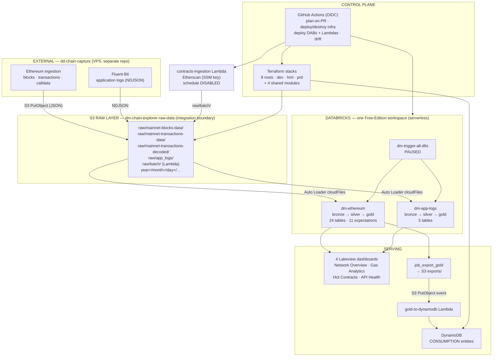
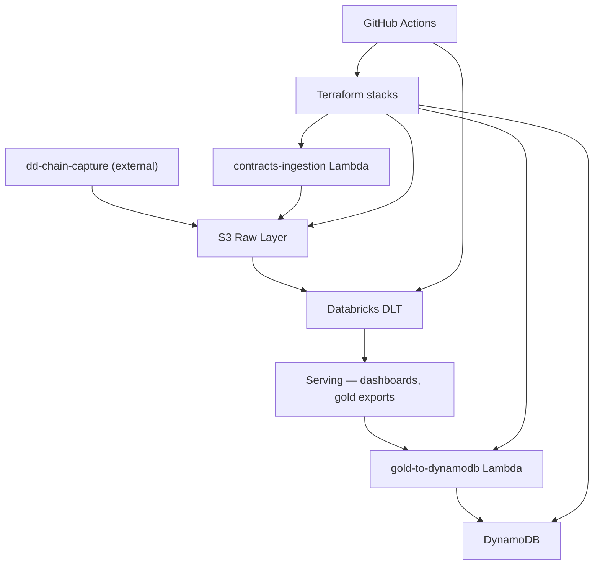
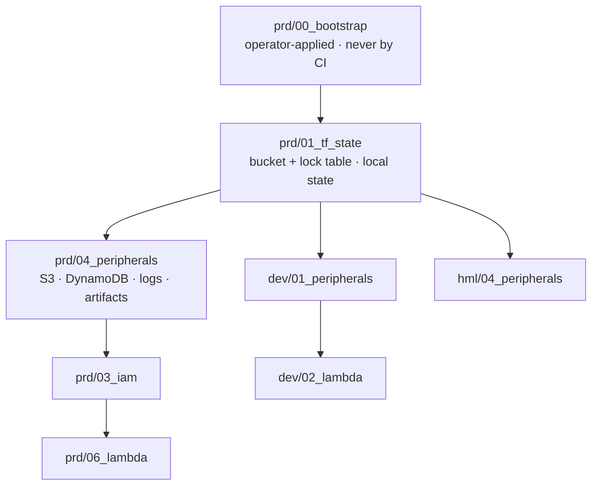

## Visão geral

DD Chain Explorer is the **data-platform half** of a two-project system. It does not
capture blockchain data. Ethereum block, transaction and calldata ingestion belongs to a
separate project, **dd-chain-capture**, which runs on a VPS and delivers raw JSON into
this project's S3 raw bucket. **The S3 bucket is the integration boundary** — no queue,
no stream, no shared code, no network path between the two projects.

What this repository owns is exactly three things:

1. **Infrastructure** — Terraform under `services/{dev,hml,prd,modules}`: 8 root stacks
   and 4 shared modules.
2. **The CI pipeline** — GitHub Actions workflows that deploy infrastructure and apps,
   authenticating to AWS by GitHub OIDC only.
3. **The artifacts deployed to Databricks** for data processing — DLT pipelines,
   workflows/jobs and Lakeview dashboards under `apps/dabs/` (7 bundles) — plus the two
   AWS Lambdas under `apps/lambda` (contracts ingestion, gold → DynamoDB export).

The platform is **parked**, by design: the raw bucket has held no data since 2026-05-23,
DLT trigger jobs are paused, and the hourly contracts-ingestion schedule is disabled. It
is deployed, validated and waiting on the first delivery from dd-chain-capture — see
ADR-007 for the posture and its sunset criteria.

## Camadas

| Camada | Responsabilidade |
|--------|-----------------|
| Capture (external) | `dd-chain-capture` on a VPS — writes raw JSON to the S3 raw bucket. Not in this repo; see [[capture-layer]] |
| S3 Raw Layer | `dm-chain-explorer-raw-data` — landing zone, `raw/mainnet-*/year=/month=/day=/…` partitions, Kafka-Connect JSON; app logs as Fluent-Bit NDJSON |
| Databricks DLT | Two pipelines (`dm-ethereum`, `dm-app-logs`) reading S3 with Auto Loader; bronze → silver → gold in one Free-Edition workspace |
| Serving | 4 Lakeview dashboards, gold exports to S3, `gold-to-dynamodb` Lambda writing CONSUMPTION entities |
| Control plane | 8 Terraform root stacks across `dev`/`hml`/`prd` + GitHub Actions workflows that plan/apply them under OIDC and deploy the DABs bundles |

## Fluxo de dados — pipeline asset chain

## Contratos entre módulos

| De | Para | Tipo | Notas |
|----|------|------|-------|
| dd-chain-capture → S3 | `dm-chain-explorer-raw-data` | Object delivery | Kafka-Connect JSON under `raw/mainnet-{blocks-data,transactions-data,transactions-decoded}/`, `year=/month=/day=/…` partitions. **The only contract between the two projects.** |
| dd-chain-capture (Fluent-Bit) → S3 | `raw/app_logs/` | Object delivery | NDJSON application logs |
| S3 → DLT | Auto Loader (`cloudFiles`) | File-based | JSON format, `partitionColumns=""` — the path contract is compatible with the Kafka-Connect layout; **field-name compatibility with the DLT schemas is not yet validated** |
| contracts-ingestion Lambda → S3 | `raw/batch/` | Object delivery | Batch contract JSON from the Etherscan API — **dormant**: the hourly schedule is disabled in Terraform (ADR-005) |
| DLT gold → S3 | `exports/` | Object delivery | `job_export_gold` writes gold JSON |
| S3 `exports/` → Lambda | S3 PutObject event | Event trigger | Fires `gold-to-dynamodb` |
| Lambda → DynamoDB | `PutItem` | SDK call | CONSUMPTION entities on the single table |
| CI → Terraform / Databricks / Lambda | GitHub Actions | Deploy | OIDC role-assumption only — four short-lived roles held by `prd/00_bootstrap`, published as repository variables; no static key exists |

## Regras de dependência

**Constraints.** Nothing in this repository reaches back across the S3 boundary — there
is no code path from this project to dd-chain-capture. DLT pipelines are triggered
independently of each other. Lambdas are event-driven (EventBridge schedule for
contracts ingestion, S3 PutObject for the gold export).

### Topologia de ambientes

| Aspecto | dev | hml | prd |
|---------|-----|-----|-----|
| Databricks | `[dev]`-prefixed assets → `dev` target/catalog | unprefixed assets → `hml` target/catalog | **no workspace exists**; the `prod` DABs target has no default host variable, so `validate -t prod` fails closed |
| Workspace | one Free Edition workspace, serverless compute only — `dev` and `hml` are catalogs inside it | ← same workspace | — |
| Terraform stacks | `01_peripherals`, `02_lambda` | `04_peripherals` only (minimal lane) | `00_bootstrap`, `01_tf_state`, `03_iam`, `04_peripherals`, `06_lambda` |
| S3 | `dm-chain-explorer-dev-ingestion` | `dm-chain-explorer-hml-raw-data`, `-hml-lakehouse` (live, pinned, Unity-Catalog-attached) | `dm-chain-explorer-raw-data`, `-lakehouse`, `-databricks`, `-artifacts` |
| DynamoDB | `dm-chain-explorer-dev` | — | `dm-chain-explorer` |
| Lambdas | `dm-chain-explorer-gold-to-dynamodb-dev` | — | `dm-dd-chain-explorer-prd-{contracts-ingestion,gold-to-dynamodb}` |
| Unity Catalog credential | `dm-databricks-dev-s3-role` (Terraform-managed) | `dm-databricks-hml-s3-role` (Terraform-managed) | — |
| Compute for capture | none — capture is external (ADR-007) | none | none |

### Ordem de deploy Terraform

`prd/00_bootstrap` is outside the CI graph entirely: it holds the four OIDC deploy roles
and the CI permissions boundary, is applied by the operator with their own credentials,
and is the one stack CI may never apply — otherwise CI's ability to authenticate would
depend on the credentials it is trying to obtain.

Destroy order is the reverse; `00_bootstrap` and `01_tf_state` are never destroyed. Every
other stack is planned and applied through the informed CI gate — the plan a reviewer
approves is the plan that applies, or the run fails closed.

## Estado runtime

- `services/{dev,hml,prd}/**` — 8 Terraform root stacks, each with a committed
  `.terraform.lock.hcl`; remote state in `s3://dm-chain-explorer-terraform-state/`
- `services/modules/**` — 4 shared modules (`s3`, `dynamodb`, `lambda`,
  `cloudwatch_logs`), each declaring `required_providers`
- `apps/dabs/**` — 7 Databricks Asset Bundles (2 DLT pipelines, 4 dashboards, the gold
  export job)
- `apps/lambda/**` — contracts ingestion and gold → DynamoDB export
- `.github/workflows/**` + `scripts/ci/**` — the CI control plane
- `tests/**` + `scripts/ci/tests/**` — the live-surface pyramid and the CI-script suite
- S3 `dm-chain-explorer-raw-data` / `-lakehouse` / `-databricks` / `-artifacts`, DynamoDB
  `dm-chain-explorer`, SSM `/etherscan-api-keys` and `/web3-api-keys/*`

## Limites conhecidos

- No capture code and no capture infrastructure in this repository, and none may be
  reintroduced (ADR-007). Kinesis, Kinesis Firehose, SQS, the five ECS Fargate producer
  services and the PRD Databricks workspace were destroyed in AWS, their Terraform stacks
  and modules deleted, and the residual IAM grants, ECS/VPC shells and leaked security
  groups removed from both code and the account.
- The end-to-end data path has never run against a dd-chain-capture delivery; field-name
  compatibility between the delivered JSON and the DLT Auto Loader schemas is unverified
  (ADR-007, sunset criterion 2).
- The Lambda layer is content-addressed in `s3://dm-chain-explorer-artifacts/`; the
  artifact bucket is declared in `prd/04_peripherals` but **not yet applied**, so the
  PRD/dev Lambda-layer rewire plans skip with a warning until the store exists.
- One Databricks workspace only — there is no production workspace, and Free Edition
  offers serverless compute only. Alerts and Genie spaces are not expressible in the
  deployed CLI, so no bundle declares them.
- Terraform is the sole infrastructure authority: infrastructure changes reach AWS
  through the CI pipeline applying Terraform, never through a console click or an ad-hoc
  CLI mutation.

## Referência

### ADR-001: The S3 raw bucket is the integration boundary

Capture is a separate project with a separate lifecycle. The only coupling permitted is
object delivery into `dm-chain-explorer-raw-data` under the agreed prefixes and partition
layout. No shared queue, stream, database or library. This supersedes the earlier
event-bus design (Kinesis Data Streams + Firehose Direct Put), which no longer exists.

### ADR-002: One Databricks workspace, catalogs as environments

All Databricks assets live in a single Free-Edition workspace. Environment separation is
by target and catalog: `[dev]`-prefixed assets deploy to the `dev` target/catalog,
unprefixed assets to `hml`. The `prod` target has no workspace behind it and is not
deployable.

### ADR-003: Single-table DynamoDB design

One DynamoDB table per environment (`dm-chain-explorer[-dev]`). Entity types
(CONTRACT, CONSUMPTION, and the caches inherited from the capture era) share a PK+SK
composite key with the entity type as PK prefix.

### ADR-004: DABs component atomicity

Each Databricks component (DLT pipeline, batch job, dashboard) is an autonomous
Databricks Asset Bundle with its own `databricks.yml` and per-target config, so each
deploys and versions independently.

**Corollary — no bundle references another bundle's resource.** A cross-bundle
`${resources.*.id}` reference does not resolve, and a display-name `lookup` would couple
bundles through the `[dev]`-prefixed names that ADR-002 relies on. Capability that spans
pipelines is expressed in-bundle (each DLT bundle owns its own trigger job) or by CLI
against a pipeline id (`databricks pipelines start-update --full-refresh <id>`), never by
a fan-out bundle. Orchestration bundles that existed only to reach across this boundary
do not exist.

### ADR-005: Transactions gold view is streaming-only

The `transactions_lambda` gold view is fed by the streaming decoded-transaction silver
tables alone. Its `tx_hash` deduplication ranks by decode quality (full=1, full_4byte=2,
partial=3, batch_sem_decode=4, unknown=5), but the `batch_sem_decode` rank has no
producer: the contracts-ingestion Lambda's hourly schedule is disabled, and the DynamoDB
`CONTRACT` entities that would seed a batch run are empty. The Lambda and its
`raw/batch/` write path are retained as a dormant capability, not an active branch of the
architecture. Re-enabling the batch union is a deliberate change — seed `CONTRACT`
entities, re-enable the EventBridge schedule in Terraform — never an implicit assumption
when reading the view.

### ADR-007: Capture is deprecated here and superseded by dd-chain-capture

**Decision.** In-repository capture is deprecated permanently. Ethereum ingestion is
owned by the external `dd-chain-capture` project, and this repository is a pure consumer
of what that project delivers.

**Boundary.** The S3 raw bucket is the **sole** boundary (ADR-001). No queue, stream,
shared library, shared database, network path or IAM trust links the two projects in
either direction. The only cross-project artifacts that remain in this account are the
`capture/ecr` Terraform state key and its KMS alias, which are `dd-chain-capture`'s
property held in this repository's state bucket — documented, never written here, and
pending an ownership transfer.

**Posture: parked until delivery.** The consuming half stays deployed, validated and
idle. DLT pipelines are deployed and IDLE, their trigger jobs paused; the raw bucket has
been empty since 2026-05-23. Idle is the intended steady state, not a defect. The
platform costs a few dollars a month while it waits, and the restart is a trigger-job
un-pause, not a rebuild.

**What is forbidden.** Reintroducing capture technology here — Kinesis, Kinesis Firehose,
SQS, ECS producer services, Web3 polling clients — is out of scope by design. Every
resource and module of that era was destroyed and deleted; a request to "restore" one is
a request to re-cross the boundary and is refused.

**Sunset criteria.** The deprecation stops being a *pending* state and becomes settled
history when all of the following hold:

1. `dd-chain-capture` has delivered raw objects that a DLT update processed end to end;
2. field-name compatibility between the delivered JSON and the bronze Auto Loader schemas
   is validated (the open verification in [[capture-layer]]);
3. the `capture/ecr` state key and KMS alias are transferred to `dd-chain-capture`'s own
   state, leaving no cross-project resource in this repository's boundary.

Until then, every atom that touches the raw layer states the parked posture explicitly.

### ADR-006: SSM as the shared secret plane

Web3 API keys (Infura, Alchemy, Etherscan) live in SSM Parameter Store as SecureString
parameters and are shared with dd-chain-capture. This repository consumes only the
Etherscan keys, from the contracts-ingestion Lambda.
