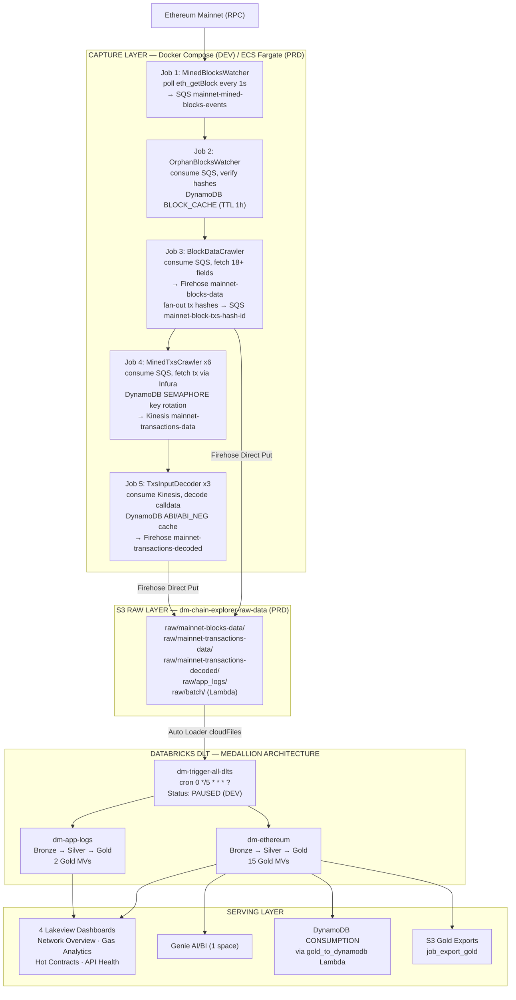
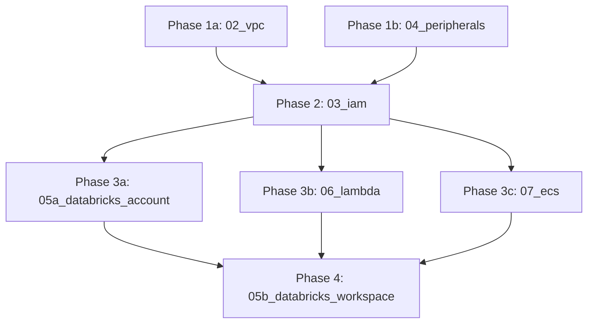
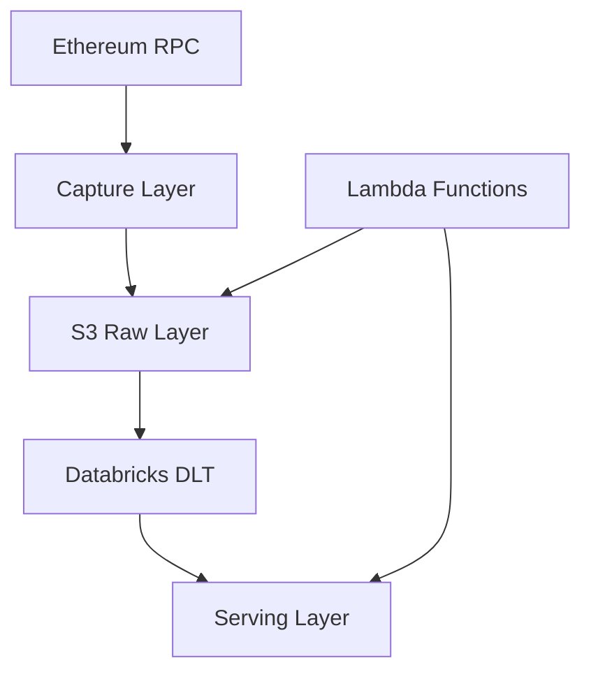

## Visão geral

DD Chain Explorer is a real-time Ethereum blockchain data platform with four architectural layers: (1) Capture Layer — 5 Python jobs on ECS Fargate that ingest raw Ethereum data; (2) S3 Raw Layer — NDJSON landing zone partitioned by time; (3) Databricks DLT Medallion — bronze/silver/gold processing via two DLT pipelines; (4) Serving Layer — Lakeview dashboards, Genie AI/BI, DynamoDB exports, and S3 gold exports.

## Camadas

| Camada | Responsabilidade |
|--------|-----------------|
| Capture Layer | 5 Python Docker jobs on ECS Fargate; poll Ethereum RPC, decode calldata, deliver to Kinesis/Firehose/SQS |
| S3 Raw Layer | NDJSON landing zone; partitioned `year=Y/month=M/day=D/hour=H/`; Firehose delivers here |
| Databricks DLT | Two DLT pipelines (`dm-ethereum`, `dm-app-logs`); Auto Loader ingests from S3; medallion architecture |
| Serving Layer | Lakeview dashboards (4), Genie AI/BI (1), Lambda DynamoDB export, S3 gold exports |

## End-to-End Data Flow

## Camada de Captura (Capture Layer)

Five Python jobs process the Ethereum event stream. In DEV they run as Docker Compose services; in PRD as ECS Fargate services.

| Job | Replicas (PRD) | Input | Output | State |
|-----|---------------|-------|--------|-------|
| Job 1 — MinedBlocksWatcher | 1 | Ethereum RPC poll (1s) | SQS `mainnet-mined-blocks-events` | — |
| Job 2 — OrphanBlocksWatcher | 1 | SQS above | Same SQS (re-emit on reorg) | DynamoDB BLOCK_CACHE (TTL 1h) |
| Job 3 — BlockDataCrawler | 1 | SQS above | Firehose `mainnet-blocks-data`; SQS `mainnet-block-txs-hash-id` | — |
| Job 4 — MinedTxsCrawler | 6 | SQS `mainnet-block-txs-hash-id` | Kinesis `mainnet-transactions-data` | DynamoDB SEMAPHORE (TTL 60s); 17 Infura API keys |
| Job 5 — TxsInputDecoder | 3 | Kinesis above | Firehose `mainnet-transactions-decoded` | DynamoDB ABI / ABI_NEG caches |

### IAM Security (post pipeline-restart-r1)

The ECS task role (`dm-chain-explorer-ecs-task-role`) is scoped to exactly the operations required:

| Service | Allowed actions | ARN scope |
|---------|----------------|-----------|
| DynamoDB | `GetItem`, `PutItem`, `UpdateItem`, `DeleteItem` | Explicit table ARN — no wildcard |
| SQS | `SendMessage`, `ReceiveMessage`, `DeleteMessage`, `GetQueueAttributes` | `arn:aws:sqs:${region}:${account_id}:mainnet-*` |
| Kinesis | `PutRecord`, `PutRecords`, `GetRecords`, `GetShardIterator`, `DescribeStream`, `ListShards` | `arn:aws:kinesis:${region}:${account_id}:stream/mainnet-*` |
| Firehose | `PutRecord`, `PutRecordBatch` | `arn:aws:firehose:${region}:${account_id}:deliverystream/*` |
| SSM | `GetParameter`, `GetParameters` | `arn:aws:ssm:${region}:${account_id}:parameter/dm-chain-explorer/*` |
| S3 | `GetObject`, `PutObject` | Raw data bucket only |

Removed in pipeline-restart-r1: `dynamodb:Scan`, `dynamodb:Query`, `dynamodb:BatchGetItem`, `dynamodb:BatchWriteItem`, `dynamodb:DescribeTable`. All wildcard `*:*` ARN patterns replaced with explicit `${region}:${account_id}` scoping. Databricks cluster role has no SSM access.

## Databricks DLT — Medallion Architecture

### Pipeline: dm-ethereum

| Layer | Schema (DEV / PRD) | Tables |
|-------|--------------------|--------|
| Bronze | `b_ethereum` | eth_mined_blocks, eth_transactions, eth_txs_input_decoded, popular_contracts_txs |
| Silver | `s_apps` | eth_blocks, eth_blocks_withdrawals, eth_transactions_staging, txs_inputs_decoded_fast, transactions_ethereum, eth_canonical_blocks_index (MV — bounded 1,000-block window) |
| Gold | `g_apps`, `g_network` | 15 materialized views |

### Pipeline: dm-app-logs

| Layer | Schema | Tables |
|-------|--------|--------|
| Bronze | `b_app_logs` | b_app_logs_data |
| Silver | `s_logs` | logs_streaming, logs_batch |
| Gold | `g_api_keys` | etherscan_consumption, web3_keys_consumption |

### eth_canonical_blocks_index — Bounded Window (post pipeline-restart-r1)

The `eth_canonical_blocks_index` Silver MV was refactored from a full-table O(N²) self-join to a bounded rolling window. Key constant: `_CANONICAL_WINDOW_BLOCKS = 1_000`. Blocks outside the window are marked canonical by default; the four CTEs (`outside_window`, `window_blocks`, `parent_refs`, `inside_window`) perform the chain-following logic only within the window. Located at `ethereum_pipeline.py:491–573`.

### Trigger (DEV)

Job `[dev] dm-trigger-all-dlts`: cron `0 */5 * * * ?` (every 5 minutes). Status: **PAUSED**. Will be unpaused when PRD-bound data flow is validated end-to-end.

## Serving Layer

### Lakeview Dashboards (4)

All four dashboards use `warehouse_id: a2a66f2adb0faf18` (Serverless Starter Warehouse). All widgets use Databricks widget `version:3`. `embed_credentials: false` in all dashboard resource YAML files.

| Dashboard | DEV ID | Status |
|-----------|--------|--------|
| Network Overview | `01f130f640de104ba0ffb93e4b0a32c8` | ACTIVE |
| Gas Analytics | `01f130f64d4d1d5ca50457cfafdc82ad` | ACTIVE |
| Hot Contracts | `01f130f6471412f29cb443ac92bcce76` | ACTIVE |
| API Health | `01f130f65385152280abbea7b5017f19` | ACTIVE |

### Genie AI/BI

One Genie space deployed to DEV. All 7 table FQNs corrected (stale `_fast` aliases removed; correct schemas: `s_apps.transactions_ethereum`, `s_apps.eth_blocks`, `g_apps.*`, `g_network.*`, `g_api_keys.*`). Note: `genie_spaces` is not a DABs terraform-managed resource in provider v1.88.0 — Genie space creation requires UI or future DABs support.

### DynamoDB Export (Lambda)

`dm-chain-explorer-gold_to_dynamodb` Lambda: triggered by S3 PutObject on `exports/` prefix; writes CONSUMPTION entities. CloudWatch log ARN scoped to `/aws/lambda/${name_prefix}-*`.

## Topologia de ambientes (Environment Topology)

| Aspect | DEV | HML | PRD |
|--------|-----|-----|-----|
| Streaming apps | Docker Compose (local) — 12 containers | ECS Fargate (ephemeral, per CI/CD deploy) | ECS Fargate (persistent) |
| Databricks | Free Edition (`dev` catalog) | Free Edition (`hml` catalog) | Databricks Workspace (`dd_chain_explorer` catalog) |
| S3 | `dm-chain-explorer-dev-ingestion` | `dm-chain-explorer-hml-raw` / `-hml-lakehouse` | `dm-chain-explorer-raw-data` + `dm-chain-explorer-lakehouse` |
| DynamoDB | `dm-chain-explorer-dev` | `dm-chain-explorer-hml` | `dm-chain-explorer` |
| Auth (streaming) | `~/.aws` profile | GitHub Secrets IAM user | ECS IAM task role (scoped) |
| Auth (Databricks) | PAT (`[dev]` profile) | PAT (GitHub Secret) | OAuth M2M service principal |

## PRD Deploy Order (Terraform)

Destroy order (reverse): 05b → (05a + 06 + 07 parallel) → 04 → 03 → 02 → never destroy 01.

## Regras de dependência

**Constraints:** Capture layer jobs depend on each other in DAG order (Job 1 → 2 → 3 → 4 → 5). DLT pipelines are triggered independently. Lambda functions are event-driven (EventBridge + S3 events).

## Contratos entre módulos

| De | Para | Tipo | Notas |
|----|------|------|-------|
| Job 1 → Job 2/3 | SQS `mainnet-mined-blocks-events` | Event queue | JSON block event message |
| Job 3 → Job 4 | SQS `mainnet-block-txs-hash-id` | Event queue | JSON tx hash message |
| Job 4 → Job 5 | Kinesis `mainnet-transactions-data` | Data stream | JSON tx record |
| Job 3/5 → S3 | Firehose Direct Put | Delivery stream | NDJSON, hourly partitioned |
| S3 → DLT | Auto Loader (`cloudFiles`) | File-based | NDJSON and binaryFile formats |
| DLT → Lambda | S3 PutObject event | Event trigger | Gold export JSON file |
| Lambda → DynamoDB | DynamoDB PutItem | SDK call | CONSUMPTION entity |

## Estado runtime tocado

- `specs/memory/architecture.md` — this file
- `apps/services/` — Docker Compose and ECS service configs
- `services/prd/03_iam/iam.tf` — IAM roles and policies
- `services/prd/04_peripherals/` — Kinesis, Firehose, SQS, DynamoDB, S3 Terraform modules
- `apps/dabs/` — Databricks Asset Bundles (DLT pipelines, dashboards, alerts, Genie)

## Decisoes arquiteturais (ADRs)

### ADR-001: Kinesis + Firehose, no Kafka / Schema Registry

Use Kinesis Data Streams + Firehose Direct Put as the event bus. JSON (NDJSON) natively with no Avro/Protobuf. Kafka MSK introduces significant operational overhead and cost for a single-pipeline platform.

### ADR-002: Firehose Direct Put vs Kinesis Intermediary

Blocks data and decoded transactions use Firehose Direct Put. Only raw transactions flow through Kinesis Data Streams (required for the multi-replica Job 4 → Job 5 consumer pattern).

### ADR-003: Single-Table DynamoDB Design

One DynamoDB table per environment (`dm-chain-explorer[-dev|-hml]`). All entity types (SEMAPHORE, COUNTER, BLOCK_CACHE, ABI, ABI_NEG, CONTRACT, CONSUMPTION) use PK+SK composite key with entity type as PK prefix.

### ADR-004: DABs Component Atomicity

Each Databricks component (DLT pipeline, batch job, dashboard, alert, Genie) is an autonomous Databricks Asset Bundle with its own `databricks.yml` and 3-target config (dev/hml/prod). Enables independent deployment and lifecycle management.

### ADR-005: Lambda Architecture for Transactions

`transactions_lambda` Gold MV unions streaming transactions with batch contract transactions (from Lambda), deduplicating by `tx_hash` with priority by decode quality (full=1, full_4byte=2, partial=3, batch_sem_decode=4, unknown=5).

### ADR-006: Distributed API Key Rotation via DynamoDB Semaphore

Job 4 (MinedTxsCrawler) runs as 6 parallel replicas coordinating Infura API key assignment via a DynamoDB semaphore (SEMAPHORE entity, TTL=60s). Supports 17 API keys at ~100 RPS/key each.
