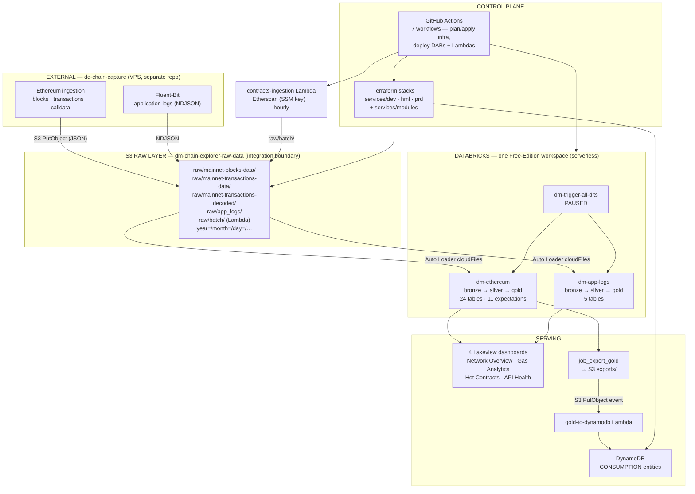
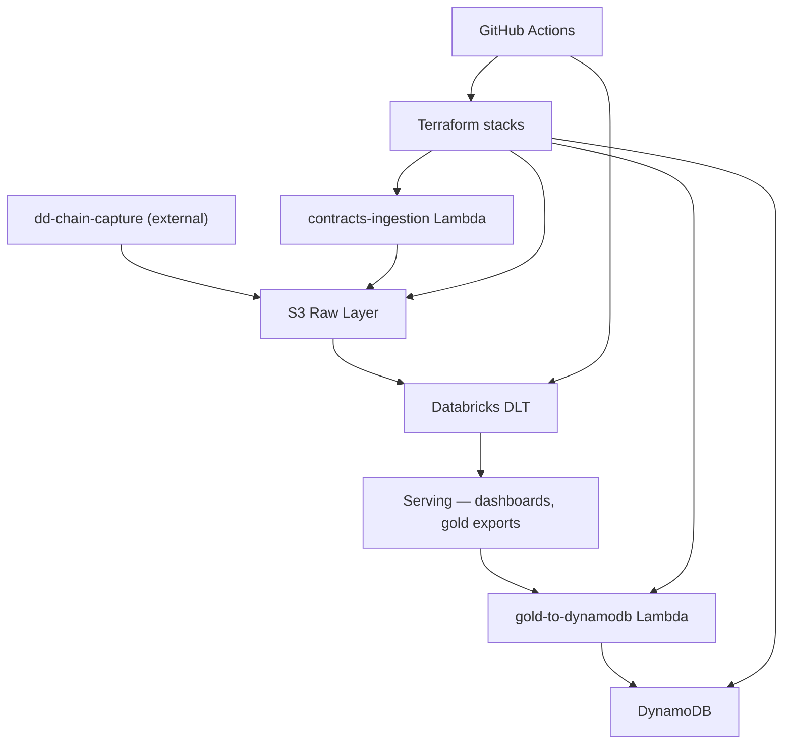
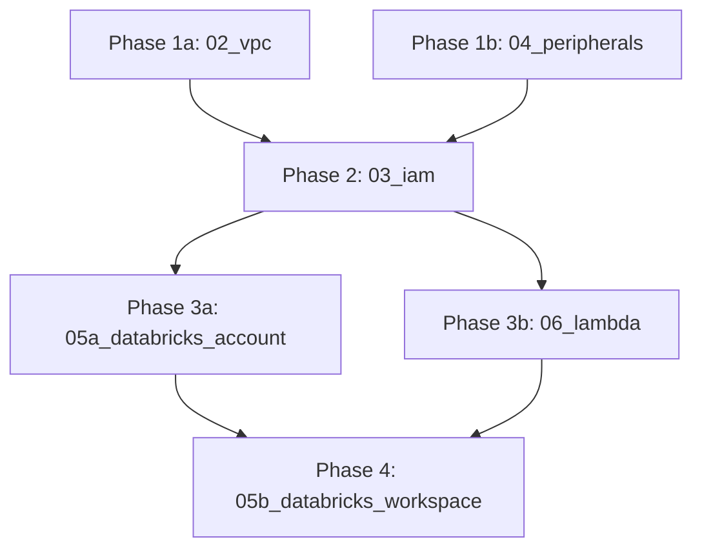

## Visão geral

DD Chain Explorer is the **data-platform half** of a two-project system. It does not
capture blockchain data. Ethereum block, transaction and calldata ingestion belongs to a
separate project, **dd-chain-capture**, which runs on a VPS and delivers raw JSON into
this project's S3 raw bucket. **The S3 bucket is the integration boundary** — no queue,
no stream, no shared code, no network path between the two projects.

What this repository owns is exactly three things:

1. **Infrastructure** — Terraform under `services/{dev,hml,prd,modules}`.
2. **The CI pipeline** — GitHub Actions workflows that deploy infrastructure and apps.
3. **The artifacts deployed to Databricks** for data processing — DLT pipelines,
   workflows/jobs and Lakeview dashboards under `apps/dabs/` — plus the two AWS Lambdas
   under `apps/lambda` (contracts ingestion, gold → DynamoDB export).

The platform is currently **idle**: the raw bucket has held no data since 2026-05-23, DLT
triggers are paused, and no job has run in 60 days. It is waiting on the first delivery
from dd-chain-capture.

## Camadas

| Camada | Responsabilidade |
|--------|-----------------|
| Capture (external) | `dd-chain-capture` on a VPS — writes raw JSON to the S3 raw bucket. Not in this repo; see [[capture-layer]] |
| S3 Raw Layer | `dm-chain-explorer-raw-data` — landing zone, `raw/mainnet-*/year=/month=/day=/…` partitions, Kafka-Connect JSON; app logs as Fluent-Bit NDJSON |
| Databricks DLT | Two pipelines (`dm-ethereum`, `dm-app-logs`) reading S3 with Auto Loader; bronze → silver → gold in one Free-Edition workspace |
| Serving | 4 Lakeview dashboards, gold exports to S3, `gold-to-dynamodb` Lambda writing CONSUMPTION entities |
| Control plane | Terraform stacks per environment + GitHub Actions workflows that plan/apply them and deploy the DABs bundles |

## Fluxo de dados — pipeline asset chain

## Contratos entre módulos

| De | Para | Tipo | Notas |
|----|------|------|-------|
| dd-chain-capture → S3 | `dm-chain-explorer-raw-data` | Object delivery | Kafka-Connect JSON under `raw/mainnet-{blocks-data,transactions-data,transactions-decoded}/`, `year=/month=/day=/…` partitions. **The only contract between the two projects.** |
| dd-chain-capture (Fluent-Bit) → S3 | `raw/app_logs/` | Object delivery | NDJSON application logs |
| S3 → DLT | Auto Loader (`cloudFiles`) | File-based | JSON format, `partitionColumns=""` — the path contract is compatible with the Kafka-Connect layout; **field-name compatibility with the DLT schemas is not yet validated** |
| contracts-ingestion Lambda → S3 | `raw/batch/` | Object delivery | Batch contract JSON from the Etherscan API |
| DLT gold → S3 | `exports/` | Object delivery | `job_export_gold` writes gold JSON |
| S3 `exports/` → Lambda | S3 PutObject event | Event trigger | Fires `gold-to-dynamodb` |
| Lambda → DynamoDB | `PutItem` | SDK call | CONSUMPTION entities on the single table |
| CI → Terraform / Databricks / Lambda | GitHub Actions | Deploy | OIDC role-assumption *(gap — see audit `20260823T145726Z-4db47555`)* |

## Regras de dependência

**Constraints.** Nothing in this repository reaches back across the S3 boundary — there
is no code path from this project to dd-chain-capture. DLT pipelines are triggered
independently of each other. Lambdas are event-driven (EventBridge schedule for
contracts ingestion, S3 PutObject for the gold export).

### Topologia de ambientes

| Aspecto | dev | hml | prd |
|---------|-----|-----|-----|
| Databricks | `[dev]`-prefixed assets → `dev` target/catalog | unprefixed assets → `hml` target/catalog | **no workspace exists**; the `prod` DABs target is not deployable and is guarded |
| Workspace | one Free Edition workspace, serverless compute only — `dev` and `hml` are catalogs inside it | ← same workspace | — |
| S3 | `dm-chain-explorer-dev-ingestion` | buckets declared in state but not live | `dm-chain-explorer-raw-data`, `-lakehouse`, `-databricks` |
| DynamoDB | `dm-chain-explorer-dev` | — | `dm-chain-explorer` |
| Lambdas | `dm-chain-explorer-gold-to-dynamodb-dev` | — | `dm-dd-chain-explorer-prd-{contracts-ingestion,gold-to-dynamodb}` |
| Compute for capture | none | empty ECS cluster shell | ECS shell in code only |

### Ordem de deploy Terraform (prd)

Destroy order is the reverse; `01_tf_state` is never destroyed.

## Estado runtime

- `services/{dev,hml,prd}/**` — Terraform stacks; remote state in
  `s3://dm-chain-explorer-terraform-state/`
- `services/modules/**` — shared modules (`s3`, `dynamodb`, `iam`, `lambda`,
  `cloudwatch_logs`, `ecs`, `vpc`); the `kinesis` and `sqs` modules were deleted
- `apps/dabs/**` — Databricks Asset Bundles (DLT pipelines, jobs, dashboards)
- `apps/lambda/**` — contracts ingestion and gold → DynamoDB export
- `.github/workflows/**` + `scripts/ci/**` — the CI control plane
- S3 `dm-chain-explorer-raw-data` / `-lakehouse` / `-databricks`, DynamoDB
  `dm-chain-explorer`, SSM `/etherscan-api-keys` and `/web3-api-keys/*`

## Limites conhecidos

- No capture code and no capture infrastructure in this repository. Kinesis, Kinesis
  Firehose, SQS, the five ECS Fargate producer services and the PRD Databricks workspace
  were destroyed in AWS (2026-06-22 and 2026-04-11) and the `kinesis`/`sqs` Terraform
  modules were deleted.
- **Residue, not capability:** ECS clusters survive as empty shells in `prd/07_ecs` and
  `hml/07_ecs`, and Kinesis/Firehose/SQS IAM grants remain in `prd/03_iam/iam.tf` and
  `hml/03_iam/main.tf`. They grant access to resources that no longer exist and are
  slated for removal *(audit `20260823T145726Z-4db47555`, DRIFT-13)*.
- The end-to-end data path has never run against a dd-chain-capture delivery; field-name
  compatibility between the delivered JSON and the DLT Auto Loader schemas is unverified.
- One Databricks workspace only — there is no production workspace, and Free Edition
  offers serverless compute only.

## Referência

### ADR-001: The S3 raw bucket is the integration boundary

Capture is a separate project with a separate lifecycle. The only coupling permitted is
object delivery into `dm-chain-explorer-raw-data` under the agreed prefixes and partition
layout. No shared queue, stream, database or library. This supersedes the earlier
event-bus design (Kinesis Data Streams + Firehose Direct Put), which no longer exists.

### ADR-002: One Databricks workspace, catalogs as environments

All Databricks assets live in a single Free-Edition workspace. Environment separation is
by target and catalog: `[dev]`-prefixed assets deploy to the `dev` target/catalog,
unprefixed assets to `hml`. The `prod` target has no workspace behind it and is not
deployable.

### ADR-003: Single-table DynamoDB design

One DynamoDB table per environment (`dm-chain-explorer[-dev]`). Entity types
(CONTRACT, CONSUMPTION, and the caches inherited from the capture era) share a PK+SK
composite key with the entity type as PK prefix.

### ADR-004: DABs component atomicity

Each Databricks component (DLT pipeline, batch job, dashboard) is an autonomous
Databricks Asset Bundle with its own `databricks.yml` and per-target config, so each
deploys and versions independently.

### ADR-005: Lambda architecture for transactions

The `transactions_lambda` gold view unions streaming transactions with batch contract
transactions produced by the contracts-ingestion Lambda, deduplicating by `tx_hash` with
priority by decode quality (full=1, full_4byte=2, partial=3, batch_sem_decode=4,
unknown=5).

### ADR-006: SSM as the shared secret plane

Web3 API keys (Infura, Alchemy, Etherscan) live in SSM Parameter Store as SecureString
parameters and are shared with dd-chain-capture. This repository consumes only the
Etherscan keys, from the contracts-ingestion Lambda.
