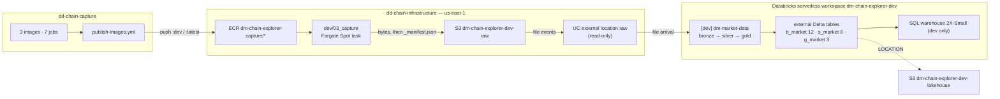
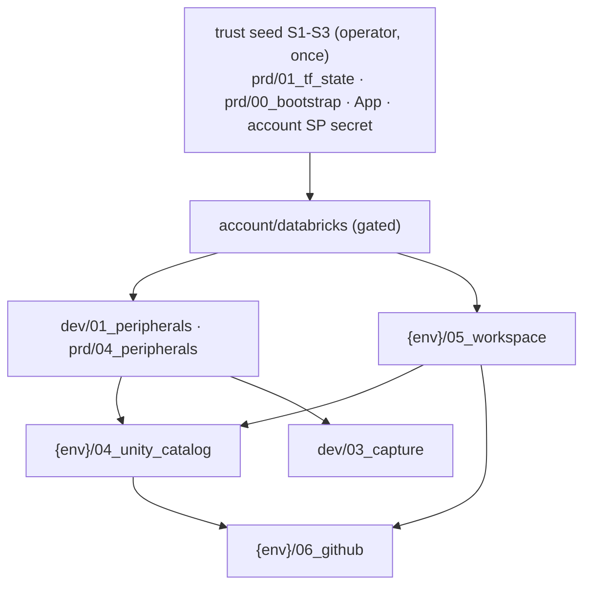

## Visão geral

**Status 2026-09-23.** Target architecture DECIDED by operator rulings R18-R36 (release
v0.7.0) and written in code on the three `feature/0.7.0` branches; **not yet live**. LIVE
today: the sa-east-1 teardown is half done (dev stacks and `capture/ecr` destroyed; prd
stacks pending), no us-east-1 object exists, the Databricks account has no workspace.
Every section marks LIVE vs DECIDED; `[[environments]]` and `[[aws-resources]]` hold the
per-object status.

DD Chain Explorer is a **Brazilian market-data lakehouse**: B3 quotes, index portfolio and
instrument files, CVM company filings and BCB macro series, landed as untouched bytes and
refined into company prices and fundamentals. Three repositories, one concern each:

| Repository | Owns |
|---|---|
| `dd-chain-capture` | the code of three batch images (`b3-market-data`, `cvm-open-data`, `bcb-sgs`), seven jobs, the landing library `dm_capture_landing`, and `publish-images.yml` (build + push to ECR) |
| `dd-chain-infrastructure` | every cloud object — ECR, the capture runtime, buckets, IAM, the Databricks account/workspaces/Unity Catalog, GitHub environments and secrets — plus the infra CI lanes; nothing is created by hand except the trust seed |
| `dd-chain-explorer` (new) | one Databricks bundle `job_market_data`, the explorer CI, and — after the v0.6.0 C-DAY — the authoritative `specs/` (this tree is the live one until then) |

## Camadas

| Camada | Responsabilidade | Status 2026-09-23 |
|---|---|---|
| Image registry | ECR `dm-chain-explorer-capture/<image>` ×3 (in `prd/04_peripherals`), MUTABLE `:dev`/`latest`, scan on push | DECIDED (us-east-1); sa-east-1 repos emptied, destroy pending the prd lane |
| Capture runtime | `dev/03_capture`: ECS cluster on Fargate Spot, egress-only SG in the default VPC, one task role per image scoped to `raw/<source>/*`, seven EventBridge Scheduler schedules **DISABLED**; `capture_run.yml` starts runs | DECIDED; sa-east-1 copy destroyed |
| Raw landing | `dm-chain-explorer-<env>-raw` — `raw/<source>/<dataset>/ingest_date=YYYY-MM-DD/` untouched bytes + `_manifest.json` written last; Intelligent-Tiering day 0, never expires | DECIDED |
| Databricks account | `account/databricks`: metastore `dm-chain-explorer-use1`, deploy SPs `dm-chain-explorer-{dev,prd}-deploy` + OAuth secrets, budget alert | account LIVE (Premium, empty); stack DECIDED |
| Workspace unit | `{env}/05_workspace`: SERVERLESS workspace `dm-chain-explorer-<env>` + metastore and ADMIN assignments — **rebuildable** | DECIDED |
| Unity Catalog | `{env}/04_unity_catalog`, **persistent**: UC IAM role, credential, file-event external locations, ISOLATED catalog, schemas, volume, grants; dev SQL warehouse | DECIDED |
| Medallion | job `dm-market-data`: `bronze → silver → gold` serverless PySpark tasks, file-arrival trigger — see [[medallion-pipelines]] | DECIDED (PR open) |
| Control plane | `{env}/06_github` + GitHub App `dm-chain-explorer-ci`; plan-as-detector lanes; event chain across the three repos — see [[cicd-pipeline]] | App LIVE; rest DECIDED |

## Fluxo de dados

## Contratos entre módulos

| De → Para | Contrato | Notas |
|---|---|---|
| capture CI → infra runtime | **Image seam (seam 3)** — ECR repo per image; capture pushes, the task definitions pull `<repo>:dev` | role `gha-capture-publish` (ECR push/pull on the three repos only); no registry variable |
| capture runtime → explorer | **Raw seam (seam 1)** — `raw-landing-contract`: partition key, untouched bytes, `raw-manifest-v1` written last; manifest presence is idempotency | the only data contract; `docs/cross-repo-contract.md` (explorer) pins it |
| UC stack → bundle | catalog, schemas `b_market/s_market/g_market/ops`, volume `ops.bundle_artifacts` are stack-owned; the bundle owns only the job | tables are `CREATE TABLE IF NOT EXISTS … LOCATION` external, so a workspace rebuild keeps them |
| stack → stack | `terraform_remote_state` on `dm-chain-explorer-tfstate-use1` | account → workspace → UC → GitHub; the UC provider host is the workspace unit's output |
| infra ⇄ explorer ⇄ infra | `repository_dispatch` `infra-dev-applied` → `explorer-dev-deployed` → `capture-landed`, App-minted per-job tokens | no loop: `capture_run` never signals infra |
| GitHub stack → both CIs | env `dev`/`production` secrets `DATABRICKS_HOST/CLIENT_ID/CLIENT_SECRET`, `DATABRICKS_WAREHOUSE_ID` (dev), var `DATABRICKS_ACCOUNT_ID` | written from account + workspace outputs; nobody types them |

## Regras de dependência

- **Survival rule.** A workspace holds only workspace objects (jobs, warehouse, `.bundle/`,
  permission assignments); every metastore object (credential, locations, catalog,
  schemas, volume, table registrations) lives in the persistent UC stack, so destroying
  `{env}/05_workspace` loses no data or registration. The UC IAM role sits beside its
  credential to break the external-id cycle in one apply.
- **Lane order:** account (gated) → dev (ungated, stack by stack) → prd (gated, wave by
  wave); `prd/00_bootstrap` and `prd/01_tf_state` are operator-only; destroy paths skip
  every `never_destroy` stack — only the rebuild drill destroys `dev/05_workspace`.
- Nothing here reaches back into `dd-chain-capture`'s code; capture reaches infra only
  through ECR and the raw bucket.

### Topologia de ambientes

| Aspecto | dev | prd |
|---|---|---|
| Workspace | `dm-chain-explorer-dev`, SERVERLESS, rebuildable (drill) | `dm-chain-explorer-prd`, SERVERLESS, permanent, rebuildable, no destroy path |
| Catalog | `dev`, ISOLATED, bound to the dev workspace | `prd`, ISOLATED, bound to the prd workspace |
| Buckets | `dm-chain-explorer-dev-{raw,lakehouse}` | `dm-chain-explorer-prd-{raw,lakehouse}` |
| Workload | capture runtime + bundle deployed, file-arrival UNPAUSED | **platform only** — bundle `prod` validated, never deployed; no capture runtime; no warehouse |
| Gate | applies on `develop` push | `production` environment approval (operator) |

Detail and live status: [[environments]].

## Estado runtime

- **LIVE (2026-09-23):** infra `develop` = PR-α (#10): plan-driven lanes, bootstrap delta 2
  (operator-applied), temporary `retire` job. Run `35817189275`: retire emptied the six
  sa-east-1 buckets (all already empty) and five ECR repos, destroyed `capture/ecr` whole
  (11 resources incl. KMS key + Roles Anywhere); the dev lane destroyed `dev/01`,
  `dev/02_lambda`, `dev/03_capture` (45 resources). The prd lane was **skipped** (skip
  inherited from `account-apply`); fix PR #11 open — `prd/04_peripherals` and
  `prd/06_lambda` are still live in sa-east-1.
- **LIVE:** Databricks account (Premium, card-billed) with no workspace; metastores only in
  us-east-2/us-west-2. GitHub App `dm-chain-explorer-ci` installed on the three repos.
- **DECIDED, in code, not merged:** infra PR-β (local branch `feature/0.7.0-us-east-1`:
  region move, account/workspace/UC/GitHub stacks, `capture_run.yml`, trust seed); explorer
  PR #5 (`job_market_data`, chain CI, Ethereum code deleted); capture PR #4 (us-east-1).
- **Not yet written:** `rebuild_drill.yml` (T-I7.20).

## Limites conhecidos

- The end-to-end chain (AC-22) has never run; no us-east-1 object exists yet.
- PRD carries no workload; PRD capture schedules and bundle deploy are the backlog entry
  `prod-environment-official-account`.
- Capture schedules stay DISABLED; data lands only through `capture_run` or a runbook
  backfill.
- `constitution.md` §1/§2/§6/§7 still describe the lambda seam, Free Edition, `hml` and
  DLT — its amendment is operator-only (T-O7.5, AC-17); where they disagree, this atom
  states the ruled truth.
- Mutable `:dev` image tag; digest is recorded in each manifest, not pinned.

## Referência

ADR numbers continue after the v0.6.0 SPEC's ADR-1..10, so every number in this tree is
unique. Retired: ADR-002 (one Free Edition workspace — R27), ADR-003 (DynamoDB — R21),
ADR-005 (Ethereum gold view — R21), ADR-006 (SSM Web3 key plane — R21); v0.6.0 SPEC ADR-3
(lambda seam) by ADR-012 and ADR-10's Free Edition half by ADR-013.

### ADR-001: The raw bucket is the data seam

**Accepted; amended 2026-09-23 by ADR-014.** Capture meets processing only through object
delivery into `dm-chain-explorer-<env>-raw` under `raw/<source>/<dataset>/ingest_date=/`
with `_manifest.json` last. No queue, stream, shared database or library between them.

### ADR-004: DABs component atomicity

**Accepted.** Each Databricks component is an autonomous bundle; no bundle references
another bundle's resource. Today exactly one bundle exists (`job_market_data`).

### ADR-007: Capture code lives in dd-chain-capture; its runtime lives in infra

**Accepted; rewritten 2026-09-23 (R11-R15).** `dd-chain-capture` owns image code and its
publish CI; `dd-chain-infrastructure` owns the registry and the runtime (task definitions,
roles, schedules). The image registry is the second seam (seam 3). Raw objects are
untouched source bytes, never expire, move to Intelligent-Tiering at day 0.

### ADR-011: Batch medallion job on file arrival — no DLT

**Accepted 2026-09-23 (R19, R20, R24, R36).** One bundle `job_market_data`, one serverless
job `dm-market-data`, three chained PySpark tasks writing Delta by MERGE/overwrite; fired
by a file-arrival trigger on the raw external location with file events enabled — no
cron, no CI-started run. DLT in any form needs a new ruling.

### ADR-012: Ethereum lane and lambda seam retired everywhere

**Accepted 2026-09-23 (R21, R23).** Every Ethereum object (bundles, schemas, Lambdas,
DynamoDB, ingestion bucket, ECR stream/connect, schedule) is destroyed through IaC/CI while
its source exists, then its source is deleted (destroy before delete). The artifacts
bucket, `gha-artifacts-publish` and `resolve_*` die with the seam.

### ADR-013: Serverless DEV + PRD workspaces in the operator's Databricks account

**Accepted 2026-09-23 (R27, R28, R31).** Free Edition is abandoned with its objects. One
us-east-1 metastore; per-env SERVERLESS workspace as a rebuildable unit; per-env persistent
UC stack; catalogs `dev`/`prd` ISOLATED with `storage_root` on the env's lakehouse bucket;
external tables only; every UC object owned by a stack. PRD is permanent and rebuildable,
proven by the dev rebuild drill (AC-29).

### ADR-014: One region, us-east-1, new names

**Accepted 2026-09-23 (R29, R32, R34).** Everything, state included, lives in us-east-1
(list-price saving ~25.7%, measured at CLOSURE, AC-30). `AWS_REGION` in each workflow is
the single source (`TF_VAR_aws_region`, no default). New names
`dm-chain-explorer-<env>-<purpose>`, state bucket `dm-chain-explorer-tfstate-use1`; sa-east-1
is torn down by CI before bring-up; orphan `capture/ecr` state destroyed whole.

### ADR-015: SSE-S3 and S3-native state locking

**Accepted 2026-09-23 (R30, R33).** Every bucket `AES256`; no CMK anywhere
(cost×security study: backlog `encryption-at-rest-posture-decision`). Backends use
`use_lockfile = true`; the DynamoDB lock table and its grants are gone.

### ADR-016: Zero-manual chain

**Accepted 2026-09-23 (R22, R26, R35).** The only hand act is the idempotent trust seed
(S1 AWS bootstrap + state bucket, S2 GitHub App, S3 account-SP secret) plus environment
approvals and the drill dispatch. The plan is the change detector; cross-repo order is
`repository_dispatch` through GitHub App `dm-chain-explorer-ci` (no PAT); GitHub
environments, secrets and the `develop` default branch are Terraform (`06_github`).
