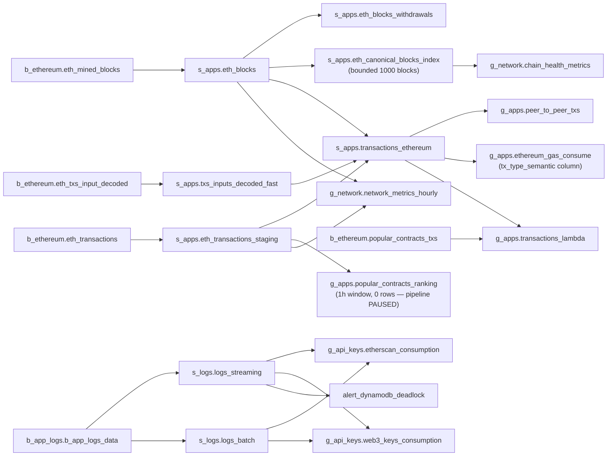

## Propósito

Canonical inventory of every Databricks table and materialized view (MV) in DD Chain Explorer. Source: Databricks DEV workspace (Free Edition), validated 2026-05-23 (post `pipeline-restart-r1`). Catalog `dev` maps to `dd_chain_explorer` in PRD. Table names and schemas are identical across environments.

The catalog spans 7 schemas and 30 objects: 12 streaming tables and 18 materialized views. It documents schema purpose, table type, source lineage, and key column notes for agents and engineers who need to write queries, define expectations, or extend the pipeline.

> **Post R1 corrections:** Stale `_fast` aliases removed from all FQNs (Genie and dashboards). Alert reference corrected to `s_logs.logs_streaming`. `tx_type_semantic` is the canonical column name in `ethereum_gas_consume` (not `type_transaction`). `popular_contracts_ranking` is 0 rows — DEV DLT pipeline is PAUSED by design.

## Fluxo de uso

1. Identify the schema tier needed (bronze for raw, silver for parsed/joined, gold for analytics).
2. Look up the table in the relevant schema section below.
3. Check the Source column to understand upstream dependencies.
4. Reference the Key Relationships flowchart for cross-schema lineage.
5. Verify the Catalog Summary totals when validating pipeline completeness.

## Trigger típico

Referenced when writing a Databricks SQL query, defining a DLT expectation, adding a new Gold MV, or debugging data quality issues in any medallion layer.

## Diferencial

Without a catalog, engineers must browse Unity Catalog UI or read DLT pipeline source code to discover table schemas and lineage. This atom provides a stable, searchable reference that agents can consume without a live Databricks connection, enabling offline spec authoring and code review.

## Estado runtime tocado

- Databricks catalog `dd_chain_explorer` (PRD) / `dev` (DEV) — all schemas below are live tables in these catalogs
- S3 `dm-chain-explorer-raw-data` — read by Auto Loader Bronze tables
- S3 `dm-chain-explorer-lakehouse` — Delta table storage

## Dependências

- **Upstream**: `capture-layer` produces the S3 NDJSON raw files that Bronze tables ingest
- **Upstream**: `aws-resources` defines the S3 bucket names used by Auto Loader paths
- **Downstream**: `serving-layer` reads Gold tables for dashboards, Genie, and Lambda export

---

## Schema: `b_ethereum` — Bronze Ethereum

All tables are STREAMING_TABLE (append-only via DLT Auto Loader from S3 NDJSON).

| Table | Type | Source S3 Prefix | Description |
|-------|------|-----------------|-------------|
| `eth_mined_blocks` | STREAMING_TABLE | `raw/mainnet-mined-blocks-data/` | Raw mined block events from Job 1 via SQS/Firehose |
| `eth_transactions` | STREAMING_TABLE | `raw/mainnet-transactions-data/` | Raw transaction records from Job 4 via Kinesis |
| `eth_txs_input_decoded` | STREAMING_TABLE | `raw/mainnet-transactions-decoded/` | Decoded calldata from Job 5 via Firehose Direct Put |
| `popular_contracts_txs` | STREAMING_TABLE | `raw/batch/` | Batch contract transactions from Lambda `contracts_ingestion` |

---

## Schema: `b_app_logs` — Bronze Application Logs

| Table | Type | Source S3 Prefix | Description |
|-------|------|-----------------|-------------|
| `b_app_logs_data` | STREAMING_TABLE | `raw/app_logs/` | CloudWatch structured logs from all 5 streaming jobs (double-gzip binaryFile format) |

---

## Schema: `s_apps` — Silver Ethereum Analytics

| Table | Type | Source | Description |
|-------|------|--------|-------------|
| `eth_blocks` | STREAMING_TABLE | `b_ethereum.eth_mined_blocks` | Parsed block headers: number, hash, parent_hash, miner, gas_used, gas_limit, base_fee_per_gas, timestamp, tx_count |
| `eth_blocks_withdrawals` | STREAMING_TABLE | `eth_blocks` (explode withdrawals[]) | EIP-4895 validator withdrawals: validator_index, withdrawal_address, amount_gwei, amount_eth |
| `eth_transactions_staging` | STREAMING_TABLE | `b_ethereum.eth_transactions` | Parsed raw transactions: tx_hash, block_number, from_address, to_address, value, input, gas, gas_price, tx_type, access_list. `from_address` expectation: `expect_or_drop` (post R1). |
| `txs_inputs_decoded_fast` | STREAMING_TABLE | `b_ethereum.eth_txs_input_decoded` | Parsed decoded calldata: tx_hash, contract_address, method, parms, decode_type |
| `transactions_ethereum` | STREAMING_TABLE | JOIN: eth_transactions_staging + txs_inputs_decoded_fast + eth_blocks | Full enriched transactions: all tx fields + method + params + block metadata + event_date partition |
| `eth_canonical_blocks_index` | MATERIALIZED_VIEW | `eth_blocks` + parent_hash chain | Canonical chain index — classifies each block as `canonical` or `orphan`. **Bounded rolling window of 1,000 blocks** (`_CANONICAL_WINDOW_BLOCKS=1_000`, post R1). Blocks outside window marked canonical by default. No full-table O(N²) self-join. Critical for Gold MV correctness. |

---

## Schema: `s_logs` — Silver Application Logs

| Table | Type | Source | Description |
|-------|------|--------|-------------|
| `logs_streaming` | STREAMING_TABLE | `b_app_logs.b_app_logs_data` (recent) | Parsed structured logs (last N hours): job_name, level, message, timestamp, api_key_name, call_count. Used by `alert_dynamodb_deadlock` (post R1 fix — was erroneously referencing a non-existent table). |
| `logs_batch` | STREAMING_TABLE | `b_app_logs.b_app_logs_data` (historical) | Historical log records for batch aggregation |

---

## Schema: `g_apps` — Gold Ethereum Analytics

All tables are MATERIALIZED_VIEW, refreshed by the `dm-ethereum` DLT pipeline trigger (every 5 min when unpaused).

> **DEV state (post R1):** DLT pipeline is PAUSED. `popular_contracts_ranking` returns 0 rows — this is expected and correct. MVs reflect historical data from last pipeline run (April 2026).

| MV | Source | Description |
|----|--------|-------------|
| `popular_contracts_ranking` | `eth_transactions_staging` (1h window) | Top 100 contracts by tx volume: contract_address, tx_count, unique_senders, first_seen, last_seen. 0 rows in DEV — pipeline PAUSED. |
| `peer_to_peer_txs` | `transactions_ethereum` | EOA→EOA transfers: tx_hash, from_address, to_address, value, gas_price, base_fee_per_gas, tx_timestamp |
| `ethereum_gas_consume` | `transactions_ethereum` | Gas per tx with type classification. Canonical column: `tx_type_semantic` (values: `contract_deploy`, `peer_to_peer`, `contract_interaction`). Also includes `gas_pct_of_block`. DEV validated: contract_interaction ~710K, peer_to_peer ~96.5K rows. |
| `transactions_lambda` | `transactions_ethereum` ∪ `popular_contracts_txs` | Lambda Architecture union: deduplicates by tx_hash with priority decode_type: full(1) > full_4byte(2) > partial(3) > batch_sem_decode(4) > unknown(5) |
| `contract_volume_ranking` | `transactions_ethereum` | Extended contract ranking with volume bucketing by hour |
| `contract_method_activity` | `transactions_ethereum` | Most called methods per contract: contract_address, method, call_count |
| `contract_deploy_metrics_hourly` | `transactions_ethereum` | Hourly deployment rate: deploy_count, deployer_count, avg_gas |
| `gas_price_distribution_hourly` | `transactions_ethereum` | Gas price percentiles per hour: p25, p50, p75, p95, max. Aggregated over `tx_type_semantic` dimension. DEV validated: 65 distinct hour_buckets. |
| `p2p_transfer_metrics_hourly` | `transactions_ethereum` | P2P transfer stats: tx_count, total_value_eth, avg_value_eth, unique_senders |

---

## Schema: `g_network` — Gold Network Metrics

All tables are MATERIALIZED_VIEW.

| MV | Source | Description |
|----|--------|-------------|
| `network_metrics_hourly` | `eth_blocks` + `eth_transactions_staging` | Per-hour network KPIs: block_count, tx_count, tps_avg, avg_gas_price_gwei, avg_block_gas_used, avg_block_utilization_pct, avg_txs_per_block. DEV validated: 136 rows (April 2026 data). |
| `chain_health_metrics` | `eth_canonical_blocks_index` | Orphan rate, canonical block %, reorg detection metrics |
| `block_production_health` | `eth_blocks` | Block time distribution. Columns: hour_bucket, block_count, missed_slots_estimated, missed_slot_rate_pct, avg_slot_gap_sec, max_slot_gap_sec, gap_events_count. DEV validated: 136 rows. |
| `eth_burn_hourly` | `eth_transactions_staging` + `eth_blocks` | EIP-1559 ETH burn per hour: base_fee_per_gas × gas_used summed |
| `withdrawal_metrics` | `eth_blocks_withdrawals` | Beacon Chain withdrawals: total_withdrawals, total_eth, active_validators |
| `validator_activity` | `eth_blocks_withdrawals` | Per-validator withdrawal history: validator_index, total_eth_withdrawn, withdrawal_count |

---

## Schema: `g_api_keys` — Gold API Key Consumption

All tables are MATERIALIZED_VIEW from `dm-app-logs` pipeline.

| MV | Source | Description |
|----|--------|-------------|
| `etherscan_consumption` | `s_logs.logs_streaming` + `s_logs.logs_batch` | Etherscan API calls by key: calls_total, calls_ok_total, calls_error_total, calls_1h/2h/12h/24h/48h, last_call_at. DEV: 6 rows. |
| `web3_keys_consumption` | `s_logs.logs_streaming` + `s_logs.logs_batch` | Infura/Alchemy API calls by key: same fields + vendor (alchemy/infura). DEV: 9 rows. |

---

## Alerts

| Alert | DABs bundle | Query source | Description |
|-------|------------|-------------|-------------|
| `alert_dynamodb_deadlock` | `apps/dabs/alert_dynamodb_deadlock/` | `s_logs.logs_streaming` | Fires when `deadlock_events > 0` in streaming logs. Table reference corrected in R1 — was referencing a non-existent table. DEV validated: SUCCEEDED, 0 deadlock_events. |

---

## Catalog Summary

| Schema | Streaming Tables | MVs | Total |
|--------|-----------------|-----|-------|
| `b_ethereum` | 4 | 0 | 4 |
| `b_app_logs` | 1 | 0 | 1 |
| `s_apps` | 5 | 1 | 6 |
| `s_logs` | 2 | 0 | 2 |
| `g_apps` | 0 | 9 | 9 |
| `g_network` | 0 | 6 | 6 |
| `g_api_keys` | 0 | 2 | 2 |
| **TOTAL** | **12** | **18** | **30** |

---

## Key Relationships

