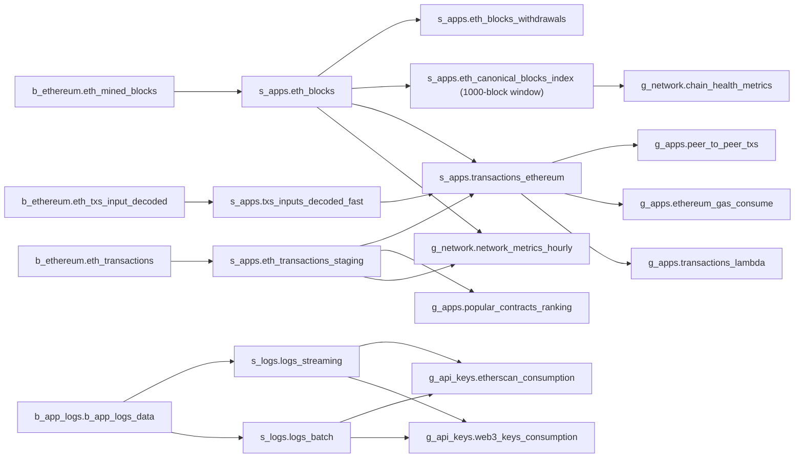

## Propósito

Canonical inventory of every Databricks table and materialized view (MV) owned by DD Chain Explorer. Everything lives in **one Databricks Free Edition workspace**: the `dev` bundle target writes the `dev` catalog (resources carry the `[dev]` name prefix), the unprefixed target writes the `hml` catalog. There is no production workspace and no `prd` catalog.

The materialized inventory is **29 objects across 7 schemas** in `dev`: 12 streaming tables and 17 materialized views, all owned by the two DLT pipelines described in [[medallion-pipelines]]. The `hml` catalog contains only `default`/`information_schema` — no project schema was ever created there, so none of the 29 objects exists in `hml`.

Every `dev` object carries `updated_at = 2026-04-28`: the pipelines have not run since, because the S3 raw prefixes are empty (capture moved to the separate **dd-chain-capture** project and is not yet delivering). Row counts are therefore historical and are not restated here — the serverless SQL warehouse is stopped and cannot be queried without starting it.

## Fluxo de uso

1. Identify the medallion tier needed: bronze for raw landings, silver for parsed/joined, gold for analytics.
2. Look up the table in the schema section below and read its Source column for upstream dependencies.
3. Follow the lineage diagram when a change crosses schemas.
4. Confirm the object still exists before writing a query — the catalog is authoritative for names, not for freshness.
5. Assume zero fresh rows until raw ingestion resumes.

## Trigger típico

Referenced when writing a Databricks SQL query, adding or changing a DLT expectation, adding a Gold MV, or reviewing a dashboard dataset against real table names.

## Diferencial

Without this atom, engineers must browse the Unity Catalog UI or read 1,800 lines of DLT notebook source to discover names, tiers and lineage. It gives agents an offline, reviewable reference — including the explicit negative facts (what does *not* exist) that a live browse cannot convey cheaply.

## Estado runtime tocado

- Databricks catalog `dev` — the only catalog with project schemas (7 schemas, 29 objects)
- Databricks catalog `hml` — exists, **no project schemas, 0 project objects**
- S3 raw prefixes read by the bronze Auto Loader streams (see [[aws-resources]]) — currently empty
- Databricks-managed Delta storage for all streaming tables and MVs

### Schema `b_ethereum` — Bronze Ethereum

All STREAMING_TABLE, ingested by Auto Loader (`cloudFiles.format=json`, `partitionColumns=""`) from the raw prefixes delivered by dd-chain-capture.

| Table | Type | Source prefix | Description |
|-------|------|---------------|-------------|
| `eth_mined_blocks` | STREAMING_TABLE | `raw/mainnet-blocks-data/` | Raw mined-block payloads, web3 camelCase keys, schema inferred |
| `eth_transactions` | STREAMING_TABLE | `raw/mainnet-transactions-data/` | Raw transaction records, web3 camelCase keys, schema inferred |
| `eth_txs_input_decoded` | STREAMING_TABLE | `raw/mainnet-transactions-decoded/` | Decoded calldata; the only stream with explicit schema hints (`tx_hash, contract_address, method, parms, method_id, decode_type, decode_source, decode_confidence`) |

### Schema `b_app_logs` — Bronze Application Logs

| Table | Type | Source prefix | Description |
|-------|------|---------------|-------------|
| `b_app_logs_data` | STREAMING_TABLE | `raw/app_logs/` | Application logs. Repo code reads Fluent-Bit NDJSON with an explicit schema (`timestamp LONG, logger, level, filename, function_name, message`); the **deployed** notebook is still the older binary-envelope reader (gap — audit DRIFT-18) |

### Schema `s_apps` — Silver Ethereum

| Table | Type | Source | Description |
|-------|------|--------|-------------|
| `eth_blocks` | STREAMING_TABLE | `b_ethereum.eth_mined_blocks` | Parsed block headers: number, hash, parent_hash, miner, gas_used, gas_limit, base_fee_per_gas, timestamp, tx_count |
| `eth_blocks_withdrawals` | STREAMING_TABLE | `eth_blocks` (explode `withdrawals[]`) | EIP-4895 validator withdrawals: validator_index, withdrawal_address, amount_gwei, amount_eth |
| `eth_transactions_staging` | STREAMING_TABLE | `b_ethereum.eth_transactions` | Parsed transactions: tx_hash, block_number, from_address, to_address, value, input, gas, gas_price, tx_type, access_list. `from_address` uses `expect_or_drop` |
| `txs_inputs_decoded_fast` | STREAMING_TABLE | `b_ethereum.eth_txs_input_decoded` | Parsed decoded calldata: tx_hash, contract_address, method, parms, decode_type |
| `transactions_ethereum` | STREAMING_TABLE | join of the three above | Enriched transactions: all tx fields + method + params + block metadata + `event_date` partition |
| `eth_canonical_blocks_index` | MATERIALIZED_VIEW | `eth_blocks` parent-hash chain | Canonical/orphan classification over a bounded rolling window of 1,000 blocks; avoids an O(N²) self-join. Present in the repo and in `dev`; **absent from the deployed `hml` pipeline** (gap — audit DRIFT-18) |

### Schema `s_logs` — Silver Application Logs

| Table | Type | Source | Description |
|-------|------|--------|-------------|
| `logs_streaming` | STREAMING_TABLE | `b_app_logs.b_app_logs_data` (recent) | Parsed structured logs: job_name, level, message, timestamp, api_key_name, call_count |
| `logs_batch` | STREAMING_TABLE | `b_app_logs.b_app_logs_data` (historical) | Historical log records for batch aggregation |

### Schema `g_apps` — Gold Ethereum Analytics

All MATERIALIZED_VIEW, produced by the `dm-ethereum` pipeline.

| MV | Source | Description |
|----|--------|-------------|
| `popular_contracts_ranking` | `eth_transactions_staging` (1h window) | Top contracts by tx volume: contract_address, tx_count, unique_senders, first_seen, last_seen |
| `peer_to_peer_txs` | `transactions_ethereum` | EOA→EOA transfers: tx_hash, from/to, value, gas_price, base_fee_per_gas, tx_timestamp |
| `ethereum_gas_consume` | `transactions_ethereum` | Gas per tx. Canonical classification column is `tx_type_semantic` (`contract_deploy`, `peer_to_peer`, `contract_interaction`), plus `gas_pct_of_block` |
| `transactions_lambda` | `transactions_ethereum` | Deduplication by tx_hash with decode_type priority (`full` > `full_4byte` > `partial` > batch > unknown). The batch-contracts branch of this union has **no backing bronze table** in code or in the catalog |
| `contract_volume_ranking` | `transactions_ethereum` | Contract ranking with hourly volume bucketing |
| `contract_method_activity` | `transactions_ethereum` | Most-called methods per contract: contract_address, method, call_count |
| `contract_deploy_metrics_hourly` | `transactions_ethereum` | Hourly deployment rate: deploy_count, deployer_count, avg_gas |
| `gas_price_distribution_hourly` | `transactions_ethereum` | Gas-price percentiles per hour (p25/p50/p75/p95/max) over `tx_type_semantic` |
| `p2p_transfer_metrics_hourly` | `transactions_ethereum` | P2P stats: tx_count, total/avg value in ETH, unique_senders |

### Schema `g_network` — Gold Network Metrics

| MV | Source | Description |
|----|--------|-------------|
| `network_metrics_hourly` | `eth_blocks` + `eth_transactions_staging` | Hourly network KPIs: block_count, tx_count, tps_avg, avg_gas_price_gwei, block gas/utilization averages |
| `chain_health_metrics` | `eth_canonical_blocks_index` | Orphan rate, canonical block share, reorg detection |
| `block_production_health` | `eth_blocks` | Slot-gap distribution: block_count, missed_slots_estimated, missed_slot_rate_pct, avg/max slot gap |
| `eth_burn_hourly` | `eth_transactions_staging` + `eth_blocks` | EIP-1559 burn per hour (base_fee × gas_used) |
| `withdrawal_metrics` | `eth_blocks_withdrawals` | Beacon-chain withdrawals: total_withdrawals, total_eth, active_validators |
| `validator_activity` | `eth_blocks_withdrawals` | Per-validator history: validator_index, total_eth_withdrawn, withdrawal_count |

### Schema `g_api_keys` — Gold API Key Consumption

| MV | Source | Description |
|----|--------|-------------|
| `etherscan_consumption` | `s_logs.logs_streaming` + `logs_batch` | Etherscan calls per key: calls_total/ok/error, rolling 1h/2h/12h/24h/48h windows, last_call_at |
| `web3_keys_consumption` | `s_logs.logs_streaming` + `logs_batch` | Infura/Alchemy calls per key: same fields plus vendor |

### Resumo do catálogo

| Schema | Streaming tables | MVs | Total |
|--------|-----------------|-----|-------|
| `b_ethereum` | 3 | 0 | 3 |
| `b_app_logs` | 1 | 0 | 1 |
| `s_apps` | 5 | 1 | 6 |
| `s_logs` | 2 | 0 | 2 |
| `g_apps` | 0 | 9 | 9 |
| `g_network` | 0 | 6 | 6 |
| `g_api_keys` | 0 | 2 | 2 |
| **TOTAL (`dev`)** | **12** | **17** | **29** |

`hml`: 0 of the 29. No `prd` catalog exists.

### Relações principais

## Dependências

- **Upstream**: [[capture-layer]] — the external dd-chain-capture project delivers the raw JSON that the bronze streams read
- **Upstream**: [[aws-resources]] — defines the S3 buckets and prefixes behind the Auto Loader paths
- **Produced by**: [[medallion-pipelines]] — the two DLT pipelines own every object listed here
- **Downstream**: [[serving-layer]] — dashboards and the gold export read the gold schemas
