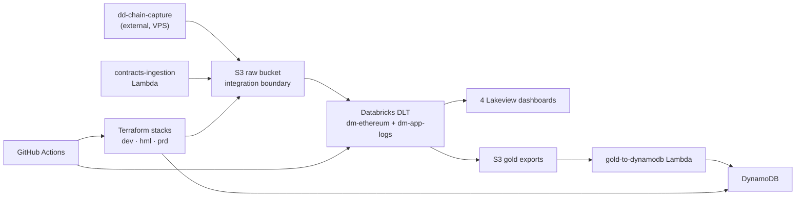

## Visão atômica

DD Chain Explorer is an Ethereum data platform that **processes and serves** on-chain
data it does not capture. Raw block, transaction and calldata JSON is delivered into its
S3 raw bucket by a separate project, dd-chain-capture, running on a VPS; from there a
Databricks medallion pipeline transforms it into queryable gold tables, Lakeview
dashboards and DynamoDB exports.

The repository owns exactly three things: the Terraform infrastructure, the GitHub
Actions CI pipeline that deploys it, and the artifacts deployed to Databricks (DLT
pipelines, jobs, dashboards) plus two AWS Lambdas.

## Usuários

| Usuário | Descrição |
|---------|-----------|
| Platform engineers | Apply Terraform stacks, run the CI workflows, deploy DABs bundles, and keep the S3 → DLT path healthy |
| Data analysts | Query gold tables through the four Lakeview dashboards |
| Cost analysts | Track Etherscan and Web3 API key consumption through the gold API-key tables and their DynamoDB export |
| Agents | Self-pull this catalog before touching infrastructure, CI or Databricks code |

## Catálogo de features

| Slug | Título | TL;DR |
|------|--------|-------|
| [medallion-pipelines](medallion-pipelines.md) | Medallion Pipelines | Two Databricks DLT pipelines — `dm-ethereum` (24 tables, 11 expectations) and `dm-app-logs` (5 tables) — transforming S3 raw JSON through bronze, silver and gold |
| [aws-resources](aws-resources.md) | AWS Resources | Canonical AWS inventory after capture retirement — S3, DynamoDB, Lambda, SSM, IAM, CloudWatch, Terraform state — with managed, orphan and residue status per resource |
| [cicd-pipeline](cicd-pipeline.md) | CI/CD Pipeline | The GitHub Actions control plane — 7 workflows, the informed environment gate, the `scripts/ci` toolbox and the stack map — currently unable to authenticate to AWS |
| [data-catalog](data-catalog.md) | Data Catalog | Databricks Unity Catalog inventory — 29 objects in the `dev` catalog (12 streaming tables + 17 materialized views) |
| [serving-layer](serving-layer.md) | Serving Layer | Four ACTIVE Lakeview dashboards, S3 gold exports, and the `gold-to-dynamodb` Lambda writing CONSUMPTION entities |
| [capture-layer](capture-layer.md) | Capture Integration | The S3 boundary with the external dd-chain-capture project — the sole contract by which raw chain data enters the platform |

## Mapa de capacidades

## Limites conhecidos

- Ethereum mainnet only — no multi-chain support.
- No capture capability in this repository; if dd-chain-capture stops delivering, the
  platform has no data.
- No public REST API and no authentication or access control for dashboard viewers.
- One Databricks workspace, Free Edition, serverless compute only; the `prod` deployment
  target has no workspace behind it.
- The platform is currently **idle**: the raw bucket has held no object since
  2026-05-23, DLT triggers are paused, and no job has run in 60 days.
- CI cannot authenticate to AWS today *(gap — see audit
  `20260823T145726Z-4db47555`)*, so deploys are manual until the OIDC roles are applied.
