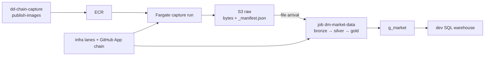

## Visão atômica

**Status 2026-09-23.** DECIDED and coded (release v0.7.0, rulings R18-R36); not yet live in
us-east-1. Each atom carries its own LIVE/DECIDED line.

DD Chain Explorer lands public Brazilian market data — B3 quotes and index files, CVM
company filings, BCB macro series — as untouched bytes, and refines it into company daily
prices, Ibovespa constituents and fundamentals. Three repositories: `dd-chain-capture`
(images), `dd-chain-infrastructure` (every cloud object and the lanes), `dd-chain-explorer`
(the medallion bundle and, after C-DAY, `specs/`). The Ethereum lane is retired everywhere.

## Usuários

| Usuário | Descrição |
|---|---|
| Analysts | Query `g_market` through the dev SQL warehouse |
| Operator | Runs the trust seed once, approves `production`, dispatches the rebuild drill |
| Agents | Self-pull this catalog before touching capture, infrastructure, CI or the bundle |

## Catálogo de features

| Slug | Título | TL;DR |
|---|---|---|
| [capture-layer](capture-layer.md) | Capture Layer | 3 images, 7 jobs on Fargate Spot, untouched bytes + `_manifest.json` in the raw bucket |
| [medallion-pipelines](medallion-pipelines.md) | Medallion Job | One serverless job, bronze → silver → gold, fired by file arrival; no DLT |
| [data-catalog](data-catalog.md) | Data Catalog | ISOLATED catalogs `dev`/`prd`; `b_market` 12, `s_market` 8, `g_market` 3, `ops` volume |
| [serving-layer](serving-layer.md) | Serving Layer | SQL over `g_market` via one dev serverless warehouse; nothing else |
| [environments](environments.md) | Environments | dev carries the workload and the drill; prd is platform-only behind `production` |
| [aws-resources](aws-resources.md) | AWS Resources | us-east-1 target inventory + live sa-east-1 teardown status |
| [cicd-pipeline](cicd-pipeline.md) | CI/CD Pipeline | Plan-as-detector lanes, App-chained repos, trust seed, rebuild drill |

## Mapa de capacidades

## Limites conhecidos

- Nothing runs yet in us-east-1; the POC gate (AC-22) is unproven.
- prd has no workload; capture schedules are DISABLED.
- No dashboards, exports, public API or DY/CAGR metrics.
- `constitution.md` still states the pre-R18 architecture until the operator's T-O7.5
  amendment.
