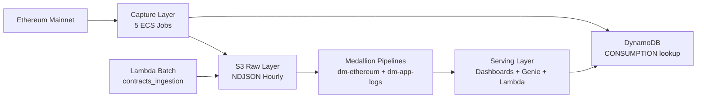

## Visão atômica

DD Chain Explorer is a real-time Ethereum blockchain data platform that captures, processes, and serves on-chain transaction data. It transforms raw Ethereum RPC data into queryable Gold-layer analytics using a Medallion architecture on Databricks, providing operational visibility into API key consumption and system health.

## Usuários

| Usuário | Descrição |
|---------|-----------|
| Platform engineers | Monitor streaming jobs, API key health, and data pipeline freshness via dashboards and alerts |
| Data analysts | Query Gold tables via Databricks SQL dashboards (Network Overview, Gas Analytics, Hot Contracts, API Health) |
| System operators | Use Genie AI/BI space for ad-hoc natural language questions over Ethereum data |
| Cost analysts | Track Etherscan/Infura API key consumption and rotation efficiency via Gold API key tables |

## Catálogo de features

| Slug | Título | TL;DR |
|------|--------|-------|
| [capture-layer](capture-layer.md) | Capture Layer | Five ECS Fargate jobs continuously ingesting Ethereum blocks, transactions, and decoded calldata to S3 |
| [medallion-pipelines](medallion-pipelines.md) | Medallion Pipelines | Two Databricks DLT pipelines (dm-ethereum + dm-app-logs) transforming S3 raw data through bronze/silver/gold — 30 tables/MVs |
| [serving-layer](serving-layer.md) | Serving Layer | Four Lakeview dashboards, Genie AI/BI space, DynamoDB Lambda export, and S3 gold exports |
| [aws-resources](aws-resources.md) | AWS Resources | Canonical inventory of AWS infrastructure resources (S3, Kinesis, Firehose, SQS, DynamoDB, Lambda, ECS/ECR, CloudWatch, IAM) across DEV/HML/PRD |
| [data-catalog](data-catalog.md) | Data Catalog | Databricks Unity Catalog inventory — 30 tables/MVs across 7 schemas validated post pipeline-restart-r1 |

## Mapa de capacidades

## Limites conhecidos

- Ethereum mainnet only — no multi-chain support
- No historical backfill for arbitrary date ranges (full refresh covers pipeline data only)
- No public REST API endpoint (future roadmap)
- No user authentication or access control for dashboard viewers
- No real-time alerts for on-chain events (only operational infrastructure alerts)
- DEV DLT trigger is PAUSED by design — activated manually for end-to-end testing
